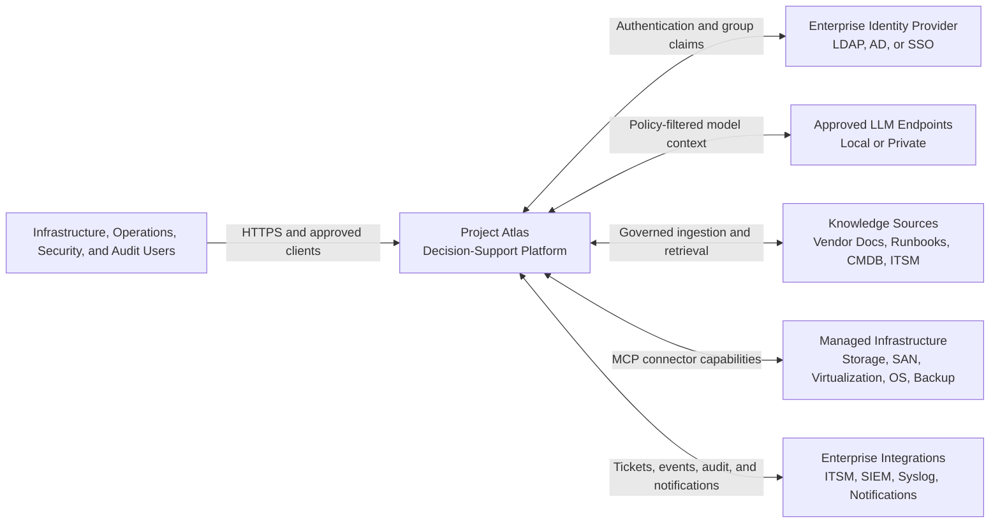
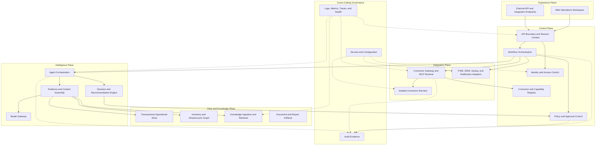
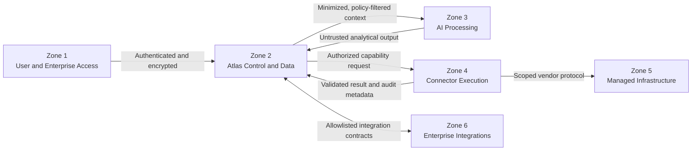
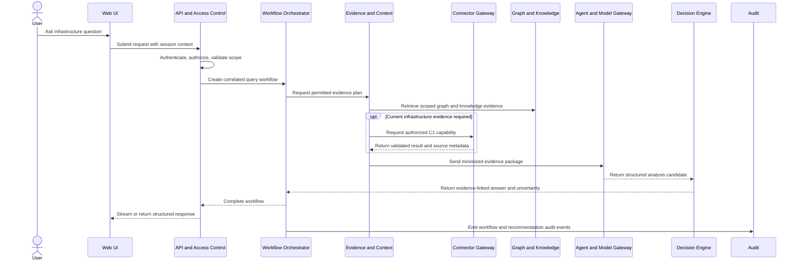
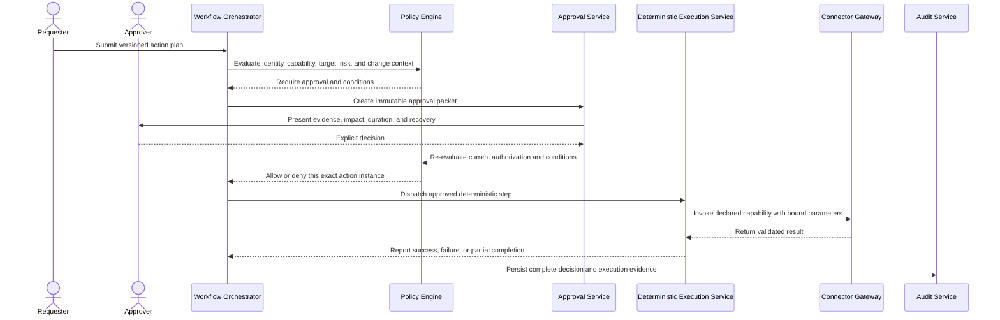

# Project Atlas

## System Architecture

| Field | Value |
| --- | --- |
| Document ID | ATLAS-010 |
| Version | 1.0.0 |
| Status | Approved |
| Document Owner | Architecture Owner |
| Reviewers | Product Owner, Security Architecture, Infrastructure Operations, AI Architecture |
| Approver | Umit Ozdemir (acting Architecture Owner) |
| Approval Date | 2026-08-03 |
| Last Updated | 2026-08-03 |
| Related Documents | [ATLAS-001](001_Product_Vision.md), [ATLAS-002](002_Product_Requirements.md), [ATLAS-003](003_Project_Principles.md), [ATLAS-004](004_Glossary.md), [ATLAS-011](011_Component_Architecture.md), [ATLAS-013](013_Deployment_Architecture.md), [ATLAS-014](014_AI_Architecture.md), [ATLAS-020](020_MCP_Framework.md) |
| Supersedes | ATLAS-010 version 0.1.0 |

## 1. Purpose

This document defines the high-level system architecture, system boundaries, trust zones, logical building blocks, primary data flows, and initial runtime strategy for Project Atlas.

It establishes the architecture contract that detailed component, deployment, AI, RAG, event, MCP, security, and development documents must refine without contradicting.

The architecture is intentionally technology-neutral where a product choice requires an Architecture Decision Record (ADR).

## 2. Scope

### In Scope

- Atlas system context and external actors
- Logical architecture planes and component responsibilities
- Trust boundaries and infrastructure execution boundaries
- Primary query, health-check, recommendation, and future execution flows
- Data ownership and communication principles
- MVP runtime and deployment direction
- Reliability, observability, audit, and security requirements
- Evolution criteria from a modular control plane to distributed services

### Out of Scope

- Final technology and vendor selection
- Detailed API and event schemas
- Detailed database and infrastructure graph schemas
- Connector SDK implementation details
- User interface component design
- Production sizing and capacity numbers
- Customer-specific network topology or security policy

## 3. Architectural Drivers

Atlas must support the following drivers:

- Enterprise on-premises and restricted-network deployment
- Heterogeneous infrastructure and vendor-neutral integration
- Modular installation and lifecycle management of MCP connectors
- Local or privately hosted OpenAI-compatible LLM endpoints
- Evidence-grounded AI analysis and explainable recommendations
- Infrastructure inventory and dependency graph analysis
- Scheduled and on-demand health checks
- Human-controlled operational decision making
- LDAP, Active Directory, SSO-ready identity, and scoped RBAC
- Tamper-resistant audit and Syslog or SIEM export
- Reproducible deployment, upgrade, backup, restore, and rollback
- Growth from an MVP to multi-site and highly available enterprise deployment

## 4. Governing Architecture Principles

This architecture applies the following ATLAS-003 principles directly:

| Principle | Architectural consequence |
| --- | --- |
| PRN-001 | AI produces analysis and proposals; accountable humans authorize sensitive actions |
| PRN-002 | LLM access to infrastructure is mediated by governed services and connectors |
| PRN-003 | New connectors and capabilities are read-only by default |
| PRN-004 | Identity, target, environment, capability, and data access are scoped by least privilege |
| PRN-005 | Evidence references are first-class data across query and recommendation flows |
| PRN-008 | Uncertain authorization, policy, connector, or execution state fails closed |
| PRN-009 | Audit is part of the request path, not an optional side feature |
| PRN-011 | Knowledge retains provenance, version, access classification, and freshness |
| PRN-014 | Extensions are modular but untrusted until registered and validated |
| PRN-018 | Data remains within configured organizational and model-processing boundaries |
| PRN-019 | All platform planes expose health, metrics, logs, traces, and correlation identifiers |
| PRN-023 | Runtime and deployment procedures are reproducible from versioned repository assets |

## 5. System Context

Atlas sits between enterprise users, enterprise control systems, AI model endpoints, knowledge sources, and managed infrastructure. It is the policy-governed coordination and decision-support boundary; it is not a replacement for source systems or existing monitoring platforms.

### 5.1 External Actors and Systems

| Actor or system | Relationship to Atlas |
| --- | --- |
| Infrastructure engineers | Query infrastructure, investigate incidents, run authorized diagnostics, and review recommendations |
| Infrastructure architects | Inspect topology, dependencies, resilience, capacity, and change impact |
| Operations teams | Run scheduled workflows, health checks, reports, and incident analysis |
| Security and compliance teams | Govern access, inspect audit evidence, and review policy behavior |
| Product and platform administrators | Configure Atlas, connectors, knowledge sources, policies, and integrations |
| Enterprise identity provider | Authenticates users and supplies governed identity or group claims |
| Managed infrastructure | Remains the authoritative operational source reached through connectors |
| Knowledge sources | Supply vendor and organizational evidence with provenance and access controls |
| LLM endpoints | Perform bounded language and analysis tasks using filtered context |
| ITSM and enterprise integrations | Exchange incidents, changes, approvals, notifications, and audit data |

## 6. Logical Architecture

Atlas is organized into logical planes. A plane describes responsibility and trust boundaries; it does not require a separate deployable service in the MVP.

## 7. Plane Responsibilities

### 7.1 Experience Plane

The Experience Plane provides human and system interaction surfaces.

Responsibilities:

- Chat-centered operations workspace
- Inventory, graph, connector, health-check, report, approval, and audit views
- Explicit display of evidence, uncertainty, risk, impact, and approval state
- Accessible and predictable interaction for repeated operational use
- Versioned external integration APIs where required

The Experience Plane must not enforce security by itself. Backend services re-evaluate authorization and policy for every protected operation.

### 7.2 Control Plane

The Control Plane owns identity context, workflow state, capability registration, policy decisions, and approval state.

Responsibilities:

- Authentication integration and secure session handling
- RBAC and resource-scope authorization
- Request validation and correlation identifiers
- Workflow creation, persistence, pause, resume, cancellation, and timeout behavior
- Connector and capability registration, version, status, and trust metadata
- Deterministic policy evaluation and approval lifecycle
- Coordination of audit-critical operations

The Control Plane is authoritative for whether an action may proceed. The AI and connector layers cannot override it.

### 7.3 Intelligence Plane

The Intelligence Plane performs bounded evidence-based analysis.

Responsibilities:

- Intent interpretation and task decomposition
- Selection of permitted analytical agents and tools
- Evidence and context assembly under data-access policy
- Retrieval-grounded answer generation
- Root cause, risk, and change impact analysis support
- Structured recommendation and reasoning-summary generation
- Model routing, token or context budgets, timeout, and provider abstraction

The Intelligence Plane is not authoritative for identity, authorization, policy, approval, or execution status.

### 7.4 Integration Plane

The Integration Plane isolates Atlas from vendor-specific protocols and external enterprise systems.

Responsibilities:

- MCP protocol handling and Atlas capability mapping
- Connector package validation, registration, configuration, and lifecycle
- Isolation of connector processes, credentials, network scope, and resource usage
- Input and output schema validation
- Bounded retries, timeouts, cancellation, and idempotency controls
- Normalization of vendor results without discarding source evidence
- ITSM, SIEM, Syslog, and notification integration

Connector failure must remain contained within the affected runner and workflow. It must not compromise the Control Plane or expose another connector's credentials.

### 7.5 Data and Knowledge Plane

The Data and Knowledge Plane stores governed product state and evidence.

Responsibilities:

- Transactional state for users, roles, connectors, workflows, policies, approvals, and reports
- Time-aware infrastructure inventory and relationship graph
- Knowledge source registration, ingestion, chunking, indexing, retrieval, and lifecycle
- Evidence references, provenance, access classification, and data freshness
- Document, report, and export artifact storage
- Backup, restore, retention, deletion, and migration support

Each logical data domain has an owner. Components must not bypass domain contracts by directly modifying another domain's data.

### 7.6 Cross-Cutting Governance

Governance capabilities apply to every plane.

Responsibilities:

- Structured audit events and tamper-resistant retention
- Application logs, metrics, traces, health endpoints, and alerting
- Secret storage and credential rotation
- Configuration, certificate, and trust-store management
- Data classification, retention, residency, and export policy
- Correlation across user request, workflow, agent, model, connector, and external integration activity

## 8. Core Logical Components

| Component | Primary responsibility | Must not do |
| --- | --- | --- |
| Web Operations Workspace | Present chat, evidence, inventory, graph, approvals, reports, and administration | Treat hidden UI elements as authorization controls |
| API Boundary | Validate requests, establish session context, assign correlation IDs, and route commands | Execute connector commands directly |
| Identity and Access Control | Integrate identity providers and enforce scoped authorization | Delegate final authorization to the LLM |
| Workflow Orchestrator | Persist and coordinate long-running, resumable, auditable work | Hide partial completion or retry indefinitely |
| Policy Engine | Return deterministic allow, deny, or condition outcomes | Generate operational recommendations |
| Approval Service | Manage approval packets, decisions, expiry, and separation of duties | Convert an approval into unrestricted permission |
| Connector Registry | Manage connector identity, versions, manifests, trust state, and capabilities | Assume an MCP server is trusted by default |
| Connector Gateway | Mediate validated capability requests to isolated runners | Accept arbitrary shell commands from AI output |
| Connector Runner | Execute one bounded capability with scoped credentials and resources | Access unrelated connector credentials or control-plane storage |
| Agent Orchestrator | Coordinate permitted AI analysis steps and budgets | Authorize or directly execute infrastructure changes |
| Evidence and Context Service | Assemble policy-filtered graph, knowledge, history, and live results | Place secrets or unauthorized data into model context |
| Model Gateway | Abstract approved LLM endpoints and enforce model policy | Send data to an unapproved endpoint |
| Decision Engine | Produce structured findings, confidence, impact, alternatives, and recommendations | Return permission to execute an action |
| Inventory Service | Maintain normalized entities, source references, and observation times | Treat imported inventory as permanently current |
| Graph Service | Maintain typed relationships and answer dependency or blast-radius queries | Hide missing or stale relationships |
| Knowledge Service | Govern ingestion, provenance, classification, indexing, and retrieval | Treat retrieved instructions as executable commands |
| Audit Service | Persist and export security and operational evidence | Store secrets or permit silent disabling on sensitive paths |
| Reporting Service | Produce versioned technical and management reports from governed data | Recalculate security decisions independently |

## 9. Trust Zones and Security Boundaries

### 9.1 Zone Rules

| Zone | Trust position | Required controls |
| --- | --- | --- |
| User and Enterprise Access | Authenticated but not implicitly authorized | TLS, session controls, CSRF protection where applicable, input validation, rate limits, scoped RBAC |
| Atlas Control and Data | Highest application trust; still zero-trust between identities and modules | Service identity, authorization, encryption, audit, data ownership, backup, and restricted administration |
| AI Processing | Output and retrieved instructions are untrusted | Context minimization, endpoint allowlist, output schema validation, prompt-injection controls, no secrets, no direct infrastructure route |
| Connector Execution | High operational risk and vendor-specific behavior | Process or container isolation, egress allowlist, scoped credentials, capability allowlist, timeout, resource limit, full audit |
| Managed Infrastructure | Authoritative source but external to Atlas trust | Vendor authentication, least privilege, certificate validation, target allowlist, safe error handling |
| Enterprise Integrations | External systems with separate ownership | Signed or authenticated interfaces, schema validation, replay protection where applicable, rate limits, audit |

### 9.2 Non-Bypassable Boundaries

- The browser cannot call connector runners directly.
- An LLM or agent cannot call managed infrastructure directly.
- A connector runner cannot decide its own authorization or approval.
- Retrieved documents cannot create capabilities or modify policy.
- Approval cannot bypass current authorization, target scope, or policy evaluation.
- Operational and AI logs cannot substitute for mandatory audit events.

## 10. Primary Interaction Flows

### 10.1 Evidence-Grounded Read-Only Query

Key controls:

- Authorization is checked before evidence retrieval and live connector access.
- Only registered C1 capabilities may be used automatically in this flow.
- Connector and AI output are schema-validated and treated as untrusted inputs.
- The final response includes evidence references, timestamps, and unknowns.

### 10.2 Scheduled Health Check

1. A scheduler creates a workflow from a versioned health-check definition.
2. The Workflow Orchestrator resolves the service identity, target scope, and current policy.
3. The Connector Gateway dispatches permitted C1 or policy-approved C2 capabilities.
4. Results are validated, normalized, time-stamped, and linked to source evidence.
5. Deterministic checks evaluate known rules and thresholds.
6. AI may summarize or correlate findings but cannot alter the raw result.
7. Findings update health history and may create notifications or ITSM records according to policy.
8. Workflow, connector, finding, and notification outcomes are audited.

### 10.3 Change Recommendation and Approval Packet

1. A user requests analysis of a proposed change.
2. Atlas validates identity and scope but does not execute the proposal.
3. Atlas gathers current topology, health, configuration evidence, relevant runbooks, and historical incidents.
4. The Decision Engine estimates blast radius, risks, expected duration, interruption, alternatives, and unknowns.
5. Atlas prepares an approval packet with implementation, validation, rollback or recovery, and required roles.
6. The Policy Engine classifies the proposed capabilities and determines approval conditions.
7. The user receives the recommendation and approval-ready plan.
8. In the MVP, Atlas stops at decision support; C3 through C5 execution is not enabled.

### 10.4 Future Controlled Execution

Future controlled execution is an architecture extension, not an MVP commitment.

Mandatory properties:

- Approval binds to the exact action, parameters, target, plan version, and expiry.
- Policy and authorization are evaluated again immediately before execution.
- Parameter changes invalidate prior approval.
- C5 capabilities cannot be autonomously executed.
- Failure or uncertainty stops subsequent steps unless an approved recovery path says otherwise.

## 11. Data Architecture and Ownership

Atlas uses multiple logical data models because transactional state, graph relationships, semantic retrieval, and document artifacts have different requirements. A single physical database may implement more than one logical model in the MVP if isolation and contracts are preserved.

| Data domain | System of record | Key requirements |
| --- | --- | --- |
| Identity mapping and sessions | Transactional operational store or enterprise IdP as applicable | Secure lifecycle, expiry, audit, no credential duplication |
| Connector registry and configuration | Transactional operational store | Versioned manifests, secret references, trust state, target scope |
| Workflow, policy, and approval state | Transactional operational store | Transactions, concurrency control, immutable decision references, migrations |
| Inventory entities | Inventory domain store | Source identity, normalized identity, observation time, reconciliation state |
| Infrastructure relationships | Graph domain store | Typed edges, validity interval, provenance, freshness, traversal performance |
| Knowledge metadata | Knowledge domain store | Owner, classification, version, source authority, retention, ingestion state |
| Embeddings and retrieval index | Vector or hybrid retrieval store | Metadata filtering, deletion, re-indexing, access-control enforcement |
| Documents and report artifacts | Governed object or filesystem storage | Integrity, classification, retention, backup, malware scanning where applicable |
| Audit events | Tamper-resistant audit store | Append-oriented behavior, restricted access, retention, export, integrity verification |
| Logs, metrics, and traces | Observability platform | Correlation, retention, redaction, operational search, no secret leakage |

### 11.1 Data Rules

- Data access follows the requesting identity and purpose, including model context assembly.
- Logical domain owners expose contracts; other components do not modify their storage directly.
- Evidence references remain resolvable for the required retention period.
- Data deletion removes or tombstones derived indexes according to policy.
- Backups and exports preserve classification and access restrictions.
- Graph and inventory data carry observation time and provenance.
- AI-generated summaries never replace raw source evidence.

## 12. Communication Model

Atlas uses both synchronous and asynchronous communication.

### 12.1 Synchronous

Use synchronous APIs for:

- Authentication and session operations
- Interactive reads with bounded latency
- Validation and policy decisions
- Short connector queries where timeout is safe
- Retrieval of workflow or report status

### 12.2 Asynchronous

Use durable asynchronous workflows or events for:

- Scheduled health checks
- Long-running connector operations
- Knowledge ingestion and re-indexing
- Discovery and graph reconciliation
- Deep incident and change analysis
- Report generation
- Approval waiting
- External notification and integration delivery

### 12.3 Contract Rules

- APIs and events are versioned and schema-validated.
- Every request, workflow, model call, connector call, and event carries a correlation identifier.
- Delivery is assumed to be at least once unless a contract explicitly guarantees otherwise.
- Consumers must be idempotent where duplicate delivery is possible.
- Timeouts and cancellation do not imply rollback.
- Dead-letter or quarantine handling must preserve diagnostic and audit context.
- Sensitive payloads are minimized and classified.

## 13. Initial Runtime Strategy

### 13.1 MVP Baseline

The recommended MVP is a modular control-plane application with separate worker processes for long-running work and isolated connector runners.

Logical modules remain separated by interfaces even when deployed together:

- Web frontend
- Backend API and application modules
- Workflow workers
- Connector Gateway
- Isolated connector runners
- Approved LLM endpoint
- Transactional store
- Initial graph implementation
- Initial vector or hybrid retrieval implementation
- Document artifact storage
- Audit and observability integration

This baseline avoids premature microservice operational overhead while preserving extraction boundaries.

### 13.2 Required Process Isolation

The following should not run inside the web request process:

- Vendor connector execution
- Long-running workflows
- Document parsing and embedding generation
- Large report generation
- Untrusted generated connector validation

Connector runners require the strongest isolation because they hold scoped vendor credentials and interact with managed infrastructure.

### 13.3 Service Extraction Triggers

A logical module may become an independent service when one or more conditions are demonstrated:

- Independent scaling or high-availability requirements
- Different security or network trust zone
- Resource isolation requirement
- Separate release cadence or ownership team
- Failure containment requirement
- Data sovereignty or site-local processing requirement
- Measured performance bottleneck

Service extraction requires an ADR and must not permit direct access to another service's data store.

## 14. Deployment Topology Direction

Initial deployment profiles:

| Profile | Purpose | Expected shape |
| --- | --- | --- |
| Developer | Local development and automated tests | Local processes or containers, mock infrastructure, local model option |
| Lab | Architecture and connector validation | Single-node or small multi-container deployment with isolated test targets |
| Restricted enterprise | On-premises environment with controlled dependencies | Mirrored artifacts, proxy and certificate support, approved local services |
| Production | Future resilient deployment | Redundant control-plane instances, durable workers, highly available stores, backed-up configuration |

The final container platform, databases, event backbone, secret manager, and observability stack require ADRs. Docker Compose may be used for development or lab use; it is not automatically the production architecture.

## 15. Reliability and Failure Behavior

### 15.1 Reliability Principles

- Fail closed when authorization, policy, approval, or target scope is uncertain.
- Fail visibly when evidence, graph state, or knowledge is stale or incomplete.
- Isolate connector and model failures from control-plane availability.
- Persist long-running workflow state before external side effects.
- Use bounded retries with backoff and idempotency controls.
- Report partial completion explicitly.
- Preserve raw evidence when downstream AI analysis fails.
- Support backup and restore for every authoritative data domain.

### 15.2 Degraded Modes

| Failure | Permitted behavior | Prohibited behavior |
| --- | --- | --- |
| LLM unavailable | Return raw evidence, deterministic findings, and clear degraded status where useful | Invent an AI conclusion or bypass the model policy |
| Connector unavailable | Use labeled historical evidence where policy allows and expose freshness | Present stale data as current |
| Graph unavailable | Continue direct scoped queries that do not require impact analysis | Claim blast radius or dependency completeness |
| Knowledge retrieval unavailable | Return live facts and state the evidence limitation | Generate vendor guidance without sources |
| Policy or authorization unavailable | Deny protected operations and alert operators | Fail open |
| Audit persistence unavailable | Block sensitive operations according to policy and alert operators | Continue unrecorded sensitive activity |
| External SIEM or ITSM unavailable | Queue bounded delivery and expose backlog | Lose events silently or block unrelated read-only analysis by default |

## 16. Observability and Audit Architecture

Every request begins with a correlation ID and creates trace context propagated through applicable components.

Required signals:

- API latency, status, and rate-limit metrics
- Authentication and authorization outcomes
- Workflow state, queue depth, duration, retries, and failures
- Connector health, capability latency, timeout, and error classification
- Model endpoint health, latency, token usage, refusal, and schema-validation failure
- Knowledge ingestion, retrieval, freshness, and access-filter behavior
- Inventory and graph reconciliation status
- Policy decisions, approval states, and blocked operations
- Audit write and export health
- Database, storage, backup, and restore health

Audit events and operational telemetry share correlation identifiers but remain separately governed. Audit records must not be editable through normal operational administration.

## 17. Security Architecture Requirements

### 17.1 Identity and Access

- All human and service access is authenticated.
- Authorization is checked at the backend and again at sensitive execution boundaries.
- RBAC supports environment and target scope.
- Service accounts have explicit owners and rotation policies.
- Break-glass access is time-bound, justified, visible, and audited.

### 17.2 Secrets

- Stored configuration contains secret references, not secret values.
- Secrets are delivered only to the component and connector instance that requires them.
- Secrets are excluded from prompts, model context, logs, reports, errors, and audit parameters.
- Rotation does not require rebuilding application images.

### 17.3 AI and Knowledge

- Model endpoints are allowlisted and selected by data policy.
- Context is minimized and filtered by the user's data access.
- Retrieved content and model output are treated as untrusted.
- Prompt injection cannot grant capability access or change policy.
- Sensitive model requests and evidence retrieval are auditable without storing prohibited content.

### 17.4 Connector Execution

- Connector identity and package integrity are verified before enablement.
- Network egress is restricted to declared targets and dependencies.
- Capabilities use typed schemas and declared side effects.
- Resource, time, concurrency, and output-size limits are enforced.
- Credentials are scoped by target and capability wherever the vendor supports it.

## 18. MVP Architecture Scope

### 18.1 Included

- Chat-centered web workspace and backend API
- Local administrator bootstrap and enterprise authentication abstraction
- Initial RBAC, policy, and audit foundations
- Modular control-plane boundaries
- Durable workflow foundation
- Connector registry, mock connector, and one real C1 connector candidate
- Isolated connector execution
- Basic inventory and infrastructure relationship model
- Knowledge ingestion and permission-aware retrieval prototype
- Configurable OpenAI-compatible local LLM endpoint
- Evidence-linked response and recommendation contract
- Scheduled health-check prototype
- Operational logs, metrics, health endpoints, and correlation IDs

### 18.2 Excluded

- C3, C4, or C5 infrastructure execution
- Autonomous remediation
- Full digital-twin simulation
- Full connector marketplace
- Production-grade generated connector deployment
- Multi-tenant SaaS architecture
- Complete vendor coverage
- Final production high-availability topology

## 19. Evolution Path

Architecture evolution should occur in evidence-based stages:

1. Establish modular control-plane contracts and isolated connector execution.
2. Validate one end-to-end read-only vertical slice.
3. Add durable workflows, graph reconciliation, and governed knowledge ingestion.
4. Measure load, failure modes, deployment constraints, and ownership boundaries.
5. Extract services only where trust, scale, availability, or ownership requires it.
6. Introduce future controlled execution only after policy, approval, simulation, recovery, and audit controls are independently validated.

No stage grants AI autonomous operational authority.

## 20. Dependencies and Traceability

| Upstream or downstream document | Relationship |
| --- | --- |
| ATLAS-001 Product Vision | Defines product identity and long-term outcome |
| ATLAS-002 Product Requirements | Defines required product capabilities and MVP scope |
| ATLAS-003 Project Principles | Supplies non-negotiable constraints and capability classes |
| ATLAS-004 Glossary | Supplies canonical terminology |
| ATLAS-011 Component Architecture | Refines logical component responsibilities and contracts |
| ATLAS-012 Microservice Architecture | Defines service extraction and distributed-system rules |
| ATLAS-013 Deployment Architecture | Refines runtime profiles, topology, availability, and recovery |
| ATLAS-014 AI Architecture | Refines model, agent, context, and AI guardrail behavior |
| ATLAS-015 RAG Architecture | Refines ingestion, retrieval, provenance, and access filtering |
| ATLAS-016 Event Architecture | Refines event schemas, delivery, retention, and consumers |
| ATLAS-020 MCP Framework | Refines connector contracts, lifecycle, and capability safety |
| ATLAS-025 Policy Engine | Refines deterministic policy inputs, outputs, and enforcement |
| ATLAS-026 Graph Engine | Refines infrastructure entities, relationships, and traversal |
| ATLAS-030 through ATLAS-038 | Refine enterprise identity, audit, logging, integration, and approval controls |
| ATLAS-050 through ATLAS-057 | Translate the architecture into implementation and deployment contracts |

Future requirements, ADRs, implementations, and tests must reference ATLAS-010 and the applicable upstream principles.

## 21. Assumptions

- The first deployment target is enterprise-controlled and may have restricted internet access.
- The initial LLM endpoint supports an OpenAI-compatible API and can be replaced through the Model Gateway.
- Managed infrastructure remains authoritative for live operational state.
- Existing monitoring, CMDB, ITSM, and SIEM systems remain in use and integrate with Atlas where configured.
- The MVP prioritizes C0 and C1 capabilities, with carefully governed C2 diagnostics where required.
- Physical database consolidation is acceptable in MVP when logical ownership and migration paths remain explicit.

## 22. Risks and Mitigations

| Risk | Architectural mitigation |
| --- | --- |
| AI hallucination or unsupported recommendation | Evidence packages, source references, confidence and unknowns, deterministic validation |
| Unsafe connector behavior | Isolation, capability manifests, least privilege, schema validation, timeouts, audit |
| Prompt injection from documents or tool results | Untrusted-input handling, context separation, tool authorization outside the model |
| Incomplete or stale topology | Provenance and freshness on entities and relationships; limitations shown in impact analysis |
| Premature microservice complexity | Modular control plane first; extraction only through measured triggers and ADRs |
| Modular monolith becoming tightly coupled | Owned modules, explicit contracts, no cross-domain data modification, architecture tests |
| Audit or policy becoming a bottleneck | Durable, observable design with capacity planning and fail-closed rules for sensitive paths |
| Restricted-network deployment failure | Reproducible artifacts, dependency mirrors, local services, proxy and trust-store support |
| Connector credential compromise | Scoped secret delivery, runner isolation, egress restrictions, rotation, audit |
| Vendor lock-in | Normalized contracts, adapter boundaries, preserved vendor evidence, ADR-based technology selection |

## 23. Open Questions and ADR Backlog

The following decisions require dedicated analysis before implementation:

- `ADR-001`: MVP backend shape and modular-boundary enforcement
- `ADR-002`: Transactional database and migration strategy
- `ADR-003`: Infrastructure graph storage strategy
- `ADR-004`: Vector or hybrid retrieval storage strategy
- `ADR-005`: Workflow runtime and asynchronous event backbone
- `ADR-006`: Secret-management integration for development and enterprise deployment
- `ADR-007`: Model Gateway contract and first approved LLM endpoint
- `ADR-008`: Connector runner isolation and packaging model
- `ADR-009`: Audit-store integrity and retention architecture
- `ADR-010`: First supported deployment profile and operating-system baseline

Additional open questions:

- Which infrastructure domain and product will provide the first real C1 connector?
- Which minimum graph relationships are required for the first change-impact demonstration?
- Which enterprise identity integration is first: LDAP, Active Directory, or standards-based SSO?
- Which availability and recovery objectives are required for the first production deployment?

## 24. Acceptance Criteria

This document is ready to enter Review when:

- Product, architecture, security, operations, and AI reviewers agree on the system boundaries.
- The separation among Control, Intelligence, Integration, Data, and Governance responsibilities is unambiguous.
- Direct LLM-to-infrastructure access is explicitly prohibited and technically preventable.
- Connector execution isolation and capability mediation are accepted as core requirements.
- The MVP runtime strategy and microservice extraction triggers are accepted.
- Primary data flows identify authorization, policy, evidence, audit, and failure behavior.
- MVP inclusions and exclusions align with ATLAS-002 and ATLAS-003.
- Required ADRs are assigned owners before implementation begins.

## 25. Change History

| Version | Date | Author | Summary |
| --- | --- | --- | --- |
| 0.1.0 | 2026-07-21 | Project Atlas Team | Initial high-level architecture draft |
| 0.2.0 | 2026-08-03 | Architecture Owner | Added governed metadata, planes, trust zones, component boundaries, core flows, data ownership, MVP runtime strategy, failure behavior, and ADR backlog |
| 1.0.0 | 2026-08-03 | Umit Ozdemir | Approved as the first binding documentation baseline under the designated approver authority |
