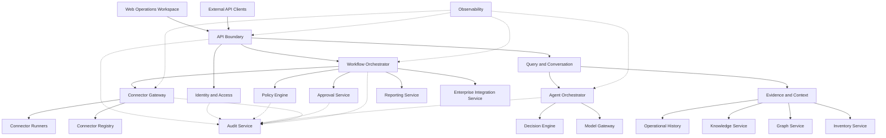

# Project Atlas

## Component Architecture

| Field | Value |
| --- | --- |
| Document ID | ATLAS-011 |
| Version | 1.0.0 |
| Status | Approved |
| Document Owner | Architecture Owner |
| Reviewers | Backend Architecture, Frontend Architecture, Security Architecture, AI Architecture, Infrastructure Operations |
| Approver | Umit Ozdemir (acting Architecture Owner) |
| Approval Date | 2026-08-03 |
| Last Updated | 2026-08-03 |
| Related Documents | [ATLAS-003](003_Project_Principles.md), [ATLAS-004](004_Glossary.md), [ATLAS-010](010_System_Architecture.md), [ATLAS-012](012_Microservice_Architecture.md), [ATLAS-016](016_Event_Architecture.md), [ATLAS-050](050_API.md) |
| Supersedes | ATLAS-011 version 0.1.0 |

## 1. Purpose

This document decomposes the logical planes defined by ATLAS-010 into components with explicit responsibilities, owned data, inbound and outbound contracts, security obligations, and forbidden dependencies.

The component model applies whether components are deployed as modules in one process or as separate services. Deployment topology must not erase ownership boundaries.

## 2. Scope

### In Scope

- Logical component catalog and ownership
- Synchronous API, asynchronous event, and workflow boundaries
- Data ownership and cross-component access rules
- Security, audit, observability, and failure obligations
- MVP module and process mapping
- Rules for adding, replacing, or extracting components

### Out of Scope

- Technology or framework selection
- Endpoint-level API schemas
- Physical database topology
- Detailed user-interface component hierarchy
- Vendor connector implementation details
- Production sizing

## 3. Component Design Rules

All components must follow these rules:

1. A component has one primary business responsibility and an accountable owner.
2. A component owns its state and exposes that state through versioned contracts.
3. Components do not modify another component's owned data directly.
4. Authentication context and correlation identifiers cross every protected boundary.
5. Authorization and policy are enforced by authoritative components, not inferred by callers.
6. AI output, connector output, retrieved content, and external events are untrusted inputs.
7. Sensitive operations emit durable audit events as part of the operation outcome.
8. Long-running work is represented by durable workflow state rather than an open web request.
9. Failure, timeout, cancellation, retry, and partial completion are explicit contract outcomes.
10. Components may be physically co-located in the MVP but remain logically separable and independently testable.

## 4. Component Map

## 5. Component Catalog

| Component | Primary responsibility | Owned state | Main contracts |
| --- | --- | --- | --- |
| Web Operations Workspace | Human interaction and operational visualization | Local presentation state only | Web API client, streaming response client |
| API Boundary | Request validation, session context, correlation, routing, rate control | Request metadata and optional idempotency records | Versioned HTTP or streaming API |
| Identity and Access | Authentication integration and scoped authorization | Identity mappings, roles, grants, sessions, access decisions | Authentication and authorization contracts |
| Query and Conversation | Conversation lifecycle and query coordination | Conversations, messages, user-visible response state | Query command and response contracts |
| Workflow Orchestrator | Durable coordination of long-running work | Workflow definitions, runs, steps, retries, checkpoints | Workflow command, state, and event contracts |
| Policy Engine | Deterministic policy evaluation | Versioned policy packages and decision records | Policy decision contract |
| Approval Service | Human approval lifecycle and separation of duties | Approval packets, decisions, expiry, conditions | Approval command, query, and event contracts |
| Connector Registry | Connector package and capability lifecycle | Manifests, versions, compatibility, trust and enablement state | Registry and capability-discovery contracts |
| Connector Gateway | Mediation of authorized capability invocation | Short-lived invocation state and idempotency records | Capability invocation contract |
| Connector Runner | Isolated vendor interaction | Ephemeral execution state; no platform system of record | Runner control and structured result contracts |
| Evidence and Context | Policy-filtered assembly of evidence packages | Evidence references and context assembly records | Evidence query and package contracts |
| Agent Orchestrator | Bounded AI task planning and agent coordination | Agent run metadata, budgets, tool-use records | Agent task and result contracts |
| Model Gateway | Approved model routing and invocation controls | Endpoint configuration references and usage metadata | Model request and structured response contracts |
| Decision Engine | Findings, confidence, impact, alternatives, and recommendation preparation | Decision records and recommendation versions | Decision input and output contracts |
| Inventory Service | Normalized infrastructure entity inventory | Entities, source identifiers, attributes, observations | Inventory query and reconciliation contracts |
| Graph Service | Typed, time-aware infrastructure relationships | Relationships, validity, provenance, graph projections | Graph query and mutation contracts |
| Knowledge Service | Source registration, ingestion, retrieval, and provenance | Sources, items, chunks, indexes, access metadata | Ingestion and retrieval contracts |
| Operational History | Health findings, incidents, changes, and prior outcomes | Time-series findings and operational records | History query and append contracts |
| Reporting Service | Versioned technical and management report generation | Report definitions, runs, artifacts, delivery state | Report command, query, and artifact contracts |
| Enterprise Integration Service | ITSM, SIEM, Syslog, notification, and CMDB adapters | Integration configuration references and delivery state | Adapter command and delivery event contracts |
| Audit Service | Durable security and operational accountability | Append-oriented audit events and export state | Audit append, query, integrity, and export contracts |
| Observability | Operational telemetry collection and alerting | Logs, metrics, traces, health and alert state | Telemetry protocols and health contracts |
| Configuration and Secrets | Governed configuration and secret-reference resolution | Versioned configuration, secret references, rotation metadata | Configuration and secret-resolution contracts |

## 6. Experience and API Components

### 6.1 Web Operations Workspace

Responsibilities:

- Present chat, infrastructure context, evidence, risk, approvals, reports, and administration
- Preserve explicit workflow and freshness status
- Display uncertainty, missing evidence, and degraded behavior
- Support cancellation and review of eligible long-running work
- Avoid exposing secrets, raw credentials, or unauthorized resources

The workspace may optimize presentation but must not reinterpret policy, risk class, approval, or execution state.

### 6.2 API Boundary

Responsibilities:

- Terminate approved transport protocols
- Validate content type, request schema, size, and rate limits
- Establish authenticated session and request context
- Assign or validate request and correlation identifiers
- Enforce coarse endpoint authorization before routing
- Return consistent errors and workflow identifiers
- Support bounded streaming for chat and progress updates

Forbidden behavior:

- Direct connector or model invocation
- Business decisions implemented only in route handlers
- Trusting client-supplied role, risk, target, or approval claims
- Holding an HTTP request open for unbounded operational work

### 6.3 Query and Conversation

Responsibilities:

- Persist conversations and messages according to retention policy
- Normalize user intent into an analysis request
- Create or attach to the appropriate workflow
- Stream evidence-linked progress and final results
- Preserve recommendation and evidence version references

Conversation history is context, not authority. Instructions in prior messages cannot grant access or approval.

## 7. Control Components

### 7.1 Identity and Access

Responsibilities:

- Authenticate through configured local bootstrap or enterprise providers
- Map enterprise identities and groups to Atlas roles
- Evaluate permissions for action, resource, environment, and data scope
- Manage sessions, expiry, revocation, and step-up authentication hooks
- Emit authentication and authorization audit events

The component returns explicit allow or deny decisions with decision identifiers. It does not depend on AI output.

### 7.2 Workflow Orchestrator

Responsibilities:

- Validate and instantiate versioned workflow definitions
- Persist workflow and step state before external side effects
- Manage scheduling, retries, timeouts, cancellation, compensation, and approval waits
- Pass immutable inputs and correlation context to each step
- Record partial completion and recovery requirements
- Emit lifecycle events and audit references

The orchestrator coordinates components but does not own their domain data or duplicate policy logic.

### 7.3 Policy Engine

Responsibilities:

- Evaluate identity, role, capability class, target, environment, change window, approval, and service impact
- Return deterministic `allow`, `deny`, or conditional outcomes
- Version policy packages and decision inputs
- Explain which policy and rule produced the result
- Support simulation and policy unit testing

Policy decisions are immutable records for a specific input context and expire according to policy. A previous allow result is not reusable after relevant context changes.

### 7.4 Approval Service

Responsibilities:

- Create immutable approval packets from a versioned proposal
- Resolve authorized approvers and separation-of-duties constraints
- Capture approve, reject, defer, request-evidence, expire, or cancel outcomes
- Bind approval to action, target, parameters, plan version, and expiry
- Notify the workflow of a decision without directly invoking execution

Changing bound proposal fields invalidates the approval.

### 7.5 Connector Registry

Responsibilities:

- Register connector identity, publisher, version, integrity, and compatibility
- Store capability manifests and risk classifications
- Track validation, trust, installation, enablement, and health state
- Prevent silent permission expansion during upgrade
- Support capability discovery under caller authorization

Registration does not grant execution permission. Unreviewed packages remain disabled.

## 8. Intelligence Components

### 8.1 Evidence and Context

Responsibilities:

- Resolve evidence requirements for an analysis request
- Retrieve only data permitted for the requesting identity and purpose
- Combine live connector results, inventory, graph, knowledge, and history references
- Label observation time, provenance, source authority, conflict, and staleness
- Minimize and classify content before model use
- Persist a reproducible evidence-package reference

The component must distinguish observation, inference, assumption, and unknown.

### 8.2 Agent Orchestrator

Responsibilities:

- Select registered agent definitions for permitted analytical tasks
- Enforce tool allowlists, step limits, model budgets, timeouts, and cancellation
- Request capabilities only through governed platform contracts
- Record agent runs, tool requests, and structured outputs
- Stop when evidence or policy conditions are not met

Agents cannot obtain credentials, approve actions, modify policy, or directly invoke connector runners.

### 8.3 Model Gateway

Responsibilities:

- Route requests only to approved OpenAI-compatible endpoints
- Apply endpoint and data-classification policy
- Enforce request limits, timeout, retry, and structured-output requirements
- Record usage and model identity without logging prohibited content
- Normalize provider errors and health state

The gateway does not decide which infrastructure capabilities the caller may use.

### 8.4 Decision Engine

Responsibilities:

- Normalize deterministic findings and AI analysis candidates
- Evaluate evidence coverage and conflict
- Assign bounded confidence and expose uncertainty
- Prepare root cause candidates, impact, alternatives, and recommendations
- Produce the ATLAS-003 standard AI output contract
- Request policy classification for proposed operational actions

Decision records reference evidence and model or rule versions. They are recommendations, not authorizations.

## 9. Integration Components

### 9.1 Connector Gateway

Responsibilities:

- Accept only registered capability identifiers and typed parameters
- Revalidate identity, target, capability, policy decision, and approval binding as required
- Select an eligible connector instance and isolated runner
- Enforce idempotency, timeout, concurrency, and output-size constraints
- Validate structured results and retain vendor evidence references
- Emit invocation and outcome audit events

Forbidden behavior:

- Accept arbitrary commands from prompts or users
- Select a broader credential when a scoped one fails
- Convert timeout or unknown runner state into success
- Retry non-idempotent behavior without an explicit strategy

### 9.2 Connector Runner

Responsibilities:

- Receive one bounded invocation with short-lived credential access
- Connect only to declared targets and dependencies
- Execute the declared vendor operation
- Return structured result, error classification, timing, and source metadata
- Terminate or reset safely after policy-defined limits

The runner has no access to user sessions, approval administration, policy authoring, model endpoints, or unrelated platform stores.

### 9.3 Enterprise Integration Service

Responsibilities:

- Translate Atlas contracts to ITSM, CMDB, SIEM, Syslog, and notification interfaces
- Authenticate external systems and validate inbound payloads
- Implement delivery retry, idempotency, replay protection, and dead-letter handling
- Preserve source identifiers and correlation
- Enforce integration-specific data minimization

External integration state cannot silently override Atlas policy or audit records.

## 10. Data and Knowledge Components

### 10.1 Inventory Service

Responsibilities:

- Reconcile entities from connectors, imports, and approved external sources
- Preserve vendor and source identifiers alongside normalized identities
- Track observation time, source precedence, conflict, and lifecycle state
- Expose scoped inventory search and detail contracts

### 10.2 Graph Service

Responsibilities:

- Own typed relationships, provenance, direction, and validity intervals
- Support dependency, upstream, downstream, path, and blast-radius queries
- Expose missing-data and freshness indicators
- Maintain graph projections without rewriting inventory source evidence

### 10.3 Knowledge Service

Responsibilities:

- Register sources and ownership
- Ingest, parse, classify, version, chunk, index, and retire knowledge
- Enforce document and chunk-level access filters
- Return source-linked retrieval results with authority and freshness metadata
- Delete or rebuild derived indexes when source content changes

### 10.4 Operational History

Responsibilities:

- Store health findings, incident links, change outcomes, capacity observations, and recommendation outcomes
- Support time-window and target-scoped queries
- Preserve source-system identifiers and correction history
- Distinguish imported records from Atlas-generated findings

### 10.5 Reporting Service

Responsibilities:

- Execute versioned report definitions against authorized domain queries
- Preserve report inputs, generation time, classification, and evidence references
- Generate artifacts asynchronously
- Control download, retention, and delivery

Reports cannot grant broader data access than the requesting or receiving identity possesses.

## 11. Governance Components

### 11.1 Audit Service

Responsibilities:

- Accept authenticated, schema-valid audit events
- Enforce required fields and prohibited-data rules
- Persist append-oriented records with integrity controls
- Support restricted queries, retention, legal hold where required, and export
- Monitor audit pipeline health and backlog

Sensitive operations must define whether audit persistence is synchronous or transactionally coupled. A failed required audit write causes the operation to fail closed.

### 11.2 Observability

Responsibilities:

- Collect structured application logs, metrics, traces, and health
- Propagate correlation across components
- Alert on platform, connector, workflow, model, policy, audit, and data-store failures
- Redact secrets and limit sensitive context

Observability data supports operations but is not the authoritative audit record.

### 11.3 Configuration and Secrets

Responsibilities:

- Resolve layered, versioned configuration for environment and component scope
- Store only secret references in ordinary configuration
- Deliver secrets to authorized workloads at runtime
- Support rotation, revocation, certificate trust, and configuration validation

## 12. Allowed Interaction Patterns

| Pattern | Use |
| --- | --- |
| Synchronous query | Bounded reads, validation, authorization, policy, and short status operations |
| Durable command | Request creation of long-running or state-changing work |
| Domain event | Publish a completed fact for decoupled consumers |
| Workflow step | Coordinate ordered work, retries, approval waits, and recovery |
| Evidence reference | Link conclusions to immutable or versioned source material |

Rules:

- Commands express intent and may be rejected.
- Events describe facts that already occurred and are not mutable commands.
- Queries must not create hidden operational side effects.
- Workflow state is not reconstructed solely from logs.
- Components must not call themselves through public APIs to share internal code.

## 13. Forbidden Dependencies

- Experience components must not call Connector Runners, Model Gateway, or data stores directly.
- Agent Orchestrator must not call Connector Runners or secrets directly.
- Connector Runner must not call Policy Engine to authorize itself.
- Decision Engine must not update inventory, graph, knowledge, policy, or approval state.
- Reporting must not bypass domain authorization by reading raw databases.
- Enterprise integrations must not modify audit history.
- Observability pipelines must not become a command path into components.
- No component may use another component's database as its public API.
- No component may interpret an LLM response as proof of authorization, approval, or execution success.

## 14. Data Ownership and Transaction Boundaries

### 14.1 Ownership

Each mutable record has one authoritative owner. Derived read models may be replicated, but they identify source version and refresh state.

### 14.2 Transactions

- Transactions do not span independently deployed component stores.
- Cross-component consistency uses workflows, idempotent commands, events, and compensation.
- Audit records reference the authoritative operation result.
- Approval and execution binding uses immutable identifiers and version checks.
- Connector side effects are never assumed rolled back by a database transaction.

### 14.3 Concurrency

Components use optimistic versioning, idempotency keys, leases, or target locks where concurrent work could conflict. Lock scope and expiry must be visible and auditable.

## 15. Error and Result Contract

All component boundaries use structured outcomes containing, where applicable:

- Outcome code and stable error category
- Human-safe summary
- Correlation and operation identifiers
- Retryability and recommended retry delay
- Partial-completion state
- Evidence or diagnostic references
- Policy or authorization decision reference
- Sanitized vendor error reference

Internal stack traces, credentials, tokens, or unrestricted vendor payloads are not returned to clients.

## 16. Security and Audit Obligations

Each component specification must declare:

- Authentication and service identity requirements
- Required permissions and resource scopes
- Data classifications read and written
- Secret references required
- Audit events emitted
- Network destinations
- Threats and abuse limits
- Failure behavior when identity, policy, or audit dependencies are unavailable

## 17. Observability Contract

Every component exposes:

- Liveness and readiness appropriate to its dependencies
- Request or job counts, latency, error, and saturation metrics
- Structured logs with component, event name, severity, and correlation ID
- Distributed trace propagation where supported
- Version, build, and dependency health metadata

Metrics labels must avoid unbounded values such as raw target names, user input, or document identifiers.

## 18. MVP Physical Mapping

The MVP may combine logical components as follows:

| Process or deployable | Logical components |
| --- | --- |
| Web frontend | Web Operations Workspace |
| Backend control-plane process | API Boundary, Identity and Access, Query, Policy, Approval, Registry, domain service APIs |
| Workflow worker process | Workflow Orchestrator, report coordination, ingestion coordination |
| AI worker process | Evidence and Context, Agent Orchestrator, Decision Engine |
| Model gateway process or module | Model Gateway |
| Connector gateway process | Connector Gateway and runner lifecycle control |
| Isolated connector runner | One connector package or tightly governed connector group |
| Data services | Transactional, graph, retrieval, artifact, audit, and observability stores as selected by ADR |

Physical co-location does not authorize cross-module table writes or hidden calls.

## 19. Component Lifecycle

A new or materially changed component requires:

1. Named responsibility and owner
2. Input, output, API, command, and event contracts
3. Owned data and migration strategy
4. Identity, authorization, policy, and audit behavior
5. Failure, retry, cancellation, and recovery behavior
6. Observability and support model
7. Compatibility and versioning statement
8. Unit, contract, integration, security, and failure tests
9. Deployment and rollback plan
10. ADR when the change affects an accepted boundary

## 20. Dependencies and Traceability

- ATLAS-010 defines the planes, trust zones, core flows, and runtime direction refined here.
- ATLAS-012 defines when logical components become independently deployed services.
- ATLAS-016 defines domain event envelopes and delivery behavior.
- ATLAS-020 and ATLAS-021 refine connector, capability, registry, and runner contracts.
- ATLAS-030 through ATLAS-038 refine identity, access, audit, logging, integration, and approval components.
- ATLAS-050 through ATLAS-053 refine API, backend, frontend, and persistent data implementation.

## 21. Assumptions

- Logical separation is required from the first implementation even when physical deployment is consolidated.
- Connector execution requires stronger isolation than ordinary control-plane modules.
- The initial team may own multiple components, but ownership remains explicit.
- External systems can be unavailable and all integration contracts require bounded failure behavior.

## 22. Open Questions

- Which component contracts require formal schemas before the first vertical slice?
- Which domain read models should be replicated for query performance?
- Which audit writes must be synchronous in the MVP?
- Which components require separate service identities when physically co-located?
- Which component is the first candidate for independent extraction after MVP measurement?

## 23. Acceptance Criteria

This document is ready to enter Review when:

- Every ATLAS-010 logical responsibility has one authoritative component owner.
- Component data ownership and forbidden dependencies are accepted.
- AI, connector, policy, approval, and execution boundaries are unambiguous.
- The MVP physical mapping preserves required trust and process isolation.
- Error, audit, observability, and lifecycle contracts are sufficient to guide detailed APIs.
- Required component contract ADRs and schema work are assigned.

## 24. Change History

| Version | Date | Author | Summary |
| --- | --- | --- | --- |
| 0.1.0 | 2026-07-21 | Project Atlas Team | Initial component list and integration boundaries |
| 0.2.0 | 2026-08-03 | Architecture Owner | Added governed metadata, component ownership, contracts, forbidden dependencies, data boundaries, MVP mapping, and lifecycle requirements |
| 1.0.0 | 2026-08-03 | Umit Ozdemir | Approved as the first binding documentation baseline under the designated approver authority |
