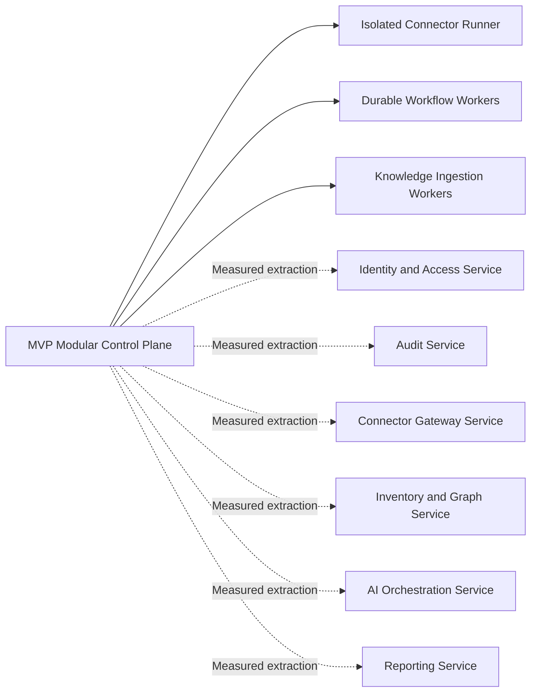

# Project Atlas

## Microservice Architecture

| Field | Value |
| --- | --- |
| Document ID | ATLAS-012 |
| Version | 1.0.0 |
| Status | Approved |
| Document Owner | Architecture Owner |
| Reviewers | Backend Architecture, Platform Engineering, Security Architecture, Operations |
| Approver | Umit Ozdemir (acting Architecture Owner) |
| Approval Date | 2026-08-03 |
| Last Updated | 2026-08-03 |
| Related Documents | [ATLAS-003](003_Project_Principles.md), [ATLAS-010](010_System_Architecture.md), [ATLAS-011](011_Component_Architecture.md), [ATLAS-013](013_Deployment_Architecture.md), [ATLAS-016](016_Event_Architecture.md), [ATLAS-051](051_Backend.md) |
| Supersedes | ATLAS-012 version 0.1.0 |

## 1. Purpose

This document defines how Project Atlas preserves service boundaries while starting with an operationally manageable MVP. It establishes the criteria, contracts, security controls, and migration process for extracting logical components into independently deployed services.

Atlas does not adopt microservices as a goal by itself. Distribution is used only where trust, scale, availability, deployment, ownership, or failure isolation justifies its cost.

## 2. Scope

### In Scope

- MVP modular-monolith position
- Candidate service boundaries
- Service extraction criteria and process
- Service communication, data ownership, and consistency
- Identity, authorization, policy, audit, and secret propagation
- Resilience, observability, deployment, and testing expectations
- Distributed-system anti-patterns and governance

### Out of Scope

- Selection of a service mesh, message broker, container platform, or framework
- Endpoint and event field-level schemas
- Physical production topology and sizing
- Component responsibilities already defined by ATLAS-011

## 3. Architectural Position

### 3.1 MVP Position

The Atlas MVP should use a modular control-plane application with explicit internal contracts, durable worker processes, and isolated connector runners.

The MVP is not one undifferentiated codebase. It preserves:

- Module ownership
- Dependency direction
- Domain data ownership
- Contract-based interaction
- Service identity boundaries where required
- Independent tests
- Extractable packaging boundaries

### 3.2 Required Separate Processes

Regardless of modular-monolith deployment, these workloads require process or stronger isolation:

- Connector runners
- Long-running workflow workers
- Document parsing and embedding workers
- Untrusted connector validation
- Resource-intensive report generation where it could affect API availability

### 3.3 Target Direction

Atlas may evolve into a set of independently deployed services. The target is a well-governed distributed system, not the maximum number of services.

## 4. Decision Model: Module or Service

A logical component remains a module by default. Extraction requires evidence and an ADR.

| Driver | Evidence that supports extraction |
| --- | --- |
| Trust boundary | Different network zone, credentials, data classification, or compromise impact |
| Failure isolation | Repeated failures or resource exhaustion affect unrelated workloads |
| Independent scale | Measured load profile differs materially from the control plane |
| Availability | Component requires a distinct recovery or redundancy objective |
| Site locality | Processing or data must remain near managed infrastructure or a geographic site |
| Release independence | Separate release cadence materially reduces risk or coordination cost |
| Ownership | A stable team can own build, deployment, support, and on-call responsibility |
| Technology fit | A different runtime or storage model provides demonstrated operational value |
| Compliance | Regulation or policy requires isolation, retention, or administration separation |

Weak reasons that do not justify extraction alone:

- The component name contains the word `service`.
- A framework makes service creation easy.
- A future scale problem is imagined but not measured.
- The code has become difficult to understand due to missing modularity.
- Separate deployment is used to avoid defining internal contracts.

## 5. Candidate Service Evolution

Candidate services and likely extraction reasons:

| Candidate | Likely reason | Prerequisite |
| --- | --- | --- |
| Connector Gateway | Network and credential isolation, site-local access, failure containment | Stable capability invocation contract and runner protocol |
| Audit | Integrity separation, retention, write throughput, independent administration | Stable audit schema and fail-closed policy |
| Knowledge Ingestion | CPU and memory isolation, independent scaling, untrusted file processing | Durable ingestion workflow and artifact quarantine |
| AI Orchestration | Model resource isolation, independent scaling, endpoint-specific network policy | Stable evidence-package and structured-output contracts |
| Inventory and Graph | Query scale, site federation, specialized storage | Stable entity, relationship, provenance, and reconciliation contracts |
| Workflow | High volume, long retention, independent availability | Stable workflow definition and event model |
| Reporting | Resource isolation and independent scheduling | Stable domain query and artifact contracts |
| Identity and Access | Security administration separation or enterprise federation scale | Stable session, token, and authorization-decision contracts |

No candidate is automatically approved for extraction.

## 6. Service Boundary Rules

An independently deployed service must:

- Have one named business responsibility and owner
- Own its mutable data
- Publish versioned APIs, commands, and events
- Authenticate every caller and use its own service identity
- Re-evaluate authorization where it is authoritative
- Define timeout, retry, idempotency, and cancellation behavior
- Emit metrics, logs, traces, health, and audit events
- Provide deployment, migration, backup, restore, and rollback procedures
- Support backward-compatible rolling change where required
- Define support ownership and operational objectives

A service must not:

- Read or write another service's database
- Share a universal administrator credential
- Trust network location as identity
- Delegate authorization to an upstream UI or LLM
- Expose internal vendor credentials in API payloads
- Require synchronous chains for every request
- Use events as undocumented remote procedure calls

## 7. Service Communication

### 7.1 Synchronous Calls

Use synchronous calls when the caller requires an immediate bounded answer, including:

- Authentication and authorization
- Policy evaluation
- Short queries
- Schema validation
- Workflow state retrieval

Requirements:

- Explicit deadline shorter than the caller deadline
- Propagated correlation and trace context
- Authenticated service identity
- Versioned schema and structured error
- No automatic retry for non-idempotent operations
- Bounded response size

### 7.2 Asynchronous Commands

Use durable commands to request long-running or side-effecting work.

Commands include:

- Unique command and idempotency identifiers
- Requesting identity and delegated scope reference
- Target and environment scope
- Contract version
- Expiry and cancellation behavior
- Correlation, causation, and workflow identifiers

A command can be accepted, rejected, or conditionally accepted. Acceptance is not completion.

### 7.3 Domain Events

Events represent completed facts and are immutable. Event consumers must tolerate duplicate and delayed delivery according to ATLAS-016.

### 7.4 Prohibited Chatty Interaction

Service boundaries should not produce many fine-grained calls for one user action. Prefer coarse domain contracts, workflow orchestration, and local read models where justified.

## 8. Identity and Trust Between Services

Each service and worker has a unique workload identity.

Required controls:

- Mutual authentication or equivalent trusted workload identity
- Short-lived credentials where supported
- Explicit caller allowlists and permission scopes
- Target audience validation for service tokens
- Rotation without rebuilding application artifacts
- Audit attribution to both human initiator and service actor

User identity propagation uses a bounded delegation context. Services must not forward raw user passwords, long-lived tokens, or unrestricted sessions.

## 9. Authorization, Policy, and Approval

Distributed deployment must preserve authoritative decisions:

- Identity and Access owns authorization decisions.
- Policy Engine owns policy decisions.
- Approval Service owns approval state.
- Connector Gateway revalidates required decisions at the execution boundary.
- Workflow Orchestrator binds decision references to the exact work item.

Decision tokens or references must be short-lived, audience-bound, tamper-evident, and include relevant target, capability, parameters or plan version, environment, and expiry.

A network call succeeding does not prove the action was authorized.

## 10. Data Ownership

### 10.1 Database per Service Principle

An extracted service controls its persistence schema. Physical database infrastructure may be shared, but credentials, schemas, migrations, backup ownership, and access boundaries remain separate.

### 10.2 Prohibited Shared-Database Integration

Other services cannot:

- Query private tables for convenience
- Add foreign keys into another service's schema
- Run another service's migrations
- Use database triggers as cross-service integration
- Repair another service's data without an owned administrative contract

### 10.3 Read Models

Cross-domain query views use APIs, events, materialized read models, or governed analytical stores. Read models expose source version, update time, and rebuild procedure.

## 11. Consistency and Transactions

Atlas does not use distributed database transactions across service boundaries.

Patterns:

- Local transaction plus transactional outbox for event publication
- Idempotent command handling
- Workflow saga for multi-step operations
- Explicit compensation where reversal is possible
- Recovery workflow where reversal is not possible
- Optimistic concurrency using entity or plan versions

The user sees pending, partial, failed, compensating, and recovery-required states. The system must not report success until required authoritative outcomes are known.

## 12. Workflow Orchestration and Choreography

Use orchestration when:

- Step order matters
- Approval or policy gates exist
- Recovery and partial completion must be visible
- The process spans minutes or longer
- Human interaction is required

Use event choreography when:

- Consumers independently react to a completed fact
- No single consumer owns the whole process
- Eventual consistency is acceptable

Do not implement security-sensitive operational changes as unowned event choreography.

## 13. Resilience

### 13.1 Required Controls

- Timeouts on every remote call
- Bounded retries with backoff and jitter
- Circuit breaking where repeated remote failure would amplify load
- Concurrency and queue limits
- Bulkheads between workloads and tenants or environments where applicable
- Idempotency for retryable commands
- Dead-letter or quarantine handling
- Health that distinguishes process liveness from dependency readiness

### 13.2 Retry Ownership

Exactly one layer owns a retry policy for a given failed operation. Nested automatic retries must be budgeted to avoid retry storms.

### 13.3 Backpressure

Producers must receive explicit overload or queue-full outcomes. The platform must not accept unbounded work and rely on memory queues.

## 14. Availability and Recovery

Each extracted service defines:

- Availability objective
- Recovery Time Objective and Recovery Point Objective
- Backup and restore ownership
- Data replication assumptions
- Dependency failure behavior
- Degraded mode
- Maintenance and upgrade behavior

Service availability cannot exceed the availability of mandatory synchronous dependencies. Architecture reviews must minimize critical synchronous chains.

## 15. Deployment and Release

An extracted service has:

- Independently versioned artifact
- Immutable build output
- Declarative configuration and secret references
- Automated database migration with compatibility phase
- Readiness gate and health checks
- Resource requests and limits
- Network policy and egress declaration
- Rolling, blue-green, or controlled replacement strategy as appropriate
- Rollback or forward-fix decision procedure

Independent deployment does not permit uncoordinated breaking contract changes.

## 16. Contract Versioning

### 16.1 Compatibility

- Additive changes are preferred.
- Consumers ignore unknown optional fields.
- Required-field removal or semantic change is breaking.
- Breaking changes require parallel contract versions or coordinated migration.
- Event schemas retain compatibility for the full replay and retention window.

### 16.2 Consumer-Driven Validation

Providers run contract tests for known consumers where practical. Contract registries or schema repositories may be introduced through ADR.

## 17. Observability

Every remote interaction records:

- Source and destination service identity
- Contract and version
- Correlation, causation, request, workflow, and trace identifiers
- Duration, result category, retry count, and timeout
- Queue latency for asynchronous work

Telemetry must avoid secrets, unrestricted user content, document text, and high-cardinality labels.

## 18. Audit

Audit events preserve the human initiator, service actor, decision references, target, capability, and outcome across service hops.

Audit requirements:

- A service cannot claim another service's identity.
- Retries reference the same logical operation and distinct attempt identifiers.
- Duplicate audit ingestion does not create contradictory outcomes.
- Clock synchronization and event receipt time are monitored.
- Audit failure behavior follows the operation's sensitivity policy.

## 19. Security

### 19.1 Network

- Default-deny ingress and egress where the platform supports it
- Explicit service and target allowlists
- Encrypted transport
- Certificate or workload-identity rotation
- Separate administration paths

### 19.2 Supply Chain

- Signed or integrity-verified artifacts
- Dependency and image scanning
- Software bill of materials where required
- Controlled base images and registries
- Reproducible build evidence

### 19.3 Runtime

- Non-root execution where supported
- Read-only filesystems and minimal privileges where practical
- Resource limits
- Secret injection rather than embedded files
- Isolation of untrusted parsing and connector code

## 20. Testing Strategy

Extracted services require:

- Unit tests for domain behavior
- API, command, and event schema tests
- Consumer and provider contract tests
- Authorization, policy, and audit tests
- Idempotency and concurrency tests
- Timeout, retry, circuit-breaker, and backpressure tests
- Migration and backward-compatibility tests
- Backup and restore tests
- Network and dependency failure tests
- End-to-end tests for critical workflows

## 21. Extraction Process

1. Identify a measured driver and owner.
2. Record the decision and alternatives in an ADR.
3. Stabilize the in-process module contract.
4. Remove direct data and code dependencies.
5. Introduce contract tests and telemetry.
6. Create a service identity, storage boundary, and deployment artifact.
7. Run module and service implementations in compatibility mode if needed.
8. Migrate traffic and data incrementally.
9. Validate failure, rollback, recovery, and operations.
10. Remove the old path only after acceptance and evidence retention.

## 22. Distributed-System Anti-Patterns

Atlas must avoid:

- Distributed monoliths with synchronous all-to-all calls
- One service per database table
- Shared universal libraries containing mutable domain logic
- Shared databases as integration contracts
- Events with hidden command semantics
- Unbounded retry loops
- Assuming exactly-once delivery without end-to-end proof
- Long synchronous connector calls through the web request path
- Service extraction without an owning team or operational model
- Using microservices to compensate for unclear component design

## 23. Dependencies and Traceability

- ATLAS-010 defines the system planes, runtime baseline, and extraction triggers.
- ATLAS-011 defines logical component responsibilities and ownership.
- ATLAS-013 defines physical deployment profiles and platform requirements.
- ATLAS-016 defines event envelopes, delivery, replay, and retention.
- ATLAS-023 defines workflow orchestration and recovery behavior.
- ATLAS-050 and ATLAS-051 define API and backend implementation contracts.

## 24. Assumptions

- The MVP team benefits more from operational simplicity than independent deployment of every component.
- Connector, parsing, and long-running workloads still require isolation from the web process.
- Enterprise deployments may eventually require site-local or security-zone-specific services.
- The platform can introduce a durable asynchronous backbone when justified by the workflow architecture.

## 25. Open Questions

- Which durable workflow and messaging technology will be selected?
- Which service-to-service identity mechanism supports both container and restricted enterprise deployments?
- Which service is the first extraction candidate after MVP measurements?
- Which contract-testing and schema-governance tooling will be adopted?
- What availability objectives apply to the first production deployment?

## 26. Acceptance Criteria

This document is ready to enter Review when:

- Reviewers accept the modular control-plane MVP position.
- Required process isolation is distinguished from optional service extraction.
- Extraction criteria, data ownership, and communication rules are enforceable.
- Identity, policy, approval, audit, and execution context remain intact across service boundaries.
- Reliability, deployment, testing, and operational ownership requirements are complete.
- ADR owners are assigned for workflow, messaging, workload identity, and first service extraction.

## 27. Change History

| Version | Date | Author | Summary |
| --- | --- | --- | --- |
| 0.1.0 | 2026-07-21 | Project Atlas Team | Initial microservice direction and candidate services |
| 0.2.0 | 2026-08-03 | Architecture Owner | Defined modular MVP position, extraction criteria, distributed contracts, data ownership, resilience, security, and migration process |
| 1.0.0 | 2026-08-03 | Umit Ozdemir | Approved as the first binding documentation baseline under the designated approver authority |
