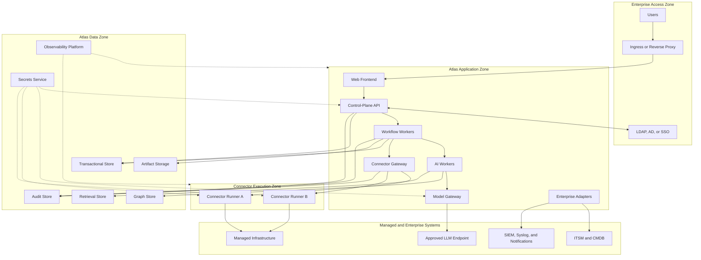

# Project Atlas

## Deployment Architecture

| Field | Value |
| --- | --- |
| Document ID | ATLAS-013 |
| Version | 1.0.0 |
| Status | Approved |
| Document Owner | Platform Architecture |
| Reviewers | Architecture Owner, Security Architecture, Platform Engineering, Infrastructure Operations, Database Administration |
| Approver | Umit Ozdemir (acting Architecture Owner) |
| Approval Date | 2026-08-03 |
| Last Updated | 2026-08-03 |
| Related Documents | [ATLAS-003](003_Project_Principles.md), [ATLAS-010](010_System_Architecture.md), [ATLAS-011](011_Component_Architecture.md), [ATLAS-012](012_Microservice_Architecture.md), [ATLAS-038](038_Deployment_and_Bootstrap.md), [ATLAS-057](057_Deployment.md) |
| Supersedes | ATLAS-013 version 0.1.0 |

## 1. Purpose

This document defines the deployment profiles, trust zones, runtime placement, network flows, configuration, secrets, availability, backup, upgrade, and restricted-network requirements for Project Atlas.

It separates logical architecture from physical topology so the same governed component contracts can run in developer, lab, restricted enterprise, and future production environments.

## 2. Scope

### In Scope

- Supported deployment profiles and promotion path
- Runtime units and placement constraints
- Network zones and required flows
- Configuration, secrets, certificates, and artifact handling
- Restricted-network and offline installation
- Availability, scaling, backup, restore, and disaster recovery
- Upgrade, rollback, migration, and operational readiness
- Deployment security and observability

### Out of Scope

- Final selection of container platform, databases, secret manager, or observability products
- Customer-specific IP addresses, hostnames, firewall rules, or sizing
- Detailed installation commands
- Application-level component behavior already defined by ATLAS-011

## 3. Deployment Principles

1. Deployment is reproducible from versioned repository and release artifacts.
2. Runtime configuration is external to immutable application artifacts.
3. Secrets are resolved at runtime and never committed or embedded in images.
4. Connector execution is isolated from the web and control-plane processes.
5. Network access is deny-by-default and allowlisted by workload purpose.
6. AI model, connector, database, and enterprise integration traffic use explicit trust boundaries.
7. Restricted-network installation is a first-class deployment path.
8. Backup, restore, upgrade, and rollback are tested release capabilities.
9. Production topology is selected from measured objectives, not copied from a lab profile.
10. Deployment automation cannot bypass application authorization, policy, approval, or audit controls.

## 4. Deployment Profiles

| Profile | Purpose | Availability expectation | External dependencies |
| --- | --- | --- | --- |
| Developer | Local coding, tests, and contract validation | Disposable; no production durability | Mock systems and optional local model |
| Integration Test | Automated multi-component and failure tests | Re-creatable and isolated | Test identity, model, connectors, and stores |
| Lab | End-to-end architecture and connector validation | Recoverable but not production HA | Non-production infrastructure targets |
| Restricted Enterprise | On-premises deployment with controlled or absent internet | Defined by customer environment | Internal mirrors, identity, model, logging, and targets |
| Production | Future supported operational deployment | Explicit SLO, RTO, and RPO | Enterprise platform and recovery services |
| Site Connector Edge | Optional future site-local connector execution | Site policy dependent | Central control plane and local target systems |

Profiles use the same signed release version and contracts. Profile differences are configuration, scale, placement, dependency, and resilience decisions.

## 5. Runtime Units

| Runtime unit | Workload | Isolation requirement |
| --- | --- | --- |
| Web frontend | Static assets and browser-facing UI | Separate from connector and secret-bearing workloads |
| Control-plane API | API, identity integration, policy, approval, registry, domain APIs | Protected application zone; no direct managed-infrastructure route |
| Workflow workers | Durable orchestration, scheduling, reporting, reconciliation | Separate process with bounded queues and concurrency |
| AI workers | Evidence assembly, agent orchestration, decision processing | Separate resource and data-egress policy |
| Model Gateway | Approved LLM endpoint mediation | Only approved model destinations; no managed-infrastructure route |
| Connector Gateway | Capability mediation and runner lifecycle | Controlled route to connector execution zone |
| Connector runners | Vendor-specific calls with scoped credentials | Process or container isolation, target egress allowlist, strict resource limits |
| Knowledge workers | File parsing, malware scanning integration, chunking, embedding | Untrusted-input isolation and artifact quarantine |
| Data services | Transactional, graph, retrieval, artifact, audit, telemetry storage | Restricted data zone and administrative access |
| Integration adapters | ITSM, CMDB, SIEM, Syslog, notifications | Explicit external endpoint allowlists and delivery queues |

## 6. Baseline Topology

The diagram is logical. A profile may co-locate approved units while preserving credentials, network, process, and data boundaries.

## 7. Network Zones

### 7.1 Access Zone

Contains enterprise ingress and user access paths.

Controls:

- Approved TLS versions and cipher policy
- Enterprise certificate trust
- Request-size and rate controls
- Web security headers and application firewall integration where required
- No direct access to data stores, model endpoints, or connector runners

### 7.2 Application Zone

Contains the Atlas control plane and ordinary workers.

Controls:

- Workload identity and service-to-service authentication
- Default-deny ingress and egress where supported
- Explicit model, integration, data, and connector-gateway destinations
- Restricted administrative access

### 7.3 Connector Execution Zone

Contains isolated connector runners.

Controls:

- No inbound user or browser access
- Connector Gateway as the only control entry
- Target-specific egress allowlists
- No access to model endpoints or unrelated platform databases
- Scoped, short-lived secret delivery where supported
- Per-runner resource, concurrency, timeout, and output limits

### 7.4 Data Zone

Contains authoritative Atlas stores and secret-management integration.

Controls:

- Service-specific credentials and schemas
- Encryption in transit and at rest
- Restricted administrative path
- Backup and replication traffic allowlists
- Audit and monitoring of privileged access

### 7.5 External Integration Zone

Represents model endpoints, identity providers, ITSM, CMDB, SIEM, Syslog, notifications, artifact mirrors, and managed infrastructure.

Each destination is explicitly configured with ownership, certificate trust, authentication, timeout, and data-classification policy.

## 8. Network Flow Matrix

| Source | Destination | Purpose | Default |
| --- | --- | --- | --- |
| User client | Enterprise ingress | Web and approved API access | Allow through authenticated TLS path |
| Ingress | Web frontend or API | Routed application traffic | Allow defined ports only |
| API | Identity provider | Authentication and group resolution | Allow configured provider only |
| Application workloads | Data services | Owned data contracts | Allow service-specific destination and credential |
| AI workers | Model Gateway | Model request | Allow internal gateway only |
| Model Gateway | Approved LLM endpoint | Policy-filtered inference | Allow approved endpoints only |
| Workflow workers | Connector Gateway | Capability command | Allow authenticated internal contract only |
| Connector Gateway | Connector runner | Bounded runner control | Allow managed runner channel only |
| Connector runner | Managed target | Vendor API, CLI, or SDK protocol | Allow declared target and protocol only |
| Integration adapter | Enterprise integration | Ticket, event, audit, or notification delivery | Allow configured endpoint only |
| Workloads | Observability | Telemetry export | Allow approved collectors only |
| Workloads | Secret service | Secret resolution | Allow workload-authorized paths only |
| Administrative client | Platform administration | Controlled operations | Deny except approved administration path |

All unspecified flows are denied.

## 9. Developer Profile

Goals:

- Fast, reproducible setup
- No requirement for production credentials or real infrastructure
- Contract and failure testing with mocks
- Optional local OpenAI-compatible endpoint

Requirements:

- One documented bootstrap command or ordered workflow
- Version-pinned dependencies
- Synthetic seed data
- Mock identity, connector, model, ITSM, and SIEM endpoints
- Disposable local data option
- Clear reset that cannot target non-development environments
- Environment validation before startup

Developer defaults must not be copied into production configuration.

## 10. Lab Profile

The Lab profile validates real integrations without production authority.

Requirements:

- Isolated non-production target systems
- Read-only or explicitly lab-scoped credentials
- Connector runner network policies representative of production
- Representative certificate and proxy behavior
- Backup and restore rehearsal
- Upgrade and rollback rehearsal
- Failure injection for model, connector, data, and integration dependencies

## 11. Restricted-Network Enterprise Profile

Restricted-network operation is mandatory architecture scope.

### 11.1 Release Bundle

A release bundle should contain or reference an approved internal mirror for:

- Application artifacts and integrity metadata
- Container images or installable packages
- Software bill of materials
- Database migrations
- Configuration schemas and examples
- Deployment manifests
- License and third-party notices
- Verification scripts
- Backup, restore, upgrade, rollback, and troubleshooting documentation

### 11.2 Dependency Mirroring

- Runtime installation must not download arbitrary dependencies from the internet.
- Artifact sources are allowlisted and integrity-verified.
- Mirror population is a separate controlled process.
- Release verification works without contacting public services.
- Required model files and embeddings models follow the same governance.

### 11.3 Proxy and Certificate Support

- Per-destination proxy configuration where required
- `NO_PROXY`-equivalent behavior documented for internal services
- Enterprise CA bundle injection
- Certificate rotation without image rebuild
- Explicit policy for private certificates and hostname validation

## 12. Production Availability Model

Production availability is selected through an ADR using business objectives. The architecture must support:

- Multiple stateless frontend and API instances
- Durable workflow state and recoverable workers
- Redundant ingress
- Highly available authoritative stores where required
- Connector-runner restart and replacement
- Model endpoint health and controlled failover where approved
- Queue persistence and replay
- Backup and restore independent of high availability

High availability does not replace disaster recovery or backup.

## 13. Failure Domains

Atlas should isolate failures by:

- Deployment profile and environment
- Availability zone or host where supported
- Control plane versus connector execution
- Connector package or vendor domain
- Knowledge ingestion versus interactive API
- AI processing versus deterministic control components
- Audit and observability storage

A single malformed document, failing connector, slow model, or report must not exhaust the web API or prevent policy enforcement.

## 14. Scaling

### 14.1 Horizontal Candidates

- Web frontend and API instances
- Workflow and report workers
- AI workers
- Knowledge ingestion workers
- Connector runners by connector instance or target group
- Read replicas or query projections where supported

### 14.2 Scaling Signals

- Request latency and saturation
- Queue depth and oldest-item age
- Workflow duration and concurrency
- Connector target rate limits
- Model endpoint latency and quota
- Ingestion throughput and backlog
- Graph and retrieval query performance

Scaling must preserve target concurrency limits and avoid multiplying unsafe retries.

## 15. Placement and Resource Controls

- Connector runners may require placement near managed targets.
- AI and embedding workloads may require specialized compute but cannot assume it.
- Data services use durable storage classes appropriate to recovery objectives.
- CPU, memory, storage, process, and concurrency limits are declared.
- Untrusted parsing and connector workloads use stronger sandboxing where available.
- Production workloads avoid single-host co-location that defeats failure-domain goals.

## 16. Configuration Architecture

Configuration precedence is explicit and documented:

1. Release defaults
2. Deployment-profile configuration
3. Environment configuration
4. Site or component overrides
5. Runtime-approved dynamic configuration where supported

Rules:

- Configuration is schema-validated before activation.
- Unknown keys fail validation for security-sensitive configuration.
- Changes record actor, old and new version, reason, and result.
- Sensitive values are secret references.
- Configuration export redacts secrets and protected data.
- Dynamic changes define whether restart, rolling reload, or no action is required.

## 17. Secrets and Key Management

- An approved secrets service is the production source of truth.
- Workloads authenticate to the secret service using workload identity where supported.
- Secret paths are scoped by environment, component, and connector instance.
- Rotation supports overlapping validity where external systems require it.
- Secret access is audited.
- Backup material is encrypted and has separate access control.
- Bootstrap secrets are one-time or immediately rotated.
- No shared universal connector credential is permitted.

## 18. Certificates and Trust

The deployment supports:

- Enterprise CA trust bundles
- Separate server and client certificates where required
- Certificate inventory, ownership, expiry monitoring, and rotation
- Mutual TLS or equivalent workload identity between sensitive services
- Certificate revocation and emergency replacement
- Vendor endpoint certificate validation

Disabling certificate validation is prohibited outside explicitly isolated test scenarios.

## 19. Data Service Deployment

Each selected store defines:

- Supported version and compatibility window
- Storage, encryption, and credential model
- High-availability topology where required
- Migration ownership
- Backup, restore, and integrity validation
- Monitoring and capacity thresholds
- Retention and deletion behavior
- Restricted-network installation source

Physical consolidation is permitted in MVP only when logical schemas, credentials, ownership, and migration paths remain separate.

## 20. Backup and Restore

### 20.1 Backup Scope

- Transactional operational state
- Inventory and graph data
- Knowledge metadata and source artifacts where Atlas owns the copy
- Retrieval indexes when rebuilding is not the approved recovery strategy
- Workflow and approval state
- Policies and configuration
- Audit data according to retention and compliance policy
- Report artifacts where required

### 20.2 Requirements

- Encrypted backup in transit and at rest
- Independent credentials and storage policy
- Consistent dependency-aware backup or documented restore ordering
- Integrity verification
- Retention and deletion policy
- Regular restore tests
- Recorded recovery evidence

An untested backup is not considered a recoverable backup.

## 21. Disaster Recovery

A production deployment defines:

- Business-approved RTO and RPO per data domain
- Recovery site and infrastructure dependencies
- Identity, certificate, DNS, secret, model, and integration prerequisites
- Restore order and validation
- Connector target access from the recovery site
- Audit continuity
- Failback procedure

Disaster recovery exercises must include a representative end-to-end read-only workflow.

## 22. Upgrade Strategy

1. Validate artifact integrity, compatibility, and release notes.
2. Confirm backup and tested recovery path.
3. Run preflight checks for platform, storage, configuration, and external dependencies.
4. Apply backward-compatible data migrations.
5. Upgrade stateless and worker units with health gates.
6. Upgrade connector packages independently according to compatibility policy.
7. Validate critical workflows, audit, policy, model, and connector health.
8. Complete destructive migrations only after compatibility acceptance.

Production upgrade order is documented per release.

## 23. Rollback and Forward Recovery

- Application rollback is supported while schemas remain backward-compatible.
- Irreversible migrations require a restore or forward-recovery plan.
- Connector rollback includes manifest, capability, permission, and configuration compatibility.
- Workflow definitions remain available for in-flight runs or include a migration strategy.
- A rollback does not silently discard audit or approval records.

## 24. Observability Deployment

The observability path includes:

- Centralized structured logs
- Metrics collection and alerting
- Distributed traces where supported
- Synthetic and dependency health checks
- Queue, workflow, connector, model, database, storage, audit, and certificate monitoring
- Syslog or SIEM forwarding according to policy

Telemetry pipelines use buffering and bounded retry. Their failure is visible and follows data-loss policy.

## 25. Deployment Security

- Hardened hosts or container nodes
- Supported operating-system and runtime versions
- Minimal runtime packages and non-root execution where supported
- Signed or integrity-verified artifacts
- Vulnerability scanning and patch policy
- Network policies and host firewalls
- Restricted administrative roles
- Immutable infrastructure or controlled configuration management where practical
- Time synchronization
- Malware scanning for uploaded content where required
- Secure disposal of temporary files and retired storage

## 26. Environment Separation

- Development, test, lab, and production have separate identities, secrets, data, targets, and policy state.
- Production data is not copied to lower environments without approved sanitization.
- Connector target allowlists prevent cross-environment mistakes.
- Release promotion uses the same immutable artifact digest.
- Environment name is not the only safety control; credentials and network access also enforce separation.

## 27. Capacity Planning

Sizing must consider:

- Concurrent users and streaming sessions
- Managed entities and graph relationships
- Connector instances, health-check frequency, and vendor rate limits
- Workflow concurrency and retention
- Document volume, chunk count, embedding size, and re-indexing rate
- Model request volume and context size
- Audit, log, metric, trace, and report retention
- Backup window and restore time

Capacity guidance requires benchmark evidence from representative workloads.

## 28. Operational Readiness Gate

Before a profile is declared supported:

- Installation and preflight are repeatable.
- Configuration and secrets pass validation.
- Required network flows are documented and tested.
- Health, metrics, logs, traces, and alerts are operational.
- Backup and restore are tested.
- Upgrade and rollback are rehearsed.
- Identity, RBAC, policy, audit, connector, model, and integration paths are validated.
- Runbooks and ownership are assigned.
- Known limits and unsupported configurations are published.

## 29. Dependencies and Traceability

- ATLAS-010 defines system planes, trust zones, and runtime direction.
- ATLAS-011 defines runtime component responsibilities.
- ATLAS-012 defines service extraction and distributed deployment rules.
- ATLAS-038 defines bootstrap assets and setup workflows.
- ATLAS-053 and ATLAS-054 define data and retrieval store requirements.
- ATLAS-057 defines deployable implementation, manifests, and operational procedures.
- ATLAS-058 defines build and release automation.

## 30. Assumptions

- Enterprise environments may prohibit public internet access.
- Customers provide approved compute, storage, network, DNS, NTP, certificates, identity, and backup capabilities.
- Atlas supports local or private model endpoints without requiring public AI services.
- Production availability and recovery targets are selected before production certification.

## 31. Open Questions and ADR Backlog

- Which operating systems and CPU architectures are first-class targets?
- Is Docker Compose limited to developer and lab profiles?
- Which container orchestration platform, if any, is required for first production support?
- Which secret manager and workload-identity mechanisms are supported first?
- Which data services and backup mechanisms are selected?
- What production SLO, RTO, and RPO targets apply?
- Is a site-local Connector Gateway required for the first multi-site deployment?
- Which artifact-signing and offline-bundle format is adopted?

## 32. Acceptance Criteria

This document is ready to enter Review when:

- Deployment profiles and supported-use boundaries are agreed.
- Network zones and required flows preserve ATLAS-010 trust boundaries.
- Connector, AI, data, and control-plane placement rules are accepted.
- Restricted-network artifact and certificate requirements are complete.
- Configuration, secrets, backup, restore, upgrade, and rollback ownership is explicit.
- Production availability and recovery decisions are assigned to ADRs.
- Operational readiness can be evaluated through objective checks.

## 33. Change History

| Version | Date | Author | Summary |
| --- | --- | --- | --- |
| 0.1.0 | 2026-07-21 | Project Atlas Team | Initial deployment goals and candidate profiles |
| 0.2.0 | 2026-08-03 | Platform Architecture | Added deployment zones, runtime placement, network flows, restricted-network support, availability, recovery, upgrade, and operational readiness |
| 1.0.0 | 2026-08-03 | Umit Ozdemir | Approved as the first binding documentation baseline under the designated approver authority |
