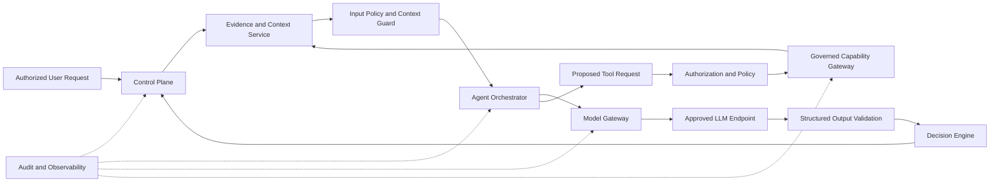
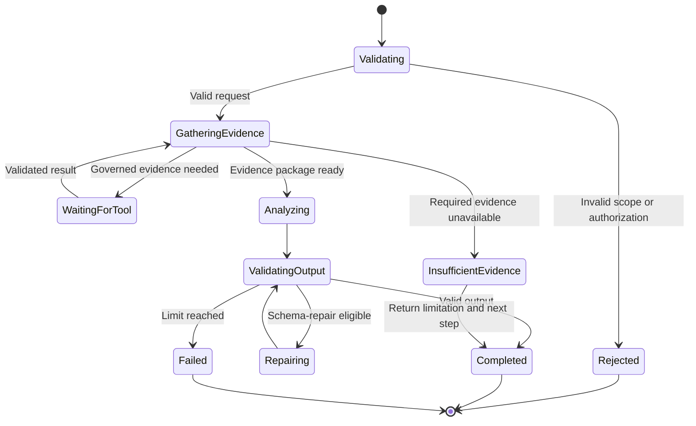

# Project Atlas

## AI Architecture

| Field | Value |
| --- | --- |
| Document ID | ATLAS-014 |
| Version | 1.0.0 |
| Status | Approved |
| Document Owner | AI Architecture |
| Reviewers | Architecture Owner, Security Architecture, Infrastructure Operations, Data Governance |
| Approver | Umit Ozdemir (acting Architecture Owner) |
| Approval Date | 2026-08-03 |
| Last Updated | 2026-08-03 |
| Related Documents | [ATLAS-003](003_Project_Principles.md), [ATLAS-004](004_Glossary.md), [ATLAS-010](010_System_Architecture.md), [ATLAS-015](015_RAG_Architecture.md), [ATLAS-024](024_Decision_Engine.md), [ATLAS-040](040_AI_Agents.md), [ATLAS-047](047_Guardrails.md) |
| Supersedes | ATLAS-014 version 0.1.0 |

## 1. Purpose

This document defines how AI capabilities are integrated into Project Atlas, which responsibilities may use an LLM, how model and agent behavior is constrained, and how evidence, security, privacy, evaluation, audit, and degraded operation are preserved.

AI is an analytical subsystem. It is not an identity, policy authority, approval authority, execution authority, or source of infrastructure truth.

## 2. Scope

### In Scope

- AI responsibilities and prohibited responsibilities
- Model Gateway and provider abstraction
- Agent orchestration and tool mediation
- Prompt, context, output, memory, and model lifecycle
- Evidence grounding, confidence, and explainability
- Security, privacy, audit, observability, and evaluation
- Local OpenAI-compatible model support
- MVP AI scope and future evolution

### Out of Scope

- Final model or model-provider selection
- Model training implementation
- Detailed retrieval pipeline covered by ATLAS-015
- Detailed agent definitions covered by ATLAS-040
- Detailed root cause, recommendation, and guardrail algorithms
- Infrastructure execution authority

## 3. AI Role

Atlas may use AI for:

- Natural-language intent interpretation
- Evidence-based question answering
- Summarization and correlation
- Diagnostic hypothesis generation
- Root cause analysis support
- Change impact analysis support
- Recommendation and alternative generation
- Runbook and vendor-document interpretation
- Report drafting
- MCP connector generation assistance

Atlas must use deterministic components for:

- Authentication
- Authorization
- Policy evaluation
- Approval state
- Capability and risk classification enforcement
- Schema validation
- Workflow state and execution dispatch
- Audit persistence and integrity
- Infrastructure result confirmation

## 4. AI Trust Model

AI input and output are untrusted from a security and execution perspective.

Non-bypassable rules:

- The model cannot contact managed infrastructure.
- The model cannot receive infrastructure credentials.
- The model cannot create or expand permissions.
- The model cannot mark its own output as approved or executed.
- A tool name or model-generated parameters do not grant capability access.
- Retrieved text cannot modify system policy or authorize a tool.
- Model output is validated before it reaches downstream business logic.

## 5. AI Logical Components

| Component | Responsibility | Authority explicitly excluded |
| --- | --- | --- |
| Agent Registry | Version and approve agent definitions, tools, models, and prompts | Runtime authorization |
| Agent Orchestrator | Coordinate bounded analytical steps | Approval and direct execution |
| Evidence and Context Service | Assemble policy-filtered evidence packages | Changing source evidence |
| Prompt Registry | Version system instructions, task templates, and output contracts | Secret storage |
| Model Gateway | Route to approved endpoints and normalize model behavior | Choosing infrastructure permissions |
| Input Guard | Classify and sanitize model-bound context | Rewriting authoritative source data |
| Output Validator | Enforce schema, size, references, and prohibited-content rules | Proving factual correctness by itself |
| Decision Engine | Combine model candidates with deterministic findings and policy context | Authorization and execution |
| Evaluation Service | Run regression, safety, quality, and drift evaluations | Production approval without human governance |
| AI Audit Adapter | Record model, prompt, evidence, tool, and outcome references safely | Storing prohibited sensitive content |

## 6. Model Gateway

The Model Gateway is the only supported application path to LLM endpoints.

### 6.1 Responsibilities

- Expose one versioned provider-neutral request contract
- Support configurable OpenAI-compatible endpoints
- Route according to model policy, task type, data classification, health, and cost or capacity limits
- Apply timeout, concurrency, token, context, and output limits
- Require structured outputs where the task contract defines them
- Normalize provider errors, finish reasons, usage, and model identity
- Record request metadata and policy decisions without exposing prohibited content
- Support endpoint health checks and controlled disablement

### 6.2 Endpoint Registration

Each endpoint registration includes:

- Endpoint identifier and owner
- Provider or implementation type
- Base URL or internal service reference
- Authentication secret reference
- Approved models and exact model identifiers
- Supported context and output limits
- Data-classification ceiling
- Network and residency boundary
- Availability and timeout policy
- Logging and retention behavior
- Evaluation status and approved task classes

### 6.3 Routing

Routing is deterministic policy. It must not send a request to an endpoint that is less trusted than the request classification permits.

Fallback is allowed only when:

- The fallback endpoint is pre-approved for the same task and data class.
- The model capability and structured-output contract are compatible.
- The switch is visible in telemetry and decision metadata.
- The user is informed when the model difference could affect interpretation.

## 7. Model Provider Abstraction

Provider-specific behavior is isolated behind the Model Gateway.

The internal contract normalizes:

- Messages and roles
- Structured response schema
- Tool proposal representation
- Model and endpoint identity
- Token or usage metrics where available
- Stop and refusal reasons
- Timeout and rate-limit categories
- Safety or content-filter outcomes

Provider abstraction must not hide meaningful limitations such as missing structured-output support, lower context size, data retention, or tool-use behavior.

## 8. Task Classes

| Task class | AI role | Required safeguards |
| --- | --- | --- |
| Language transformation | Summarize, translate, classify, or format | Source preservation, output validation |
| Evidence-grounded answer | Answer using retrieved and live evidence | Citations, access filtering, uncertainty |
| Diagnostic analysis | Generate and rank hypotheses | Evidence coverage, alternatives, validation steps |
| Change analysis | Estimate impact, risk, duration, and recovery | Current graph data, policy classification, human review |
| Recommendation | Propose actions or options | ATLAS-003 output contract, no execution authority |
| Agentic investigation | Select bounded analytical steps and tools | Tool allowlist, budgets, authorization, audit |
| Connector generation | Draft code, manifests, schemas, and tests | Isolated generation, untrusted status, review and validation |

Each agent and prompt declares its permitted task classes.

## 9. Agent Orchestration

### 9.1 Agent Definition

A versioned agent definition declares:

- Agent identifier, owner, purpose, and version
- Permitted task classes
- Approved prompt templates
- Input and output schemas
- Permitted evidence domains
- Permitted tool or capability categories
- Model eligibility requirements
- Step, token, time, and cost budgets
- Stop and escalation conditions
- Required evaluation suite
- Audit and retention behavior

### 9.2 Execution Model

### 9.3 Limits

- Maximum steps
- Maximum model calls
- Maximum tool proposals and executions
- Maximum input, retrieved context, and output size
- End-to-end deadline
- Per-tool timeout
- Concurrency limit by user, environment, and connector target
- Cancellation and user-stop support

Limits are configuration and policy, not prompt suggestions.

## 10. Tool and Capability Mediation

Agents propose tool use through a typed request. The platform then:

1. Resolves the registered tool to a governed capability.
2. Validates parameter schema and target identity.
3. Evaluates user and service authorization.
4. Evaluates policy, capability class, environment, and workflow state.
5. Requires approval where applicable.
6. Dispatches through the Connector Gateway or another authoritative service.
7. Validates and classifies the result.
8. Adds the result to the evidence package with provenance and freshness.

The model never receives a credential or network connection as a tool result.

## 11. Context Architecture

### 11.1 Context Sources

- User request and authorized conversation history
- User, role, environment, and task context
- Inventory and graph evidence
- Live connector observations
- Retrieved knowledge
- Health findings and operational history
- Applicable policy and workflow constraints
- Approved output schema and task instructions

### 11.2 Context Assembly Order

1. Validate purpose, identity, and task scope.
2. Resolve data-access policy.
3. Retrieve candidate evidence.
4. Filter by access, classification, relevance, version, and freshness.
5. De-duplicate and rank.
6. Separate instructions from untrusted evidence.
7. Minimize to the task budget.
8. Record evidence references and context assembly version.

### 11.3 Context Safety

- Secrets are prohibited.
- Retrieved instructions are quoted or delimited as data.
- Source authority and trust do not grant command authority.
- Content from one tenant or organization cannot enter another context.
- Hidden metadata that the user cannot access is excluded from the answer and model context.
- Oversized or malformed content is rejected or processed in an isolated pipeline.

## 12. Prompt Architecture

### 12.1 Prompt Layers

- Platform invariants
- Agent role and task contract
- Organization-approved policy context
- Output schema
- Evidence package
- User request

Higher-trust instructions are stored separately from user and retrieved content.

### 12.2 Prompt Registry

Prompt templates are versioned artifacts containing:

- Identifier, owner, version, and status
- Compatible agents and model classes
- Input and output schemas
- Change history and evaluation results
- Required safety assertions
- Data-classification restrictions
- Rollback version

Prompt changes are reviewed like code and cannot be edited silently in production.

### 12.3 Prompt Injection Controls

- Treat all user, document, connector, and external content as untrusted.
- Separate tool authorization from the model.
- Use allowlisted capabilities and typed schemas.
- Detect and label attempts to override system policy or exfiltrate data.
- Minimize context and redact secrets before model invocation.
- Validate output for unauthorized instructions, data leakage, and malformed references.
- Evaluate attacks against representative documents and tool results.

## 13. Structured Output

Operational AI outputs use versioned schemas.

Required fields vary by task but may include:

- Summary
- Findings
- Evidence references
- Affected entities and services
- Hypotheses or probable causes
- Confidence and confidence basis
- Unknowns and assumptions
- Risk and impact
- Recommended next steps
- Alternatives
- Preconditions and approvals
- Duration and service-interruption estimate
- Rollback or recovery guidance
- Validation criteria

Schema validity is necessary but does not prove factual correctness. The Decision Engine validates evidence linkage and deterministic constraints separately.

## 14. Evidence and Citation

- Every operational claim identifies supporting evidence or is labeled as an inference.
- Citations resolve to authorized evidence references, not model-generated URLs.
- Evidence includes observation time and source provenance.
- Conflicting evidence is retained and shown.
- Missing required evidence reduces confidence and can block a recommendation.
- Generated text never overwrites raw evidence.

## 15. Confidence and Uncertainty

Confidence is produced from a governed combination of:

- Evidence coverage
- Source authority
- Freshness
- Agreement or conflict among sources
- Topology completeness
- Deterministic validation
- Model evaluation for the task class

The LLM may contribute an assessment but does not set final confidence alone.

Atlas should use calibrated categories or ranges backed by evaluation data. It must avoid unsupported decimal precision.

## 16. Reasoning and Explainability

Atlas stores and presents concise reasoning summaries, evidence links, assumptions, alternatives, and deterministic checks.

Atlas does not require or expose private model chain-of-thought. Internal scratch content is not an audit requirement and may contain unreliable or sensitive material.

## 17. Memory

AI memory is separated by purpose.

| Memory type | Purpose | Governance |
| --- | --- | --- |
| Request context | Complete one task | Short-lived and minimized |
| Conversation history | Preserve user-visible continuity | User-scoped retention and deletion |
| Workflow state | Resume durable work | Authoritative non-LLM store |
| Operational history | Learn from incidents, changes, and findings | Evidence provenance, correction, retention |
| Knowledge memory | Retrieve approved documents and runbooks | ATLAS-015 access and lifecycle controls |
| Evaluation history | Compare model, prompt, and agent performance | Versioned test data and protected results |

Conversation or model memory must not become an undocumented source of truth. Persistent facts enter governed inventory, graph, knowledge, or history domains.

## 18. Training and Adaptation

RAG, prompt design, and evaluation are preferred before model training.

Any fine-tuning or training requires a separate approved design covering:

- Objective and measurable benefit
- Data ownership, consent, classification, and retention
- Removal of secrets and personal or customer-sensitive data
- Dataset version and lineage
- Security and privacy review
- Baseline and regression evaluation
- Model artifact storage, deployment, rollback, and deletion
- License and vendor restrictions

Production interactions are not training data by default.

## 19. Model Lifecycle

### 19.1 States

- Registered
- Under evaluation
- Approved for restricted tasks
- Approved for production tasks
- Suspended
- Deprecated
- Retired

### 19.2 Change Controls

A model or endpoint version change requires:

- Identity and capability comparison
- Evaluation against required suites
- Security and privacy review when behavior or hosting changes
- Compatibility validation for structured outputs and tools
- Performance and capacity validation
- Rollback readiness
- Release note and affected-agent analysis

Aliases such as `latest` are not sufficient production model identities unless resolved and recorded to an immutable version.

## 20. Evaluation Architecture

### 20.1 Evaluation Dimensions

- Evidence faithfulness
- Citation correctness
- Completeness and usefulness
- Calibration and uncertainty disclosure
- Safety and policy adherence
- Prompt-injection resistance
- Unauthorized data disclosure
- Structured-output validity
- Tool-selection correctness
- Infrastructure-domain accuracy
- Latency, context use, and resource consumption

### 20.2 Evaluation Sets

- Synthetic infrastructure scenarios
- Curated vendor and cross-domain cases
- Known incidents with approved expected findings
- Adversarial documents and user prompts
- Missing, stale, and conflicting evidence cases
- Authorization and data-isolation cases
- Model and dependency failure cases

Evaluation data must not contain unmanaged production secrets or customer data.

### 20.3 Release Gate

Each agent, prompt, model, or retrieval change has defined thresholds and must not regress critical safety cases. Exceptions require recorded risk acceptance and cannot weaken non-overridable controls.

## 21. Data Protection

- Data classification is evaluated before model invocation.
- Endpoint registration declares the maximum permitted classification.
- Context uses minimum necessary evidence.
- Sensitive fields are redacted or tokenized where useful.
- Model request and response retention is configurable and documented.
- External endpoints are disabled by default unless approved.
- Cross-organization and cross-environment context leakage is tested.
- User-visible exports preserve source access restrictions.

## 22. Audit

AI audit metadata includes, where applicable:

- User, service, request, workflow, agent-run, and correlation identifiers
- Agent, prompt, model, endpoint, and output-schema versions
- Evidence-package reference
- Tool proposals, policy decisions, and executed capability references
- Start, completion, cancellation, timeout, and failure states
- Output validation result
- Decision or recommendation identifier

Raw prompts and responses are not automatically audit-log payloads. Their storage follows separate classification and retention policy.

## 23. Observability

Required metrics and signals:

- Model endpoint availability and latency
- Request and output token or size usage where available
- Agent steps, tool proposals, cancellations, and budget exhaustion
- Structured-output validation and repair rate
- Evidence count, freshness, conflict, and citation coverage
- Safety refusal and guardrail activation
- Prompt-injection detection
- Evaluation drift and regression
- Queue depth and end-to-end response time

High-cardinality or sensitive text is excluded from metric labels.

## 24. Failure and Degraded Behavior

| Failure | Atlas behavior |
| --- | --- |
| Model unavailable | Return deterministic or raw evidence where useful and label degraded mode |
| Model timeout | Stop or retry within one bounded owner; never assume success |
| Invalid structured output | Attempt bounded repair or fail with diagnostic reference |
| Insufficient evidence | Return limitations and next evidence-gathering step |
| Retrieval unavailable | Do not generate unsupported vendor guidance |
| Tool denied | Explain the constraint without suggesting bypass |
| Prompt injection detected | Isolate content, record signal, and continue only with safe evidence |
| Endpoint policy mismatch | Deny routing and identify required approved endpoint class |
| Guardrail or audit dependency unavailable | Follow fail-closed policy for sensitive tasks |

## 25. Performance and Capacity

The architecture supports:

- Streaming user-visible progress without exposing unvalidated output as final
- Model request concurrency limits
- Context and retrieval budgets
- Cached deterministic evidence where freshness policy permits
- Batching for embeddings or offline analysis
- Queue separation between interactive and background work
- Cancellation propagation

Performance optimization must not remove citations, policy checks, audit, or output validation.

## 26. MVP AI Scope

### Included

- One configurable approved OpenAI-compatible local endpoint
- Model Gateway abstraction
- Evidence-grounded chat response
- One bounded investigation agent
- Structured recommendation schema
- Prompt and agent versioning foundation
- C0 and C1 tool mediation
- Basic evaluation suite and audit metadata
- Clear degraded behavior when the model is unavailable

### Excluded

- Autonomous remediation
- C3 through C5 execution by AI
- Production fine-tuning pipeline
- Unrestricted multi-agent autonomy
- Dynamic installation of unreviewed tools
- External model fallback without explicit policy
- AI-generated connector production enablement

## 27. Dependencies and Traceability

- ATLAS-010 defines the Intelligence Plane and trust boundaries.
- ATLAS-011 defines AI component responsibilities and forbidden dependencies.
- ATLAS-015 defines knowledge ingestion and retrieval.
- ATLAS-024 defines deterministic decision preparation.
- ATLAS-040 defines agent roles and orchestration contracts.
- ATLAS-041 through ATLAS-046 define reasoning, RCA, recommendation, impact, runbook, and explainability behavior.
- ATLAS-047 defines mandatory AI guardrails.

## 28. Assumptions

- The first model endpoint exposes an OpenAI-compatible API inside an approved environment.
- Model quality varies by task and must be demonstrated through evaluation.
- RAG and live evidence are required for operational conclusions.
- Enterprise deployments may restrict model traffic to local endpoints.
- AI output remains advisory even when future controlled execution is introduced.

## 29. Open Questions and ADR Backlog

- Which local model endpoint and initial model identity are approved for development?
- Which structured-output and streaming capabilities are mandatory?
- Which evaluation thresholds block release for each task class?
- Which prompt-injection detection and content isolation controls are implemented first?
- How long are conversation, prompt, response, and agent-run records retained?
- Is Model Gateway a module or separately deployed process in the MVP?
- Which embedding model and endpoint are approved under ATLAS-015?

## 30. Acceptance Criteria

This document is ready to enter Review when:

- AI advisory responsibilities and deterministic authority boundaries are accepted.
- Direct model access to credentials, infrastructure, policy, approval, and execution is technically prohibited.
- Model Gateway registration, routing, data classification, and fallback rules are agreed.
- Agent, prompt, context, output, memory, and model lifecycle controls are complete.
- Evaluation and release gates cover operational accuracy, safety, and data isolation.
- MVP AI inclusions and exclusions align with ATLAS-002 and ATLAS-003.
- Required model, evaluation, retention, and deployment ADRs have owners.

## 31. Change History

| Version | Date | Author | Summary |
| --- | --- | --- | --- |
| 0.1.0 | 2026-07-21 | Project Atlas Team | Initial AI role, capabilities, model strategy, and guardrails |
| 0.2.0 | 2026-08-03 | AI Architecture | Added AI trust model, Model Gateway, agent and tool mediation, context and prompt governance, evaluation, model lifecycle, memory, privacy, and degraded behavior |
| 1.0.0 | 2026-08-03 | Umit Ozdemir | Approved as the first binding documentation baseline under the designated approver authority |
