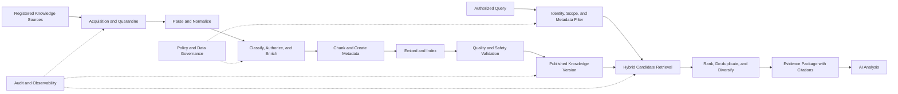
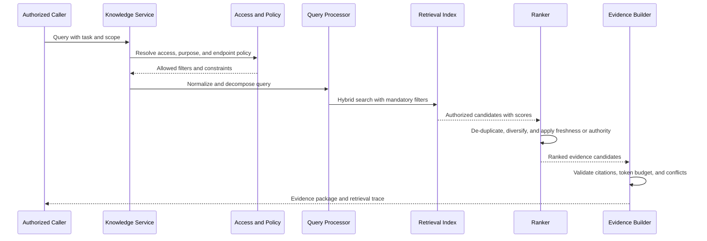

# Project Atlas

## RAG Architecture

| Field | Value |
| --- | --- |
| Document ID | ATLAS-015 |
| Version | 1.0.0 |
| Status | Approved |
| Document Owner | Knowledge and AI Architecture |
| Reviewers | Architecture Owner, Security Architecture, Data Governance, Infrastructure Domain Architects, AI Architecture |
| Approver | Umit Ozdemir (acting Architecture Owner) |
| Approval Date | 2026-08-03 |
| Last Updated | 2026-08-03 |
| Related Documents | [ATLAS-003](003_Project_Principles.md), [ATLAS-004](004_Glossary.md), [ATLAS-010](010_System_Architecture.md), [ATLAS-014](014_AI_Architecture.md), [ATLAS-027](027_Knowledge_Engine.md), [ATLAS-054](054_VectorDB.md) |
| Supersedes | ATLAS-015 version 0.1.0 |

## 1. Purpose

This document defines the Retrieval-Augmented Generation architecture used to ingest, govern, retrieve, cite, update, and retire vendor and organizational knowledge in Project Atlas.

RAG provides evidence to AI analysis. It does not make retrieved content authoritative, executable, current, or safe by default.

## 2. Scope

### In Scope

- Knowledge-source registration and trust
- Ingestion, parsing, classification, chunking, embedding, and indexing
- Document, chunk, and evidence metadata
- Access-controlled retrieval and ranking
- Citation, provenance, freshness, conflict, and lifecycle
- Prompt-injection and malicious-content controls
- Evaluation, observability, deletion, backup, and recovery
- Vendor knowledge packs and organizational knowledge boundaries
- MVP RAG scope

### Out of Scope

- Final vector database or embedding-model selection
- Complete connectors for every knowledge source
- General-purpose enterprise search
- Model fine-tuning or training
- Detailed incident-learning behavior covered by later knowledge documents

## 3. Goals

The RAG subsystem must:

- Ground AI outputs in inspectable evidence
- Preserve source identity, version, owner, authority, and observation time
- Enforce user and purpose-based access before retrieval and model use
- Distinguish vendor, internal, generated, and historical knowledge
- Prefer applicable product and version content
- Detect or disclose stale, superseded, conflicting, and incomplete sources
- Support restricted-network and local deployment
- Support deletion and derived-index cleanup
- Produce reproducible retrieval traces for evaluation and audit

## 4. Non-Goals

The RAG subsystem is not:

- A substitute for live infrastructure evidence
- A guarantee that a document is correct
- A command channel from documents to infrastructure
- A bypass around source permissions
- A permanent store for secrets
- An automatic training-data pipeline
- A replacement for document ownership and review

## 5. Knowledge Trust Model

Every source and item has independent attributes for access, authority, applicability, freshness, and integrity.

Retrieved content remains untrusted input. Publication means eligible for governed retrieval, not permission to execute instructions found in the content.

## 6. Knowledge Source Classes

| Source class | Examples | Typical authority considerations |
| --- | --- | --- |
| Vendor authoritative | Product manuals, support KBs, API and CLI documentation | Product, version, publication date, support status |
| Vendor advisory | Blogs, community articles, field notes | Lower authority; verify against authoritative sources |
| Organizational approved | Runbooks, architecture standards, approved procedures | Owner, approval status, environment applicability |
| Organizational operational | Incidents, problems, changes, tickets, notes | Outcome quality, privacy, correction, time relevance |
| System-generated | Health findings, reports, recommendations | Generating version, evidence, validation and approval state |
| User-provided ad hoc | Uploaded documents and notes | Untrusted until classified and reviewed |
| External public | Standards or public references | License, authenticity, currency, relevance |

Source class affects ranking and confidence but never overrides authorization.

## 7. Source Registration

A source must be registered before ingestion.

Required registration metadata:

- Source identifier and display name
- Source type and class
- Owner and technical contact
- Acquisition method and endpoint
- Authentication secret reference
- Organizational, tenant, environment, vendor, and product scope
- Default data classification
- Access-control mapping method
- Expected version and update behavior
- Authority and trust rationale
- Retention and deletion policy
- License or usage restrictions
- Ingestion schedule and failure policy
- Enabled, suspended, or retired state

Registration changes are audited. A source is disabled until connection and permission validation succeed.

## 8. Source Lifecycle

| State | Meaning |
| --- | --- |
| Registered | Metadata exists; content is not eligible for retrieval |
| Validating | Connectivity, permissions, schema, and sample content are under review |
| Active | Approved versions may be ingested and published |
| Degraded | Source is available with known freshness, quality, or acquisition problems |
| Suspended | New ingestion and retrieval publication are blocked |
| Retiring | Source is being removed according to retention and dependency rules |
| Retired | Source is no longer eligible; required history remains preserved |

## 9. Ingestion Pipeline

### 9.1 Stages

1. Register source and ingestion job.
2. Acquire content through an approved connector or upload path.
3. Verify transport, source identity, size, type, and integrity where available.
4. Quarantine and scan untrusted files.
5. Parse content in an isolated worker.
6. Normalize text, tables, headings, code blocks, and document structure.
7. Extract and validate metadata.
8. Classify access, sensitivity, authority, applicability, and lifecycle.
9. Detect duplicates, prior versions, and supersession.
10. Chunk content using a versioned strategy.
11. Generate embeddings with an approved model.
12. Write source artifact, metadata, chunks, and retrieval indexes.
13. Run quality, security, and retrieval validation.
14. Publish one immutable knowledge-item version atomically.
15. Emit lineage, audit, and operational events.

### 9.2 Atomic Publication

Partially processed content is not visible to production retrieval. Publication switches a validated version from staging to eligible state only after required artifacts and indexes are complete.

### 9.3 Idempotency

Ingestion uses source item identifier, source version, content digest, and ingestion configuration version to avoid accidental duplicate versions.

## 10. Acquisition and Quarantine

- Uploaded files and remote content are untrusted.
- File type is verified by content, not extension alone.
- Size, compression ratio, nesting, page count, and object limits are enforced.
- Password-protected or encrypted files follow an explicit handling policy.
- Malware scanning is integrated where required.
- Parsing runs without production credentials and with restricted network access.
- Active content, macros, embedded executables, and external references are not executed.
- Failed or suspicious artifacts remain quarantined with restricted access and retention.

## 11. Parsing and Normalization

The normalized representation preserves:

- Title and heading hierarchy
- Paragraph and list boundaries
- Tables and row or column context
- Code, CLI examples, and API schemas
- Page, section, anchor, and source-location references
- Images or diagrams as referenced artifacts when supported
- Language and character encoding
- Product names, versions, dates, warnings, and prerequisites

Parsing must not silently drop unsupported sections. Unsupported or low-confidence extraction is visible in quality metadata.

## 12. Metadata Model

### 12.1 Source Metadata

- Source identifier, class, owner, and connector
- Acquisition time and source modification time
- Original URI or source-system reference
- License and usage restrictions
- Default access and classification
- Source health and last successful synchronization

### 12.2 Knowledge Item Metadata

- Item and immutable version identifier
- Title, document type, language, and content digest
- Vendor, product family, product, model, and applicable versions
- Publication, effective, expiry, and review dates
- Owner, approver, approval status, and lifecycle
- Authority score or category with rationale
- Data classification and access policy reference
- Supersedes, superseded-by, related-item, and conflict references
- Parser, normalization, chunking, and embedding versions
- Quality and safety validation results

### 12.3 Chunk Metadata

- Chunk identifier and parent item version
- Section path, page, anchor, and ordinal
- Token or character size
- Product and version inheritance
- Access and classification inheritance or override
- Embedding model and index version
- Content type such as prose, table, code, warning, or procedure
- Neighbor and structural relationship references

Metadata required for access control must be present on every retrievable record, not joined after unauthorized candidates are retrieved.

## 13. Data Classification and Access Control

### 13.1 Enforcement Points

Access is enforced during:

- Source browsing
- Ingestion administration
- Metadata and artifact storage
- Candidate retrieval
- Re-ranking
- Evidence-package assembly
- Model-context creation
- Citation display
- Export and report generation

### 13.2 Rules

- Retrieval uses authenticated identity, role, organization, environment, purpose, and source policy.
- Unauthorized documents and chunks are excluded before semantic similarity evaluation where feasible.
- Search statistics, counts, titles, snippets, and embeddings must not leak unauthorized existence or content.
- Access-filter failure denies retrieval.
- Cached retrieval results are scoped by access context and policy version.
- Model endpoints receive only content allowed for that endpoint's data-classification ceiling.

## 14. Chunking Architecture

Chunking is versioned and content-aware.

Strategies may use:

- Heading and semantic boundaries
- Table-aware units
- Procedure steps with prerequisites and warnings
- API operation or CLI command boundaries
- Sliding overlap where context continuity requires it
- Parent-child or summary relationships for long sections

Chunking must preserve enough source structure for accurate citation. Chunk size is selected by evaluation, not one universal constant.

## 15. Embedding Architecture

Each embedding model registration includes:

- Immutable model identity and owner
- Endpoint and data boundary
- Vector dimension and normalization behavior
- Supported languages and content types
- Maximum input size
- Version and license
- Evaluation status
- Batch, timeout, rate, and resource limits

Changing embedding model or material preprocessing creates a new index version. Mixed embeddings in one index are prohibited unless the store and retrieval contract explicitly separate them.

## 16. Storage Architecture

| Store | Responsibility |
| --- | --- |
| Artifact store | Original and normalized document artifacts |
| Metadata store | Sources, items, versions, lifecycle, access, lineage, jobs |
| Retrieval index | Dense vectors, sparse terms, filters, and chunk references |
| Audit store | Sensitive ingestion, administration, retrieval, and export events |
| Evaluation store | Versioned test queries, expected evidence, metrics, and results |

The retrieval index is derived data. The system must know whether it is restored from backup or rebuilt from authoritative artifacts and metadata.

## 17. Index Partitioning

Index design must support boundaries for:

- Organization or tenant
- Environment
- Data classification
- Vendor and product domain
- Knowledge source class
- Embedding model and index version
- Active versus archived knowledge

Partitioning is not the only access control. Authorization metadata and query-time enforcement remain mandatory.

## 18. Retrieval Pipeline

### 18.1 Query Processing

May include:

- Language detection
- Acronym and canonical-term mapping
- Vendor, product, version, environment, and time extraction
- Query decomposition for multi-domain questions
- Optional model-assisted rewrite under a bounded contract
- Exact identifier and command preservation

The original query is retained. Model-assisted rewrite does not change authorization scope.

### 18.2 Candidate Retrieval

Atlas should support hybrid retrieval where evaluation demonstrates benefit:

- Dense semantic search
- Sparse keyword or full-text search
- Exact identifier, product, version, and metadata matching
- Graph or relationship-assisted expansion where applicable

### 18.3 Ranking

Ranking may consider:

- Semantic and lexical relevance
- Product and version applicability
- Source authority
- Approval and lifecycle state
- Freshness
- Environment applicability
- Evidence diversity
- Exact identifier matches
- Conflict and supersession state

Authority must not cause irrelevant content to outrank relevant applicable evidence automatically.

## 19. Retrieval Output Contract

Each result contains:

- Evidence reference identifier
- Item and chunk identifiers
- Source title and source class
- Source-system reference or URI where permitted
- Relevant excerpt or structured content
- Section, page, anchor, or location
- Product and version applicability
- Publication and observation time
- Authority, lifecycle, freshness, and conflict state
- Retrieval and ranking metadata suitable for evaluation
- Access and classification labels for downstream enforcement

Internal raw similarity scores are not presented as factual confidence.

## 20. Citation Architecture

- Citations point to stored evidence references, not model-created strings.
- A citation identifies the exact item version and location.
- The user can inspect source metadata if authorized.
- Quoted content follows applicable copyright and organizational policy.
- Deleted or expired evidence retains a tombstone or audit reference where retention requires it.
- Recommendation records preserve evidence version references used at decision time.

## 21. Freshness, Supersession, and Conflict

### 21.1 Freshness

Freshness is evaluated from source update behavior, document dates, review dates, applicable product versions, and last successful synchronization.

### 21.2 Supersession

When a source publishes a replacement:

- The new item references the prior item.
- The prior item is marked superseded but retained according to policy.
- Default retrieval excludes superseded content unless historical context is requested.
- Existing recommendations keep their original evidence references.

### 21.3 Conflict

Conflicting sources are not silently merged. Results identify the conflict, source authority, applicability, and missing validation. AI output must show material conflicts.

## 22. Vendor Knowledge Packs

A vendor knowledge pack may contain:

- Approved source registrations
- Product and version taxonomy
- Canonical and vendor term mappings
- Document parsing and chunking profiles
- Retrieval filters and ranking features
- Known warnings and supersession rules
- Evaluation queries and expected evidence
- Connector capability documentation

Knowledge packs are versioned extensions and untrusted until reviewed. They do not contain production credentials.

## 23. Organizational Knowledge

Internal runbooks, tickets, incidents, problems, and changes require:

- Owner and retention policy
- Access classification
- Source-system reference
- Correction and redaction process
- Outcome or approval state where applicable
- Separation of facts, user notes, and AI-generated summaries
- Personal and sensitive-data handling

An incident occurring once does not make its remediation universally valid.

## 24. Generated Knowledge

AI-generated summaries, runbooks, connector documentation, and recommendations are labeled as generated and include:

- Generating agent, prompt, model, and version
- Evidence references
- Human review and approval state
- Generation time
- Expiry or review date
- Intended scope

Generated knowledge is ranked below approved authoritative sources unless an explicit policy says otherwise.

## 25. Prompt Injection and Content Safety

Controls include:

- Treat document instructions as data
- Separate trusted prompts from retrieved content
- Detect common override, exfiltration, and tool-use instructions
- Remove or isolate active content and hidden document elements where possible
- Prevent retrieved content from selecting tools or changing policy
- Limit context by purpose and relevance
- Validate output citations against retrieved evidence
- Include adversarial documents in evaluation suites

Detection is a signal, not the only control. Tool authorization remains external to the model.

## 26. Quality Validation

Before publication, validation checks:

- Parse coverage and unsupported elements
- Required metadata completeness
- Duplicate and version relationships
- Access-label consistency
- Chunk size and structure
- Embedding completion
- Retrieval of representative known queries
- Citation resolution
- Prompt-injection and suspicious-content signals
- Source licensing and retention metadata

Failed items remain staged or quarantined and are not searchable.

## 27. Retrieval Evaluation

### 27.1 Metrics

- Recall at a defined candidate count
- Precision or relevance at a defined result count
- Ranking quality
- Citation correctness
- Product and version applicability
- Freshness and authority selection
- Access-control leakage rate, which must be zero in required tests
- Conflict and supersession handling
- End-to-end answer faithfulness
- Latency and resource usage

### 27.2 Test Sets

- Known vendor questions
- Exact CLI, API, error, and product identifiers
- Cross-domain infrastructure questions
- Version-specific questions
- Stale and superseded documents
- Conflicting vendor and internal guidance
- Restricted and unauthorized content
- Adversarial prompt-injection content
- No-answer and insufficient-evidence cases

## 28. Observability

Required signals:

- Source synchronization health and age
- Ingestion queue depth, duration, failure, and quarantine
- Parser and content-type distribution
- Chunk and embedding counts by version
- Index size, update, compaction, and query health
- Retrieval latency and candidate counts
- Empty-result and low-evidence rate
- Access-filter denial and policy failure
- Citation validation failure
- Stale, superseded, and conflict result frequency
- Evaluation trend and regression

Telemetry labels avoid document text, user queries, and unbounded identifiers.

## 29. Audit

Audit events include, where applicable:

- Source registration, configuration, enablement, suspension, and retirement
- Manual upload and deletion
- Classification and access-policy change
- Publication, supersession, and retirement
- Sensitive retrieval and export
- Administrative re-index and bulk operation
- Generated-knowledge approval
- Evaluation release decision

Routine retrieval telemetry and security audit are separately governed.

## 30. Deletion and Retention

Deletion propagates through:

- Source artifacts
- Normalized artifacts
- Metadata records according to retention or tombstone policy
- Chunks and embeddings
- Sparse indexes and caches
- Generated summaries that depend solely on deleted content where required
- Backup expiry according to policy

Deletion is asynchronous but trackable. Completion means all required active indexes and caches are cleared, not only the source row.

## 31. Backup and Recovery

- Metadata and authoritative artifacts are backed up according to RPO and RTO.
- Retrieval indexes are either backed up consistently or reproducibly rebuilt.
- Embedding model and preprocessing versions required for rebuild remain available.
- Restore preserves access classifications and source ownership.
- Recovery validation includes representative authorized and unauthorized queries.
- Cross-index version mismatches fail safely.

## 32. Performance and Capacity

Capacity planning considers:

- Sources, items, pages, chunks, and index versions
- Embedding dimension and storage overhead
- Ingestion and re-index throughput
- Concurrent query volume
- Metadata-filter selectivity
- Hybrid search and reranking cost
- Context token budgets
- Artifact and backup retention

Interactive retrieval has bounded latency. Large ingestion and re-indexing run asynchronously with backpressure.

## 33. MVP Scope

### Included

- Manual file upload and one automated source type
- PDF, plain text, and Markdown candidates subject to parser evaluation
- Source and item metadata with owner, version, classification, and freshness
- Isolated parsing
- One approved local embedding endpoint
- One versioned retrieval index
- Metadata-filtered semantic retrieval with optional keyword support
- Evidence references and citations
- Role-aware source and document filtering
- Basic ingestion and retrieval evaluation suite
- Deletion and re-ingestion workflow

### Excluded

- Complete enterprise content-source coverage
- Automatic trust of generated knowledge
- Production fine-tuning
- Cross-tenant shared indexes without proven isolation
- Unreviewed external web crawling
- Automatic execution of instructions found in documents
- Full multimodal diagram understanding

## 34. Dependencies and Traceability

- ATLAS-003 defines evidence, knowledge, data-boundary, and generated-artifact principles.
- ATLAS-010 and ATLAS-011 define the Data and Knowledge Plane and component ownership.
- ATLAS-014 defines context, model, agent, prompt, and evaluation behavior.
- ATLAS-027 refines knowledge-source and organizational-memory workflows.
- ATLAS-053 and ATLAS-054 define metadata and vector-store implementation requirements.
- ATLAS-042 through ATLAS-046 consume governed evidence for RCA, recommendations, impact, runbooks, and explainability.

## 35. Assumptions

- Enterprise knowledge contains multiple access classifications and owners.
- Vendor documentation is version-specific and may be superseded.
- The first embedding and LLM endpoints can operate inside an approved environment.
- Live infrastructure observations and documents are complementary evidence types.
- Source systems remain authoritative for records they own.

## 36. Open Questions and ADR Backlog

- Which vector or hybrid retrieval store is selected first?
- Which embedding model supports the required languages and restricted deployment?
- Which document formats and parser libraries are supported in MVP?
- Which source is the first automated integration?
- Which access-control metadata is enforced at document versus chunk level?
- Which reranking approach provides measurable benefit?
- What retention applies to user uploads, retrieval traces, and generated knowledge?
- Which malware scanning and document-isolation controls are available in target environments?

## 37. Acceptance Criteria

This document is ready to enter Review when:

- Source registration, trust, ingestion, publication, retrieval, and retirement lifecycles are agreed.
- Access filtering occurs before unauthorized content reaches retrieval results or model context.
- Provenance, product version, authority, freshness, supersession, and conflict metadata are sufficient.
- Prompt injection cannot grant capability or policy authority.
- Citation and evidence references are reproducible and authorized.
- Deletion, re-indexing, backup, and recovery behavior is defined.
- MVP source, parser, embedding, index, and evaluation decisions have owners.

## 38. Change History

| Version | Date | Author | Summary |
| --- | --- | --- | --- |
| 0.1.0 | 2026-07-21 | Project Atlas Team | Initial source, ingestion, and retrieval principles |
| 0.2.0 | 2026-08-03 | Knowledge and AI Architecture | Added source lifecycle, ingestion pipeline, access controls, metadata, hybrid retrieval, citations, safety, evaluation, deletion, and recovery architecture |
| 1.0.0 | 2026-08-03 | Umit Ozdemir | Approved as the first binding documentation baseline under the designated approver authority |
