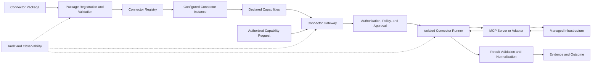
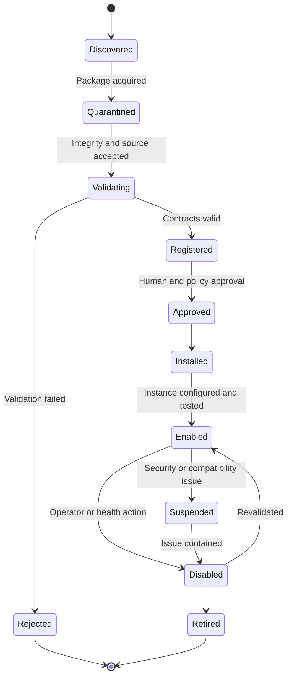
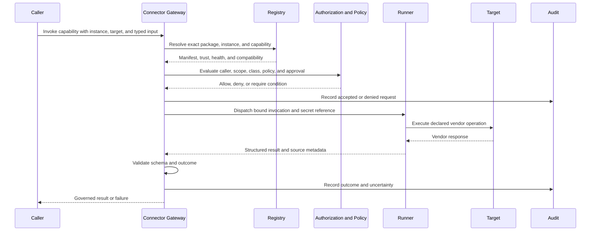

# Project Atlas

## MCP Framework

| Field | Value |
| --- | --- |
| Document ID | ATLAS-020 |
| Version | 1.0.0 |
| Status | Approved |
| Document Owner | MCP Platform Architecture |
| Reviewers | Architecture Owner, Security Architecture, Infrastructure Operations, AI Architecture, Connector SDK Owner |
| Approver | Umit Ozdemir (acting Architecture Owner) |
| Approval Date | 2026-08-03 |
| Last Updated | 2026-08-03 |
| Related Documents | [ATLAS-003](003_Project_Principles.md), [ATLAS-004](004_Glossary.md), [ATLAS-010](010_System_Architecture.md), [ATLAS-011](011_Component_Architecture.md), [ATLAS-021](021_MCP_Plugin_SDK.md), [ATLAS-022](022_MCP_Builder.md) |
| Supersedes | ATLAS-020 version 0.1.0 |

## 1. Purpose

This document defines the framework through which Project Atlas discovers, registers, validates, configures, isolates, invokes, audits, upgrades, and retires infrastructure integrations implemented with Model Context Protocol (MCP).

An MCP server is not automatically a trusted Atlas connector. Atlas adds lifecycle, identity, capability, risk, policy, approval, result-validation, and operational controls around the protocol.

## 2. Scope

### In Scope

- MCP connector package, instance, capability, tool, and resource model
- Connector registry and lifecycle
- Capability manifests and C0 through C5 classification
- Invocation, policy, approval, credential, and result paths
- Isolation, versioning, compatibility, health, audit, and observability
- Local, remote, vendor, CLI, and API-backed connector patterns
- MVP framework scope

### Out of Scope

- SDK implementation details covered by ATLAS-021
- AI-assisted generation covered by ATLAS-022
- Final packaging, signing, sandbox, or transport technology selection
- Vendor-specific capability definitions
- Authorization and policy rule language details

## 3. Framework Goals

- Add infrastructure capabilities without modifying Atlas Core
- Support independently versioned connectors and instances
- Expose vendor capabilities through explicit typed contracts
- Enforce read-only defaults and capability risk classes
- Keep credentials out of models, prompts, logs, and packages
- Isolate vendor code and failures from the control plane
- Preserve source evidence and vendor-specific diagnostics
- Support installation, upgrade, rollback, disablement, and retirement
- Make generated and third-party connectors untrusted until validated
- Work in restricted-network enterprise deployments

## 4. Core Model

## 5. Canonical Entities

| Entity | Meaning |
| --- | --- |
| Connector package | Integrity-verifiable release artifact containing manifest, implementation, schemas, documentation, and tests |
| Connector definition | Vendor or product integration identity independent of a configured environment |
| Connector version | Immutable implementation and contract version |
| Connector instance | Environment-specific configuration, endpoint scope, credential reference, and enablement state |
| Capability | Versioned Atlas operation with typed input, output, side-effect, and risk declarations |
| MCP tool | Protocol-exposed operation mapped to one governed Atlas capability |
| MCP resource | Protocol-exposed contextual data mapped to an authorized Atlas resource contract |
| Runner | Isolated runtime that executes one connector package or governed connector group |
| Invocation | One requested attempt to execute a capability against a bound instance and target |
| Result | Structured completion, failure, timeout, cancellation, or uncertain outcome |

## 6. Package Manifest

The package manifest includes:

- Connector identifier, display name, publisher, owner, and support contact
- Package and connector semantic version
- Atlas and SDK compatibility range
- Supported platforms, products, and product versions
- Runtime and entry point
- Integrity digest and signature metadata where supported
- License and third-party dependency information
- Configuration schema
- Secret-reference requirements
- Network destinations and protocols
- File, process, resource, and privilege requirements
- Declared capabilities and resources
- Upgrade, downgrade, and configuration-migration support
- Health-check and self-test definitions
- Documentation and test references

The manifest is immutable within one package digest.

## 7. Capability Manifest

Each capability declares:

- Stable capability identifier and version
- Human-readable purpose
- Input and output schemas
- Applicable target types
- Capability class C0 through C5
- Read, diagnostic, write, service-impacting, and destructive side effects
- Required target permissions
- Credential scope
- Expected duration and timeout ceiling
- Idempotency behavior
- Concurrency and rate-limit guidance
- Cancellation support
- Result and error categories
- Evidence and audit fields
- Preconditions, postconditions, and recovery notes where applicable
- Required policy and approval conditions

Missing or ambiguous side-effect metadata causes registration failure or C5 classification until reviewed.

## 8. Capability Classes

The framework implements ATLAS-003 classes:

| Class | MCP framework posture |
| --- | --- |
| C0 Informational | No live target access; normal data authorization applies |
| C1 Read-only | Live query with scoped credentials; may run under approved policy |
| C2 Diagnostic | Bounded target activity; policy decides approval based on impact |
| C3 Controlled change | Disabled by default; exact action approval and deterministic execution required |
| C4 Service-impacting | Disabled by default; privileged approval, current impact analysis, and change governance required |
| C5 Destructive | Never autonomous; exceptional human-governed procedure only |

Risk class is based on realistic worst-case behavior. Connector publishers cannot lower a class after installation without review and policy acceptance.

## 9. Registration Lifecycle

States are separately tracked for package version and connector instance.

## 10. Package Acquisition

Allowed sources may include:

- Built-in Atlas release bundle
- Approved internal connector registry
- Offline signed bundle
- Human-uploaded package under quarantine
- MCP Builder output under generated-artifact quarantine

Acquisition records source, actor, time, digest, publisher identity, and environment. Public network installation is disabled unless explicitly governed.

## 11. Validation Pipeline

Before registration or upgrade:

1. Verify package integrity and allowed source.
2. Inspect manifest and schema versions.
3. Scan dependencies and package content.
4. Reject embedded secrets and prohibited files.
5. Validate configuration and capability schemas.
6. Compare declared permissions, network access, and risk classes to implementation behavior where testable.
7. Run static analysis and dependency checks.
8. Run connector contract and mock-target tests.
9. Start in an isolated validation runner.
10. Execute self-test and allowed test capabilities against lab targets.
11. Produce a validation report and unresolved-risk list.
12. Require designated approval before environment enablement.

Validation results bind to the exact package digest.

## 12. Connector Instance Configuration

An instance defines:

- Instance identifier and connector version
- Organization, environment, site, and target scope
- Endpoint and certificate-trust configuration
- Secret references
- Enabled capabilities and policy overrides within allowed bounds
- Schedule and concurrency limits
- Proxy and network route
- Health state and last successful validation
- Owner and support group
- Configuration version and change history

Secrets are resolved only at runtime by the runner or approved gateway component.

## 13. Capability Discovery

Discovery returns only capabilities that are:

- Declared by the installed package version
- Enabled for the connector instance
- Compatible with the target version
- Permitted for the caller's role, environment, and target scope
- Not suspended by security, health, or policy state

AI receives a minimized tool description, typed schema, and safety metadata. It does not receive credentials, hidden administrative capabilities, or unauthorized target names.

## 14. Invocation Pipeline

## 15. Invocation Contract

An invocation includes:

- Invocation and idempotency identifiers
- Request, correlation, causation, and workflow identifiers
- Human initiator and service actor references
- Connector definition, package, instance, and capability versions
- Exact target and environment
- Typed parameters
- Authorization, policy, approval, and change-record references as required
- Deadline, cancellation token, and attempt number
- Expected evidence and result schema

The runner receives only information necessary for this invocation.

## 16. Credential Architecture

- Credentials are stored in an approved secrets service.
- Manifests and configuration contain secret references only.
- Each instance uses the least-privileged credential feasible.
- Separate credentials should distinguish read-only and write-capable capabilities.
- Credentials are scoped by target, site, environment, and vendor role.
- Short-lived tokens are preferred where supported.
- Secret retrieval and use are audited without exposing values.
- Rotation and revocation do not require package rebuild.
- AI, prompts, tool descriptions, results, logs, and reports never contain secret values.

## 17. Runner Isolation

Runner isolation controls include:

- Separate process or container identity
- Read-only package filesystem where practical
- Ephemeral writable workspace
- Non-root and minimal operating-system privileges
- CPU, memory, process, storage, and output limits
- Target-specific network egress
- No model-endpoint or unrelated database access
- Short-lived secret delivery
- Execution timeout and forced termination
- Cleanup of temporary files and environment variables

Higher-risk packages may require stronger sandboxing or dedicated runner pools.

## 18. Connector Patterns

### 18.1 Native MCP Server

A vendor or third party supplies an MCP server. Atlas still requires an adapter manifest, validation, capability mapping, risk classification, and instance policy.

### 18.2 REST or SDK Adapter

Atlas connector code maps vendor APIs or SDKs to MCP and Atlas contracts.

### 18.3 CLI Adapter

CLI connectors require:

- Fixed executable and version allowlist
- Argument-array invocation without shell interpolation
- Typed parameter mapping
- Locale and encoding controls
- Bounded stdout and stderr
- Exit-code and partial-result interpretation
- Temporary-file security
- Strong runner isolation

### 18.4 Read-Only Data Adapter

Imports files, exports, or databases under explicit read-only and access-control contracts.

## 19. Input Validation

- Validate against exact capability schema.
- Reject unknown fields for security-sensitive operations.
- Normalize identifiers without changing meaning.
- Enforce target binding and allowlists.
- Apply range, length, enum, pattern, and collection limits.
- Prevent command, path, query, and template injection.
- Validate requested product and capability compatibility.

Model-generated input receives the same validation as human or API input.

## 20. Result Contract

Results contain:

- Invocation and attempt identifiers
- Completion state: succeeded, failed, timed out, cancelled, partial, or uncertain
- Structured capability output
- Target and observation time
- Connector, capability, and vendor version metadata
- Evidence references or sanitized raw-response digest
- Warnings, missing fields, and freshness
- Stable error category and vendor error reference
- Retryability and recommended next step
- Side-effect confirmation where applicable

Success requires positive contract evidence, not absence of an error.

## 21. Error Taxonomy

- Invalid request
- Authentication failed
- Authorization or policy denied
- Approval missing or expired
- Target unavailable
- Connector unhealthy or incompatible
- Vendor rate limited
- Timeout
- Cancelled
- Parse or schema validation failed
- Partial result
- Outcome uncertain
- Internal connector failure
- Security control triggered

Raw vendor diagnostics are preserved under access control but sanitized before user or model exposure.

## 22. Idempotency and Uncertain Outcomes

- C0 and C1 queries may be retryable when safe.
- C2 through C5 capabilities declare explicit idempotency behavior.
- Non-idempotent retry is prohibited without target-aware reconciliation.
- Timeout after dispatch creates an uncertain outcome until target state is verified.
- An uncertain outcome blocks dependent steps and requires investigation or recovery.
- Idempotency keys bind to capability, instance, target, input digest, and workflow step.

## 23. Health and Readiness

Health dimensions:

- Package and runtime integrity
- Configuration validity
- Credential availability without revealing value
- Endpoint resolution and certificate trust
- Authentication check
- Target compatibility
- Capability self-test
- Runner capacity and queue
- Recent invocation success and latency

Health checks use safe capabilities and obey target rate limits. A green process does not imply target readiness.

## 24. Versioning and Compatibility

Versioned elements:

- Package
- Manifest
- Configuration schema
- Capability input and output schema
- Runner protocol
- SDK compatibility
- Target product compatibility

An upgrade report identifies:

- Added, removed, or changed capabilities
- Risk-class or permission changes
- Configuration migration
- Target compatibility changes
- Required policy and approval review
- In-flight workflow impact
- Rollback compatibility

Silent permission or risk expansion is prohibited.

## 25. Upgrade and Rollback

1. Acquire and validate the new package in quarantine.
2. Compare manifests, permissions, capabilities, and schemas.
3. Run compatibility and lab tests.
4. Approve the exact digest for selected environments.
5. Drain or isolate affected runner workload.
6. Migrate configuration with preserved prior version.
7. Enable canary instance or bounded target set.
8. Validate health and representative capabilities.
9. Expand rollout or roll back.

In-flight workflows retain their bound connector and capability version or follow an explicit migration plan.

## 26. Disablement and Retirement

Immediate suspension is available for compromise, unsafe behavior, vendor vulnerability, or invalid classification.

Retirement requires:

- Dependency and workflow inventory
- Replacement or migration plan
- Configuration and secret cleanup
- Audit and evidence retention
- Package and schema retention for historical interpretation
- Runner and network-policy removal

## 27. Audit

Audit events include:

- Package acquisition, validation, approval, installation, upgrade, suspension, and retirement
- Instance creation and configuration change
- Capability enablement and risk-class change
- Invocation accepted, denied, started, completed, failed, cancelled, timed out, or uncertain
- Credential-reference assignment and rotation metadata
- Administrative health and self-test actions

Audit parameters are sanitized and secret-free.

## 28. Observability

Required signals:

- Package and instance counts by lifecycle state
- Runner health, capacity, restarts, and resource saturation
- Invocation count, latency, timeout, cancellation, partial, and uncertain outcomes
- Vendor error and rate-limit categories
- Policy denial and approval wait
- Schema-validation failure
- Target health and compatibility age
- Upgrade and rollback progress

Metrics avoid raw target identifiers and user-provided values as labels.

## 29. Security Requirements

- Package source and integrity verification
- Dependency scanning and software bill of materials
- No embedded credentials or customer data
- Isolated validation and execution
- Least-privileged target accounts
- Target and egress allowlists
- Strict input and output schemas
- No shell interpolation for CLI connectors
- Prompt and tool separation
- Default-disabled C3 through C5 capabilities
- Emergency suspension independent of package code

## 30. Testing Requirements

- Manifest and schema validation
- Unit tests for capability mapping
- Contract tests for inputs, outputs, and errors
- Mock target and recorded-response tests with sanitized data
- Authorization, policy, approval, and audit tests
- Injection and malicious-output tests
- Timeout, cancellation, retry, idempotency, and uncertain-outcome tests
- Target-version compatibility tests
- Runner isolation and resource-limit tests
- Upgrade, downgrade, and configuration-migration tests

## 31. Marketplace Direction

A future marketplace is a governed catalog, not an unrestricted code repository.

It must expose:

- Publisher and ownership
- Package digest and signature status
- Validation and evaluation reports
- Requested permissions and network access
- Capability classes
- Supported products and versions
- Compatibility and known limitations
- Approval state by environment

Marketplace installation still follows local security and approval policy.

## 32. MVP Scope

### Included

- Connector package and capability manifest schemas
- Connector registry and instance configuration
- Mock connector
- One real read-only C1 connector candidate
- Isolated runner and Connector Gateway
- Typed invocation and result contracts
- Secret-reference integration
- Basic validation harness
- Health, audit, and observability
- Upgrade and disablement foundation

### Excluded

- Public marketplace
- Production use of generated connectors without review
- Autonomous C3 through C5 execution
- Every MCP transport and language runtime
- Universal vendor compatibility
- Dynamic package installation from public internet by default

## 33. Dependencies and Traceability

- ATLAS-003 defines capability classes, AI boundaries, least privilege, and generated-artifact trust.
- ATLAS-010 and ATLAS-011 define Connector Gateway, Registry, Runner, and trust zones.
- ATLAS-021 defines the developer SDK and test harness.
- ATLAS-022 defines AI-assisted connector generation.
- ATLAS-023 and ATLAS-025 define workflow and policy integration.
- ATLAS-032 and ATLAS-033 define audit and logging.

## 34. Assumptions

- MCP is the preferred protocol boundary, while vendor access may use REST, SDK, CLI, files, or other mechanisms behind a connector.
- Enterprise deployments require local package and dependency mirrors.
- Vendor systems differ in permission granularity and idempotency support.
- The first real connector is read-only.

## 35. Open Questions and ADR Backlog

- Which transport and runner-control protocol are supported first?
- Which package, signature, and internal registry formats are adopted?
- Is the first SDK Python-based?
- Which sandbox controls are available across supported operating systems?
- Which infrastructure product is the first real connector target?
- Which secret manager is used in developer and enterprise profiles?
- How are third-party native MCP servers proxied and validated?

## 36. Acceptance Criteria

This document is ready to enter Review when:

- MCP server and trusted Atlas connector boundaries are accepted.
- Package, instance, capability, runner, invocation, result, and lifecycle contracts are complete.
- C0 through C5 classes and default enablement behavior align with ATLAS-003.
- Credentials, network access, tool exposure, and runner isolation are enforceable.
- Upgrade cannot silently expand permission or risk.
- MVP connector and validation choices have owners.

## 37. Change History

| Version | Date | Author | Summary |
| --- | --- | --- | --- |
| 0.1.0 | 2026-07-21 | Project Atlas Team | Initial MCP goals, responsibilities, capability types, and safety rules |
| 0.2.0 | 2026-08-03 | MCP Platform Architecture | Added package, instance, capability, lifecycle, validation, invocation, isolation, credential, result, upgrade, and marketplace architecture |
| 1.0.0 | 2026-08-03 | Umit Ozdemir | Approved as the first binding documentation baseline under the designated approver authority |
