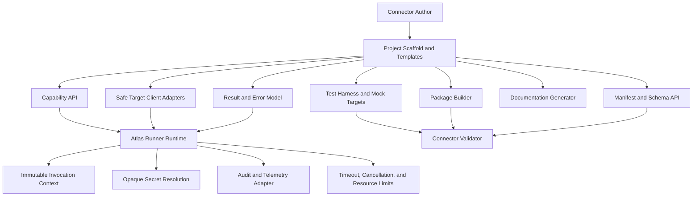

# Project Atlas

## MCP Plugin SDK

| Field | Value |
| --- | --- |
| Document ID | ATLAS-021 |
| Version | 1.0.0 |
| Status | Approved |
| Document Owner | Connector SDK Owner |
| Reviewers | MCP Platform Architecture, Security Architecture, Infrastructure Domain Architects, Developer Experience, Test Architecture |
| Approver | Umit Ozdemir (acting Architecture Owner) |
| Approval Date | 2026-08-03 |
| Last Updated | 2026-08-03 |
| Related Documents | [ATLAS-003](003_Project_Principles.md), [ATLAS-020](020_MCP_Framework.md), [ATLAS-022](022_MCP_Builder.md), [ATLAS-025](025_Policy_Engine.md), [ATLAS-055](055_Coding_Standards.md), [ATLAS-056](056_Testing.md) |
| Supersedes | ATLAS-021 version 0.1.0 |

## 1. Purpose

This document defines the developer-facing Software Development Kit (SDK) for creating, testing, packaging, documenting, and validating Atlas MCP connectors.

The SDK makes secure behavior the easiest path. It supplies framework contracts and test tooling so connector authors do not reimplement credential handling, policy context, audit metadata, timeout behavior, result schemas, or package validation.

## 2. Scope

### In Scope

- SDK architecture and public contracts
- Connector project structure
- Manifest, configuration, capability, result, and error APIs
- Target clients and CLI safety wrappers
- Test harness, mocks, fixtures, validation, and packaging
- Compatibility, versioning, documentation, and release expectations
- Generated and manually authored connector support

### Out of Scope

- Final programming-language selection
- Complete implementation code
- Vendor-specific connector behavior
- Package-registry infrastructure
- MCP Builder generation logic
- Atlas runtime internals not required by connector authors

## 3. SDK Goals

- Create consistent connectors with minimal security boilerplate
- Enforce ATLAS-020 manifests and capability contracts
- Prevent direct secret handling by ordinary connector code
- Provide safe API, SDK, CLI, and file-access adapters
- Normalize result and error behavior
- Enable deterministic tests without production infrastructure
- Generate connector documentation from machine-readable contracts
- Support offline development and dependency mirroring
- Keep connector code portable across supported runner environments

## 4. Design Principles

1. Secure defaults are mandatory and explicit escape hatches require review.
2. Connector business logic is separated from transport and runtime concerns.
3. Capability handlers accept typed inputs and return typed results.
4. Credentials are represented by opaque references or injected clients.
5. Raw commands, shell interpolation, and unrestricted network clients are not SDK defaults.
6. Runtime context is immutable from connector code.
7. Tests can reproduce timeout, cancellation, duplicate, partial, and malformed outcomes.
8. Public SDK contracts follow semantic versioning and compatibility policy.
9. Generated connectors use the same SDK and validation as human-authored connectors.

## 5. SDK Architecture



## 6. SDK Modules

| Module | Responsibility |
| --- | --- |
| `manifest` | Package, connector, compatibility, permission, and capability declarations |
| `config` | Typed non-secret configuration and validation |
| `secrets` | Opaque secret references and approved client injection |
| `capability` | Capability definition, input, output, class, side effect, and handler contracts |
| `context` | Immutable invocation, target, identity-reference, deadline, and correlation context |
| `clients` | Safe HTTP, SDK, CLI, file, and protocol adapters |
| `results` | Structured success, failure, partial, timeout, cancellation, and uncertain outcomes |
| `errors` | Stable Atlas connector error taxonomy and vendor diagnostic mapping |
| `health` | Configuration, endpoint, authentication, compatibility, and self-test checks |
| `telemetry` | Safe logs, metrics, traces, and audit metadata hooks |
| `testing` | Mock runtime, target simulators, fixtures, contract assertions, and fault injection |
| `packaging` | Reproducible package, integrity metadata, dependency inventory, and signature hooks |
| `docs` | Generated capability, configuration, permissions, and support documentation |

## 7. Connector Project Layout

Recommended language-neutral layout:

```text
connector/
  atlas-connector.yaml
  README.md
  CHANGELOG.md
  LICENSE
  src/
    connector/
    capabilities/
    clients/
    mappings/
  schemas/
    config/
    inputs/
    outputs/
  tests/
    unit/
    contract/
    integration/
    fixtures/
    scenarios/
  docs/
    permissions.md
    compatibility.md
    operations.md
  examples/
  lockfiles-or-dependency-manifests/
```

The final scaffold is selected by language profile but preserves equivalent contracts.

## 8. Language Profiles

The core connector contract is language-neutral. A language profile defines:

- Supported language and runtime versions
- Project layout and package manager
- SDK binding version
- Dependency-lock requirements
- Static analysis and formatting
- Test runner
- Package format and entry point
- Runner base image or runtime prerequisites

A Python-first SDK is a candidate because of API, automation, and AI ecosystem support, but requires an ADR before implementation. Other language profiles must pass the same contract suite.

## 9. Manifest API

The SDK supplies typed builders and schema validation for:

- Connector identity and publisher
- SDK and Atlas compatibility
- Target products and versions
- Runtime, entry point, and dependencies
- Configuration and secret-reference schemas
- Network destinations and protocols
- Capabilities, resources, risk classes, and permissions
- Health checks and self-tests
- Upgrade and migration support

Build fails when required safety metadata is absent.

## 10. Configuration API

Configuration fields declare:

- Name, type, purpose, and default
- Required or optional state
- Allowed values, ranges, lengths, and patterns
- Environment and target applicability
- Restart or reload behavior
- Sensitive or non-sensitive classification
- Deprecation and migration behavior

Secret values cannot use ordinary configuration fields. The validator rejects common embedded credential patterns where feasible.

## 11. Secret API

Connector code receives either:

- An approved, preconfigured target client, or
- A short-lived opaque secret handle resolved through the runner

The API must prevent or discourage:

- Serializing secret values
- Logging or returning secret objects
- Passing secrets to model or evidence context
- Reading another instance's secret path
- Persisting secrets after invocation

Secret objects redact display, equality diagnostics, and exception output.

## 12. Invocation Context

The immutable context exposes:

- Invocation, request, workflow, correlation, and attempt identifiers
- Connector, package, instance, and capability versions
- Bound organization, environment, site, and target
- Deadline and cancellation signal
- Idempotency key
- Approved feature and compatibility flags
- Safe telemetry and evidence emitters

It does not expose user credentials, raw approval tokens, unrestricted policy, or secret-store administration.

## 13. Capability Definition API

A capability definition requires:

- Stable identifier and semantic version
- Description and target types
- Input and output models
- C0 through C5 class
- Side-effect and permission declarations
- Timeout ceiling
- Idempotency category
- Cancellation behavior
- Concurrency and rate-limit hints
- Preconditions and result evidence
- Error mapping
- Test scenarios

SDK registration compares declarations to the package manifest and fails on inconsistency.

## 14. Capability Handler Contract

Conceptual handler:

```text
handle(context, typed_input, approved_target_client) -> typed_result
```

Handler rules:

- Validate vendor-specific constraints before remote calls.
- Check cancellation before and between bounded operations.
- Use context deadline rather than creating an unbounded timeout.
- Return structured outcomes, not printed text.
- Preserve source observation time and vendor version.
- Map vendor errors without leaking credentials or unrestricted payloads.
- Never create a nested shell for CLI operations.
- Never call an LLM or policy engine directly.

## 15. Safe Target Clients

### 15.1 HTTP Client

- Approved base endpoint and certificate validation
- Target and redirect allowlists
- Timeout and response-size limits
- Proxy policy
- Authentication injection outside connector logic
- Structured retry hooks restricted to safe methods
- Redacted request and response logging

### 15.2 Vendor SDK Client

- Pinned compatible vendor SDK versions
- Wrapped authentication and timeout behavior
- Stable Atlas error mapping
- No global mutable client state across instances

### 15.3 CLI Client

- Fixed executable identity and version validation
- Argument arrays without shell expansion
- Allowlisted subcommands and flags per capability
- Controlled working directory and environment
- Output, duration, and process-tree limits
- Locale and encoding control
- Exit-code and partial-output mapping

### 15.4 File and Import Client

- Path scope rooted in an approved mount
- No path traversal or symbolic-link escape
- File size and type limits
- Read-only default
- Temporary-file cleanup

## 16. Result Model

Typed results include:

- Outcome state
- Capability-specific data
- Target and observation metadata
- Evidence and source references
- Warnings, omissions, and freshness
- Side-effect confirmation when applicable
- Sanitized vendor diagnostic reference
- Retry and next-step guidance

Result builders prevent a success outcome without required success evidence.

## 17. Error Model

SDK error classes map to ATLAS-020 taxonomy:

- `InvalidInput`
- `AuthenticationFailure`
- `PermissionFailure`
- `TargetUnavailable`
- `IncompatibleTarget`
- `RateLimited`
- `TimedOut`
- `Cancelled`
- `MalformedResponse`
- `PartialResult`
- `OutcomeUncertain`
- `ConnectorInternalFailure`
- `SecurityViolation`

Errors include stable code, safe summary, retryability, vendor reference, and optional diagnostic evidence. Raw exceptions are not public results.

## 18. Logging, Metrics, and Tracing API

The SDK automatically attaches component, connector, instance-reference, capability, invocation, attempt, correlation, and trace metadata.

Connector authors provide event names and safe fields. The SDK rejects or redacts:

- Secret values and known credential objects
- Raw authorization headers
- Unbounded vendor payloads
- Full command lines containing sensitive parameters
- User document or prompt content

Metric helpers constrain label names and cardinality.

## 19. Audit Metadata API

Connector handlers do not write directly to the audit store. They return structured execution metadata to the runner and gateway.

The SDK supports:

- Target and capability evidence
- Sanitized parameter summary
- Vendor operation reference
- Side-effect and outcome confirmation
- Source observation time
- Partial or uncertain outcome detail

The platform owns authoritative actor, authorization, policy, and approval references.

## 20. Health API

Health checks are separate functions for:

- Package self-test
- Configuration validation
- Secret availability
- Endpoint resolution and certificate trust
- Authentication
- Target product and version compatibility
- Safe read-only capability probe
- Dependency status

Health results distinguish healthy, degraded, unavailable, incompatible, and unknown.

## 21. Test Harness

The test harness provides:

- Fake invocation context and cancellation
- In-memory secret handles with redaction assertions
- Mock HTTP, SDK, CLI, and file clients
- Synthetic clock and deadlines
- Target fixtures and scenario builders
- Golden structured results
- Schema and manifest validation
- Audit and telemetry capture
- Fault injection
- Runner-level sandbox test integration

## 22. Required Test Categories

### Unit

- Mapping, validation, normalization, and error conversion

### Contract

- Manifest, configuration, input, output, result, and capability compatibility

### Security

- Injection, path traversal, redirect, certificate, secret leakage, oversized output, and command argument tests

### Failure

- Timeout, cancellation, rate limit, malformed response, partial result, uncertain outcome, and dependency loss

### Idempotency

- Duplicate request, retry after timeout, and reconciliation behavior

### Integration

- Approved lab target or vendor simulator using non-production credentials

### Upgrade

- Configuration migration, capability comparison, in-flight compatibility, downgrade, and rollback

## 23. Mock and Fixture Governance

- Fixtures contain no real customer identifiers, credentials, IP addresses, or sensitive data.
- Recorded vendor responses are sanitized and reviewed.
- Each fixture identifies target product and version.
- Golden outputs are versioned with the capability schema.
- Failure fixtures include vendor error, malformed, truncated, delayed, and contradictory responses.

## 24. Connector Validator

The validator produces a machine-readable and human-readable report covering:

- Manifest and schema validity
- SDK and Atlas compatibility
- Dependency lock and vulnerability state
- Prohibited file and secret scan
- Capability risk and permission completeness
- Test coverage and required scenario results
- Documentation completeness
- Package reproducibility and integrity
- Runtime self-test and resource behavior

Validation success does not equal production approval.

## 25. Package Builder

The package builder creates:

- Immutable connector artifact
- Canonical manifest and schemas
- Locked dependency metadata
- Integrity digest
- Signature request or signature metadata
- Software bill of materials where supported
- Generated documentation
- Test and validation report references

Build timestamps or non-deterministic files should not alter content identity unnecessarily.

## 26. Documentation Generator

Generated connector documentation includes:

- Supported products and versions
- Configuration and non-secret examples
- Required target permissions
- Network flows
- Capabilities and classes
- Inputs, outputs, timeouts, idempotency, and side effects
- Health and troubleshooting
- Upgrade, downgrade, and known limitations
- Evidence and audit behavior

## 27. Compatibility

The SDK publishes a compatibility matrix across:

- SDK binding version
- Atlas runtime and runner protocol
- Manifest and schema versions
- Language runtime
- Package format

Public SDK breaking changes require a major version, migration guide, deprecation period, and updated validator.

## 28. Deprecation

- Deprecated APIs emit build-time or test-time warnings.
- Security-critical APIs may have shorter removal windows with explicit notices.
- Connector packages declare the oldest and newest supported SDK range.
- Runtime refuses incompatible packages before execution.

## 29. Developer Workflow

1. Select an approved language profile.
2. Generate a project scaffold.
3. Complete connector and configuration manifest.
4. Define target permissions and network flows.
5. Define one capability at a time.
6. Implement with approved clients.
7. Add unit, contract, security, failure, and mock-target tests.
8. Generate documentation.
9. Build reproducible package.
10. Run connector validator.
11. Review validation, risk class, and permissions.
12. Submit the exact package digest for environment approval.

## 30. Generated Connector Support

MCP Builder output uses a generated-project marker and provenance metadata. The SDK requires the same schemas, tests, package process, and validation. Generated code receives no reduced review path.

## 31. Security Requirements

- Dependency pinning and scanning
- No arbitrary package-install hooks in production build
- No embedded secrets
- Restricted network during build and test where practical
- Safe client wrappers
- Typed capability schemas
- CLI argument safety
- Redacted telemetry
- Test evidence for capability class and side effects
- Signed or integrity-verifiable release artifacts

## 32. Restricted-Network Development

The SDK supports:

- Mirrored language packages and tools
- Offline API documentation and schemas
- Local mock targets
- Reproducible toolchain bundle
- Package validation without public services
- Internal package and connector registries

## 33. MVP Scope

### Included

- One approved language profile
- Manifest, configuration, capability, context, result, and error APIs
- Safe HTTP client and basic CLI client
- Secret-reference abstraction
- Mock runtime and target fixtures
- Contract and security validation
- Documentation and package generation
- Mock connector and first real C1 connector support

### Excluded

- Multiple full language bindings
- Public package registry
- Automatic production approval
- Generic arbitrary-command connector API
- Complete vendor simulator library
- C3 through C5 connector implementation requirement

## 34. Dependencies and Traceability

- ATLAS-020 defines framework and runtime contracts implemented by the SDK.
- ATLAS-022 consumes the SDK scaffold and validator for generated connectors.
- ATLAS-025 supplies policy behavior outside connector code.
- ATLAS-055 defines common coding standards.
- ATLAS-056 defines project-wide testing and quality gates.
- ATLAS-058 defines CI validation and release automation.

## 35. Assumptions

- A Python-first profile is likely but not yet approved.
- Connector authors may have strong vendor expertise but varying secure-development experience.
- Vendor APIs and CLIs differ in quality, schema, and error behavior.
- Restricted-network development is required.

## 36. Open Questions and ADR Backlog

- Is Python the first approved SDK language?
- Which schema format and code-generation approach are used?
- Which package-signing mechanism is supported in MVP?
- Which safe CLI execution library or wrapper is adopted?
- How are SDK compatibility and deprecation tested automatically?
- Which mock server and recorded-response formats are approved?

## 37. Acceptance Criteria

This document is ready to enter Review when:

- SDK modules and public contracts cover every mandatory ATLAS-020 concern.
- Secret, context, capability, result, error, telemetry, and health APIs preserve trust boundaries.
- CLI and network adapters prevent common injection and leakage paths.
- Required tests and connector validation are sufficient for human and generated connectors.
- Packaging, compatibility, deprecation, documentation, and restricted-network behavior are agreed.
- First language and schema ADRs have owners.

## 38. Change History

| Version | Date | Author | Summary |
| --- | --- | --- | --- |
| 0.1.0 | 2026-07-21 | Project Atlas Team | Initial SDK goals, features, and connector lifecycle |
| 0.2.0 | 2026-08-03 | Connector SDK Owner | Added SDK modules, safe client APIs, handler contracts, test harness, validation, packaging, compatibility, and generated-connector support |
| 1.0.0 | 2026-08-03 | Umit Ozdemir | Approved as the first binding documentation baseline under the designated approver authority |
