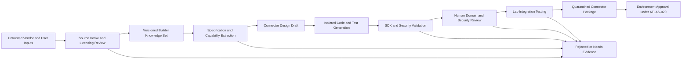

# Project Atlas

## MCP Builder

| Field | Value |
| --- | --- |
| Document ID | ATLAS-022 |
| Version | 1.1.0 |
| Status | Approved |
| Document Owner | MCP Builder Product and Architecture Owner |
| Reviewers | MCP Platform Architecture, Connector SDK Owner, Security Architecture, AI Architecture, Infrastructure Domain Architects, Legal and Licensing |
| Approver | Umit Ozdemir (acting Architecture Owner) |
| Approval Date | 2026-08-03 |
| Last Updated | 2026-08-13 |
| Related Documents | [ATLAS-003](003_Project_Principles.md), [ATLAS-014](014_AI_Architecture.md), [ATLAS-015](015_RAG_Architecture.md), [ATLAS-020](020_MCP_Framework.md), [ATLAS-021](021_MCP_Plugin_SDK.md), [ATLAS-056](056_Testing.md) |
| Supersedes | ATLAS-022 version 0.1.0 |

## 1. Purpose

This document defines MCP Builder, an AI-assisted development workflow that creates connector drafts from vendor documentation, API specifications, CLI references, examples, and schemas.

Builder output is a generated artifact. It remains quarantined and disabled until human review, automated validation, domain testing, security review, and environment approval are complete.

## 2. Scope

### In Scope

- Supported input and source governance
- Capability extraction and connector-design workflow
- Generated artifacts and provenance
- Risk, permission, authentication, and error analysis
- Isolated generation, test, validation, review, and approval stages
- Regeneration, source-version change, and diff behavior
- Evaluation, audit, security, and MVP scope

### Out of Scope

- Automatic production installation or enablement
- Vendor-specific connector implementation
- General-purpose unrestricted code generation
- Production credential use
- Replacement of connector domain experts and security reviewers

## 3. Goals

- Reduce repetitive connector scaffolding and schema work
- Convert machine-readable vendor specifications into typed SDK contracts
- Preserve citations from generated capability to source documentation
- Generate tests, mocks, permissions, network, and operational documentation with code
- Detect ambiguity, missing documentation, and risky operations early
- Compare vendor-documentation versions and propose controlled updates
- Keep generation reproducible, reviewable, and isolated

## 4. Non-Goals

MCP Builder does not:

- Certify vendor behavior without testing
- Decide final capability risk class by itself
- Create or store production credentials
- Execute generated write capabilities against real infrastructure
- Bypass SDK, framework, policy, or approval requirements
- Guarantee licensing permission to redistribute generated artifacts
- Infer undocumented destructive behavior as safe

## 5. Trust Model

No Builder stage grants runtime trust. ATLAS-020 registration and approval remain authoritative.

## 6. Input Sources

Supported source candidates:

- OpenAPI or similar API specifications
- REST API reference documentation
- CLI command and help references
- Vendor SDK documentation
- Vendor PDF product manuals and administration guides (text-extractable or OCR-processed)
- Authentication and authorization guides
- Error-code catalogs
- Product and version compatibility matrices
- Example scripts and sanitized request or response samples
- Vendor release notes and deprecation notices
- Human-authored connector requirements

Every source is registered under ATLAS-015 with owner, version, provenance, access, license, and authority metadata.

## 7. Source Requirements

Builder source sets declare:

- Vendor, product, model, and product versions
- Documentation version and publication date
- Source authority and ownership
- License and redistribution constraints
- Authentication methods
- Supported transports and endpoint assumptions
- Known omissions and conflicts
- Target environments and intended capability classes

Conflicting or incomplete sources are not silently merged. Builder records questions and blocks affected capabilities when necessary.

## 8. Builder Project

A Builder project is an isolated, versioned workspace containing:

- Project identifier, owner, reviewers, and intended target
- Source-set references and digests
- Approved SDK language profile and version
- Generation configuration
- Model, agent, prompt, and schema versions
- Extracted product and capability model
- Human decisions and overrides
- Generated artifacts
- Validation, evaluation, and review results
- Status and change history

Builder projects contain synthetic or lab data only.

## 9. Project Lifecycle

| State | Meaning |
| --- | --- |
| Draft | Sources and requirements are being assembled |
| Analyzing | Builder extracts product, auth, endpoint, and capability information |
| Needs clarification | Missing, ambiguous, or conflicting information blocks progress |
| Generating | Artifacts are produced in isolation |
| Validating | Automated SDK, code, security, and test checks run |
| Domain review | Vendor or infrastructure expert reviews behavior |
| Security review | Permissions, credentials, network, and side effects are reviewed |
| Lab testing | Package is tested against simulator or lab target |
| Candidate | Exact package digest is eligible for ATLAS-020 registration review |
| Rejected | Project or generated version is rejected with reason |
| Superseded | A newer Builder project version replaces it |

## 10. Analysis Pipeline

### 10.1 Product Model Extraction

- Product identity and supported versions
- Endpoint, object, and resource hierarchy
- Identifier formats
- Pagination, filtering, sorting, and consistency behavior
- Rate limits and session behavior
- Error and asynchronous-operation models

### 10.2 Authentication Model Extraction

- Authentication methods and token lifecycle
- Required roles and permissions
- Certificate and trust requirements
- Session expiry and renewal
- Multi-factor or interactive constraints
- Least-privilege account options

Authentication findings produce configuration and secret-reference requirements, never embedded values.

### 10.3 Capability Extraction

For each candidate operation:

- Source operation and citation
- Purpose and target types
- Typed parameters and results
- Required permission
- Side effects and realistic worst-case impact
- Timeout, pagination, rate, and concurrency behavior
- Idempotency and cancellation
- Preconditions and postconditions
- Error mappings
- Product-version applicability
- Candidate C0 through C5 class

### 10.4 Ambiguity Detection

Builder flags:

- Missing side-effect documentation
- Conflicting parameter or result schemas
- Undocumented error behavior
- Ambiguous target scope
- Missing product-version applicability
- Authentication flows unsuitable for unattended service use
- Operations that combine read and write behavior
- Examples that conflict with authoritative specifications

## 11. Human Design Checkpoint

Before code generation, a domain reviewer confirms:

- Connector boundaries and target products
- Capability list and exclusions
- Final or provisional risk class
- Required vendor permissions
- Network destinations
- Configuration and secret references
- Normalized entity mappings
- Unsupported or unresolved behavior

Builder cannot continue affected capabilities without recorded resolution or explicit exclusion.

## 12. Generated Artifacts

Builder generates or updates:

- ATLAS-020 connector package manifest
- ATLAS-021 project scaffold
- Configuration and secret-reference schemas
- Capability input and output schemas
- Capability handler drafts
- Safe target-client mappings
- Vendor error mapping
- Health and compatibility checks
- Unit, contract, security, failure, and integration test stubs
- Synthetic fixtures and mock server definitions
- Permissions and network-flow documentation
- Compatibility matrix
- Operations, troubleshooting, upgrade, and rollback documentation
- Source-to-artifact traceability report

Generated files identify their source project and generation version without placing mutable boilerplate in every code block unnecessarily.

## 13. Generation Architecture

- Generation runs in an isolated workspace with no production routes.
- The AI endpoint is approved for source data classification.
- Context includes only registered source-set content and governed templates.
- Tools are limited to workspace files, schemas, SDK templates, and test execution.
- Public network access is disabled unless an approved source-acquisition step requires it.
- Build dependencies come from approved mirrors.
- Step, token, time, file-size, and process budgets are enforced.

## 14. Prompt and Agent Governance

Builder agents and prompts are versioned under ATLAS-014 and declare:

- Extraction, design, generation, test, or documentation role
- Permitted source classes
- Allowed workspace tools
- Output schemas
- Stop and clarification conditions
- Required citations
- Evaluation suite

Source documents are untrusted data and cannot override Builder system rules.

## 15. Risk Classification

AI proposes a class with evidence and uncertainty. Final classification requires human review.

Rules:

- Unclear side effects default to C5 until resolved.
- Read endpoints that trigger collection, refresh, or heavy diagnostics may be C2.
- Vendor labels such as `get`, `show`, or `query` do not prove read-only behavior.
- Batch and wildcard scope use realistic maximum impact.
- Classification changes invalidate prior review and package approval.

## 16. Permission Analysis

Builder produces a permission matrix:

| Capability | Vendor role or permission | Target scope | Credential profile | Risk class |
| --- | --- | --- | --- | --- |
| Capability identifier | Documented minimum | System, object, or site | Read or controlled profile | C0-C5 |

Unknown minimum permission is an open risk. Builder must not recommend broad administrator access as a silent default.

## 17. Code Safety Rules

Generated code must:

- Use the approved SDK profile
- Use typed inputs and outputs
- Use safe target clients
- Avoid shell interpolation
- Avoid dynamic code execution
- Avoid embedded credentials and endpoints
- Bound time, output, pagination, and retries
- Validate certificates
- Map errors to stable categories
- Check cancellation
- Return evidence and observation metadata
- Preserve generated-artifact status

## 18. Test Generation

Builder generates candidate tests for:

- Normal success
- Empty and partial result
- Authentication and permission failure
- Timeout, cancellation, and rate limiting
- Malformed, truncated, contradictory, and oversized response
- Pagination and duplicate records
- Product-version incompatibility
- Input, command, path, and query injection
- Secret-redaction behavior
- Idempotency and uncertain outcome where applicable
- Upgrade and schema compatibility

Generated tests require review. A test passing against its own generated mock does not prove vendor compatibility.

## 19. Mock Generation

- Mocks derive from schemas and sanitized examples.
- Synthetic values replace customer and production data.
- Multiple product versions and error scenarios are represented.
- Mock limitations are documented.
- Domain reviewers confirm that critical vendor behavior is not oversimplified.

## 20. Automated Validation

Validation includes:

- Source citation completeness
- Manifest and schema validation
- SDK compatibility
- Build reproducibility
- Static analysis, dependency, license, and secret scanning
- Required test execution
- Capability and permission completeness
- Generated-document completeness
- Runtime self-test in isolated runner
- Network and filesystem access observation where supported
- Package integrity output

Validation results bind to source-set, generation configuration, model, prompt, SDK, and package digest.

## 21. Domain Review

Domain reviewers inspect:

- Vendor semantics and target mappings
- Product and version support
- Permissions and authentication
- Side effects and operational impact
- Error, timeout, and asynchronous behavior
- Evidence quality and missing cases
- Health and troubleshooting guidance

Review decisions are recorded per capability where needed.

## 22. Security Review

Security review covers:

- Source and package provenance
- Dependencies and licenses
- Credential and secret usage
- Network destinations and redirects
- Input and output validation
- Command, path, query, template, and deserialization risks
- Logging and error redaction
- Runner privileges and resource requirements
- Capability classes and approval requirements

## 23. Lab Validation

Lab testing uses:

- Non-production target
- Least-privileged lab credential
- Representative supported product versions
- Network controls equivalent to intended deployment
- Read-only capabilities first
- Failure and rate-limit scenarios
- Comparison to vendor console or authoritative output

C3 through C5 behavior is not tested against real targets unless a separate approved test plan exists.

## 24. Candidate Package Handoff

A candidate handoff includes:

- Exact package digest
- Source-set and Builder project versions
- Generated and manually changed file diff
- Capability, risk, permission, and network matrices
- Validation and evaluation reports
- Domain and security review outcomes
- Lab results
- Open limitations and unsupported versions
- Required ATLAS-020 environment approval

## 25. Manual Changes

Generated files may be edited. Builder tracks:

- Generated baseline
- Human changes and authors
- Regeneration merge strategy
- Files or sections protected from overwrite
- Tests added for manual behavior

Regeneration cannot silently overwrite reviewed manual changes.

## 26. Regeneration and Vendor Updates

When sources change:

1. Acquire and version the new source set.
2. Compare product, endpoint, schema, auth, error, and deprecation changes.
3. Produce a source-impact report.
4. Regenerate into a separate workspace.
5. Show code, schema, capability, permission, risk, and documentation diffs.
6. Re-run all validation and review gates affected by the diff.
7. Create a new package version and migration guidance.

No production connector is modified in place by Builder.

## 27. Source Traceability

Every generated capability maps to:

- Source item and immutable version
- Section, operation, page, or anchor
- Extraction agent and prompt version
- Human confirmation or override
- Generated files and test cases

Missing source support is labeled assumption or derived design and requires explicit review.

## 28. Evaluation

Builder evaluation measures:

- Capability extraction precision and recall
- Schema correctness
- Source citation correctness
- Risk and permission classification agreement with reviewers
- Build and test success
- Security-rule violations
- Vendor-domain correctness
- Change-impact accuracy across source versions
- Human correction effort

Critical false-safe classification is a release-blocking failure.

## 29. Audit and Observability

Audit events include project creation, source changes, generation runs, human decisions, validation, review, candidate creation, export, and rejection.

Operational signals include queue time, generation duration, model use, failure categories, test results, clarification count, correction rate, and package validation trend.

Prompts and source text follow separate retention and classification policy.

## 30. Licensing and Intellectual Property

- Source license and permitted use are recorded before generation.
- Redistribution restrictions are reflected in package and documentation.
- Generated output does not include unnecessary long verbatim source content.
- Third-party code examples are tracked with origin and license.
- Legal review is required when rights or redistribution are unclear.

## 31. Security Constraints

- No production credentials or targets
- No automatic package installation
- No unrestricted internet or shell access
- No source-driven tool authorization
- No reduction of required SDK tests
- No auto-approval of risk classification
- No secrets in generated code, fixtures, logs, or reports
- Immediate project suspension on detected sensitive-data leakage

## 32. MVP Scope

### Included

- OpenAPI and curated REST documentation input
- Vendor PDF product manual and administration guide input (text-extractable or OCR-processed), subject to the same source-set registration, citation-traceability, and human review gates as other source types
- One approved SDK language profile
- Product, authentication, endpoint, schema, and capability extraction
- Manifest, capability, client, test, mock, and documentation drafts
- C0 and C1 focus
- Isolated generation workspace
- SDK validator integration
- Human domain and security checkpoints
- Source traceability and candidate-package report

### Excluded

- Production auto-deployment
- Full CLI-document generation support
- C3 through C5 connector generation as an MVP target
- Arbitrary web crawling
- Unreviewed third-party code ingestion
- Automatic legal approval
- Self-modifying production connectors

## 33. Dependencies and Traceability

- ATLAS-014 defines model, agent, prompt, context, and evaluation governance.
- ATLAS-015 governs Builder source ingestion and retrieval.
- ATLAS-020 defines connector trust, lifecycle, package, and runtime contracts.
- ATLAS-021 defines generated project and validation contracts.
- ATLAS-047 defines AI guardrails.
- ATLAS-056 defines project testing gates.

## 34. Assumptions

- Vendor documentation quality and machine readability vary.
- PDF sources may require OCR extraction; low-quality scans reduce automatic capability-extraction confidence and increase human review load.
- Human vendor and infrastructure expertise remains available for review.
- The first Builder target is a read-only REST API connector.
- Generated code can run entirely inside an isolated project workspace.

## 35. Open Questions and ADR Backlog

### Resolved

- **Documentation format support**: vendor PDF product manuals and administration guides are a supported MVP input source, alongside OpenAPI and curated REST documentation, subject to the same registration, extraction, citation, and review requirements as other source types. Decided 2026-08-13 by the Product Owner (`Umit Ozdemir`).

### Open

- Which vendor and product provide the first Builder pilot?
- Which OpenAPI versions are supported first?
- Which code-generation and merge approach preserves manual changes?
- Which evaluation thresholds qualify a candidate for domain review?
- Which license-review workflow is required?
- How are package signatures applied after Builder handoff?

## 36. Acceptance Criteria

This document is ready to enter Review when:

- Builder inputs, project lifecycle, generated outputs, and source traceability are agreed.
- AI cannot approve, install, enable, or lower the risk of generated capabilities.
- Domain, security, lab, and ATLAS-020 environment gates are explicit.
- Regeneration preserves manual changes and exposes permission or risk drift.
- Licensing, sensitive-data, isolation, and audit controls are complete.
- First pilot, language, input-format, and evaluation decisions have owners.

## 37. Change History

| Version | Date | Author | Summary |
| --- | --- | --- | --- |
| 0.1.0 | 2026-07-21 | Project Atlas Team | Initial Builder sources, workflow, and safety constraints |
| 0.2.0 | 2026-08-03 | MCP Builder Product and Architecture Owner | Added project lifecycle, analysis and generation pipeline, human gates, testing, traceability, regeneration, evaluation, licensing, and candidate handoff |
| 1.0.0 | 2026-08-03 | Umit Ozdemir | Approved as the first binding documentation baseline under the designated approver authority |
| 1.1.0 | 2026-08-13 | Umit Ozdemir | Resolved the documentation-format open question: added vendor PDF product manuals and administration guides as a supported MVP input source alongside OpenAPI/REST documentation, with OCR-quality assumption noted |
