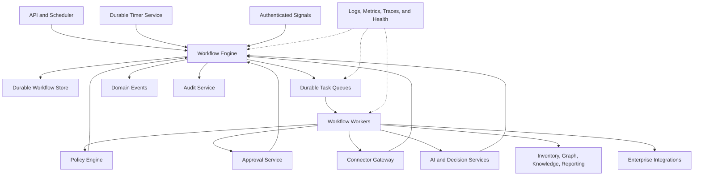
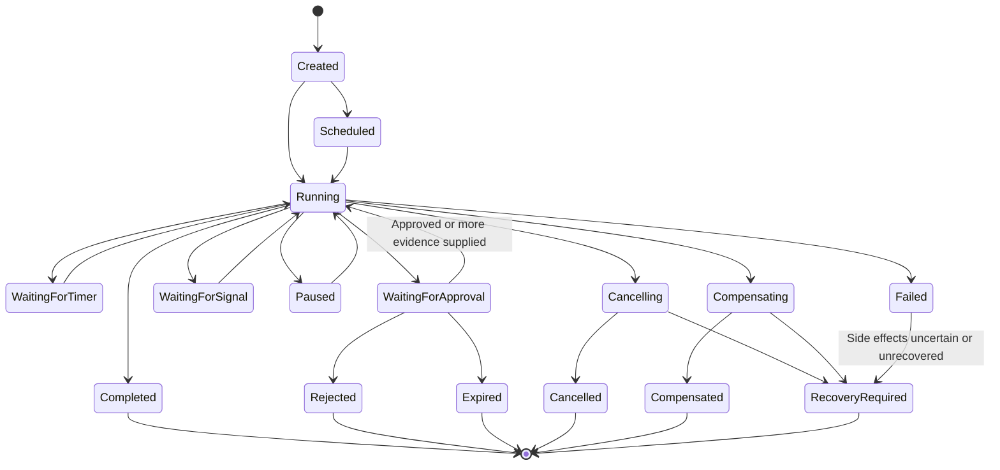

# Project Atlas

## Workflow Engine

| Field | Value |
| --- | --- |
| Document ID | ATLAS-023 |
| Version | 1.0.0 |
| Status | Approved |
| Document Owner | Workflow Platform Owner |
| Reviewers | Architecture Owner, Security Architecture, Infrastructure Operations, Backend Architecture, Audit Owner |
| Approver | Umit Ozdemir (acting Architecture Owner) |
| Approval Date | 2026-08-03 |
| Last Updated | 2026-08-03 |
| Related Documents | [ATLAS-003](003_Project_Principles.md), [ATLAS-010](010_System_Architecture.md), [ATLAS-011](011_Component_Architecture.md), [ATLAS-016](016_Event_Architecture.md), [ATLAS-025](025_Policy_Engine.md), [ATLAS-037](037_Approval_Workflow.md) |
| Supersedes | ATLAS-023 version 0.1.0 |

## 1. Purpose

This document defines how Project Atlas models, schedules, executes, pauses, resumes, retries, cancels, recovers, observes, and audits durable workflows.

The Workflow Engine coordinates authoritative components. It does not own their domain data, replace policy or approval, or grant AI execution authority.

## 2. Scope

### In Scope

- Workflow definition and run model
- State machine and step types
- Durability, scheduling, timers, retries, idempotency, and cancellation
- Policy, approval, connector, AI, and human-task integration
- Compensation, rollback, recovery, and partial completion
- Versioning, migration, concurrency, audit, observability, and testing
- MVP workflow scope

### Out of Scope

- Final workflow technology or definition language
- Domain algorithms executed inside steps
- Policy language details
- User-interface design for workflow views
- Direct infrastructure command implementation

## 3. Goals

- Make long-running operational work durable and inspectable
- Preserve state through process restart and dependency outage
- Apply authorization, policy, approval, and audit at required steps
- Prevent duplicate side effects
- Expose progress, waiting, partial, failed, cancelled, and recovery-required states
- Support scheduled health checks and on-demand investigations
- Keep workflow definitions versioned and testable
- Separate orchestration from domain component ownership

## 4. Workflow Model

| Entity | Meaning |
| --- | --- |
| Workflow definition | Immutable versioned process graph and contract |
| Workflow run | One execution instance bound to a definition version |
| Step definition | Versioned unit of coordination with input, output, policy, and failure rules |
| Step run | One logical execution of a step |
| Attempt | One try within a step run |
| Timer | Durable scheduled wake-up or deadline |
| Signal | Authenticated external input such as approval or cancellation |
| Checkpoint | Persisted workflow progress before or after a side effect |
| Compensation | Defined action that reverses a previously completed reversible step |
| Recovery task | Human or automated procedure when compensation is unavailable or unsafe |

## 5. Architecture

## 6. Workflow Definition

A definition declares:

- Stable identifier, semantic version, owner, and lifecycle
- Purpose and supported initiators
- Input and final output schemas
- Steps and allowed transitions
- Step input and output mappings
- Required roles, policies, capability classes, and approvals
- Timers, deadlines, retry, cancellation, and concurrency
- Compensation and recovery behavior
- Data classification and retention
- Events, audit records, and observability
- Compatibility and migration rules
- Required tests and runbooks

Definitions are reviewed artifacts. Runtime users cannot inject arbitrary code or connector commands into them.

## 7. Definition Lifecycle

- Draft
- Validating
- Review
- Approved
- Active
- Suspended
- Deprecated
- Retired

Only approved and active versions start new production runs. Existing runs remain bound to their version unless a reviewed migration occurs.

## 8. Workflow Run State

Terminal state does not always mean success. User interfaces and APIs expose the exact state.

## 9. Step Types

| Type | Purpose |
| --- | --- |
| Validation | Schema, precondition, freshness, and compatibility checks |
| Authorization | Scoped access decision from Identity and Access |
| Policy | Deterministic allow, deny, or conditional decision |
| Evidence query | Retrieve authorized inventory, graph, knowledge, or history |
| Connector capability | Invoke one registered governed capability |
| AI analysis | Run one bounded agent or model task |
| Decision | Produce findings, confidence, impact, or recommendation |
| Approval | Wait for an exact human decision packet |
| Human task | Request evidence, correction, or review without implying approval |
| Timer | Wait until a scheduled time, delay, or deadline |
| Notification | Deliver an informational message through an adapter |
| Integration | Create or update an authorized ITSM or external record |
| Report | Generate a versioned artifact asynchronously |
| Compensation | Reverse a completed reversible step |
| Recovery | Coordinate explicit recovery when rollback is not possible |

## 10. Step Contract

Each step declares:

- Stable step identifier and type
- Input and output schemas
- Authoritative executing component
- Deadline and timeout
- Retry owner and retry policy
- Idempotency behavior
- Cancellation behavior
- Required authorization, policy, and approval
- Expected side effects and capability class
- Success, failure, partial, and uncertain outcomes
- Evidence and audit requirements
- Compensation or recovery relation

## 11. Run Creation

Run creation validates:

- Active definition version
- Initiator identity and permission
- Input schema and target scope
- Environment and organization
- Idempotency key where applicable
- Scheduling permission
- Required configuration and component health

Creation returns a workflow identifier. Acceptance does not imply execution success.

## 12. Durability

- State is persisted before dispatching external side effects.
- Step result and next transition are recorded atomically where local storage permits.
- External results include idempotency and correlation identifiers.
- Worker ownership uses leases with expiry and heartbeat.
- Process restart resumes from persisted state, not memory.
- Timers survive restart.
- Workflow history is sufficient to explain transitions without relying only on logs.

## 13. Scheduling and Timers

Supported schedules may include:

- One-time future run
- Recurring interval
- Calendar schedule with explicit time zone
- Event-triggered run
- Manual run

Rules:

- Daylight-saving and missed-run behavior is declared.
- Duplicate scheduler delivery does not create duplicate logical runs.
- Catch-up is bounded.
- Schedule ownership, enablement, and change are audited.
- Target rate and maintenance windows are respected.

## 14. Retry

Retry policy declares:

- Retryable error categories
- Maximum attempts
- Initial delay, backoff, jitter, and maximum delay
- Total retry budget
- Idempotency requirement
- Behavior on deadline or cancellation

Exactly one layer owns automatic retry for a given operation. Workflow retry must account for client, gateway, connector, and vendor retries to prevent amplification.

## 15. Idempotency

An idempotency key binds to:

- Workflow definition and version
- Run or business request
- Step identifier
- Capability, connector instance, target, and input digest where applicable

Duplicate commands return or reconcile the existing logical outcome. C3 through C5 steps require target-specific evidence before retry after uncertain outcome.

## 16. Timeout and Deadline

- Workflow, step, and attempt deadlines are separate.
- Downstream deadlines are shorter than caller deadlines.
- Timeout is a state, not proof that target work stopped.
- Connector timeout can produce `OutcomeUncertain`.
- Timer expiration and approval expiration are deterministic events.
- Deadline changes after start require explicit policy and audit.

## 17. Cancellation

Cancellation is a request, not instantaneous erasure.

The engine:

1. Authenticates and authorizes the requester.
2. Marks the run `Cancelling`.
3. Stops dispatching new eligible steps.
4. Propagates cancellation to active components that support it.
5. Waits within a bounded period for outcomes.
6. Determines whether compensation or recovery is required.
7. Records final `Cancelled` or `RecoveryRequired` state.

Cancellation does not delete history, evidence, audit, or completed side effects.

## 18. Authorization and Delegation

- Run creation captures human initiator and current scope.
- Long-running work uses a bounded service delegation reference, not a raw user session.
- Sensitive steps re-evaluate authorization near execution time.
- Revocation behavior is declared by workflow type.
- A scheduler uses a named service identity and target scope.
- Workflow ownership does not grant permission to every target.

## 19. Policy Integration

Policy evaluation occurs:

- At run creation where applicable
- Before sensitive evidence access
- Before connector capability dispatch
- Before approval packet creation
- Immediately before future controlled execution
- When relevant context or proposal version changes

Policy results are versioned references. A conditional result creates explicit required steps; it is not treated as allow.

## 20. Approval Integration

An approval step binds:

- Proposal and plan version
- Exact action, capability, target, and parameters
- Evidence, impact, duration, and recovery references
- Required role and separation of duties
- Change record and window where required
- Expiry

Changed bound data invalidates approval and returns the workflow to analysis or approval preparation.

## 21. AI Integration

AI steps:

- Use versioned agent and prompt definitions
- Receive authorized evidence packages
- Have step, tool, token, time, and output budgets
- Return structured untrusted output
- Cannot mutate workflow state directly
- Cannot approve, skip, or add arbitrary execution steps

The engine validates AI output before transition.

## 22. Connector Integration

- The step names a registered capability, not an arbitrary command.
- Connector Gateway revalidates instance, target, class, policy, and approval.
- Invocation and attempt identifiers correlate with the step run.
- Partial and uncertain outcomes block dependent steps unless the definition handles them explicitly.
- Raw vendor errors do not become workflow expressions without normalization.

## 23. Human Tasks

Human tasks may request:

- Additional evidence
- Target confirmation
- Data correction
- Domain review
- Approval
- Manual recovery completion

Tasks declare assigned role, due time, permitted outcomes, required comment or evidence, and escalation. Ordinary review tasks do not imply approval.

## 24. Compensation, Rollback, and Recovery

### 24.1 Compensation

Compensation is a defined action that semantically reverses a prior completed step. It is not automatically available.

### 24.2 Rollback

Rollback returns a target to a known prior state and requires evidence that reversal is supported.

### 24.3 Recovery

Recovery restores an acceptable service state when exact reversal is impossible. Recovery may require human operations outside Atlas.

The workflow records which completed steps were compensated, remain active, or have uncertain state.

## 25. Failure Classification

- Validation failure
- Authorization or policy denial
- Approval rejection or expiry
- Dependency unavailable
- Retryable transient failure
- Permanent domain failure
- Timeout
- Cancellation
- Partial completion
- Outcome uncertain
- Compensation failed
- Recovery required
- Internal workflow failure

Failure categories drive declared transitions, not generic retry.

## 26. Concurrency and Target Locks

Workflows may use:

- Optimistic entity versions
- Target-scoped leases
- Capability-specific concurrency limits
- Maintenance-window locks
- Workflow uniqueness keys

Locks have owner, purpose, scope, acquisition time, expiry, renewal, and audit. An expired lock does not prove an external action ended.

## 27. Workflow Versioning

- New runs use the active version.
- Existing runs remain on their bound version.
- Compatible changes may add new paths not used by in-flight runs.
- Breaking changes require migration or continued runtime support.
- Definitions referenced by retained run history remain interpretable.
- Agent, prompt, policy, capability, and schema versions are bound or referenced per step.

## 28. Run Migration

Migration requires:

- Source and target definition versions
- Eligible states and checkpoints
- State and data transformation
- Completed side-effect analysis
- Policy, approval, and compatibility re-evaluation
- Dry run and rollback or recovery plan
- Human approval for sensitive migrations

Forced silent migration is prohibited.

## 29. Events

The engine emits ATLAS-016 events for run and significant step facts, including started, waiting, resumed, completed, failed, cancelled, compensating, and recovery-required.

Events do not replace authoritative workflow state. Event replay cannot repeat side effects without idempotent command handling.

## 30. Audit

Audit captures:

- Definition and schedule administration
- Run creation, initiator, target, and input summary
- Authorization, policy, and approval references
- Sensitive step dispatch and result
- Manual signals and human tasks
- Retry, cancellation, compensation, migration, and recovery
- Final state and unresolved effects

Secrets and prohibited input content are excluded.

## 31. Observability

Required signals:

- Runs by type and state
- Queue depth and oldest task
- Schedule delay
- Step duration and attempts
- Retry, timeout, cancellation, partial, and uncertain outcomes
- Approval wait age
- Stuck lease and timer lag
- Compensation and recovery-required rate
- Worker health and saturation
- Event and audit publication backlog

## 32. Data and Retention

Workflow data includes definition, run, step, attempt, timer, signal, decision references, evidence references, and history.

Retention considers audit, incident, change, approval, and support needs. Large connector outputs and reports use evidence or artifact references rather than inline workflow state.

## 33. Security

- Authenticated human and service initiators
- Scoped delegation
- Definition and schedule administration separation
- No arbitrary code or command steps
- Typed inputs and outputs
- Secret references only
- Target and environment binding
- Policy and approval revalidation
- Rate, concurrency, time, and resource limits
- Audit for sensitive transitions

## 34. Definition Validation

Validation detects:

- Unreachable and non-terminating paths
- Missing failure or timeout transitions
- Retry without idempotency
- Sensitive step without policy or approval
- Compensation reference cycles
- Missing input or output mapping
- Unbounded timers, loops, or parallel branches
- Incompatible capability, agent, or schema versions
- Secret fields in workflow data

## 35. Testing

- Definition and schema tests
- State-transition tests
- Scheduling and daylight-saving tests
- Duplicate command and idempotency tests
- Timeout, cancellation, and retry tests
- Policy, approval, and separation-of-duties tests
- Worker crash and lease recovery tests
- Partial, uncertain, compensation, and recovery tests
- Version migration tests
- Audit and event completeness tests
- Load and backpressure tests

## 36. MVP Workflows

Initial workflows:

1. Evidence-grounded infrastructure query
2. Scheduled read-only health check
3. Knowledge ingestion and publication
4. Connector package validation
5. Change impact analysis ending in an approval-ready packet
6. Report generation

MVP workflows do not execute C3 through C5 capabilities.

## 37. MVP Engine Scope

### Included

- Versioned definitions and durable runs
- Worker queues, leases, timers, retries, and cancellation
- Policy and approval wait steps
- Connector, AI, evidence, and report steps
- Idempotency and partial or uncertain outcomes
- Events, audit, metrics, and status API
- Definition validation and test harness

### Excluded

- Arbitrary user-authored production workflows
- C3 through C5 execution
- Cross-region active-active engine
- Unbounded dynamic DAG generation by AI
- Automatic compensation without defined safety evidence

## 38. Dependencies and Traceability

- ATLAS-010 through ATLAS-012 define system, component, and distributed boundaries.
- ATLAS-016 defines workflow lifecycle events.
- ATLAS-020 defines connector capability invocation.
- ATLAS-024 and ATLAS-025 define decision and policy steps.
- ATLAS-037 defines approval packets and human decisions.
- ATLAS-056 defines workflow testing requirements.

## 39. Assumptions

- Workflows may run longer than user sessions and process lifetimes.
- External systems may return delayed, duplicate, partial, or uncertain outcomes.
- The first workflows are read-only or analytical.
- A durable workflow technology can run in restricted enterprise environments.

## 40. Open Questions and ADR Backlog

- Which workflow technology and definition format are selected?
- Which persistence and task-queue technologies support restricted deployment?
- Which definition features are code-only versus declarative?
- What retention applies to workflow history and evidence references?
- Which steps require synchronous audit persistence?
- How are target locks coordinated across connector instances?

## 41. Acceptance Criteria

This document is ready to enter Review when:

- Definition, run, step, attempt, timer, signal, and state contracts are agreed.
- Retry, idempotency, timeout, cancellation, and uncertain outcomes are enforceable.
- Authorization, policy, approval, AI, and connector boundaries remain authoritative.
- Compensation, rollback, recovery, versioning, and migration rules are complete.
- Initial workflows and MVP exclusions align with ATLAS-002 and ATLAS-003.
- Workflow technology and persistence ADRs have owners.

## 42. Change History

| Version | Date | Author | Summary |
| --- | --- | --- | --- |
| 0.1.0 | 2026-07-21 | Project Atlas Team | Initial workflow types, requirements, and states |
| 0.2.0 | 2026-08-03 | Workflow Platform Owner | Added durable workflow model, state machine, step contracts, retries, idempotency, cancellation, policy, approval, compensation, migration, and MVP workflows |
| 1.0.0 | 2026-08-03 | Umit Ozdemir | Approved as the first binding documentation baseline under the designated approver authority |
