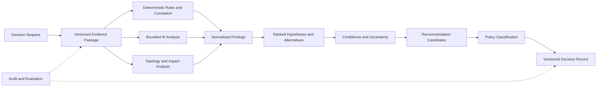

# Project Atlas

## Decision Engine

| Field | Value |
| --- | --- |
| Document ID | ATLAS-024 |
| Version | 1.0.0 |
| Status | Approved |
| Document Owner | Decision Intelligence Owner |
| Reviewers | Architecture Owner, AI Architecture, Security Architecture, Infrastructure Domain Architects, Operations |
| Approver | Umit Ozdemir (acting Architecture Owner) |
| Approval Date | 2026-08-03 |
| Last Updated | 2026-08-03 |
| Related Documents | [ATLAS-003](003_Project_Principles.md), [ATLAS-014](014_AI_Architecture.md), [ATLAS-023](023_Workflow_Engine.md), [ATLAS-025](025_Policy_Engine.md), [ATLAS-042](042_Root_Cause_Analysis.md), [ATLAS-043](043_Recommendation_Engine.md) |
| Supersedes | ATLAS-024 version 0.1.0 |

## 1. Purpose

This document defines how Atlas converts observations, retrieved knowledge, graph context, deterministic findings, historical outcomes, and AI analysis into structured decision-support records.

The Decision Engine prepares findings and recommendations. It does not authenticate users, authorize access, approve actions, enforce policy, or execute infrastructure operations.

## 2. Scope

### In Scope

- Decision request, evidence, finding, hypothesis, impact, and recommendation-candidate models
- Deterministic and AI-assisted analysis boundaries
- Confidence, uncertainty, alternatives, conflict, and data freshness
- Policy handoff and structured output
- Versioning, reproducibility, evaluation, audit, and observability
- MVP decision scope

### Out of Scope

- Policy rule language and authorization
- Human approval lifecycle
- Connector execution
- Detailed RCA and recommendation presentation
- Final domain-specific diagnostic algorithms

## 3. Goals

- Produce evidence-linked and reproducible operational assessments
- Keep observations, deterministic findings, AI inferences, and assumptions distinct
- Rank plausible explanations without presenting uncertainty as fact
- Calculate impact from current graph and service context
- Produce safe recommendation candidates and alternatives
- Expose missing, stale, and conflicting evidence
- Request deterministic policy classification for proposed actions
- Support domain evaluation and historical comparison

## 4. Decision Model

## 5. Canonical Entities

| Entity | Meaning |
| --- | --- |
| Decision request | Typed question, purpose, target scope, time, and requested output |
| Evidence package | Authorized immutable references and metadata used for analysis |
| Observation | Time-stamped fact obtained directly from a source |
| Finding | Normalized relevant condition derived deterministically or with declared method |
| Hypothesis | Plausible explanation requiring evidence and possible validation |
| Impact assessment | Estimated affected entities, services, users, and operational consequences |
| Recommendation candidate | Proposed diagnostic or remediation option before policy and approval |
| Decision record | Versioned final decision-support output and its complete references |

## 6. Decision Request

Required fields:

- Request and workflow identifiers
- Requesting identity and authorized scope reference
- Decision type and question
- Target entities, services, environment, and time window
- Required evidence domains
- Required output schema
- Deadline and freshness requirements
- Applicable domain and product versions

## 7. Evidence Package Requirements

The engine accepts only a validated evidence package containing:

- Evidence reference and type
- Source, owner, provenance, and authority
- Observation, publication, retrieval, and expiry time
- Product, version, target, and environment applicability
- Access and classification reference
- Integrity or source-version metadata
- Conflict, stale, superseded, missing, or partial labels

Evidence content is immutable for one decision record. Later evidence creates a new decision version.

## 8. Analysis Methods

### 8.1 Deterministic

- Threshold and rule evaluation
- State and configuration comparison
- Time-window correlation
- Graph traversal and dependency analysis
- Known error or signature mapping
- Capacity and trend calculations
- Policy-independent data-quality checks

### 8.2 AI-Assisted

- Natural-language interpretation
- Cross-source summarization
- Hypothesis generation and ranking proposals
- Similar-incident comparison
- Explanation and alternative drafting
- Runbook and vendor-guidance interpretation

AI output is a candidate input and requires schema, evidence, and deterministic validation.

## 9. Finding Contract

A finding includes:

- Stable finding identifier and type
- Statement and severity where applicable
- Method: observed, deterministic rule, calculation, or AI-assisted inference
- Supporting and contradicting evidence
- Target and affected scope
- First and last observed time
- Freshness and data-quality state
- Rule, model, agent, prompt, and schema versions as applicable
- Confidence basis
- Unknowns and recommended validation

## 10. Hypothesis Model

Each hypothesis contains:

- Description
- Required causal or dependency path
- Supporting evidence
- Contradicting evidence
- Missing evidence
- Alternative explanations
- Validation steps
- Confidence category and basis
- Potential impact if true

Hypotheses are ranked but never hidden solely because they have lower confidence. Material alternatives remain visible.

## 11. Evidence Strength

Evidence strength considers:

- Direct observation versus indirect report
- Source authority and integrity
- Product and version match
- Target and environment match
- Freshness
- Independent corroboration
- Graph completeness
- Data-quality warnings
- Conflict and supersession

The model's rhetorical certainty does not affect evidence strength.

## 12. Confidence Architecture

Confidence is separate from severity, impact, and action risk.

Initial categories:

- High: strong applicable evidence with limited material conflict
- Medium: meaningful support with notable gaps or alternatives
- Low: plausible but weak, stale, indirect, or conflicting support
- Insufficient: required evidence is absent or invalid

Every category includes a basis and unknowns. Numeric confidence may be introduced only after calibration against evaluated domain cases.

## 13. Conflict Handling

- Preserve conflicting evidence references.
- Identify whether conflict concerns time, product version, target, source authority, or interpretation.
- Prefer no silent winner when applicability cannot be resolved.
- Reduce confidence or return insufficient evidence.
- Recommend a discriminating validation step.
- Prevent conflicting evidence from being summarized into false consensus.

## 14. Impact Assessment

Impact uses:

- Target entity and capability
- Current inventory and graph relationships
- Relationship direction, validity, and freshness
- Technical and business service mapping
- Redundancy, path, cluster, and protection state where modeled
- Current health and maintenance context
- Historical outcome evidence

Output includes affected, possibly affected, and unknown scope. Incomplete graph data is explicit.

## 15. Recommendation Candidates

Candidates may be:

- Gather additional evidence
- Validate a hypothesis
- Apply a non-invasive workaround
- Plan a configuration or operational change
- Escalate to vendor or another domain
- Monitor and re-evaluate
- Take no action when evidence does not justify one

Each candidate includes evidence, rationale, capability class, risk, impact, duration, service interruption, prerequisites, approvals, validation, recovery, alternatives, and unknowns as applicable.

## 16. Policy Handoff

For each operational candidate, the engine sends Policy Engine:

- Candidate and plan version
- Requesting identity and scope reference
- Capability and class
- Exact target and parameters
- Evidence and impact references
- Environment, time window, and change record
- Proposed safeguards and approval state

Policy returns allow, deny, or conditions. The Decision Engine records the outcome but cannot alter it.

## 17. Decision Record

A record includes:

- Decision identifier and version
- Request and workflow references
- Created time and validity or expiry
- Target and scope
- Evidence package version
- Findings and hypotheses
- Confidence and uncertainty
- Impact and graph-freshness statement
- Recommendation candidates and alternatives
- Policy outcomes and required approvals
- Models, rules, agents, prompts, and schemas used
- Review and supersession state

## 18. Output Contract

User-facing output follows ATLAS-003:

1. Problem or request summary
2. Current assessment
3. Evidence and citations
4. Affected components and services
5. Probable causes and alternatives
6. Confidence, unknowns, assumptions, and freshness
7. Recommended steps
8. Risk, impact, duration, and interruption
9. Preconditions, policy, and approvals
10. Rollback or recovery where relevant
11. Verification criteria

## 19. Reproducibility

Reproduction requires:

- Immutable evidence references
- Decision request and schema
- Rules and configuration versions
- Graph snapshot or version references
- Agent, prompt, model, and endpoint identity
- Retrieval trace
- Policy input and result references

Model output may not be bit-for-bit reproducible. Atlas reproduces inputs, versions, deterministic checks, and recorded outputs.

## 20. Versioning and Supersession

- A new evidence package, target state, rule, model, or material correction creates a new decision version.
- Prior records remain immutable and linked as superseded.
- User annotations or review do not rewrite original evidence.
- Expired decisions cannot be reused as current approval packets.

## 21. Human Review

Reviewers may:

- Confirm or reject findings
- Add evidence
- Correct target or applicability
- Re-rank hypotheses with reason
- Reject recommendations
- Request re-analysis

Human changes are attributed and create a reviewed version or annotation; they do not erase generated history.

## 22. Feedback and Outcome Learning

Atlas may record:

- Which hypothesis was confirmed
- Which action was selected
- Actual impact, duration, and service interruption
- Validation and recovery outcome
- False positive, false negative, or missing evidence

Outcome data is governed operational history and evaluation input, not automatic model training.

## 23. Failure Behavior

| Failure | Decision behavior |
| --- | --- |
| Evidence unavailable | Return insufficient evidence and next collection step |
| Graph stale or incomplete | Limit impact claim and identify unknown blast radius |
| AI unavailable | Return deterministic findings and degraded status where possible |
| Rule failure | Exclude failed rule and disclose incomplete analysis |
| Conflicting evidence | Preserve conflict and reduce confidence |
| Policy unavailable | Do not present candidate as allowed |
| Output invalid | Bounded repair or fail without publishing decision |
| Audit required but unavailable | Fail closed according to task policy |

## 24. Security and Privacy

- Access-filter evidence before analysis.
- Use minimum necessary context.
- Exclude secrets and credential material.
- Prevent cross-organization and cross-environment decisions.
- Treat evidence and model output as untrusted input.
- Restrict decision records and citations to authorized users.
- Sanitize exports and audit metadata.
- Rate-limit expensive or broad-scope analysis.

## 25. Audit

Audit includes:

- Decision request and actor
- Evidence-package reference
- Models, rules, agents, and prompts used
- Findings, recommendation, and decision record identifiers
- Policy requests and outcomes
- Human review and supersession
- Sensitive export

## 26. Observability

Required signals:

- Decisions by type and outcome
- Evidence count, age, conflict, and insufficiency
- Deterministic and AI analysis latency and failure
- Confidence category distribution
- Policy outcomes and approval requirements
- Human correction and rejection rate
- Decision supersession and expiry
- Evaluation regressions

## 27. Evaluation

Evaluation measures:

- Evidence faithfulness
- Finding correctness
- Hypothesis recall and ranking
- Confidence calibration
- Conflict and unknown disclosure
- Impact accuracy
- Recommendation safety and usefulness
- Policy handoff correctness
- Citation validity
- Domain reviewer agreement

Critical unsafe recommendations or unsupported high-confidence findings block release.

## 28. MVP Scope

### Included

- Versioned request, evidence package, finding, hypothesis, impact, candidate, and record schemas
- Deterministic findings plus one bounded AI analysis path
- Categorical confidence with basis
- Graph-assisted impact for modeled relationships
- Policy handoff
- Structured user output
- Human review and outcome feedback foundation
- Evaluation and audit

### Excluded

- Autonomous action selection or execution
- Universal numeric confidence
- Full predictive analytics
- Self-modifying rules
- Automatic model training from outcomes
- Complete cross-domain RCA coverage

## 29. Dependencies and Traceability

- ATLAS-003 defines evidence and output principles.
- ATLAS-014 defines AI, context, structured output, and evaluation.
- ATLAS-023 orchestrates decision workflows.
- ATLAS-025 authoritatively classifies proposed actions.
- ATLAS-026 supplies graph and impact context.
- ATLAS-042 through ATLAS-044 refine RCA, recommendation, and change impact.

## 30. Assumptions

- Evidence quality and topology completeness vary by environment.
- Domain-specific deterministic rules will be added incrementally.
- The first confidence model is categorical and evidence-based.
- Human reviewers remain accountable for consequential decisions.

## 31. Open Questions and ADR Backlog

- Which decision schema format and storage are selected?
- Which domain provides the first evaluated rule and hypothesis set?
- How are categorical confidence thresholds calibrated?
- Which graph snapshot strategy supports reproducible impact analysis?
- What validity and retention periods apply by decision type?
- Which reviewer feedback becomes evaluation data?

## 32. Acceptance Criteria

This document is ready to enter Review when:

- Observations, findings, hypotheses, impacts, recommendation candidates, and policy outcomes are unambiguous.
- Confidence is evidence-based and separate from risk and authorization.
- Conflict, stale data, unknowns, and incomplete graph behavior are explicit.
- Decision records are reproducible, versioned, reviewable, and auditable.
- MVP evaluation and first-domain decisions have owners.

## 33. Change History

| Version | Date | Author | Summary |
| --- | --- | --- | --- |
| 0.1.0 | 2026-07-21 | Project Atlas Team | Initial decision responsibilities, inputs, and outputs |
| 0.2.0 | 2026-08-03 | Decision Intelligence Owner | Added evidence, finding, hypothesis, confidence, conflict, impact, recommendation, policy handoff, record, evaluation, and feedback architecture |
| 1.0.0 | 2026-08-03 | Umit Ozdemir | Approved as the first binding documentation baseline under the designated approver authority |
