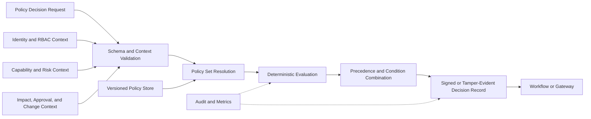

# Project Atlas

## Policy Engine

| Field | Value |
| --- | --- |
| Document ID | ATLAS-025 |
| Version | 1.0.0 |
| Status | Approved |
| Document Owner | Security and Policy Architecture |
| Reviewers | Architecture Owner, Security Architecture, Infrastructure Operations, Compliance, Identity and Access Owner |
| Approver | Umit Ozdemir (acting Security Architecture Owner) |
| Approval Date | 2026-08-03 |
| Last Updated | 2026-08-03 |
| Related Documents | [ATLAS-003](003_Project_Principles.md), [ATLAS-020](020_MCP_Framework.md), [ATLAS-023](023_Workflow_Engine.md), [ATLAS-024](024_Decision_Engine.md), [ATLAS-031](031_RBAC.md), [ATLAS-037](037_Approval_Workflow.md) |
| Supersedes | ATLAS-025 version 0.1.0 |

## 1. Purpose

This document defines the deterministic Policy Engine that decides whether an Atlas operation is allowed, denied, or subject to explicit conditions.

Policy is separate from authentication, RBAC, AI reasoning, human approval, and execution. All required controls must agree before a protected operation proceeds.

## 2. Scope

### In Scope

- Policy model, inputs, outputs, precedence, and lifecycle
- Capability-class and environment defaults
- Evaluation, explanation, caching, simulation, and testing
- Approval, change-window, evidence, and separation-of-duties conditions
- Administration, security, audit, availability, and MVP scope

### Out of Scope

- Final policy language or engine technology
- Authentication and role-assignment implementation
- Human approval user interface
- Connector execution
- Customer-specific production rules

## 3. Goals

- Enforce deny-by-default behavior
- Apply non-overridable Atlas safety minimums
- Combine identity, role, target, capability, environment, evidence, approval, and change context
- Produce deterministic, explainable, versioned decisions
- Support policy testing and simulation before activation
- Prevent AI, connector, or workflow code from bypassing policy
- Support enterprise-specific rules without weakening platform invariants

## 4. Control Separation

| Control | Question answered |
| --- | --- |
| Authentication | Who or what is the actor? |
| RBAC and authorization | May this actor request this operation on this scope? |
| Policy | Under current conditions, may the operation proceed and with which conditions? |
| Approval | Has an authorized human approved this exact proposal? |
| Execution gateway | Are all decisions current, bound, and valid at dispatch? |

Approval cannot override denial, and authorization cannot satisfy a required approval.

## 5. Architecture

## 6. Policy Domains

- Platform invariants
- Identity and role conditions
- Capability class and side effects
- Connector and package trust
- Target, site, environment, and organization scope
- Time, maintenance window, and emergency state
- Evidence freshness and impact completeness
- Approval and separation of duties
- Change or incident record
- Data classification and model endpoint
- Rate, concurrency, and operational health
- Compliance and retention

## 7. Policy Input Contract

Required or conditional fields:

- Decision request, workflow, and correlation identifiers
- Human initiator and service actor
- Roles, groups, grants, and delegated scope references
- Requested operation and purpose
- Connector, instance, capability, version, and C0-C5 class
- Exact target, environment, site, and organization
- Typed-parameter digest and plan version
- Expected side effects
- Evidence, graph-freshness, impact, and confidence references
- Approval packet and decision references
- Change, incident, or emergency record
- Current time, change window, and request expiry
- Relevant component health and security state

Missing required context returns deny or a declared condition; it never implies allow.

## 8. Policy Decision Contract

Decision outcomes:

- `Allow`
- `Deny`
- `RequireApproval`
- `RequireAdditionalEvidence`
- `RequireElevatedRole`
- `RequireChangeRecord`
- `RequireChangeWindow`
- `RequireStepUpAuthentication`
- `RequireManualExecution`

A decision includes:

- Decision identifier and time
- Outcome and ordered reasons
- Evaluated policy set and versions
- Bound actor, operation, target, parameter or plan digest
- Conditions and required next steps
- Validity interval and expiry
- Non-overridable rule references
- Audit and evaluation metadata

## 9. Precedence

Policy precedence is restrictive:

1. Platform non-overridable deny rules
2. Security suspension and emergency containment
3. Compliance and data-boundary rules
4. Environment and organization rules
5. Capability and connector rules
6. Target and service rules
7. Workflow-specific rules
8. Explicit allow rules within all higher constraints

Any applicable deny wins. Multiple conditions are combined; one satisfied condition does not remove another.

## 10. Non-Overridable Minimum

- Unauthenticated access is denied.
- Unauthorized scope is denied.
- Unknown capability class is denied.
- Disabled, suspended, untrusted, or incompatible connector use is denied.
- Expired or mismatched approval is denied.
- Secrets in model or ordinary result context are denied.
- C5 autonomous execution is denied.
- AI cannot approve or directly execute infrastructure actions.
- Audit-required sensitive actions are denied when required audit persistence is unavailable.
- Cross-organization or cross-environment access is denied unless an approved architecture explicitly permits it.

Customer policy may be stricter but cannot weaken these rules.

## 11. Default Capability Policies

| Class | Default |
| --- | --- |
| C0 | Allow only within authorized data scope |
| C1 | Allow for authorized identity, approved target, healthy trusted connector, and full audit |
| C2 | Require policy-defined evidence or approval based on resource and service impact |
| C3 | Deny unless explicitly enabled with exact approval and deterministic execution controls |
| C4 | Deny unless privileged approval, current impact analysis, change record, window, and recovery plan are valid |
| C5 | Deny autonomous execution; permit only exceptional human-governed procedure outside ordinary AI automation |

## 12. Approval Binding

Policy validates that approval matches:

- Proposal and plan version
- Capability and connector version
- Exact target and environment
- Typed parameter digest
- Risk and impact references
- Required approver role and separation of duties
- Validity period and change window

Any mismatch invalidates approval.

## 13. Evidence Conditions

Policy may require:

- Current target health
- Graph freshness and minimum dependency coverage
- Recent backup or protection status
- Vendor-version-compatible runbook
- Successful precondition checks
- Rollback or recovery plan
- Service owner acknowledgement
- Additional human evidence

Policy does not judge model rhetoric; it evaluates declared structured evidence references.

## 14. Policy Sets

Policy sets are layered by:

- Platform
- Deployment
- Organization or tenant
- Environment
- Site
- Domain or vendor
- Connector and capability
- Business or technical service
- Workflow

Resolution is deterministic and records every included version.

## 15. Policy Lifecycle

- Draft
- Validating
- Simulation
- Review
- Approved
- Scheduled
- Active
- Suspended
- Deprecated
- Retired

Only approved active versions affect production decisions. Emergency suspension is separately authorized and audited.

## 16. Policy Change

A change includes:

- Owner and purpose
- Before and after semantic diff
- Affected identities, targets, capabilities, and workflows
- Simulation results
- Security and operational review
- Activation and rollback plan
- Effective time and expiry where temporary

Broad permission expansion receives higher review than restrictive change.

## 17. Simulation

Simulation evaluates a candidate policy against:

- Curated allow and deny cases
- Recent sanitized decision records
- Capability-class matrix
- Cross-environment and cross-organization attempts
- Expired, missing, or mismatched approval
- Emergency and degraded dependencies
- Expected production traffic sample where policy permits

Simulation never authorizes or executes the represented operations.

## 18. Testing

- Syntax and schema tests
- Unit tests for each rule
- Precedence and conflict tests
- Non-overridable minimum tests
- Role, target, environment, and organization isolation tests
- C0 through C5 matrix tests
- Approval and plan-binding tests
- Time-window and time-zone tests
- Missing, stale, and malformed context tests
- Performance and load tests
- Rollback tests

A policy package cannot activate with failing mandatory deny tests.

## 19. Decision Validity and Caching

- Decisions are short-lived and bound to exact input context.
- Deny decisions may be cached only without hiding urgent policy change.
- Allow caching requires policy version, actor, operation, target, parameter digest, and expiry.
- Connector, approval, security, or target-state changes can invalidate decisions.
- Execution Gateway re-evaluates sensitive operations near dispatch.

## 20. Availability and Failure

| Failure | Behavior |
| --- | --- |
| Policy store unavailable | Use only verified active snapshot within allowed age; otherwise deny |
| Evaluation error | Deny and alert |
| Unknown policy version | Deny |
| Context service unavailable | Deny or require evidence |
| Approval service unavailable | Deny approval-required action |
| Audit unavailable | Follow non-overridable fail-closed rule for sensitive actions |
| Clock uncertainty | Deny time-bound approval or window-dependent action |

## 21. Break-Glass and Emergency

Break-glass is not an AI or workflow bypass.

It requires:

- Named human identity
- Strong authentication
- Justification and incident or emergency record
- Narrow target, capability, and duration
- Independent notification and enhanced audit
- Post-event review
- No weakening of C5 autonomous-execution prohibition

## 22. Administration and Separation of Duties

Separate permissions cover:

- Author policy
- Review policy
- Approve policy
- Activate or suspend policy
- View sensitive decisions
- Export policy or decisions
- Administer break-glass

Where required, one identity cannot author and approve the same material permission expansion.

## 23. Security

- Policy artifacts are integrity-verifiable and access-controlled.
- Evaluation is deterministic and isolated from LLM output.
- Input schemas reject unknown security-sensitive fields.
- Policy decisions are tamper-evident and audience-bound where passed between services.
- Secret values are excluded.
- Administrative APIs use strong authorization and rate limits.
- Policy packages and dependencies follow supply-chain controls.

## 24. Audit

Audit includes:

- Policy creation, review, approval, activation, rollback, suspension, and retirement
- Decision request, outcome, reasons, and policy versions
- Administrative simulation and export
- Break-glass use
- Decision invalidation and execution-bound re-evaluation

High-volume allow decisions may use governed aggregation only where detailed audit is not mandatory. Denials and sensitive decisions remain individually traceable.

## 25. Observability

Required signals:

- Decisions by outcome, class, environment, and reason category
- Evaluation latency and failure
- Active policy and snapshot age
- Cache hit, expiry, and invalidation
- Approval mismatch and expired decision
- Non-overridable rule activation
- Simulation regression
- Break-glass use

Metrics do not expose raw target, user, or parameter values.

## 26. Policy Explanation

User-safe explanation includes:

- Outcome
- Applicable requirement or denial reason
- Required next step
- Policy reference and decision identifier
- Expiry where relevant

It does not expose sensitive rule internals that enable bypass, other users' permissions, or secret context.

## 27. MVP Policy Scope

### Included

- Versioned policy packages and deterministic evaluation
- Platform non-overridable minimum
- RBAC, environment, target, connector trust, and C0-C2 policies
- Approval, evidence, and change-record conditions
- Decision records, explanation, audit, and metrics
- Simulation and mandatory test suite
- Future C3-C5 deny defaults

### Excluded

- C3 through C5 production execution enablement
- AI-authored automatic policy activation
- Unrestricted customer policy code
- Cross-tenant delegation
- Fully autonomous emergency policy changes

## 28. Dependencies and Traceability

- ATLAS-003 defines non-overridable principles and capability classes.
- ATLAS-020 supplies connector, capability, instance, and risk context.
- ATLAS-023 coordinates conditional policy steps.
- ATLAS-024 supplies evidence, impact, and recommendation candidates.
- ATLAS-031 supplies identity, role, and scoped authorization.
- ATLAS-037 supplies approval records and separation of duties.

## 29. Assumptions

- Customers require configurable rules but accept a platform safety minimum.
- Policy evaluation technology can operate locally in restricted environments.
- Authorization, policy, approval, and execution remain separate components.
- The first enabled capabilities are C0 and C1, with selected C2 diagnostics.

## 30. Open Questions and ADR Backlog

- Which policy language and engine are selected?
- How are policy packages signed and distributed?
- Which decisions require synchronous audit persistence?
- What maximum policy snapshot age is permitted during store outage?
- Which initial C2 diagnostics require approval?
- Which sanitized decision data may be used for simulation?

## 31. Acceptance Criteria

This document is ready to enter Review when:

- Authentication, authorization, policy, approval, and execution are clearly separated.
- Policy input, output, precedence, lifecycle, and validity are enforceable.
- Non-overridable minimum and C0-C5 defaults are accepted.
- Simulation, testing, failure, caching, administration, and break-glass behavior are complete.
- Policy technology and initial policy-matrix decisions have owners.

## 32. Change History

| Version | Date | Author | Summary |
| --- | --- | --- | --- |
| 0.1.0 | 2026-07-21 | Project Atlas Team | Initial policy goals, risk classes, inputs, and outputs |
| 0.2.0 | 2026-08-03 | Security and Policy Architecture | Added control separation, precedence, non-overridable minimum, policy lifecycle, simulation, testing, validity, failure, break-glass, and administration |
| 1.0.0 | 2026-08-03 | Umit Ozdemir | Approved as the first binding documentation baseline under the designated approver authority |
