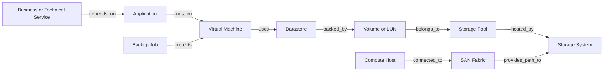

# Project Atlas

## Graph Engine

| Field | Value |
| --- | --- |
| Document ID | ATLAS-026 |
| Version | 1.0.0 |
| Status | Approved |
| Document Owner | Infrastructure Graph Architecture |
| Reviewers | Architecture Owner, Infrastructure Domain Architects, Data Architecture, Security Architecture, AI Architecture |
| Approver | Umit Ozdemir (acting Architecture Owner) |
| Approval Date | 2026-08-03 |
| Last Updated | 2026-08-03 |
| Related Documents | [ATLAS-003](003_Project_Principles.md), [ATLAS-010](010_System_Architecture.md), [ATLAS-015](015_RAG_Architecture.md), [ATLAS-024](024_Decision_Engine.md), [ATLAS-042](042_Root_Cause_Analysis.md), [ATLAS-044](044_Change_Impact.md) |
| Supersedes | ATLAS-026 version 0.1.0 |

## 1. Purpose

This document defines the time-aware infrastructure graph used by Atlas for inventory relationships, dependency analysis, blast radius, root cause analysis, service mapping, and future digital-twin scenarios.

The graph is an evidence model, not a guarantee of complete reality. Every entity and relationship carries source, time, validity, and confidence metadata.

## 2. Scope

### In Scope

- Entity, relationship, observation, identity, and provenance model
- Graph ingestion, normalization, reconciliation, lifecycle, and versioning
- Dependency, path, neighborhood, blast-radius, and historical queries
- Freshness, completeness, conflict, access control, and audit
- Storage-neutral graph requirements and MVP scope

### Out of Scope

- Final graph database selection
- Complete vendor taxonomy
- Full CMDB replacement
- Production digital-twin simulation engine
- Domain-specific RCA algorithms

## 3. Goals

- Connect infrastructure facts across vendor domains
- Preserve vendor identity while exposing normalized concepts
- Support explainable path and impact queries
- Represent current and historical validity
- Reconcile multiple sources without silent overwrite
- Expose stale, missing, conflicting, and inferred relationships
- Enforce organizational and environment boundaries
- Scale from an MVP relationship model to multi-site topology

## 4. Graph Model

Paths are examples. The canonical schema uses typed entities and relationships with explicit direction and semantics.

## 5. Canonical Records

### 5.1 Entity

- Atlas entity identifier
- Entity type and schema version
- Organization, environment, site, and domain
- Canonical display attributes
- Vendor, product, model, and product version
- Source identifiers and aliases
- Lifecycle state
- First seen, last observed, valid from, and valid to
- Source and provenance references
- Data classification and access policy
- Quality, conflict, and freshness state

### 5.2 Relationship

- Atlas relationship identifier
- Relationship type and schema version
- Source entity, target entity, and direction
- Cardinality and attributes
- Observed, calculated, inferred, or manually asserted method
- Source and supporting evidence
- First seen, last observed, valid from, and valid to
- Confidence basis, conflict, and freshness
- Access and classification

### 5.3 Observation

An observation records one source's claim about an entity or relationship at a time. Reconciliation builds the canonical projection without erasing observations.

## 6. Identity and Keys

Atlas identifiers are stable and do not depend solely on display names or mutable IP addresses.

Identity resolution may use:

- Vendor serial and object identifier
- Platform UUID
- Qualified world-wide name
- Cloud resource identifier
- Source-system immutable identifier
- Composite product-specific key

Ambiguous matches remain separate or conflicted until resolved. Manual merge and split are audited and reversible through mapping history.

## 7. Initial Entity Types

- Organization, environment, site, datacenter, room, rack
- Business service, technical service, application
- Storage system, controller, port, pool, volume, LUN, file system
- SAN fabric, switch, port, zone, alias, HBA, path
- Compute host, cluster, virtual machine, datastore
- Operating-system instance and service
- Backup platform, policy, job, copy, restore point
- Network device, interface, subnet, DNS record where required
- Connector instance and monitoring source

New types require owner, schema, identity rule, access model, and relationship semantics.

## 8. Initial Relationship Types

- `contains`
- `located_in`
- `member_of`
- `runs_on`
- `depends_on`
- `uses`
- `backed_by`
- `belongs_to`
- `connected_to`
- `provides_path_to`
- `hosts`
- `protects`
- `monitors`
- `managed_by`
- `replicates_to`
- `fails_over_to`

Inverse display may be generated, but one canonical direction owns semantics.

## 9. Schema Governance

Entity and relationship schemas define:

- Stable type and version
- Required and optional attributes
- Identity and merge rules
- Direction and cardinality
- Allowed source and target types
- Temporal behavior
- Access and classification inheritance
- Validation and deprecation

Breaking semantic changes use a new major schema version and migration plan.

## 10. Ingestion Sources

- MCP discovery and inventory capabilities
- CMDB imports
- Virtualization and operating-system inventory
- Storage and SAN configuration
- Backup catalogs
- Application and service maps
- Approved manual assertions
- Future monitoring and event sources

Source registration declares authority by entity and attribute type. No source is universally authoritative for all data.

## 11. Ingestion Pipeline

1. Validate source, identity, scope, and schema.
2. Store immutable source observations.
3. Normalize types and units.
4. Resolve candidate identities.
5. Detect duplicates and conflicts.
6. Reconcile canonical entity projection.
7. Validate relationship endpoints and semantics.
8. Update temporal validity and freshness.
9. Publish graph-change events.
10. Record lineage, quality, and audit metadata.

## 12. Reconciliation

Reconciliation considers:

- Source authority for the field or relationship
- Observation time and source synchronization health
- Product and environment applicability
- Stable identity strength
- Agreement among independent sources
- Manual reviewed overrides

Conflicts are stored and exposed. A later observation does not automatically override a higher-authority current source.

## 13. Temporal Model

Atlas distinguishes:

- Event time: when the source says a change occurred
- Observation time: when Atlas observed it
- Record time: when Atlas stored it
- Validity interval: when the graph believes the fact applied

Current queries use valid, non-expired relationships under freshness policy. Historical queries specify an `as_of` time and disclose source limitations.

## 14. Freshness and Expiry

Freshness policy varies by type and source schedule.

- `Fresh`: observed within required interval
- `Aging`: still usable with warning
- `Stale`: excluded from critical claims unless explicitly requested
- `Unknown`: no reliable observation interval
- `Expired`: no longer active in current projection

Missing a periodic observation may mark a fact stale before it is removed.

## 15. Relationship Confidence

Relationship confidence derives from:

- Direct vendor observation
- Multiple-source corroboration
- Deterministic mapping
- Inference rule and prerequisites
- Manual reviewed assertion
- Freshness and conflict

Inferred edges are visually and programmatically distinct from observed edges.

## 16. Completeness

Graph completeness is reported by requested domain and path, not one global percentage.

Completeness may identify:

- Missing expected source
- Unobserved relationship type
- Stale branch
- Ambiguous entity identity
- Partial site or domain coverage
- Unknown business-service mapping

Impact and RCA outputs carry the relevant completeness statement.

## 17. Query Contracts

Supported logical queries:

- Entity lookup and authorized search
- Immediate upstream and downstream neighbors
- Typed path between entities
- Dependency tree to bounded depth
- Blast radius from entity or proposed change
- Shared dependency and potential common cause
- Redundancy and alternate-path candidates
- Protection and backup coverage
- Historical `as_of` topology
- Source, freshness, conflict, and completeness explanation

Queries enforce depth, node, edge, time, and resource limits.

## 18. Blast Radius

Blast-radius analysis declares:

- Starting entity and proposed failure or action
- Relationship types and direction traversed
- Maximum depth and stop conditions
- Redundancy and failover assumptions
- Freshness and completeness
- Definitely, possibly, and unknown affected entities
- Technical and business services
- Evidence path for every result

Graph reachability alone does not prove outage. Domain rules interpret redundancy and operational state.

## 19. Root Cause Support

The graph supports RCA by finding:

- Common upstream dependencies
- Shared recent changes or failing components
- Path convergence
- Protection or redundancy loss
- Time-aligned topology changes
- Contradicting healthy paths

The Graph Engine returns paths and evidence; the Decision and RCA engines rank causes.

## 20. Digital Twin Direction

Future digital-twin scenarios may overlay proposed state changes on an immutable graph snapshot.

Requirements before production use:

- Explicit snapshot and simulation model versions
- Domain behavior models
- Stated assumptions and unsupported behavior
- No writes to live canonical graph
- Comparison of predicted and actual outcomes
- Human review and policy integration

Graph topology alone is not a complete behavioral simulation.

## 21. Access Control

- Entities and relationships carry organization, environment, and classification.
- Query authorization applies before traversal results are returned.
- Hidden nodes must not leak through counts, path shapes, labels, or errors.
- Cross-boundary edges require explicit approved representation.
- Derived impact results inherit the most restrictive relevant classification.
- Caches and projections are scoped by access context.

## 22. Data Ownership

- Inventory Service owns canonical entities.
- Graph Service owns canonical relationships and graph projections.
- Source connectors own source observations only through append contracts.
- Decision Engine consumes graph results and does not modify topology.
- CMDB remains authoritative for fields assigned to it by source policy.

## 23. Storage Requirements

The selected implementation must support:

- Typed property graph or equivalent relationships
- Bounded traversal and path queries
- Temporal and provenance metadata
- Schema and index migration
- Access filtering
- Backup, restore, integrity checks, and local enterprise deployment
- Export and rebuild from authoritative observations where designed

Technology selection requires benchmark and operational evidence.

## 24. Versioning and Snapshots

- Schema, reconciliation rules, and source mappings are versioned.
- Decision records reference graph snapshot or query-time version.
- Snapshot strategy may use temporal queries, immutable exports, or version markers.
- Reprocessing with new rules creates traceable projection changes.
- Historical evidence remains interpretable after schema migration.

## 25. Events

ATLAS-016 events include entity observed, reconciled, conflicted, stale, retired and relationship observed, changed, expired, or removed.

Events contain references and minimized change summaries, not unrestricted graph subtrees.

## 26. Audit

Audit covers:

- Source and reconciliation-policy administration
- Manual entity merge, split, assertion, and override
- Schema activation and migration
- Sensitive broad graph query and export
- Snapshot and digital-twin administration

Routine automated observations use operational events unless policy requires audit.

## 27. Observability

- Entity and relationship counts by type and lifecycle
- Source synchronization age and coverage
- Reconciliation throughput, conflict, merge, and failure
- Fresh, stale, unknown, and expired distributions
- Query latency, depth, size, timeout, and access denial
- Orphan and dangling relationship attempts
- Backup, restore, migration, and index health

## 28. Failure and Degraded Behavior

| Failure | Behavior |
| --- | --- |
| Source unavailable | Age existing observations and expose degraded coverage |
| Reconciliation failure | Preserve prior canonical state and quarantine failed batch |
| Identity ambiguity | Keep separate entities and expose conflict |
| Graph store unavailable | Block graph-dependent impact claims |
| Partial query | Return partial state with explicit limits, never complete-looking output |
| Schema mismatch | Reject write and preserve source observation for review |

## 29. Testing

- Schema and cardinality tests
- Identity merge and split tests
- Multi-source precedence and conflict tests
- Temporal and expiry tests
- Path, cycle, depth, and bounded traversal tests
- Blast-radius expected-path tests
- Access-control leakage tests
- Large graph and performance tests
- Migration, backup, restore, and rebuild tests
- Stale and partial-source failure tests

## 30. MVP Scope

### Included

- Core entity and relationship schemas for one storage-to-virtualization path
- Source observations and normalized identities
- Provenance, observation time, validity, freshness, and conflict
- Bounded neighbor, path, dependency, and blast-radius queries
- Role and environment filtering
- One graph snapshot reference strategy
- Reconciliation, audit, metrics, backup, and restore foundation

### Excluded

- Full enterprise CMDB replacement
- Complete business-service discovery
- Production digital twin
- Every infrastructure domain
- Unbounded graph query language for ordinary users
- AI-created canonical edges without governed evidence

## 31. Dependencies and Traceability

- ATLAS-003 defines time-aware context, evidence, and data boundaries.
- ATLAS-010 defines the Infrastructure Graph in the Data Plane.
- ATLAS-024 consumes graph evidence for impact and hypotheses.
- ATLAS-042 and ATLAS-044 refine RCA and change-impact use.
- ATLAS-053 defines database requirements and migration.
- Connector documents define source observations and entity mappings.

## 32. Assumptions

- No single source fully describes enterprise topology.
- The first MVP graph covers a narrow vertical infrastructure path.
- Product and vendor identifiers can be preserved alongside normalized identity.
- Business-service mapping may initially require approved imports or manual assertions.

## 33. Open Questions and ADR Backlog

- Which graph storage strategy is selected?
- Which storage, SAN, host, virtualization, and service relationships are mandatory for MVP?
- Which source is authoritative for each initial entity attribute?
- What freshness thresholds apply by type?
- How is graph snapshot identity implemented?
- Which benchmark dataset represents first production scale?

## 34. Acceptance Criteria

This document is ready to enter Review when:

- Entity, relationship, observation, identity, provenance, temporal, and conflict models are accepted.
- Ingestion and reconciliation preserve source evidence without silent overwrite.
- Query, blast-radius, completeness, and access-control behavior is explicit.
- Graph limitations prevent unsupported certainty in RCA and impact outputs.
- MVP vertical path, storage technology, sources, and freshness decisions have owners.

## 35. Change History

| Version | Date | Author | Summary |
| --- | --- | --- | --- |
| 0.1.0 | 2026-07-21 | Project Atlas Team | Initial graph goals, entities, and relationships |
| 0.2.0 | 2026-08-03 | Infrastructure Graph Architecture | Added canonical graph records, identity, reconciliation, temporal validity, confidence, completeness, queries, access, digital-twin direction, and MVP path |
| 1.0.0 | 2026-08-03 | Umit Ozdemir | Approved as the first binding documentation baseline under the designated approver authority |
