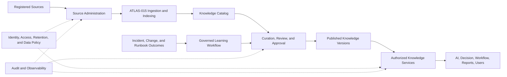
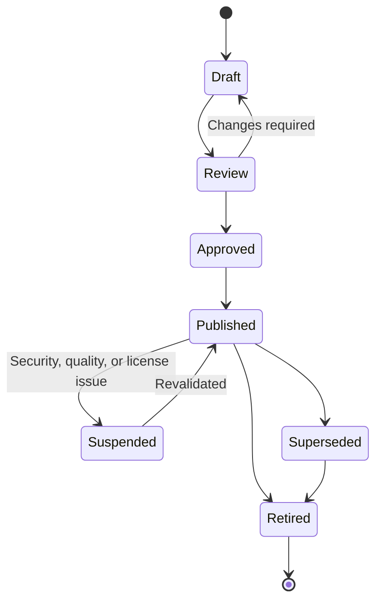

# Project Atlas

## Knowledge Engine

| Field | Value |
| --- | --- |
| Document ID | ATLAS-027 |
| Version | 1.0.0 |
| Status | Approved |
| Document Owner | Knowledge Management Owner |
| Reviewers | Architecture Owner, Data Governance, Security Architecture, AI Architecture, Infrastructure Domain Architects, Operations |
| Approver | Umit Ozdemir (acting Architecture Owner) |
| Approval Date | 2026-08-03 |
| Last Updated | 2026-08-03 |
| Related Documents | [ATLAS-003](003_Project_Principles.md), [ATLAS-014](014_AI_Architecture.md), [ATLAS-015](015_RAG_Architecture.md), [ATLAS-024](024_Decision_Engine.md), [ATLAS-045](045_Runbook_Engine.md), [ATLAS-054](054_VectorDB.md) |
| Supersedes | ATLAS-027 version 0.1.0 |

## 1. Purpose

This document defines the Knowledge Engine that governs vendor knowledge, organizational procedures, incident and change history, generated knowledge, and evidence retrieval across Project Atlas.

ATLAS-015 defines the RAG pipeline. The Knowledge Engine owns source governance, knowledge lifecycle, curation, quality, organizational memory, and authorized knowledge services.

## 2. Scope

### In Scope

- Knowledge domains, ownership, lifecycle, quality, approval, and access
- Source administration and synchronization
- Vendor knowledge packs
- Runbook, incident, problem, change, and operational-memory handling
- Generated knowledge and human curation
- Knowledge services, feedback, deletion, audit, observability, and MVP scope

### Out of Scope

- Parser, chunk, embedding, and ranking internals covered by ATLAS-015
- Final content platform integrations
- Model training
- Complete ITSM implementation
- General-purpose enterprise document management

## 3. Goals

- Preserve authoritative vendor and organizational knowledge with provenance
- Make ownership, approval, version, applicability, and expiry visible
- Prevent stale or generated content from appearing authoritative
- Learn from operational outcomes without converting anecdotes into universal rules
- Support domain-specific knowledge packs and terminology
- Enforce access and data boundaries throughout retrieval and export
- Provide evidence references for decisions, reports, and audits

## 4. Knowledge Domains

| Domain | Examples | Governance focus |
| --- | --- | --- |
| Vendor | Manuals, KBs, API and CLI references, release notes | Product/version applicability, authority, license |
| Architecture | Standards, designs, ADRs, topology guidance | Approval, supersession, implementation traceability |
| Runbook | Diagnosis, maintenance, validation, recovery | Owner, preconditions, risk, approval, tested status |
| Incident and problem | Tickets, timelines, findings, root causes | Privacy, outcome, correction, evidence quality |
| Change | Plans, approvals, implementation and actual impact | Exact version, outcome, rollback or recovery |
| Operational | Health findings, capacity, reports, support notes | Observation time, source, retention |
| Connector | Capabilities, permissions, compatibility, errors | Package and product version |
| Generated | AI summaries, recommendations, drafted runbooks | Generated label, evidence, review, expiry |

## 5. Architecture

## 6. Knowledge Item Contract

Each item version includes:

- Stable item and immutable version identifier
- Domain and content type
- Title, summary, language, and source reference
- Owner, steward, reviewers, and approver where applicable
- Vendor, product, model, and applicable versions
- Organization, environment, site, and service applicability
- Created, published, effective, review, expiry, and retired dates
- Draft, review, approved, published, suspended, superseded, or retired state
- Source authority and quality assessment
- Data classification and access policy
- Evidence, related, conflict, supersession, and derivation references
- Generated or human-authored status
- ATLAS-015 artifact, chunk, and index references

## 7. Source Administration

Source administrators:

- Register owner, class, acquisition method, license, and access mapping
- Validate connector permissions and synchronization behavior
- Set schedules, freshness expectations, and failure escalation
- Review synchronization health and content drift
- Suspend or retire compromised, obsolete, or unauthorized sources
- Coordinate deletion and downstream index cleanup

Source access does not automatically make every item approved knowledge.

## 8. Knowledge Lifecycle

Imported authoritative vendor content may use a source-validated publication path, but it still records authority, applicability, and lifecycle.

## 9. Roles

- Source Owner: accountable for source authorization and availability
- Knowledge Steward: maintains metadata, quality, lifecycle, and conflicts
- Domain Reviewer: validates technical correctness and applicability
- Security Reviewer: validates access, sensitive data, and unsafe instructions
- Approver: authorizes governed internal knowledge for intended use
- Consumer: retrieves within authorized purpose and scope
- Auditor: reviews lifecycle and sensitive usage without editing content

## 10. Quality Model

Quality is multidimensional:

- Provenance and integrity
- Authority
- Product and version applicability
- Technical correctness
- Completeness
- Freshness
- Clarity and structure
- Tested or observed outcome
- Access and classification completeness
- Conflict and supersession state

Quality categories include rationale. One aggregate score must not hide a critical weakness.

## 11. Authority and Applicability

- Vendor authoritative guidance is preferred for product behavior.
- Approved internal standards govern organizational practice.
- Runbooks apply only to declared environments, products, versions, and risk classes.
- Historical incidents are examples, not universal instructions.
- Generated content is non-authoritative until reviewed.
- Newer content does not automatically supersede more applicable content.

## 12. Vendor Knowledge Packs

A pack contains:

- Source registrations
- Product and version taxonomy
- Vendor-to-Atlas terminology mappings
- Parsing and retrieval profiles
- Known document precedence and supersession
- Connector capability and permission references
- Error and event catalogs
- Evaluation questions and expected evidence
- Pack version, owner, compatibility, and change history

Packs are extensions and follow package validation and approval. They contain no credentials.

## 13. Runbook Knowledge

A runbook item declares:

- Purpose and trigger
- Products, versions, targets, and environments
- Capability classes and required roles
- Preconditions and evidence
- Ordered steps
- Expected duration and service impact
- Validation and success criteria
- Rollback or recovery
- Approval and change requirements
- Tested date, test environment, and outcome
- Owner, review, and expiry

ATLAS-045 governs execution interpretation. Retrieval alone never executes a runbook.

## 14. Incident and Problem Knowledge

Ingested incident or problem records distinguish:

- Original observations
- Human notes
- Timeline
- Hypotheses
- Confirmed root cause
- Actions and actual outcomes
- Follow-up and prevention
- AI-generated summaries

Privacy, legal hold, ticket permissions, and correction propagate into Atlas access and retention.

## 15. Change Knowledge

Change records preserve:

- Proposed and implemented plan versions
- Approval and change-window references
- Expected and actual impact, duration, and interruption
- Validation, rollback, recovery, and final outcome
- Related incidents and lessons

Only completed outcome data is used to evaluate recommendation accuracy.

## 16. Organizational Memory

Organizational memory is governed persistence, not hidden model memory.

Facts enter one of:

- Inventory and Graph Engine
- Approved knowledge item
- Operational history
- Decision and recommendation record
- Workflow and audit history

Conversation text alone does not become organizational truth.

## 17. Learning Workflow

1. Identify candidate lesson from incident, change, review, or feedback.
2. Link original evidence and outcome.
3. Remove or restrict sensitive data.
4. Draft a knowledge item with limited applicability.
5. Validate against vendor guidance and current product versions.
6. Review by domain and security owners.
7. Approve and publish or reject.
8. Assign review and expiry.

AI may draft but cannot approve learned knowledge.

## 18. Generated Knowledge

Generated items record:

- Agent, prompt, model, and version
- Evidence package
- Generation time and purpose
- Human review and approval
- Applicability and expiry
- Source conflicts and assumptions

Generated items are visually and programmatically labeled and rank below applicable approved sources by default.

## 19. Knowledge Services

The engine exposes authorized contracts for:

- Source and catalog administration
- Item create, review, approve, publish, suspend, supersede, retire, and delete
- Metadata and full-text browse
- ATLAS-015 evidence retrieval
- Related and conflicting knowledge
- Product and version applicability
- Citation resolution
- Knowledge pack installation and status
- Review-due and stale-content reporting
- Sensitive export

## 20. Access Control

- Source and item permissions map from authoritative identity or source ACLs.
- Document, chunk, citation, relationship, and export access are enforced.
- Generated derivatives inherit restrictive source classification.
- Counts, titles, snippets, and relationship links do not leak hidden content.
- Access changes invalidate retrieval caches and projections.
- Break-glass retrieval is time-bound and audited.

## 21. Conflict and Supersession

- Conflicts are explicit typed relationships.
- Reviewers identify whether scope, version, environment, authority, or content differs.
- Default retrieval excludes superseded items unless historical context is requested.
- Decisions retain the exact item versions originally cited.
- A suspension can immediately remove an item from active retrieval without deleting history.

## 22. Feedback

Consumers may report:

- Incorrect or outdated content
- Wrong product or version applicability
- Missing evidence
- Access concern
- Unsafe or ambiguous procedure
- Useful or unsuccessful recommendation outcome

Feedback creates a triaged work item. It does not directly modify rank, approval, or content.

## 23. Review and Expiry

- Internal procedures have review intervals and owners.
- Product end-of-support may expire applicable vendor guidance.
- Overdue content is labeled and may be excluded from critical recommendations.
- Owner absence triggers reassignment or suspension.
- Bulk renewal without evidence is prohibited.

## 24. Deletion and Legal Hold

- Deletion follows source ownership, retention, privacy, and legal-hold policy.
- Derived chunks, embeddings, caches, and summaries are removed or restricted.
- Tombstones preserve required traceability without content where permitted.
- Legal hold blocks deletion and is separately authorized.
- Completion is trackable and audited.

## 25. Security

- Untrusted acquisition and isolated parsing
- Prompt-injection controls
- No credentials in content or metadata
- Classification before publication
- Restricted administration and export
- Malware and active-content handling
- Cross-organization isolation
- Generated-content labeling
- Immediate source or item suspension

## 26. Audit

Audit covers source administration, manual upload, classification, review, approval, publication, suspension, supersession, deletion, legal hold, pack lifecycle, sensitive retrieval, and export.

Routine retrieval telemetry is separately governed unless policy requires individual audit.

## 27. Observability

- Source health and synchronization age
- Items by domain, lifecycle, owner, classification, and review status
- Ingestion, quarantine, publication, and deletion backlog
- Stale, expired, conflicted, and ownerless content
- Retrieval empty-result and citation-failure rate
- Feedback age and resolution
- Generated-to-approved conversion and rejection
- Access denial and policy failure

## 28. Evaluation

- Source and metadata completeness
- Correct authority and applicability
- Retrieval and citation quality
- Stale and superseded exclusion
- Conflict visibility
- Access isolation
- Runbook and incident outcome usefulness
- Generated-content review accuracy
- Knowledge freshness and owner responsiveness

## 29. Backup and Recovery

- Catalog, lifecycle, ownership, approvals, and source metadata are authoritative backup scope.
- Source artifacts are backed up where Atlas owns the governed copy.
- Retrieval indexes follow ATLAS-015 rebuild or restore policy.
- Restore preserves access, classification, approval, and legal hold.
- Recovery validation includes authorized, unauthorized, current, superseded, and deleted cases.

## 30. MVP Scope

### Included

- Source and item catalog
- Vendor, internal runbook, and generated knowledge domains
- Ownership, authority, version, classification, review, and expiry
- Draft-to-published lifecycle
- Conflict and supersession
- ATLAS-015 retrieval and citation integration
- Feedback and review-due workflow
- Audit, observability, deletion, and backup foundation

### Excluded

- Full enterprise content-management replacement
- Automatic knowledge approval
- Universal source connectors
- Model training from organizational memory
- Complete incident-learning automation
- Cross-tenant shared knowledge without proven isolation

## 31. Dependencies and Traceability

- ATLAS-014 governs AI use, memory, and generated artifacts.
- ATLAS-015 implements ingestion and retrieval.
- ATLAS-024 consumes evidence for decisions.
- ATLAS-045 governs runbook intelligence.
- ATLAS-054 defines retrieval-store requirements.
- Enterprise integration documents govern ITSM and directory access.

## 32. Assumptions

- Knowledge has named organizational owners.
- Vendor and internal content can conflict or become stale.
- Source systems remain authoritative for their records.
- Human curation is available for consequential operational knowledge.

## 33. Open Questions and ADR Backlog

- Which vendor source and internal source are first?
- Which approval states are required before critical knowledge can influence recommendations?
- What review intervals apply by domain?
- Which ITSM fields and permissions are ingested first?
- How is knowledge quality represented without misleading aggregate scores?
- Which legal hold and privacy deletion integrations are required?

## 34. Acceptance Criteria

This document is ready to enter Review when:

- Knowledge domains, ownership, lifecycle, quality, authority, and applicability are agreed.
- Vendor, internal, historical, and generated knowledge remain distinguishable.
- Learning and feedback cannot bypass human review.
- Access, conflict, supersession, expiry, deletion, and legal-hold behavior are complete.
- First sources, owners, approval rules, and review intervals are assigned.

## 35. Change History

| Version | Date | Author | Summary |
| --- | --- | --- | --- |
| 0.1.0 | 2026-07-21 | Project Atlas Team | Initial knowledge responsibilities, domains, and governance |
| 0.2.0 | 2026-08-03 | Knowledge Management Owner | Added catalog, lifecycle, roles, quality, vendor packs, runbook and incident memory, learning, feedback, access, conflict, expiry, deletion, and recovery |
| 1.0.0 | 2026-08-03 | Umit Ozdemir | Approved as the first binding documentation baseline under the designated approver authority |
