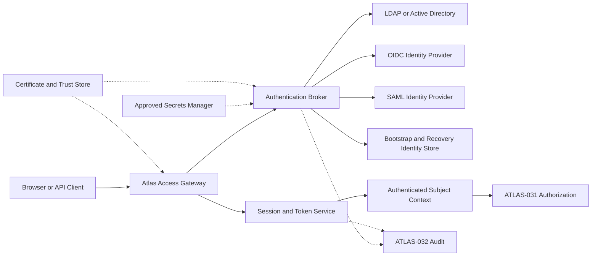
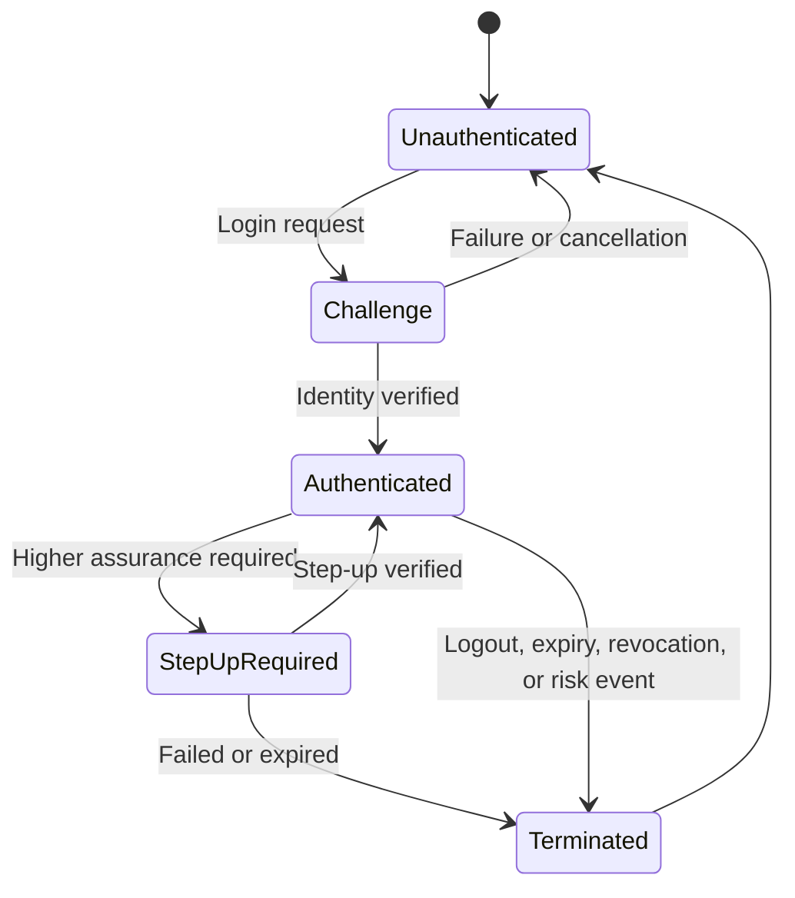

# Project Atlas

## Authentication

| Field | Value |
| --- | --- |
| Document ID | ATLAS-030 |
| Version | 2.0.0 |
| Status | Approved |
| Document Owner | Security Architecture Owner |
| Reviewers | Architecture Owner, Platform Engineering, Identity and Access Management, Operations, Audit and Compliance |
| Approver | Umit Ozdemir (acting Security Architecture Owner) |
| Approval Date | 2026-08-03 |
| Last Updated | 2026-08-13 |
| Related Documents | [ATLAS-003](003_Project_Principles.md), [ATLAS-013](013_Deployment_Architecture.md), [ATLAS-025](025_Policy_Engine.md), [ATLAS-031](031_RBAC.md), [ATLAS-032](032_Audit.md), [ATLAS-038](038_Deployment_and_Bootstrap.md) |
| Supersedes | ATLAS-030 version 0.1.0 |

## 1. Purpose

This document defines how Project Atlas establishes, verifies, maintains, and terminates identities and authenticated sessions for human users, platform services, and integrations.

Authentication proves identity. It does not grant permission to view data, invoke a connector, approve an action, or change infrastructure. Authorization, policy, and approval remain independent controls.

## 2. Scope

### In Scope

- Human authentication through enterprise directories and federation
- Secure local bootstrap and recovery identities
- Service, connector, and integration identities
- Session, token, credential, certificate, and trust lifecycle
- Authentication assurance, failure, audit, and recovery behavior
- Online, restricted-network, and offline deployment considerations

### Out of Scope

- Role and permission evaluation covered by ATLAS-031
- Action policy decisions covered by ATLAS-025
- Approval authority covered by ATLAS-037
- Vendor-specific identity-provider configuration guides
- Credential issuance or governance inside managed infrastructure systems

## 3. Objectives

- Integrate with enterprise identity systems without weakening their controls
- Keep credentials and authentication secrets outside application code and model context
- Provide secure, recoverable bootstrap without creating a permanent bypass
- Establish one traceable subject identity across UI, API, workflow, and connector activity
- Fail closed when identity or trust cannot be verified
- Support re-authentication (fresh credential verification) for sensitive administration and future controlled actions
- Make authentication health and failures observable without disclosing secrets

## 4. Identity Classes

| Identity class | Examples | Authentication method | Key constraint |
| --- | --- | --- | --- |
| Human enterprise identity | Engineer, approver, auditor | LDAP bind or federated SSO | Directory identity remains authoritative |
| Local recovery identity | Initial bootstrap administrator, emergency recovery administrator | Locally verified credential with strong controls | Restricted, time-bound where possible, highly audited |
| Platform workload identity | API, workflow, policy, scheduler service | Short-lived signed workload credential or mutual TLS | No shared human credential |
| Connector identity | Read-only vendor API account, certificate identity | Secret-manager reference, certificate, or delegated token | Scoped to declared connector capabilities and targets |
| External integration identity | ITSM, SIEM, Syslog management API | Mutual TLS, signed token, or managed service account | Independently revocable and purpose-bound |

Each authenticated subject receives a stable internal subject identifier. Display names, email addresses, directory paths, and group names are attributes and must not replace the stable identifier in durable records.

## 5. Authentication Architecture

The Authentication Broker normalizes validated identity claims. It does not translate a successful login directly into permissions.

## 6. Supported Authentication Modes

### 6.1 LDAP and Active Directory

The directory integration must support:

- Secure LDAP using TLS with certificate validation
- Configurable user and group search bases and safe filters
- Bind-account credentials referenced from an approved secrets manager
- Direct user bind or approved service-bind verification patterns
- Nested group handling with explicit depth and size limits
- Stable attribute mapping for subject ID, display name, and group identifiers
- Multiple directory endpoints with deterministic failover
- Connection, search, bind, and response timeouts
- Directory health validation without exposing credentials

Plain LDAP is prohibited outside an explicitly isolated development environment. Passwords received for authentication must not be stored, logged, placed in queues, or sent to an LLM.

### 6.2 Federated Single Sign-On

The authentication abstraction must support OpenID Connect as the preferred federation protocol and SAML 2.0 where required by enterprise deployments.

Federated integrations must validate issuer, audience, signature, lifetime, nonce or request correlation, redirect targets, and required claims. Signing keys and metadata must be refreshed safely. An unverified or ambiguous claim must not create an authenticated subject.

### 6.3 Local Authentication

Local authentication exists for initial bootstrap and controlled recovery. It is not the preferred routine enterprise login method.

- The initial administrator is created only through the bootstrap procedure in ATLAS-038.
- The bootstrap credential must be changed or replaced before normal use.
- Local password verifiers use an approved adaptive password-hashing algorithm with per-credential salt.
- Local accounts support lockout, rotation, disablement, and recovery procedures.
- Routine local access may be disabled after enterprise identity integration is verified.
- Disabling routine local access must preserve a separately governed recovery path.

## 7. Authentication Assurance

Authentication context includes method, provider, authentication time, assurance level, and applicable factors. Downstream policy can require a minimum assurance level.

Atlas authenticates human users through local bootstrap/recovery accounts and LDAP/Active Directory only (Section 6). Atlas does not require multi-factor authentication (`ADR-079`). Assurance relies on directory-verified or local credentials and session freshness. Atlas must be able to request or verify re-authentication (fresh credential entry, not a remembered session) for security administration, secret changes, emergency access, approval of high-risk operations, and other policy-defined events.

A remembered browser session alone must not satisfy a fresh-authentication requirement.

## 8. Session and Token Lifecycle

- Browser sessions use secure, HTTP-only, same-site cookies and CSRF protection.
- API access uses bounded tokens or client credentials appropriate to the client type.
- Access tokens are short-lived; renewal uses rotation and replay detection where supported.
- Session identifiers are unpredictable and are rotated after authentication or privilege context changes.
- Absolute and inactivity timeouts are configurable within platform-enforced limits.
- Logout revokes the active session and related renewable credentials.
- Identity disablement, group revocation, credential compromise, and administrator action can invalidate sessions.
- Concurrent-session limits and session inventory are policy-configurable.
- Tokens contain the minimum claims needed and never contain secrets or unrestricted permission snapshots.

Long-running workflows retain the initiating subject and authorization evidence, but they must re-evaluate authorization and approval at consequential boundaries. A workflow must not rely on an expired interactive session as continuing permission.

## 9. Service and Workload Authentication

- Every platform service has a distinct workload identity.
- Service-to-service calls are mutually authenticated using short-lived signed credentials or mutual TLS.
- Shared static API keys are not the default trust mechanism.
- Workload credentials identify service, instance, environment, and intended audience where feasible.
- Rotation must not require a platform-wide outage.
- A service cannot impersonate a human without an explicit, traceable delegation contract.
- Human and service identities are both retained in delegated audit events.

## 10. Connector and Integration Credentials

Connector credentials are referenced by opaque secret identifiers. The authentication layer and connector runtime must ensure:

- Credentials are encrypted in transit and at rest.
- Decrypted values exist only within the authorized runtime boundary and for the minimum time.
- Credential scope matches declared targets and capabilities.
- Read-only and write-capable credentials remain separate.
- Rotation, expiry, revocation, and validation are supported.
- Secret values never enter prompts, model context, reports, logs, audit fields, or support bundles.
- A credential validation test does not perform an infrastructure change.

## 11. Bootstrap and Recovery Access

Bootstrap creates the minimum identity required to configure enterprise authentication. The process must:

1. Verify deployment ownership through a local administrative channel.
2. Generate or accept the first credential without placing it in command history or logs.
3. Require immediate credential replacement on first interactive use.
4. Restrict the identity to identity and platform setup until normal roles are configured.
5. Record bootstrap completion in the audit trail.
6. Prompt the administrator to configure, test, and activate enterprise authentication.
7. Disable or seal unused bootstrap material.

Recovery or break-glass access requires documented justification, time-bound activation where supported, strong authentication, visible notification, and post-use review. It must not bypass audit, target policy, or connector controls.

## 12. Authentication State Transitions

No partial or timed-out authentication attempt becomes authenticated.

## 13. Failure and Outage Behavior

- Invalid credentials return a generic response that does not reveal account existence.
- Repeated failures are rate-limited and may trigger policy-defined lockout or security alerts.
- Directory or federation outages fail closed for new enterprise sessions.
- Existing sessions follow configured expiry and revocation policy; an outage does not extend them.
- Authentication caches must not allow stale groups or disabled identities beyond a bounded period.
- Recovery access is not activated automatically because an identity provider is unavailable.
- Certificate validation failure, clock uncertainty, token ambiguity, and unavailable audit controls block affected authentication.
- Health status distinguishes invalid configuration, provider outage, trust failure, and rejected credentials without exposing secrets.

## 14. Security Controls

- TLS is required for every credential-bearing network path.
- Trust anchors are explicitly configured and independently replaceable.
- Hostname, issuer, audience, signature, and certificate validity are verified.
- Login endpoints use rate limits and abuse detection.
- Authentication responses use secure cache controls and browser security headers.
- Credential reset and provider configuration changes require re-authentication and appropriate authorization.
- No default, shared, vendor-known, or hard-coded production credential is permitted.
- Authentication libraries and protocols must be maintained and tested against supported versions.

## 15. Privacy and Data Handling

Atlas stores only identity attributes required for authorization, display, audit, and support. Attribute purpose, source, refresh time, and retention are defined. Passwords and upstream authentication factors are never retained.

Authentication data is not used for model training. Identity attributes sent into AI context are minimized and pseudonymized where the user's name is not required for the task.

## 16. Audit Requirements

ATLAS-032 governs the canonical audit record. Authentication audit events include:

- Login success, failure category, logout, expiry, and revocation
- Provider configuration, validation, activation, and disablement
- Session creation, termination, and administrator revocation
- Local account creation, disablement, reset, and recovery use
- Step-up challenge and outcome
- Service credential issuance, rotation, rejection, and revocation
- Break-glass activation, use, expiry, and review
- Trust-store and signing-key changes

Audit events include the stable subject when known, provider, method, assurance level, session or credential identifier, source context, outcome, and correlation ID. They never include passwords, tokens, private keys, or full sensitive claims.

## 17. Observability

- Authentication success and failure rates by provider and method
- Provider latency, availability, and certificate expiry
- Session creation, revocation, and active-session trends
- Token validation and refresh failures
- Lockouts, rate limits, and suspected replay events
- Workload credential age and rotation health
- Break-glass readiness and activation status

Metrics and operational logs use aggregated or pseudonymous labels. High-cardinality identity values and secrets are excluded.

## 18. Administrative Experience

Administrators can:

- Configure a provider in a non-active state
- Validate network, trust, bind, discovery, and claim mapping separately
- Preview normalized identity and group mappings with sensitive values redacted
- Test with a named pilot account before activation
- Preserve a verified recovery path while changing providers
- View provider health, certificate status, and recent sanitized failures
- Roll back to the last valid provider configuration

An untested provider configuration must not replace the active configuration atomically without a recovery path.

## 19. Backup and Recovery

Backups include provider configuration, non-secret mapping rules, local credential verifiers, trust metadata, and session-revocation state according to recovery objectives. Secret material follows the approved secrets manager's backup policy.

Restore validation confirms that expired sessions remain expired, revoked credentials remain revoked, trust configuration is current, and bootstrap credentials are not unintentionally reactivated.

## 20. Testing Requirements

- LDAP and Active Directory success, failure, nested group, failover, and TLS validation
- OIDC and SAML signature, issuer, audience, lifetime, nonce, and claim validation
- Session fixation, CSRF, logout, expiry, revocation, replay, and concurrent-session behavior
- Provider outage, clock skew, certificate expiry, and stale-cache behavior
- Bootstrap, recovery, break-glass, and local-account disablement
- Service identity rotation and audience isolation
- Secret redaction across logs, audit, reports, support bundles, and AI context
- Authorization separation: successful authentication with no permissions remains denied

## 21. MVP Scope

### Included

- Secure local bootstrap and recovery identity
- One LDAP or Active Directory provider with secure transport and group retrieval
- Authentication broker and normalized subject context
- Secure browser sessions and API authentication foundation
- Distinct service identities and secret references
- Provider validation, health, audit, and recovery controls
- Protocol abstraction compatible with future OpenID Connect federation

### Excluded

- Multiple simultaneously active enterprise directories
- Full SAML implementation unless selected by ADR
- Passwordless authentication managed directly by Atlas
- Consumer social identity providers
- Autonomous account provisioning into source directories

## 22. Dependencies and Traceability

- ATLAS-003 defines identity, least-privilege, secret, and audit principles.
- ATLAS-013 defines trust boundaries and deployment identities.
- ATLAS-025 consumes authentication assurance in policy decisions.
- ATLAS-031 maps authenticated subjects and groups to permissions.
- ATLAS-032 defines durable authentication audit records.
- ATLAS-037 can require fresh or stronger authentication before approval.
- ATLAS-038 governs initial bootstrap and configuration validation.

## 23. Assumptions

- Enterprise customers operate an LDAP, Active Directory, OIDC, or SAML identity provider.
- Source identity systems remain authoritative for credential verification and lifecycle.
- Deployment environments provide an approved secrets-management and certificate-management capability.
- Customer session and assurance policies differ but cannot weaken platform security minimums.

## 24. Open Questions and ADR Backlog

### Resolved

- **Authentication factor requirement**: Atlas does not require multi-factor authentication. Human authentication relies on local bootstrap/recovery accounts and LDAP/Active Directory credentials only (Section 6, Section 21 MVP Scope). Step-up assurance for sensitive actions uses re-authentication (fresh credential verification), not an additional factor. Decided 2026-08-13 by the Product Owner (`Umit Ozdemir`); see `ADR-079`.

### Open

- Is LDAP/Active Directory or OpenID Connect the first production integration?
- Which adaptive password-hashing algorithm and parameters are the supported baseline?
- Which session timeouts and lockout defaults apply to MVP?
- Which workload identity mechanism is used in each deployment mode?
- Is SAML required in the first enterprise release?
- Which events require mandatory step-up (re-authentication) verification?

## 25. Acceptance Criteria

This document is ready to enter Review when:

- Human, local, service, connector, and integration identity boundaries are agreed.
- The first enterprise provider and protocol are selected or tracked by ADR.
- Session, token, bootstrap, recovery, and provider-outage behavior is testable.
- Successful authentication is explicitly separated from authorization and approval.
- Secrets cannot enter source code, logs, audit payloads, reports, or AI context.
- Security, IAM, platform, and operations reviewers accept the failure and recovery model.

## 26. Change History

| Version | Date | Author | Summary |
| --- | --- | --- | --- |
| 0.1.0 | 2026-07-21 | Project Atlas Team | Initial authentication goals and candidate capabilities |
| 0.2.0 | 2026-08-03 | Security Architecture Owner | Added identity classes, enterprise federation, session and workload identity, bootstrap, recovery, failure, audit, and testing contracts |
| 1.0.0 | 2026-08-03 | Umit Ozdemir | Approved as the first binding documentation baseline under the designated approver authority |
| 2.0.0 | 2026-08-13 | Umit Ozdemir | Removed the multi-factor authentication requirement; authentication is local bootstrap/recovery accounts and LDAP/Active Directory only, with re-authentication (not an additional factor) for step-up assurance (`ADR-079`) |
