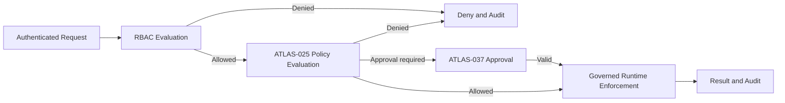

# Project Atlas

## Role-Based Access Control

| Field | Value |
| --- | --- |
| Document ID | ATLAS-031 |
| Version | 1.0.0 |
| Status | Approved |
| Document Owner | Security Architecture Owner |
| Reviewers | Architecture Owner, Identity and Access Management, Platform Engineering, Infrastructure Operations, Audit and Compliance |
| Approver | Umit Ozdemir (acting Security Architecture Owner) |
| Approval Date | 2026-08-03 |
| Last Updated | 2026-08-03 |
| Related Documents | [ATLAS-003](003_Project_Principles.md), [ATLAS-020](020_MCP_Framework.md), [ATLAS-025](025_Policy_Engine.md), [ATLAS-030](030_Authentication.md), [ATLAS-032](032_Audit.md), [ATLAS-037](037_Approval_Workflow.md) |
| Supersedes | ATLAS-031 version 0.1.0 |

## 1. Purpose

This document defines the Project Atlas role-based access-control model for users, groups, service identities, and delegated activity.

RBAC determines whether an authenticated subject may request an operation on a resource within a scope. A positive RBAC result is necessary but may not be sufficient: policy, capability class, environment state, approval, and connector controls can still deny the operation.

## 2. Scope

### In Scope

- Roles, permissions, resources, scopes, assignments, and constraints
- Enterprise group-to-role mapping
- Separation of duties and temporary elevation
- Human, service, connector, and delegated authorization contexts
- Authorization decision, enforcement, cache, audit, and testing requirements
- Baseline roles and MVP permission areas

### Out of Scope

- Identity verification covered by ATLAS-030
- Risk and action policy evaluation covered by ATLAS-025
- Human approval lifecycle covered by ATLAS-037
- Permissions enforced inside external vendor systems
- Customer-specific production role assignments

## 3. Objectives

- Deny access by default and grant the minimum required permission
- Separate platform administration, security, connector, knowledge, workflow, approval, and audit responsibilities
- Scope access by organization, environment, site, domain, resource, and capability
- Prevent UI, AI prompts, or connector naming from acting as authorization controls
- Make authorization decisions deterministic, explainable, and auditable
- Support enterprise group administration without silently expanding privilege
- Revoke access predictably and within a defined propagation window

## 4. Authorization Model

An authorization decision evaluates this tuple:

```text
subject + permission + resource + scope + context + constraints
```

| Element | Description |
| --- | --- |
| Subject | Stable human, service, connector, or delegated identity |
| Permission | One explicit action such as `connector.execute.read` or `audit.export` |
| Resource | The protected Atlas or managed-infrastructure object |
| Scope | Organizational and technical boundary within which the permission applies |
| Context | Environment, session assurance, request channel, workflow, and delegation metadata |
| Constraints | Conditions such as time window, capability class, ownership, or separation of duties |

No missing element is interpreted as unrestricted access. Wildcards require explicit administrative support, review, and visible expansion before assignment.

## 5. Decision Composition



An approval never supplies a missing RBAC permission. A workflow or AI agent cannot elevate the initiating subject.

## 6. Permission Naming and Semantics

Permissions use stable, versioned identifiers with a resource and action form:

```text
<resource-domain>.<action>[.<qualifier>]
```

Examples:

- `inventory.read`
- `connector.install`
- `connector.configure`
- `connector.execute.read`
- `connector.execute.diagnostic`
- `knowledge.publish`
- `workflow.design`
- `workflow.run`
- `policy.publish`
- `approval.decide`
- `audit.read`
- `audit.export`

Permissions are atomic. Broad labels such as `manage_all` must not conceal materially different risks. Read, create, modify, execute, approve, export, and delete remain separate where their consequences differ.

## 7. Protected Resource Domains

- Platform and deployment configuration
- Identity-provider and access configuration
- Users, groups, roles, assignments, and delegations
- Connectors, packages, credentials, targets, and capabilities
- Inventory, graph, health observations, and topology
- Knowledge sources, items, indexes, and exports
- AI conversations, investigations, evidence, and recommendations
- Workflows, schedules, runs, and operational plans
- Policies, exceptions, and simulations
- Approval requests and decisions
- Reports, dashboards, and subscriptions
- Audit records, security events, and support bundles
- ITSM, SIEM, Syslog, and other integration configurations

## 8. Scope Model

Scopes are hierarchical intersections, not informal tags.

| Scope dimension | Examples |
| --- | --- |
| Organization | Enterprise or tenant boundary |
| Environment | Development, lab, test, production |
| Site | Data center, region, campus, recovery site |
| Infrastructure domain | Storage, SAN, virtualization, operating system, backup |
| Vendor or product | Hitachi storage, VMware cluster, Brocade fabric |
| Resource set | Named systems, clusters, groups, services, or tags |
| Capability class | C0 through C5 from ATLAS-003 |

An assignment grants a role only within its declared scope. A subject with storage read access at Site A has no implied access at Site B, to virtualization resources, or to write-capable connector operations.

Scope inheritance must be explicit and inspectable. Adding a resource to a scoped group can expand access and is therefore audited.

## 9. Baseline Roles

| Role | Primary responsibility | Notable restrictions |
| --- | --- | --- |
| Platform Administrator | Platform configuration, deployment health, lifecycle | Cannot approve own sensitive action; audit content access is limited |
| Security Administrator | Identity providers, roles, security policy, trust | Cannot alter or delete audit history |
| Connector Administrator | Install, validate, configure, upgrade, disable connectors | No automatic right to execute capabilities or reveal secrets |
| Knowledge Manager | Administer sources and knowledge lifecycle | Cannot approve own generated operational procedure where separation is required |
| Workflow Designer | Create and test workflows | Cannot publish or execute consequential workflows by default |
| Infrastructure Architect | Analyze topology, impact, recommendations, and reports | No platform or credential administration by default |
| Infrastructure Engineer | Run authorized health and diagnostic capabilities in scope | Controlled-change permissions are separate |
| Operations Analyst | Review health, incidents, evidence, and recommendations | Read and bounded diagnostic access only by default |
| Approver | Decide eligible approval requests in assigned scope | Cannot request and approve the same sensitive action |
| Auditor | Read audit and compliance evidence | Read-only; no operational or configuration authority |
| Read-Only Viewer | View permitted inventory, reports, and recommendations | No exports of restricted data unless separately granted |

These are baseline composites. Customers may create constrained roles from approved permissions, but cannot weaken non-overridable separation, audit, or platform-deny rules.

## 10. Baseline Permission Matrix

Legend: `A` allowed by role subject to scope and policy, `-` not included, `S` separately assigned.

| Permission area | Platform Admin | Security Admin | Connector Admin | Knowledge Manager | Infra Engineer | Approver | Auditor | Viewer |
| --- | --- | --- | --- | --- | --- | --- | --- | --- |
| Platform configuration | A | S | - | - | - | - | - | - |
| Identity and role administration | S | A | - | - | - | - | - | - |
| Connector package lifecycle | S | S | A | - | - | - | - | - |
| Connector credential reference | S | S | A | - | - | - | - | - |
| C0/C1 capability execution | S | - | S | - | A | - | - | - |
| C2 diagnostic execution | - | - | S | - | S | - | - | - |
| C3-C5 execution | - | - | - | - | S | - | - | - |
| Knowledge administration | S | - | - | A | - | - | - | - |
| Workflow design | S | - | - | S | S | - | - | - |
| Policy publication | S | A | - | - | - | - | - | - |
| Approval decision | - | - | - | - | - | A | - | - |
| Audit read | S | S | - | - | - | - | A | - |
| Restricted export | S | S | - | S | S | - | A | - |
| General scoped read | A | A | A | A | A | A | A | A |

The matrix is a design baseline, not a production assignment. `S` permissions require explicit role composition and review. C3 through C5 remain subject to ATLAS-003, ATLAS-025, and ATLAS-037 even when a future execution role exists.

## 11. Role and Assignment Lifecycle

Role definitions and assignments follow:

1. Draft with owner, purpose, permissions, and scope constraints.
2. Automated validation for unknown permissions, unsafe wildcards, and conflicts.
3. Security and resource-owner review appropriate to risk.
4. Approval and versioned publication.
5. Assignment with reason, requester, effective time, and optional expiry.
6. Periodic certification by the accountable owner.
7. Revocation, expiry, supersession, or retirement.

Published role versions are immutable. Changes create a new version and show gained and lost permissions before activation.

## 12. Enterprise Group Mapping

- Directory groups map to published Atlas roles and explicit scopes.
- Mappings use stable directory identifiers, not display names alone.
- Nested membership behavior and maximum expansion are configured and tested.
- A preview shows effective users, roles, scopes, and conflicts before activation.
- Unknown, cyclic, oversized, or ambiguous group resolution fails closed.
- Group removal and disabled-user changes propagate within a defined maximum time.
- Manual grants and group-derived grants remain distinguishable.
- A mapping cannot assign a role outside the administrator's own delegation authority.

## 13. Separation of Duties

The following duties must be separable:

- Requesting and approving a sensitive action
- Authoring and publishing a high-impact policy
- Generating and approving an MCP package
- Configuring connector credentials and executing controlled changes
- Operating the platform and independently reviewing audit evidence
- Drafting generated knowledge and approving it as authoritative
- Creating an emergency grant and reviewing its use

Conflict rules are evaluated at assignment time and again at decision time because users, scopes, and workflow roles can change.

## 14. Temporary Elevation and Delegation

Temporary access requires:

- Named beneficiary and accountable grantor
- Business and technical justification
- Explicit permissions and narrow scope
- Start and expiry time
- Required authentication assurance
- Ticket, incident, or change reference where policy requires
- Conflict and separation-of-duties evaluation
- User notification and visible active-elevation state
- Complete audit and post-use review for privileged access

Elevation never creates C3-C5 autonomy. It expires automatically and cannot be silently renewed.

Delegated actions preserve the original human identity, delegating workflow or service identity, and final executing service identity.

## 15. Service and Agent Authorization

- Services receive purpose-specific roles and scopes.
- AI agents have no implicit permissions from their name or prompt.
- An agent's effective access is the intersection of its service role, the initiating user's delegated permissions, workflow constraints, policy, and connector capability controls.
- Scheduled workflows use a named owner and a dedicated service identity with explicit scope.
- Orphaned schedules are suspended when ownership cannot be re-established.
- Service identities cannot approve human approval requests.

## 16. Authorization Decision Contract

A decision returns:

- Decision ID and timestamp
- Allowed or denied outcome
- Stable subject and effective role-version references
- Requested permission, resource, and normalized scope
- Matched assignment and constraint references
- Denial reason code safe for the caller
- Policy and approval requirements still outstanding
- Decision expiry or cache-validity boundary
- Correlation and audit references

Internal policy details that would aid privilege probing are available only to authorized administrators and auditors.

## 17. Enforcement Points

Authorization is enforced at every protected backend boundary, including:

- API gateway or endpoint handler
- Service method handling protected resources
- Workflow transition and scheduled invocation
- Connector capability dispatch
- Knowledge retrieval and export
- Report generation and subscription delivery
- Administrative configuration changes
- Audit and security-data access

The UI may hide unavailable controls for usability but is never the enforcement point. Direct API calls and replayed workflow messages receive the same checks.

## 18. Caching and Revocation

- Cached decisions are bounded by role version, assignment version, scope version, identity freshness, and policy-relevant context.
- Privileged and consequential operations favor current evaluation.
- Role revocation, subject disablement, scope change, or emergency termination invalidates related cache entries.
- Cache unavailability must not convert a prior allow into an indefinite allow.
- Revocation propagation objectives are defined and monitored.

## 19. Denial and Failure Behavior

- Missing identity, permission, scope, role, target, or decision dependency results in denial.
- Authorization-service failure results in denial for protected operations.
- Partial group resolution does not grant partial privilege.
- Stale role or scope data beyond the allowed age results in denial or safe read-only degradation according to policy.
- Error responses distinguish unauthenticated from unauthorized without exposing hidden resources.
- A denied connector or workflow request is not sent to the target system.

## 20. Audit Requirements

ATLAS-032 governs storage and integrity. RBAC audit includes:

- Role and permission create, change, publish, retire, and delete attempts
- Assignment, mapping, delegation, elevation, expiry, and revocation
- Separation-of-duties conflict and exception decisions
- Privileged allow and all relevant deny decisions
- Scope membership and inheritance changes
- Authorization cache invalidation and policy failures
- Bulk access review and certification outcomes

Audit records reference immutable role, assignment, and scope versions sufficient to reproduce the effective decision.

## 21. Administrative and User Experience

Authorized administrators can preview effective access from three directions:

- What can this subject do, and where?
- Who can perform this action on this resource?
- Why was this request allowed or denied?

The interface shows direct, group-derived, delegated, temporary, and conflicting grants separately. Users can view their own effective access and pending expiry without seeing unauthorized resource names.

## 22. Access Reviews

- Privileged roles and temporary grants have defined certification intervals.
- Resource and role owners review active assignments and unused privilege.
- Reviewers can attest, narrow, revoke, or escalate an assignment.
- Failure to complete a required review can expire or suspend access according to policy.
- Review evidence is retained and exportable.

## 23. Security Considerations

- Permission identifiers and role definitions are versioned repository or governed data assets.
- Role import is schema-validated and cannot overwrite protected platform roles silently.
- Mass assignment, wildcard scope, and restricted export require elevated review.
- Enumeration controls prevent access checks from revealing hidden targets.
- Authorization input from connectors or AI output is treated as untrusted.
- A customer-configurable role cannot disable audit or bypass non-overridable platform controls.

## 24. Observability

- Authorization allow and deny rates by permission and service
- Decision latency, dependency failure, and cache behavior
- Privileged role and temporary-elevation counts
- Revocation propagation time
- Group synchronization and mapping errors
- Separation-of-duties conflict trends
- Unused, ownerless, expired, and review-overdue assignments

Metrics avoid raw user, group, and resource labels where they create privacy or cardinality risk.

## 25. Testing Requirements

- Default-deny and least-privilege behavior
- Role composition and atomic permission boundaries
- Organization, environment, site, domain, resource, and capability scopes
- Group mapping, nested groups, ambiguity, cycles, and revocation
- Separation-of-duties conflicts at assignment and decision time
- Temporary elevation, expiry, delegation, and orphan handling
- UI and direct API equivalence
- Workflow, service, AI-agent, and connector enforcement
- Cache invalidation and authorization-service failure
- Cross-organization and hidden-resource isolation
- Audit reproducibility of allowed and denied decisions

## 26. MVP Scope

### Included

- Stable permission registry
- Published baseline roles
- Organization, environment, site, domain, and named-resource scopes
- LDAP or Active Directory group mapping
- Backend authorization service and enforcement library
- Separation of requester and approver for sensitive actions
- Time-bound assignments
- Effective-access preview and core audit events

### Excluded

- Attribute-based policy as a replacement for RBAC
- Cross-customer role sharing
- Fully automated access certification
- User-created unrestricted wildcard permissions
- Autonomous privilege elevation

## 27. Dependencies and Traceability

- ATLAS-003 defines deny-by-default, least-privilege, and separation principles.
- ATLAS-020 defines connector capabilities and risk classes to authorize.
- ATLAS-025 evaluates additional runtime policy after RBAC.
- ATLAS-030 supplies authenticated subject and group context.
- ATLAS-032 preserves authorization decisions and administration history.
- ATLAS-037 validates approval without replacing RBAC.

## 28. Assumptions

- Enterprise directories provide stable identifiers for users and groups.
- Resource inventory and scopes can be normalized through Atlas domain services.
- Customers require different role assignments but share platform-enforced minimum constraints.
- Consequential operational execution remains limited or unavailable in early product phases.

## 29. Open Questions and ADR Backlog

- Which exact permissions compose each MVP role?
- Which scope dimensions are mandatory in the first release?
- What are the revocation propagation objectives for interactive and scheduled activity?
- Which role definitions are protected platform defaults versus customer-managed composites?
- Which privileged permissions require dual administration or fresh authentication?
- How are external ITSM approver groups mapped without creating parallel authority?

## 30. Acceptance Criteria

This document is ready to enter Review when:

- Permission, resource, scope, role, assignment, and constraint semantics are agreed.
- Baseline roles and MVP permission composition have accountable owners.
- Authentication, RBAC, policy, approval, and runtime enforcement boundaries are unambiguous.
- Group mapping, revocation, temporary access, and separation-of-duties behavior is testable.
- No UI, workflow, AI agent, or connector can bypass backend authorization.
- Security, IAM, operations, and audit reviewers accept the decision and evidence model.

## 31. Change History

| Version | Date | Author | Summary |
| --- | --- | --- | --- |
| 0.1.0 | 2026-07-21 | Project Atlas Team | Initial roles and permission areas |
| 0.2.0 | 2026-08-03 | Security Architecture Owner | Added scoped authorization model, baseline roles, permission matrix, group mapping, separation, delegation, enforcement, revocation, and testing contracts |
| 1.0.0 | 2026-08-03 | Umit Ozdemir | Approved as the first binding documentation baseline under the designated approver authority |
