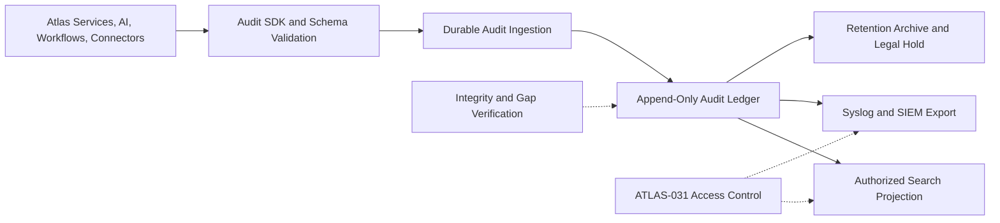

# Project Atlas

## Audit

| Field | Value |
| --- | --- |
| Document ID | ATLAS-032 |
| Version | 1.0.0 |
| Status | Approved |
| Document Owner | Audit and Compliance Owner |
| Reviewers | Security Architecture, Architecture Owner, Identity and Access Management, Platform Engineering, Operations, Legal and Privacy |
| Approver | Umit Ozdemir (acting Security Architecture Owner) |
| Approval Date | 2026-08-03 |
| Last Updated | 2026-08-03 |
| Related Documents | [ATLAS-003](003_Project_Principles.md), [ATLAS-016](016_Event_Architecture.md), [ATLAS-020](020_MCP_Framework.md), [ATLAS-030](030_Authentication.md), [ATLAS-031](031_RBAC.md), [ATLAS-033](033_Logging.md), [ATLAS-035](035_SIEM.md), [ATLAS-037](037_Approval_Workflow.md) |
| Supersedes | ATLAS-032 version 0.1.0 |

## 1. Purpose

This document defines the durable audit trail for Project Atlas. Audit records establish who or what performed an activity, under which authority, against which target, with what evidence and controls, and with what outcome.

Audit is a security and accountability control. It is distinct from operational logging, metrics, traces, conversation history, and model telemetry.

## 2. Scope

### In Scope

- Canonical audit-event schema and event taxonomy
- Human, service, AI-assisted, workflow, connector, policy, and approval activity
- Event generation, delivery, storage, integrity, access, retention, and export
- Redaction, privacy, legal hold, failure handling, and recovery
- Search, investigation, evidence packages, and compliance reporting

### Out of Scope

- General application diagnostics covered by ATLAS-033
- SIEM correlation rules covered by ATLAS-035
- Customer-specific legal retention periods
- Recording private model reasoning
- Replacing source-system or vendor audit records

## 3. Objectives

- Reconstruct consequential activity from user intent through final result
- Preserve immutable references to identities, roles, policies, approvals, evidence, plans, and targets
- Detect tampering, gaps, duplication, delay, and export failure
- Prevent credentials, tokens, private keys, or prohibited data from entering audit payloads
- Support authorized investigations without exposing unrelated sensitive content
- Remain available during failures of ordinary logging or downstream SIEM systems
- Prove that platform guardrails were evaluated and enforced

## 4. Audit Principles

- Audit cannot be disabled by a tenant, user, agent, workflow, connector, or feature flag.
- Every protected operation receives an audit decision before execution.
- Consequential operations fail closed when required audit durability cannot be established.
- Events are append-only; corrections create linked events rather than modifying history.
- Event producers use stable schemas and identifiers.
- Access to audit data is more restrictive than access to ordinary operational logs.
- Audit proves recorded behavior; it does not by itself prove that an external system reported truthfully.
- AI confidence, approval, or successful execution never permits omission of audit evidence.

## 5. Audit Architecture



The ledger is authoritative. Search indexes and SIEM copies are rebuildable projections and do not replace the original audit record.

## 6. Canonical Audit Event Envelope

Every event includes, where applicable:

| Field group | Required content |
| --- | --- |
| Identity | Event ID, event type, schema version, producer, producer version |
| Time | Producer time, accepted time, monotonic sequence or ordering metadata, clock-quality indicator |
| Correlation | Correlation, request, session, conversation, workflow-run, decision, approval, and parent-event IDs |
| Actor | Stable human subject, service identity, delegated identity chain, authentication method and assurance |
| Authority | Role and assignment versions, permission, scope, policy decision, exception, approval references |
| Action | Normalized operation, capability class, connector and capability version |
| Target | Stable Atlas resource and external target references, environment, site, domain |
| Input | Sanitized parameter names and bounded summaries, plan and evidence references |
| Outcome | Started, succeeded, denied, failed, timed out, cancelled, partial, unknown, or compensated |
| Result | Stable result code, sanitized summary, affected-object count, external record references |
| Integrity | Ledger sequence, previous-record reference or batch root, integrity status |
| Governance | Data classification, retention class, legal-hold status, redaction policy version |

Optional fields are omitted rather than populated with misleading values. Unknown outcome is distinct from failure and success.

## 7. Event Taxonomy

Stable event names use a versioned namespace such as:

```text
atlas.<domain>.<resource>.<action>.<outcome>
```

Core domains include:

- `identity`: login, logout, session, credential, provider, break-glass
- `authorization`: role, assignment, scope, allow, deny, elevation
- `platform`: configuration, secret reference, certificate, deployment, backup
- `connector`: package, configuration, credential binding, target, capability invocation
- `knowledge`: source, ingestion, classification, review, publish, export, deletion
- `ai`: request, evidence retrieval, recommendation, refusal, model and prompt version
- `workflow`: definition, schedule, transition, run, cancellation, compensation
- `decision`: finding, option, risk, impact, policy result
- `approval`: request, view, decision, expiry, revocation, emergency path
- `integration`: ITSM, Syslog, SIEM, notification, export
- `audit`: search, export, retention, legal hold, verification, administrative access

## 8. Mandatory Audited Activity

At minimum, Atlas audits:

- Authentication success and security-relevant failure
- Role, assignment, group mapping, scope, delegation, and elevation changes
- Privileged authorization allows and protected-operation denials
- Platform, identity-provider, trust, policy, and retention configuration changes
- Connector install, validate, enable, upgrade, disable, configure, and invoke
- Credential-reference create, bind, rotate, validate, and revoke operations
- Health checks, diagnostics, collections, and any C2-C5 capability attempt
- Knowledge source changes, sensitive retrieval, publication, export, and deletion
- AI investigation and recommendation generation with model, prompt, and evidence versions
- Workflow publication, schedule changes, run transitions, cancellation, and compensation
- Policy evaluation, exception, simulation, and publication
- Approval request, review, decision, expiry, cancellation, and revocation
- Report and restricted-data export
- Audit search, export, administrative access, integrity verification, retention, and legal hold
- Backup, restore, migration, and recovery of security-relevant state

Routine read events may be sampled in operational telemetry, but reads of restricted data, credentials metadata, audit data, hidden topology, or sensitive evidence are always audited.

## 9. End-to-End Activity Chain

A consequential recommendation or operation links:

1. User request and authenticated session
2. Authorized investigation scope
3. Evidence retrieval and live observations
4. AI model, prompt, agent, and tool versions
5. Decision output, assumptions, confidence, risk, and impact
6. Policy result and required controls
7. Approval packet version and human decision
8. Final precondition and authorization revalidation
9. Connector capability, target, and sanitized parameters
10. Outcome, partial state, verification, and recovery or compensation

The chain uses immutable references rather than copying unrestricted content into every event.

## 10. AI and Evidence Audit

Atlas records enough information to reproduce the governed context without exposing private model reasoning:

- Agent, model, model endpoint class, and version
- Prompt template and policy version
- User request reference and sanitized purpose
- Retrieved source, item, chunk, graph, and observation references
- Data freshness and access-decision references
- Output artifact and recommendation version
- Confidence representation, assumptions, alternatives, and refusal category
- Tool and connector calls proposed and actually dispatched
- Human corrections and feedback

Prompts or outputs containing sensitive content are stored only in appropriately classified evidence stores. The audit ledger retains references and bounded summaries.

## 11. Connector and Operational Audit

Connector events identify:

- Package publisher, package version, instance, and trust state
- Capability ID, contract version, and C0-C5 class
- Initiating user, delegated service, workflow, and final runtime identity
- Target identifiers and scope
- Sanitized parameters, idempotency key, timeout, and retry attempt
- Preflight, policy, approval, and execution-token references
- Start, response, external request ID, result, and verification state
- Partial effects, unknown outcomes, rollback, recovery, or compensation

Raw CLI output, API payloads, and collected logs remain governed evidence artifacts and are referenced rather than copied without bounds.

## 12. Integrity and Tamper Evidence

- The authoritative store is append-only to application identities.
- Administrative deletion or update interfaces are not exposed.
- Events receive ordered ledger metadata after durable acceptance.
- Hash chaining, signed batches, immutable storage, or equivalent controls provide tamper evidence.
- Integrity verification runs on schedule and on demand.
- Gaps, duplicate IDs, invalid signatures, sequence discontinuity, and unexpected clock behavior create security alerts.
- Integrity keys are separated from application signing and connector credentials.
- Search projections retain source-ledger references and can be rebuilt.

The selected mechanism, key custody, and verification frequency require a security ADR before production.

## 13. Delivery Guarantees

- Producers use a supported audit library or service contract.
- The ingestion service validates schema, size, classification, and producer identity.
- Event IDs and idempotent ingestion prevent duplicate logical records.
- Required pre-execution events are durably accepted before consequential dispatch.
- Completion events are retried until accepted or escalated.
- Producer buffers are bounded, encrypted where persisted, and observable.
- Ordering is guaranteed within a declared partition; cross-partition ordering uses timestamps and causality links.
- A timeout or uncertain external result remains `unknown` until verified.

## 14. Failure Behavior

| Failure | Required behavior |
| --- | --- |
| Audit ingestion unavailable | Block consequential administration and C2-C5 dispatch; preserve bounded C0/C1 behavior only if policy permits durable local buffering |
| Search projection unavailable | Preserve ledger ingestion; disable search and report degraded status |
| SIEM or Syslog unavailable | Queue according to policy; preserve authoritative ledger; alert on backlog |
| Producer emits invalid event | Reject protected operation or quarantine non-consequential telemetry; alert producer owner |
| Integrity verification fails | Restrict affected evidence, alert security, preserve records, begin incident procedure |
| Storage capacity threshold reached | Alert early, apply retention policy only through authorized lifecycle, block unsafe activity before loss |

Audit failure must never be hidden as an ordinary application warning.

## 15. Sensitive Data and Redaction

Audit events must not contain:

- Passwords, tokens, private keys, secret values, or recovery codes
- Complete connector credentials or authorization headers
- Unbounded command output, documents, prompts, or model responses
- Sensitive personal data without a defined audit purpose
- Customer payload data unrelated to the audited action

Redaction occurs before event acceptance using versioned rules. The presence of redaction is recorded. Hashing is not a substitute for removing low-entropy secrets. Redaction failures block affected protected events.

## 16. Access Control and Investigation

- Audit read and export are separate permissions.
- Investigators receive scope-limited access appropriate to case and purpose.
- Access to audit data is itself audited.
- Sensitive fields may require step-up authentication or dual authorization.
- Search prevents inference of hidden resources through counts, filters, or error messages.
- Case exports are immutable packages containing query criteria, record references, integrity evidence, exporter identity, and export time.
- Platform administrators do not automatically receive unrestricted audit-content access.

## 17. Retention, Archive, and Legal Hold

Events carry a retention class based on event type, environment, regulation, and customer policy. The platform enforces configured minimum and maximum bounds.

- Active search retention and long-term archive retention are separate.
- Retention policy changes are versioned, approved, and audited.
- Legal hold prevents eligible records and associated evidence from deletion.
- Hold creation, scope, owner, review, release, and export are audited.
- Expiry produces verifiable deletion or archival records.
- Derived indexes, caches, and exports follow the authoritative lifecycle where legally permitted.

## 18. Time, Ordering, and Clock Quality

- All timestamps use UTC with explicit precision.
- Services synchronize time through approved infrastructure.
- Producer and ledger-acceptance times are both retained.
- Clock offset beyond policy thresholds is visible and can block sensitive operations.
- Causal identifiers and ledger sequence are preferred over timestamp sorting alone.
- Daylight-saving and local display conversion never change stored time.

## 19. Export and Interoperability

- Syslog forwarding follows ATLAS-034.
- SIEM mappings follow ATLAS-035.
- Exports use stable schema versions and documented field mappings.
- Delivery status, acknowledgement where available, retry, backlog, and loss are monitored.
- Export filters cannot omit platform-mandatory security events when configured as a compliance destination.
- Downstream failure never causes deletion from the authoritative ledger.
- Restricted-network deployments support signed, encrypted, file-based export with chain-of-custody metadata.

## 20. Search and Reporting

Authorized users can search by time, actor, service, event type, action, target, capability class, workflow, decision, approval, outcome, and correlation ID.

Built-in reports include:

- Privileged access and authorization changes
- Connector and operational capability activity
- AI-assisted recommendation and evidence lineage
- Policy exceptions and approval decisions
- Break-glass and temporary-elevation use
- Audit integrity, delivery backlog, and administrative access
- Retention, legal hold, and export activity

Reports disclose query scope and generation time and are themselves governed artifacts.

## 21. Backup and Recovery

- The ledger, integrity metadata, schemas, retention rules, holds, and search configuration are protected by backup policy.
- Recovery preserves event order, identifiers, signatures, classification, retention, and holds.
- Restored projections are reconciled with the authoritative ledger.
- Recovery validation tests known events, denied access, integrity proofs, searches, and exports.
- Recovery operations and any unavoidable gap are separately audited.

## 22. Observability

- Accepted, rejected, duplicate, delayed, and oversized event counts
- Producer coverage and missing expected lifecycle events
- Ingestion and export latency
- Buffer, queue, archive, and SIEM backlog
- Integrity verification status and last successful check
- Storage capacity and retention forecast
- Search availability and authorization denials
- Clock drift and out-of-order events
- Redaction and schema-validation failures

## 23. Testing Requirements

- Required-event coverage for authentication, RBAC, AI, workflow, policy, approval, and connectors
- End-to-end reconstruction from request to result
- Schema compatibility and unknown-field behavior
- Duplicate, retry, reordering, delayed, partial, and unknown outcomes
- Ledger immutability and integrity verification
- Redaction and secret-injection tests across all producers
- Audit outage and storage-capacity failure behavior
- Access isolation, hidden-resource enumeration, and export controls
- Retention, archive, legal hold, deletion, backup, and restore
- Syslog and SIEM delivery failure without authoritative data loss

## 24. MVP Scope

### Included

- Canonical versioned event envelope and taxonomy
- Durable append-only ledger and authorized search projection
- Mandatory authentication, authorization, administration, AI, workflow, connector, policy, and approval events
- Correlation from user request through outcome
- Redaction, access control, retention classes, and export foundation
- Integrity verification baseline
- Syslog and SIEM export interfaces
- Health, capacity, backlog, and gap monitoring

### Excluded

- Customer-specific compliance certification
- Universal long-term archive provider support
- Automated legal interpretation of retention requirements
- Storage of private model reasoning
- Replacement of vendor or operating-system audit systems

## 25. Dependencies and Traceability

- ATLAS-003 requires durable, non-disableable auditability.
- ATLAS-016 supplies event-envelope and delivery patterns.
- ATLAS-020 defines connector capability audit context.
- ATLAS-030 and ATLAS-031 supply identity and authority context.
- ATLAS-033 separates operational logging from audit.
- ATLAS-034 and ATLAS-035 govern external security-event delivery.
- ATLAS-037 supplies approval evidence and binding.

## 26. Assumptions

- Customer retention and legal-hold requirements vary by jurisdiction and industry.
- Atlas can use storage that supports append-only or equivalent tamper-evident controls.
- External SIEM and Syslog systems are consumers, not the authoritative Atlas ledger.
- Source systems may provide their own audit identifiers for correlation.

## 27. Open Questions and ADR Backlog

- Which ledger and immutable-storage technologies are selected for each deployment mode?
- Which integrity mechanism and key-custody model are mandatory for MVP and production?
- What are the minimum searchable and archive retention bounds?
- Which C0/C1 operations may continue with encrypted local buffering during ingestion outage?
- Which audit fields require field-level encryption or dual authorization?
- What is the maximum tolerated export backlog before escalation?

## 28. Acceptance Criteria

This document is ready to enter Review when:

- The canonical event envelope and mandatory taxonomy are agreed.
- A consequential activity can be reconstructed from request through final state.
- Required audit failure blocks unsafe progress and cannot be bypassed.
- Integrity, redaction, access, retention, legal hold, export, and recovery controls are testable.
- Audit and operational logging responsibilities are clearly separated.
- Security, audit, privacy, platform, and operations reviewers accept the evidence model.

## 29. Change History

| Version | Date | Author | Summary |
| --- | --- | --- | --- |
| 0.1.0 | 2026-07-21 | Project Atlas Team | Initial audit goals, events, and fields |
| 0.2.0 | 2026-08-03 | Audit and Compliance Owner | Added canonical event model, end-to-end lineage, AI and connector evidence, integrity, failure, redaction, retention, export, recovery, and testing contracts |
| 1.0.0 | 2026-08-03 | Umit Ozdemir | Approved as the first binding documentation baseline under the designated approver authority |
