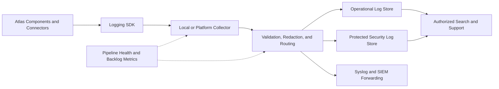

# Project Atlas

## Logging

| Field | Value |
| --- | --- |
| Document ID | ATLAS-033 |
| Version | 1.0.0 |
| Status | Approved |
| Document Owner | Platform Operations Owner |
| Reviewers | Architecture Owner, Security Architecture, Platform Engineering, Site Reliability Engineering, Audit and Compliance, Support Engineering |
| Approver | Umit Ozdemir (acting Architecture Owner) |
| Approval Date | 2026-08-03 |
| Last Updated | 2026-08-03 |
| Related Documents | [ATLAS-003](003_Project_Principles.md), [ATLAS-016](016_Event_Architecture.md), [ATLAS-032](032_Audit.md), [ATLAS-034](034_Syslog.md), [ATLAS-035](035_SIEM.md), [ATLAS-038](038_Deployment_and_Bootstrap.md) |
| Supersedes | ATLAS-033 version 0.1.0 |

## 1. Purpose

This document defines application, operational, security, connector, workflow, and AI-orchestration logging for Project Atlas.

Logs help operators understand platform behavior and diagnose failures. They are not the authoritative record of user authority or consequential activity; ATLAS-032 owns that audit trail.

## 2. Scope

### In Scope

- Structured log schema, categories, levels, correlation, and lifecycle
- Collection, buffering, routing, indexing, retention, and deletion
- Security and privacy controls for log content
- Component, connector, workflow, AI, and deployment logging
- Operator search, alerts, support bundles, and failure behavior

### Out of Scope

- Durable audit-ledger requirements covered by ATLAS-032
- Metrics and distributed-tracing implementation details
- Customer SIEM correlation content covered by ATLAS-035
- Vendor-system log ownership and retention
- Recording model private reasoning

## 3. Objectives

- Provide useful, consistent evidence for operating and supporting Atlas
- Correlate activity across UI, API, services, workflows, AI, connectors, and integrations
- Detect failures and degradation before users must infer them
- Prevent secrets and unnecessary sensitive content from entering logs
- Control cost and volume without sampling away security or failure signals
- Support online, restricted-network, and offline deployments
- Keep logging failure from silently obscuring critical platform state

## 4. Telemetry Separation

| Telemetry type | Primary purpose | Authoritative use | Default handling |
| --- | --- | --- | --- |
| Operational logs | Troubleshooting and support | Component behavior | Searchable with bounded retention |
| Security logs | Detection of suspicious or control-related behavior | Security operations signal | Routed to protected indexes and SIEM |
| Audit events | Accountability and reconstruction | Authoritative activity ledger | Governed by ATLAS-032 |
| Metrics | Trends, service health, capacity, objectives | Aggregated measurement | Time-series storage |
| Traces | Request path and latency | Distributed request diagnosis | Sampled according to policy |
| Evidence artifacts | Raw observations, command results, documents | Decision and investigation evidence | Governed object storage and access |

A single event may produce both a log and an audit event, but each uses its own schema, retention, and access policy. One must not be treated as a substitute for the other.

## 5. Logging Architecture



Applications write through a common logging contract. They do not implement vendor-specific forwarding independently.

## 6. Log Categories

- Application lifecycle and configuration
- API and request processing
- Authentication and authorization diagnostics
- Security-control and abuse signals
- Connector lifecycle, communication, parsing, and capability diagnostics
- Workflow scheduling, transition, retry, and compensation diagnostics
- AI orchestration, retrieval, tool routing, latency, and refusal diagnostics
- Knowledge ingestion and indexing diagnostics
- Event, queue, cache, database, and storage diagnostics
- Integration delivery and acknowledgement diagnostics
- Backup, restore, migration, bootstrap, and upgrade diagnostics
- Platform health, capacity, and dependency diagnostics

Category is independent of severity. A security event may be informational or critical.

## 7. Canonical Structured Log Record

Logs use a structured UTF-8 representation, with JSON as the default interchange format. Each record includes:

| Field group | Fields |
| --- | --- |
| Identity | Timestamp, level, event name, schema version, message |
| Source | Service, component, instance, version, environment, site |
| Correlation | Correlation ID, request ID, trace ID, span ID, session or workflow-run reference |
| Context | Operation, resource type, sanitized target reference, connector and capability identifiers |
| Outcome | Status, stable error code, retryability, duration, attempt |
| Security | Data classification, redaction status, security category where applicable |
| Runtime | Deployment, node, process, thread or task identifier where useful |

Human-readable messages supplement stable event names and fields. Automation must use the structured fields, not parse message text.

## 8. Event Naming and Schema

Event names use stable dotted identifiers such as:

```text
atlas.workflow.transition.failed
atlas.connector.request.timed_out
atlas.auth.provider.unavailable
```

- Existing event meaning is not changed silently.
- New optional fields are backward-compatible.
- Breaking schema changes require a version and migration period.
- Unknown fields are tolerated by collectors but preserved only within size and policy limits.
- Required-field failure is visible and does not silently create malformed records.
- Exception types and error codes are normalized across services.

## 9. Log Levels

| Level | Intended use |
| --- | --- |
| `TRACE` | Very detailed temporary diagnosis; disabled by default |
| `DEBUG` | Development and bounded troubleshooting detail |
| `INFO` | Normal lifecycle and meaningful state transition |
| `WARN` | Degraded, unexpected, or recoverable condition requiring attention |
| `ERROR` | Failed request, operation, or component function |
| `CRITICAL` | Control failure, data-loss risk, or broad service unavailability requiring immediate response |

Normal user input errors are not automatically `ERROR`. Security incidents are not hidden at `DEBUG`. Changing a component's level is authorized, time-bounded for verbose modes, and audited when it can expose more data or materially increase volume.

## 10. Correlation and Causality

- Every inbound request receives or is assigned a correlation ID.
- Correlation propagates through events, queues, workflows, AI tools, connectors, and integrations.
- Request and trace IDs identify a specific technical path; correlation ID identifies the broader activity.
- Workflow run, decision, approval, and audit references are included where applicable.
- Connector retries retain the activity correlation and add attempt identifiers.
- Scheduled work records the schedule and accountable owner.
- Cross-service messages preserve causality through parent-event or trace context.

Correlation identifiers contain no customer data or secrets.

## 11. Content Rules

Logs should answer what component did, what state it reached, how long it took, and how an operator can correlate it. Logs must not contain:

- Passwords, access tokens, private keys, secret values, or authorization headers
- Full connector commands when arguments may contain sensitive values
- Raw documents, prompts, model responses, retrieved chunks, or command output
- Unbounded request or response bodies
- Personal or infrastructure data not needed for operations
- Decrypted credentials or secret-manager responses
- Stack traces exposed directly to unprivileged users

Sensitive artifacts are stored in governed evidence stores and referenced by opaque identifiers.

## 12. Redaction and Data Minimization

- Redaction occurs as close to the producer as possible and again at centralized ingestion.
- Versioned rules cover known secret names, headers, URI parameters, structured fields, and vendor patterns.
- Allowlisted fields are preferred over blocklisting for request and response logging.
- Identity and target values are pseudonymized or tokenized when full values are unnecessary.
- Redaction failures create alerts and can quarantine affected records.
- Operators can see that content was removed and which policy version applied.
- Debug mode cannot disable mandatory redaction.

## 13. Component Logging Requirements

Every service logs:

- Startup, version, configuration source, readiness, and shutdown
- Dependency connection state and bounded retry behavior
- Request outcome, stable error code, and duration
- Queue or work-item transition and attempt
- Resource exhaustion, backpressure, and degraded mode
- Configuration reload and compatibility warning
- Unhandled exception with sanitized stack context
- Health-check failure and recovery

Successful high-volume requests may be summarized or sampled, but failures and material state transitions remain visible.

## 14. Connector Logging

Connector logs include package and instance version, target reference, capability, protocol operation, timeout, attempt, vendor request ID, parser result, and normalized failure category.

- Credentials and sensitive parameters are never logged.
- Raw vendor payloads are disabled by default and require controlled diagnostic capture.
- C3-C5 activity uses audit and governed evidence in addition to operational logs.
- A target timeout is not logged as success.
- Partial and ambiguous results are explicit.
- Connector-specific event names map to common failure categories while preserving a safe vendor code.

## 15. Workflow and Scheduler Logging

- Definition and run version
- Trigger and schedule reference
- Current state, transition, and reason
- Step start, completion, retry, timeout, cancellation, and compensation
- Input and output artifact references
- Waiting condition such as approval, dependency, or maintenance window
- Owner and delegated service identity reference
- Orphaned, stuck, and overdue run detection

Logs must not imply a workflow completed when a final verification or connector result is unknown.

## 16. AI and RAG Logging

AI operational logs include:

- Agent, orchestrator, model endpoint, and safe model-version reference
- Request class, token or context-size metrics, latency, timeout, and retry
- Retrieval count, source-class distribution, reranking stage, and empty-result signal
- Tool selection and outcome references without hidden arguments
- Guardrail, policy, citation, grounding, and structured-output validation outcomes
- Refusal, fallback, degraded mode, and human-review routing
- Cost or resource usage where applicable

Private model reasoning is neither requested nor logged. Full prompts, retrieved content, and outputs are governed artifacts only when retention is explicitly required.

## 17. Security Logging

Security logs provide operational detection signals for:

- Authentication abuse, lockout, replay, and provider trust failure
- Authorization probing and repeated denial
- Secret access anomaly and credential-validation failure
- Extension integrity or signature failure
- Prompt injection, malicious document, unsafe tool request, and guardrail rejection
- Audit pipeline failure or integrity alert
- Unexpected cross-scope access attempt
- Excessive export, search, or administrative activity
- Certificate expiry and untrusted communication

Security logs are protected, routed predictably, and linked to authoritative audit events when an accountable action exists.

## 18. Collection and Buffering

- Services write to a local collector or supported standard output contract.
- Collectors validate, enrich, redact, batch, compress, and route records.
- Local persistent buffers are encrypted, bounded, and use defined eviction rules.
- Security and error records receive higher delivery priority than verbose diagnostics.
- Backpressure is visible and cannot consume unbounded application resources.
- Duplicate delivery is tolerated through event identity where needed.
- Collector failure does not block ordinary read requests unless a related mandatory audit control also fails.

## 19. Routing and Storage

Routing uses category, severity, environment, classification, and customer policy.

- Operational and security logs can use separate indexes and access controls.
- Development, test, and production data remain separated.
- High-cardinality fields are controlled and not automatically indexed.
- Raw log access and derived dashboards have independent permissions.
- Cross-organization aggregation uses anonymized metrics unless explicitly authorized.
- External forwarding follows ATLAS-034 and ATLAS-035.

## 20. Sampling and Rate Control

- Audit events are never sampled by the logging pipeline.
- Authentication failures, authorization denials, security-control failures, C2-C5 activity failures, and critical errors are not probabilistically sampled.
- Repetitive success events may use deterministic sampling or aggregation.
- Rate limiting preserves first occurrence, count, time range, and representative context.
- Sampling and suppression policy is versioned, observable, and reversible for bounded diagnostics.
- A suppression summary is emitted so absence is not mistaken for absence of activity.

## 21. Retention and Deletion

Retention is based on category, environment, classification, support need, legal requirement, and storage capacity.

- Debug and trace data have short bounded retention.
- Security logs may require longer protected retention.
- Audit retention remains independently governed by ATLAS-032.
- Retention changes are approved and audited.
- Deletion propagates to indexes, caches, and temporary buffers according to policy.
- Legal hold applies only when formally mapped to relevant log artifacts.

## 22. Search and Operational Experience

Authorized operators can search by time, service, version, environment, level, event name, error code, correlation, trace, workflow, connector, capability, and safe target reference.

Default views emphasize:

- Current platform health and critical failures
- Recent deployment, upgrade, and configuration changes
- Failed and slow dependencies
- Connector and workflow errors
- Authentication and authorization degradation
- AI, RAG, and model-endpoint health
- Logging pipeline lag, loss risk, and storage forecast

## 23. Support Bundles

Support bundles are generated through an authorized, audited workflow and include only selected time ranges and components.

- Secrets and prohibited fields are redacted before packaging.
- Audit data is excluded unless separately authorized.
- Customer topology, documents, prompts, and raw connector results are opt-in and clearly listed.
- The bundle has a manifest, checksums, creation identity, expiry, and classification.
- Preview shows included categories and size before export.
- Offline transfer supports encryption and chain-of-custody metadata.

## 24. Failure Behavior

- Collector or store outage produces visible health degradation and bounded local buffering.
- Buffer saturation drops lowest-priority eligible records first and emits loss counters and alerts.
- Security-log delivery failure escalates separately from ordinary diagnostic loss.
- Invalid schema records are quarantined with safe producer diagnostics.
- Logging recursion and repeated exception storms are rate controlled.
- Logging failure never changes an unknown operation result to success.
- Mandatory audit failure follows ATLAS-032, not the more permissive log behavior.

## 25. Observability of Logging

- Records produced, accepted, rejected, sampled, suppressed, dropped, and forwarded
- Ingestion and indexing latency
- Buffer, queue, and storage utilization
- Parse, schema, redaction, and routing failures
- Search availability and query latency
- Per-component log silence and unexpected volume changes
- Retention and deletion backlog
- External destination health and delivery lag

## 26. Testing Requirements

- Required fields, event naming, level use, and schema compatibility
- Correlation across API, service, workflow, AI, connector, and integration paths
- Secret and sensitive-data injection with verified redaction
- Sampling, suppression, rate control, and storm behavior
- Collector, network, store, index, and destination failure
- Buffer bounds, priority, recovery, duplicate, and order behavior
- Scope isolation and protected security-log access
- Retention, deletion, support-bundle preview, and offline export
- Verification that audit events remain independent and unsampled

## 27. MVP Scope

### Included

- Common structured JSON schema and logging SDK contract
- Application, security, connector, workflow, AI, and platform categories
- Correlation propagation
- Central collection, redaction, routing, and searchable operational storage
- Configurable levels with safe defaults
- Bounded buffering and pipeline-health monitoring
- Basic support bundle with manifest and redaction
- Syslog and SIEM forwarding interface

### Excluded

- Unlimited raw payload capture
- Customer-specific dashboard library for every vendor
- Permanent debug logging
- Full observability-platform replacement
- Storage of private model reasoning

## 28. Dependencies and Traceability

- ATLAS-003 requires self-observability and secret protection.
- ATLAS-016 supplies event and correlation conventions.
- ATLAS-032 owns authoritative audit records.
- ATLAS-034 defines Syslog transport and mapping.
- ATLAS-035 defines SIEM normalization and security use cases.
- ATLAS-038 defines bootstrap, deployment, and support diagnostics.

## 29. Assumptions

- Deployment modes provide a supported local or external log-storage capability.
- Customer retention and data-classification rules vary.
- Components can adopt a shared logging library or compatible schema.
- Restricted environments may require local-only storage and controlled file export.

## 30. Open Questions and ADR Backlog

- Which collector and operational log store are selected for MVP?
- What are default retention periods by category and environment?
- Which fields are indexed by default without creating cardinality risk?
- What maximum local buffer and loss policy applies by deployment mode?
- Which support-bundle categories require explicit customer consent?
- Which OpenTelemetry conventions are adopted for logs and correlation?

## 31. Acceptance Criteria

This document is ready to enter Review when:

- Log categories, schema, levels, correlation, and content rules are agreed.
- Audit, logs, metrics, traces, and evidence artifacts have distinct ownership.
- Secret redaction and sensitive-data minimization are testable across all components.
- Sampling cannot remove mandatory security, failure, or audit signals.
- Pipeline failure, buffering, loss, retention, and support export behavior is explicit.
- Platform, security, operations, support, and audit reviewers accept the model.

## 32. Change History

| Version | Date | Author | Summary |
| --- | --- | --- | --- |
| 0.1.0 | 2026-07-21 | Project Atlas Team | Initial log types and required fields |
| 0.2.0 | 2026-08-03 | Platform Operations Owner | Added telemetry separation, structured schema, component contracts, AI and connector logging, redaction, routing, sampling, retention, support bundles, and testing |
| 1.0.0 | 2026-08-03 | Umit Ozdemir | Approved as the first binding documentation baseline under the designated approver authority |
