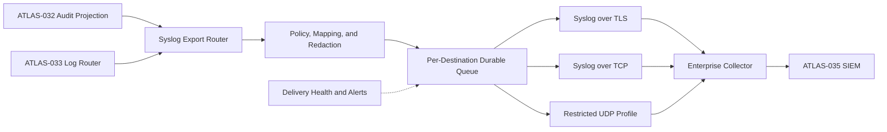

# Project Atlas

## Syslog

| Field | Value |
| --- | --- |
| Document ID | ATLAS-034 |
| Version | 1.0.0 |
| Status | Approved |
| Document Owner | Platform Operations Owner |
| Reviewers | Security Architecture, Architecture Owner, Network Engineering, Site Reliability Engineering, Audit and Compliance, SIEM Operations |
| Approver | Umit Ozdemir (acting Security Architecture Owner) |
| Approval Date | 2026-08-03 |
| Last Updated | 2026-08-03 |
| Related Documents | [ATLAS-003](003_Project_Principles.md), [ATLAS-016](016_Event_Architecture.md), [ATLAS-032](032_Audit.md), [ATLAS-033](033_Logging.md), [ATLAS-035](035_SIEM.md), [ATLAS-038](038_Deployment_and_Bootstrap.md) |
| Supersedes | ATLAS-034 version 0.1.0 |

## 1. Purpose

This document defines reliable and secure Syslog forwarding from Project Atlas to enterprise collectors, security platforms, and operational logging systems.

Syslog is an export channel. It does not replace the authoritative Atlas audit ledger or the source operational log stores.

## 2. Scope

### In Scope

- Destination configuration and validation
- RFC-compatible message formatting and field mapping
- TLS, TCP, and constrained UDP transport profiles
- Certificate, queue, retry, filtering, rate, and failure behavior
- Audit, security, operational, and health event forwarding
- Restricted-network validation and operations

### Out of Scope

- SIEM-specific normalization and correlation covered by ATLAS-035
- Authoritative audit retention covered by ATLAS-032
- General log production covered by ATLAS-033
- Administration of customer Syslog servers
- Guaranteed downstream parsing after a collector accepts a message

## 3. Objectives

- Deliver selected Atlas events through common enterprise Syslog patterns
- Protect message confidentiality, integrity, and destination authenticity
- Preserve stable event identity, time, correlation, classification, and outcome
- Detect delay, loss risk, rejection, certificate failure, and mapping error
- Keep local authoritative records when a destination is unavailable
- Support controlled filtering without hiding mandatory security events
- Make setup testable before production activation

## 4. Architecture

Each destination has independent configuration, queue state, health, and delivery policy so one failing destination does not block others.

## 5. Standards Profile

- RFC 5424 message format is the default Atlas Syslog representation.
- Syslog over TLS follows RFC 5425-compatible behavior.
- Octet-counted framing is preferred for stream transports.
- UTF-8 is used for message content with valid escaping and length limits.
- Legacy RFC 3164-style output is an explicitly enabled compatibility profile.
- Vendor-specific formats are versioned mappings, not changes to the canonical event schema.

The implementation must document deviations required by supported collectors.

## 6. Transport Profiles

| Profile | Security and reliability | Intended use | Default status |
| --- | --- | --- | --- |
| TLS | Encrypted, server-authenticated, reliable stream; optional mutual authentication | Production audit, security, and operational forwarding | Required default |
| TCP | Reliable stream without transport confidentiality | Trusted isolated network only when an approved secure tunnel or equivalent control exists | Disabled by default |
| UDP | Unencrypted, unauthenticated, no delivery acknowledgement | Legacy low-consequence operational compatibility only | Disabled by default and prohibited as sole audit path |

UDP must not be represented as guaranteed delivery. Mandatory audit export over UDP requires an independent reliable destination or controlled file-export process.

## 7. Destination Configuration

Each destination defines:

- Stable destination ID, name, owner, purpose, and environment
- Hostnames or addresses and ports
- Transport and framing profile
- Trust anchors, expected server identity, and optional client certificate
- Facility and severity mapping
- Event categories, classification limits, and filter policy
- Queue size, retry, retention, and overflow behavior
- Message-size and throughput limits
- Maintenance windows and health-alert recipients
- Mandatory or optional compliance-destination status
- Last validation time and active configuration version

Credentials and private keys are secret-manager references, never embedded values.

## 8. Message Contract

The Syslog header carries:

- Priority derived from configured facility and severity
- Protocol version
- UTC timestamp
- Source hostname or approved logical host identifier
- Application name `atlas` or stable component name
- Process or instance identifier where useful
- Stable message ID derived from event type

Structured data carries bounded fields such as:

- Event ID and schema version
- Correlation, request, trace, workflow, decision, and approval references
- Atlas component, version, environment, and site
- Actor and service references where classification permits
- Action, resource type, sanitized target, and capability class
- Outcome, stable result code, duration, and attempt
- Audit ledger reference and integrity status when applicable
- Classification and redaction status

The free-form message is a concise human summary and is not the machine-authoritative field source.

## 9. Facility and Severity Mapping

- Facility is configured by event category or destination profile.
- Security and audit events use a dedicated local facility where supported.
- Severity maps from event consequence, not merely application log level.
- Authentication denial is not automatically critical; audit integrity failure may be critical.
- Mapping tables are versioned, reviewable, and previewed before activation.
- Unmapped event types use a safe documented default and create an administration warning.

Example baseline:

| Atlas condition | Syslog severity |
| --- | --- |
| Normal lifecycle or successful governed action | Informational |
| Degraded dependency or retrying delivery | Warning |
| Failed protected request or unavailable component | Error |
| Security-control, audit-integrity, or broad availability failure | Critical or Alert according to policy |

## 10. Event Selection and Filtering

Filters can select by category, event type, severity, environment, component, capability class, outcome, and data classification.

- Filter order and default behavior are explicit.
- A preview estimates matched event types and volume.
- Deny and include rules are versioned and audited.
- Mandatory security and audit categories cannot be excluded from a destination marked as a compliance destination.
- Filters never expose hidden event fields to administrators lacking source-data permission.
- Sampling rules from ATLAS-033 are distinguished from destination filtering.
- Filter changes do not delete already queued events unless an authorized purge policy explicitly applies.

## 11. Redaction and Data Protection

- Only allowlisted structured fields are exported.
- Secret, credential, token, private-key, raw prompt, document, and command-output content is prohibited.
- Sensitive identity and target values are pseudonymized or omitted according to destination authorization.
- Message truncation preserves event ID, correlation, outcome, and truncation indicator.
- Redaction policy version is included where supported.
- Data classification is checked before enqueue and again before transmission.
- A destination cannot receive a higher classification than its approved profile permits.

## 12. TLS and Certificate Management

- Server certificate chain, validity, hostname, and permitted algorithms are verified.
- Trust anchors are explicit and cannot silently fall back to the host's unrestricted trust store.
- Mutual TLS is supported for collectors requiring client authentication.
- Private keys remain in an approved secret or key-management boundary.
- Certificate rotation supports overlapping trust and connection re-establishment without message loss.
- Expiry is monitored with configurable warning thresholds.
- Revoked, expired, mismatched, or untrusted certificates stop transmission to the affected destination.
- Temporary insecure bypass is not available as an ordinary troubleshooting option.

## 13. Queueing and Delivery

- Every reliable destination has an independent durable queue.
- Enqueue occurs only after schema, classification, redaction, and mapping validation.
- Events retain stable IDs across retries.
- Retry uses bounded exponential backoff with jitter.
- Connection recovery resumes from queued data without reordering guarantees beyond the documented partition.
- Duplicate delivery is possible and downstream systems use event IDs for deduplication.
- Queue records are encrypted where persisted and deleted after confirmed handoff according to transport semantics.
- TCP acceptance proves transport handoff, not SIEM ingestion or correlation.

## 14. Ordering, Duplication, and Time

- Per-destination sequence metadata is added where supported.
- Original event time and export time are both preserved.
- Syslog transport may reorder after reconnect or across multiple connections; consumers use causality and event IDs.
- Retries may duplicate records.
- Delayed events retain their original severity and timestamp plus delay metadata.
- Clock-quality warnings from ATLAS-032 are forwarded for affected audit events.

## 15. Rate and Size Controls

- Per-destination throughput and burst limits protect Atlas and the collector.
- Mandatory security and audit events receive priority over verbose operational records.
- Oversized events are mapped to bounded summaries with governed artifact references.
- Rate limiting produces interval summaries with suppressed counts.
- Critical event storms trigger alerts and aggregation where permitted but do not become silent.
- Queue forecasts account for expected rate, outage duration, and message size.

## 16. Validation and Activation

Configuration follows:

1. Save a non-active destination version.
2. Validate syntax, DNS, route, and port reachability.
3. Validate TLS trust, hostname, certificate, and optional client identity.
4. Send a uniquely identified test event from each selected category.
5. Confirm collector receipt manually or through an approved acknowledgement integration.
6. Preview field mapping, redaction, facility, severity, and filters.
7. Estimate event rate and queue capacity.
8. Activate through an authorized and audited change.

A successful socket connection alone is not a successful end-to-end validation.

## 17. Failure Behavior

| Failure | Behavior |
| --- | --- |
| DNS, route, connection, or collector outage | Queue and retry; alert on duration and backlog thresholds |
| TLS trust or identity failure | Stop transmission, retain queue, raise security alert; no downgrade |
| Mapping or redaction failure | Quarantine affected record, alert, preserve authoritative source |
| Queue approaching capacity | Escalate, prioritize mandatory categories, forecast exhaustion |
| Queue exhausted | Preserve authoritative audit ledger; apply documented operational-log overflow policy; record loss risk |
| Destination rejects or closes connection | Retry according to category; expose rejection and last success |
| UDP send failure | Report local error when detectable; never claim end-to-end delivery |

Destination failure never causes Atlas to delete or modify authoritative audit records.

## 18. High Availability

- A destination may define multiple collector endpoints with ordered or load-balanced behavior.
- Failover retains the same logical destination and event identity.
- Certificate identity is validated independently for every endpoint.
- Split delivery and duplicates are expected and documented.
- Queue ownership and failover prevent simultaneous uncontrolled replay.
- Recovery testing includes endpoint loss, collector maintenance, and Atlas node failover.

## 19. Administration and Access

- Viewing, creating, testing, activating, disabling, and deleting destination configurations are separate permissions where appropriate.
- Secret values are never displayed after entry.
- Configuration diff shows transport, trust, filters, mappings, queue, and classification changes.
- Disabling a mandatory destination requires elevated authorization, reason, and visible warning.
- Queue purge and replay are privileged, audited operations.
- Operators can inspect health and bounded sample mappings without reading unauthorized source content.

## 20. Audit Requirements

ATLAS-032 records:

- Destination create, edit, test, activate, disable, and retire
- Certificate, trust, transport, filter, mapping, and queue-policy changes
- Validation result and activating identity
- Delivery outage, backlog threshold, overflow, purge, and replay
- Security downgrade attempt and certificate failure
- Export event ranges and destination references

Syslog delivery of an audit event does not replace these local audit records.

## 21. Observability

- Destination availability and last successful connection
- Events queued, sent, retried, rejected, quarantined, and dropped where eligible
- Oldest queue age, bytes, and capacity forecast
- Delivery and reconnect latency
- TLS expiry, handshake, and trust failures
- Event counts by category, severity, and mapping version
- Oversized, truncated, redacted, and unmapped events
- Test-event result and last end-to-end validation

## 22. Restricted-Network Operation

- Destinations can use approved internal DNS, proxy-independent direct routes, and private trust anchors.
- Offline deployments may export signed and encrypted event packages for controlled transfer.
- Package manifests include source range, event count, schema versions, checksums, classification, and chain-of-custody fields.
- Import acknowledgement can be recorded separately without pretending real-time delivery.
- Dependency and certificate material follows ATLAS-038 bootstrap controls.

## 23. Testing Requirements

- RFC 5424 field, escaping, timestamp, framing, and size behavior
- TLS server and mutual authentication, rotation, expiry, revocation, and hostname failure
- TCP reconnect, partial write, duplicate, ordering, retry, and queue recovery
- UDP loss representation and prohibition as sole audit path
- Facility, severity, category, filter, and legacy-format mapping
- Redaction, classification, truncation, and malicious-field handling
- Queue saturation, priority, purge, replay, and Atlas node failover
- Multiple destination isolation and collector failover
- End-to-end test event and SIEM parsing validation

## 24. MVP Scope

### Included

- RFC 5424-compatible structured messages
- Syslog over TLS with server authentication
- One or more independently configured destinations
- Per-destination filters, mappings, durable queues, retry, and health
- Audit, security, and selected operational categories
- Configuration preview and end-to-end test event
- Certificate-expiry monitoring and safe failure

### Excluded

- UDP as a production compliance transport
- Vendor-specific proprietary message formats beyond approved mappings
- Guaranteed SIEM interpretation after transport acceptance
- Unlimited destination count or queue retention
- Automatic insecure downgrade

## 25. Dependencies and Traceability

- ATLAS-003 defines security, audit, and restricted-environment principles.
- ATLAS-016 supplies event identity and delivery conventions.
- ATLAS-032 remains the authoritative audit source.
- ATLAS-033 supplies structured operational and security logs.
- ATLAS-035 defines SIEM normalization and detection use cases.
- ATLAS-038 governs certificates, configuration, and restricted-network bootstrap.

## 26. Assumptions

- Enterprise collectors can accept RFC 5424 over TLS or an approved compatibility profile.
- Atlas retains authoritative source data independently of forwarding.
- Customer network, certificate, facility, and retention requirements vary.
- Downstream systems can preserve the stable Atlas event ID.

## 27. Open Questions and ADR Backlog

- Is mutual TLS required or optional for the first production profile?
- Which facilities and severity mapping form the default baseline?
- What queue duration and capacity are required per deployment size?
- Which legacy collectors require RFC 3164 compatibility?
- How is downstream receipt verified for the first supported SIEM?
- Which event categories are mandatory for a compliance destination?

## 28. Acceptance Criteria

This document is ready to enter Review when:

- The standards, transport, certificate, message, and mapping profiles are agreed.
- TLS is the production default and insecure downgrade is prohibited.
- Reliable queues, duplicate handling, failure, overflow, and recovery behavior are testable.
- Mandatory audit and security exports cannot be silently filtered or lost.
- Destination validation proves more than socket reachability.
- Security, networking, operations, audit, and SIEM reviewers accept the contract.

## 29. Change History

| Version | Date | Author | Summary |
| --- | --- | --- | --- |
| 0.1.0 | 2026-07-21 | Project Atlas Team | Initial Syslog goals and candidate capabilities |
| 0.2.0 | 2026-08-03 | Platform Operations Owner | Added standards profile, secure transports, structured mapping, durable delivery, filtering, certificate lifecycle, failure, restricted-network operation, and testing |
| 1.0.0 | 2026-08-03 | Umit Ozdemir | Approved as the first binding documentation baseline under the designated approver authority |
