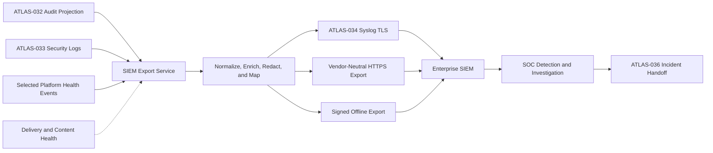

# Project Atlas

## SIEM Integration

| Field | Value |
| --- | --- |
| Document ID | ATLAS-035 |
| Version | 1.0.0 |
| Status | Approved |
| Document Owner | Security Operations Integration Owner |
| Reviewers | Security Architecture, Architecture Owner, Audit and Compliance, Platform Operations, Site Reliability Engineering, Privacy and Data Governance |
| Approver | Umit Ozdemir (acting Security Architecture Owner) |
| Approval Date | 2026-08-03 |
| Last Updated | 2026-08-03 |
| Related Documents | [ATLAS-003](003_Project_Principles.md), [ATLAS-016](016_Event_Architecture.md), [ATLAS-032](032_Audit.md), [ATLAS-033](033_Logging.md), [ATLAS-034](034_Syslog.md), [ATLAS-036](036_ITSM_Integration.md), [ATLAS-047](047_Guardrails.md) |
| Supersedes | ATLAS-035 version 0.1.0 |

## 1. Purpose

This document defines how Project Atlas exports normalized security, audit, and selected operational events to enterprise Security Information and Event Management platforms.

SIEM integration enables detection, correlation, investigation, and compliance monitoring. The SIEM copy is not the authoritative Atlas audit ledger and does not grant control over Atlas operations.

## 2. Scope

### In Scope

- Integration patterns and destination lifecycle
- Canonical-to-SIEM field mapping and normalization
- Security event categories, severities, and detection use cases
- Enrichment, data minimization, delivery, acknowledgement, and health
- Investigation links, incident handoff, testing, and content lifecycle
- Online, restricted-network, and offline export patterns

### Out of Scope

- Authoritative audit storage covered by ATLAS-032
- Syslog transport details covered by ATLAS-034
- Customer SOC operating procedures
- Autonomous remediation initiated by SIEM alerts
- Universal support for proprietary SIEM query languages

## 3. Objectives

- Make Atlas security posture and consequential activity visible to enterprise SOC teams
- Preserve stable event identity and end-to-end correlation
- Normalize Atlas concepts without losing capability, policy, AI, and approval context
- Provide high-signal detection content with documented assumptions
- Minimize sensitive infrastructure, identity, knowledge, and model data
- Detect export gaps, parser failures, mapping drift, and destination backlog
- Support incident and compliance workflows without creating a parallel source of truth

## 4. Integration Architecture

Vendor-specific adapters consume one normalized Atlas security-event contract. They do not change source audit records.

## 5. Integration Patterns

| Pattern | Intended use | Delivery evidence |
| --- | --- | --- |
| Syslog over TLS | Broad enterprise compatibility and near-real-time events | Transport handoff and destination health |
| HTTPS batch or streaming API | Rich structured fields and destination acknowledgement | Request, response, batch, and checkpoint status |
| Signed encrypted file export | Offline or controlled-transfer environments | Manifest, checksums, chain of custody, and import acknowledgement |
| Future vendor adapter | Product-specific API, schema, or content deployment | Adapter-specific receipt and compatibility status |

Syslog is the MVP baseline unless an ADR selects an API integration for the first target platform.

## 6. Source Event Categories

- Authentication, session, credential, and break-glass activity
- Authorization, role, assignment, scope, elevation, and denial activity
- Platform, trust, certificate, secret-reference, and security configuration changes
- Connector package, credential binding, target, and capability activity
- C2-C5 diagnostic or operational attempts and outcomes
- Policy evaluation, exception, simulation, and publication
- Approval request, decision, expiry, revocation, and separation conflict
- AI guardrail, prompt-injection, unsafe-tool, evidence, and recommendation events
- Knowledge-source trust, malicious-content, restricted retrieval, and export events
- Audit integrity, delivery gap, retention, legal hold, and administrative access
- Workflow, integration, backup, restore, and deployment security events
- Critical platform health and control-plane degradation

## 7. Normalized Security Event Contract

Every exported event includes the fields permitted for the destination:

| Group | Normalized fields |
| --- | --- |
| Event identity | Atlas event ID, event type, schema version, source category |
| Time | Original UTC time, Atlas acceptance time, export time, clock-quality status |
| Source | Atlas service, version, environment, deployment, site |
| Actor | Stable subject or pseudonymous reference, service identity, delegation chain, assurance |
| Authority | Permission, role-version reference, scope, policy and approval references |
| Activity | Action, resource type, capability, C0-C5 class, target reference |
| Outcome | Status, reason category, error code, retryability, duration, partial or unknown state |
| Correlation | Correlation, request, trace, session, workflow, decision, approval, incident references |
| Security | Atlas severity, confidence where relevant, classification, control and detection tags |
| Evidence | Audit-ledger reference and authorized Atlas investigation link or opaque artifact reference |

The contract uses stable enumerations. Free-form messages supplement but do not replace structured fields.

## 8. Severity Model

Atlas exports both event severity and detection significance because they are not identical.

| Severity | Meaning |
| --- | --- |
| Informational | Expected security-relevant or administrative activity |
| Low | Minor anomaly or policy-relevant observation |
| Medium | Suspicious behavior or degraded control requiring triage |
| High | Likely misuse, repeated control failure, or consequential unauthorized attempt |
| Critical | Active compromise indicator, audit-integrity failure, broad security-control outage, or unsafe action with material impact |

Severity includes a reason and source policy version. AI confidence is never mapped directly to security severity.

## 9. Classification and Mapping

- Atlas categories map to a documented vendor-neutral taxonomy first.
- Vendor-specific schemas map from that normalized representation.
- Original Atlas event type and event ID are always retained.
- Mapping versions are immutable and included with exported events or batches.
- Unmapped fields and enumerations generate compatibility warnings.
- Mapping changes are previewed against representative fixtures before activation.
- A mapping cannot lower classification, hide an unknown outcome, or convert denial to success.
- Optional industry mappings such as MITRE ATT&CK are labels for analyst context, not proof of a confirmed technique.

## 10. Data Minimization and Redaction

- Destinations receive only fields required for approved security use cases.
- Passwords, tokens, private keys, credential values, raw prompts, documents, and command output are prohibited.
- User, host, target, and service identifiers can be pseudonymized by destination policy.
- Evidence content remains in Atlas; the SIEM receives references or bounded summaries.
- Hidden topology and restricted knowledge are not revealed through event text, counts, or links.
- Destination classification is checked before export.
- Redaction policy and result are recorded.
- Customer data is not used to enrich events through an external service without explicit authorization.

## 11. Enrichment

Permitted enrichment may include:

- Atlas environment, site, infrastructure domain, and service criticality
- Capability class and realistic action risk
- Policy, approval, workflow, connector, and package trust status
- Known target ownership and business-service reference
- Authentication assurance and temporary-elevation status
- Source-data freshness and graph impact summary
- Related Atlas incident or ITSM reference

Enrichment is time-stamped and source-referenced. Stale, unavailable, or ambiguous enrichment is omitted or labeled; it does not overwrite the original event.

## 12. Baseline Detection Use Cases

### SIEM-UC-001: Repeated Authentication Failure

Detect repeated failures by subject reference, source, provider, or deployment, considering rate limits and provider outage signals.

### SIEM-UC-002: Privileged Access Change

Alert on privileged role assignment, wildcard scope, temporary elevation, extension, or emergency access, especially outside expected change windows.

### SIEM-UC-003: Separation-of-Duties Conflict

Detect a subject requesting and approving the same sensitive action, or authoring and publishing a protected policy or connector artifact contrary to policy.

### SIEM-UC-004: Unsafe Connector Activity

Alert on denied, out-of-scope, unsigned, untrusted, or C3-C5 capability attempts, repeated parameter-validation failures, and ambiguous operational outcomes.

### SIEM-UC-005: Audit Pipeline or Integrity Failure

Alert on ingestion outage, missing lifecycle events, invalid signature or chain, capacity risk, unauthorized audit access, or export backlog.

### SIEM-UC-006: AI Guardrail or Prompt-Injection Signal

Detect repeated unsafe-tool requests, malicious-document findings, instruction hierarchy violations, secret-seeking prompts, or disabled grounding controls.

### SIEM-UC-007: Sensitive Data Export

Alert on unusual audit, knowledge, report, support-bundle, or topology exports by actor, scope, volume, destination, or time.

### SIEM-UC-008: Security Configuration Change

Alert on identity provider, trust anchor, policy minimum, redaction, retention, Syslog, SIEM, or guardrail changes.

### SIEM-UC-009: Credential or Certificate Risk

Detect failed secret access, unexpected connector credential validation, certificate expiry, trust failure, or repeated service authentication rejection.

### SIEM-UC-010: Control-Plane Degradation

Correlate authentication, authorization, policy, approval, audit, connector isolation, and model-guardrail health failures that reduce safe operation.

## 13. Detection Content Contract

Each detection package defines:

- Stable detection ID and version
- Purpose, threat or compliance hypothesis, and limitations
- Required Atlas event types and fields
- Query or correlation logic for supported platforms
- Time window, thresholds, grouping, and suppression behavior
- Expected false positives and tuning guidance
- Severity and escalation recommendation
- Investigation steps and Atlas evidence links
- Test fixtures for positive, negative, duplicate, delayed, and missing-field cases
- Owner, review interval, supported schema versions, and change history

Generated detection logic is untrusted until reviewed and tested.

## 14. Delivery and Checkpointing

- Every destination maintains an independent checkpoint and backlog.
- API integrations use idempotent batches and destination acknowledgements where available.
- Syslog behavior follows ATLAS-034 and preserves Atlas event IDs for deduplication.
- File exports include sequence range, count, checksums, mapping versions, classification, and custody metadata.
- Retry uses bounded backoff and does not reorder within documented partitions where avoidable.
- Duplicate events are expected; SIEM content deduplicates on Atlas event ID.
- Gaps and delayed events remain visible and trigger destination-health alerts.

## 15. Health and Reconciliation

Atlas monitors:

- Last successful export and acknowledgement
- Oldest unsent event and backlog size
- Rejected, malformed, unmapped, and quarantined events
- Mapping and source schema compatibility
- Destination rate limits and authentication status
- Test-event receipt and parser outcome
- Count reconciliation by event range or time bucket
- Detection-content deployment and supported-version status

Where a destination supports search APIs, Atlas may perform bounded reconciliation. Lack of such access is documented and does not imply confirmed ingestion.

## 16. Failure Behavior

- Destination outage retains events according to the authoritative source and export queue policies.
- Authentication or TLS failure stops transmission; no insecure downgrade occurs.
- Mapping or redaction failure quarantines affected exports and alerts owners.
- Unknown schema versions are not silently coerced.
- Backlog approaching limits escalates before loss risk.
- SIEM outage never blocks Atlas audit ingestion.
- SIEM alerts cannot directly invoke Atlas infrastructure actions.
- Failed incident handoff preserves the detection and retryable integration state.

## 17. Investigation Experience

SIEM events include an authorized deep link or reference to the Atlas investigation view when deployment boundaries permit. The view can show:

- Original normalized event and audit reference
- Related activity in the correlation chain
- Actor, authority, policy, approval, connector, and workflow context
- Evidence and target context permitted to the investigator
- Data freshness, ambiguity, and integrity state
- Related SIEM alert and ITSM incident references

Atlas re-authorizes every view; possession of a SIEM link is not access.

## 18. ITSM Handoff

ATLAS-036 governs ticket operations. SIEM-originated incident handoff includes:

- Detection ID and version
- Alert and event references
- Severity, confidence, and triage status
- Affected Atlas deployment, services, and targets where authorized
- Investigation summary and evidence links
- Ownership and synchronization state

AI-generated summaries are labeled. Ticket creation or updates do not authorize operational action.

## 19. Content and Integration Lifecycle

1. Register destination owner, purpose, classification, and supported schema.
2. Configure a non-active transport and mapping version.
3. Validate trust, connectivity, authentication, and permissions.
4. Replay representative synthetic fixtures.
5. Verify parsing, fields, timestamps, severity, and correlation.
6. Deploy baseline detections in test mode.
7. Tune with documented rationale and approve production activation.
8. Monitor drift, health, false positives, and schema compatibility.
9. Upgrade, roll back, suspend, or retire with audit history.

## 20. Access and Administration

- Destination configuration, secret binding, mapping publication, detection deployment, export replay, and health viewing use separate permissions as appropriate.
- Security administrators and SIEM owners jointly review material field or classification changes.
- Secret values are never displayed.
- Export replay is bounded by event range, destination, and authorization.
- Disabling mandatory security categories or a compliance destination requires elevated authorization and visible warning.
- All administration and restricted investigation access is audited.

## 21. Metrics and Service Objectives

- Source-to-export and source-to-acknowledgement latency
- Delivery success, retry, rejection, duplicate, and quarantine rates
- Backlog age and capacity forecast
- Mapping coverage and parse success
- Test-event success and last validation age
- Detection events, triage outcomes, and false-positive feedback
- Destination authentication and certificate health
- Event-range reconciliation gap

Service objectives are defined per destination criticality and deployment mode.

## 22. Restricted-Network and Offline Operation

- Internal SIEM destinations use private trust and approved routes.
- Fully disconnected deployments support signed, encrypted file packages.
- Transfer packages contain no external callbacks or active content.
- Import and acknowledgement records can be returned through a controlled channel.
- Detection packages and mappings can be distributed as signed offline artifacts.
- Version and compatibility checks occur before offline installation.

## 23. Testing Requirements

- Canonical schema, vendor mapping, unknown-field, and version compatibility
- Severity, classification, redaction, and pseudonymization
- Each baseline detection with positive, negative, duplicate, delayed, and missing-data fixtures
- Syslog, API, and offline delivery patterns selected for support
- Destination outage, rejection, throttling, backlog, replay, and reconciliation
- Cross-organization and restricted-field isolation
- Investigation-link reauthorization
- Detection-package signing, installation, rollback, and drift
- Verification that SIEM alerts cannot authorize or invoke infrastructure changes

## 24. MVP Scope

### Included

- Vendor-neutral normalized security event contract
- Syslog-over-TLS integration through ATLAS-034
- One validated SIEM mapping and deployment guide
- Baseline detections SIEM-UC-001 through SIEM-UC-010 as portable specifications
- Delivery health, backlog, mapping version, and test-event validation
- Authorized Atlas investigation references
- Restricted-network export foundation

### Excluded

- Turnkey rules for every SIEM vendor
- Automatic customer-specific tuning
- Autonomous remediation or containment
- Full threat-intelligence platform integration
- Claim that an optional taxonomy label proves malicious behavior

## 25. Dependencies and Traceability

- ATLAS-003 establishes human control, audit, and data-boundary principles.
- ATLAS-016 provides event identity and compatibility rules.
- ATLAS-032 is the authoritative audit source.
- ATLAS-033 supplies security and operational logs.
- ATLAS-034 provides the baseline transport profile.
- ATLAS-036 handles governed incident handoff.
- ATLAS-047 defines AI guardrail and prompt-injection signals.

## 26. Assumptions

- Enterprise customers operate a SIEM capable of structured event ingestion.
- Customer schemas, detections, retention, and SOC processes vary.
- Atlas remains responsible for source-event correctness and export health, not downstream response execution.
- Destination permissions permit only the fields approved for security operations.

## 27. Open Questions and ADR Backlog

- Which SIEM platform is the first validated target?
- Is Syslog or an acknowledged API the first production integration?
- Which vendor-neutral taxonomy and field conventions are adopted?
- Which baseline detections are release-blocking for MVP?
- What acknowledgement and reconciliation depth is available for the selected SIEM?
- Which identity and target fields are pseudonymized by default?

## 28. Acceptance Criteria

This document is ready to enter Review when:

- Source categories, normalized fields, severity, and classification behavior are agreed.
- The first SIEM target and transport are selected or tracked by ADR.
- Baseline detections have owners, assumptions, investigation steps, and test fixtures.
- Delivery gaps, mapping drift, parser rejection, and backlog are observable.
- Sensitive data is minimized and Atlas re-authorizes investigation access.
- SIEM alerts cannot become operational authorization.
- Security, SOC, audit, privacy, and platform reviewers accept the integration contract.

## 29. Change History

| Version | Date | Author | Summary |
| --- | --- | --- | --- |
| 0.1.0 | 2026-07-21 | Project Atlas Team | Initial SIEM goals, patterns, and event types |
| 0.2.0 | 2026-08-03 | Security Operations Integration Owner | Added normalized event model, baseline detections, mapping lifecycle, enrichment, delivery health, investigation, ITSM handoff, offline operation, and testing |
| 1.0.0 | 2026-08-03 | Umit Ozdemir | Approved as the first binding documentation baseline under the designated approver authority |
