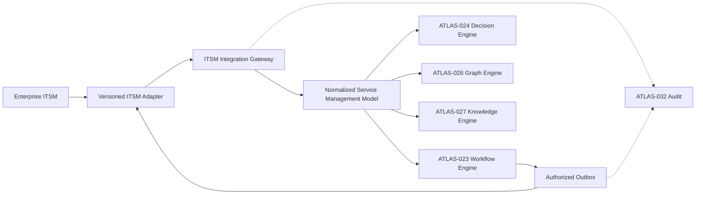
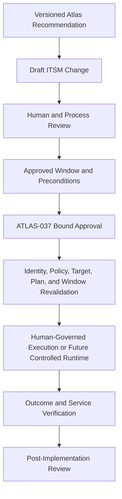

# Project Atlas

## ITSM Integration

| Field | Value |
| --- | --- |
| Document ID | ATLAS-036 |
| Version | 1.0.0 |
| Status | Approved |
| Document Owner | Enterprise Integration Owner |
| Reviewers | Architecture Owner, IT Service Management Owner, Security Architecture, Infrastructure Operations, Data Governance, Audit and Compliance |
| Approver | Umit Ozdemir (acting Architecture Owner) |
| Approval Date | 2026-08-03 |
| Last Updated | 2026-08-03 |
| Related Documents | [ATLAS-003](003_Project_Principles.md), [ATLAS-016](016_Event_Architecture.md), [ATLAS-024](024_Decision_Engine.md), [ATLAS-026](026_Graph_Engine.md), [ATLAS-027](027_Knowledge_Engine.md), [ATLAS-032](032_Audit.md), [ATLAS-035](035_SIEM.md), [ATLAS-037](037_Approval_Workflow.md) |
| Supersedes | ATLAS-036 version 0.1.0 |

## 1. Purpose

This document defines governed integration between Project Atlas and enterprise IT Service Management platforms for incidents, problems, changes, tasks, approvals, configuration items, and supporting evidence.

ITSM systems remain authoritative for their process records. Atlas analyzes infrastructure and prepares evidence or recommendations; it does not reinterpret a ticket state as unrestricted permission to change infrastructure.

## 2. Scope

### In Scope

- ITSM object mapping and source-of-truth boundaries
- Inbound retrieval and event synchronization
- Outbound create, update, comment, attachment, and link operations
- Incident, problem, change, task, approval, and CMDB integration
- Identity, access, audit, privacy, idempotency, conflict, and failure behavior
- Online, restricted-network, and offline integration patterns

### Out of Scope

- Replacing an enterprise ITSM platform
- Defining customer incident or change-management policy
- Autonomous change implementation based on ticket state
- Universal field mapping for every ITSM vendor
- Making the ITSM CMDB the only Atlas topology source

## 3. Objectives

- Connect Atlas findings and recommendations to established service-management processes
- Preserve provenance between Atlas artifacts and ITSM records
- Avoid duplicate tickets and update loops
- Respect record ownership, permissions, classification, and change windows
- Label AI-generated content and keep humans accountable for submitted records
- Synchronize state predictably without silent overwrite
- Support post-incident and post-change learning with verified outcomes

## 4. Integration Architecture

Adapters isolate vendor APIs and terminology. Core Atlas services consume normalized, versioned contracts.

## 5. Source-of-Truth Boundaries

| Data | Authoritative source | Atlas responsibility |
| --- | --- | --- |
| Ticket number, lifecycle, assignment, priority, and SLA | ITSM | Cache bounded snapshots and references |
| Change window and ITSM approval state | ITSM | Validate current state before use and preserve evidence |
| Atlas investigation, recommendation, risk, and impact | Atlas | Publish labeled summaries or references |
| Atlas workflow and connector execution state | Atlas | Update ITSM with bounded status when authorized |
| Configuration-item governance | Customer-selected CMDB or source system | Normalize and reconcile with Atlas observations |
| Infrastructure observations and topology | Atlas connectors and graph | Correlate with CMDB without silent overwrite |
| Human approval inside Atlas | Atlas | Link to ITSM approval; never fabricate equivalence |

Disagreement is represented explicitly. Neither side silently overwrites the other merely because it synchronized later.

## 6. Normalized ITSM Object Model

### 6.1 Common Record Fields

- Stable Atlas integration reference
- External system, instance, record type, record ID, and display number
- Title, sanitized summary, state, priority, impact, urgency, and severity
- Assignment group, owner, requester, and approver references
- Service, configuration-item, environment, site, and organizational scope
- Created, updated, resolved, closed, planned-start, planned-end, and window times
- Classification, access policy, and retention reference
- External version, update token, or equivalent concurrency field
- Last synchronization time and status

### 6.2 Incident

- Detection source and first observation
- Symptoms, affected services, and current impact
- Evidence and investigation references
- Probable causes and confidence
- Workaround, remediation recommendation, and current status
- Resolution, confirmed cause, and validation outcome

### 6.3 Problem

- Related incidents and trend evidence
- Known error and confirmed root cause
- Permanent fix recommendation
- Risk, priority, owner, and review status
- Linked changes and verification outcomes

### 6.4 Change

- Change type, risk, impact, affected services, and target scope
- Proposed plan and immutable Atlas recommendation version
- Preconditions, expected duration, interruption, validation, and rollback
- Planned window and freeze constraints
- ITSM approval state and approver references
- Implementation, recovery, actual impact, and review outcome

### 6.5 Task and Approval

- Parent record and ordered purpose
- Assigned group or subject
- Required evidence and completion criteria
- State, due time, completion record, and comments
- Approval question, eligible approver scope, decision, reason, and time

### 6.6 Configuration Item

- External CI identifier, class, name, owner, lifecycle, and criticality
- Environment, site, service, and support group
- Mapped Atlas entity and confidence
- Source and last observation times
- Conflict, stale, unmatched, and review state

## 7. Supported Integration Operations

### Inbound

- Retrieve a record by ID or authorized query
- Read record state, assignment, window, approval, and related objects
- Receive webhook or poll for relevant changes
- Retrieve incident, problem, and change history for authorized analysis
- Retrieve CMDB configuration items and relationships
- Validate that a referenced record is current and accessible

### Outbound

- Create a draft or submitted incident where policy permits
- Add a labeled Atlas analysis note
- Link immutable recommendation, impact, and evidence artifacts
- Create or update an implementation task
- Attach a bounded report or controlled evidence package
- Record workflow, validation, rollback, or recovery outcome
- Update an integration-owned field or state transition explicitly permitted by mapping

Every outbound operation is a governed connector capability with an assigned ATLAS-003 capability class.

## 8. Identity and Authorization

- ITSM service accounts are distinct per environment and purpose where feasible.
- Credentials are stored through approved secret references.
- Atlas permissions control who may read, create, update, attach, link, or synchronize each record type.
- External record permissions are enforced by the ITSM account and not assumed from Atlas access.
- User-delegated calls retain both human and service identities when supported.
- Assignment group or ITSM approver membership does not automatically create an Atlas role.
- Atlas approver eligibility and ITSM approval authority are mapped through explicit policy.
- Restricted ticket existence, identifiers, titles, comments, and counts must not leak through search or errors.

## 9. AI-Generated Content

AI may draft ticket summaries, timelines, evidence descriptions, probable causes, impact statements, and proposed plans.

- Generated content is visibly and programmatically labeled.
- The Atlas artifact version, model or agent reference, evidence references, and generation time are retained.
- Facts, inferences, assumptions, unknowns, and recommendations remain distinguishable.
- Human-authored ITSM content is not silently rewritten.
- Consequential external submission requires the role and review defined by policy.
- Sensitive content is minimized before transfer.
- AI cannot close an incident, approve a change, or claim successful remediation without authoritative evidence.

## 10. Incident Workflow

1. Atlas detects or receives an incident context.
2. The workflow searches for an existing linked or deduplication-matched record.
3. Atlas retrieves current record state and authorized context.
4. Decision services produce a versioned analysis and evidence package.
5. A human or policy-authorized workflow reviews the proposed outbound update.
6. The integration creates or updates the record idempotently.
7. Atlas stores the external ID, version, and synchronization result.
8. Later observations update a new note or integration-owned field without erasing history.
9. Resolution and confirmed cause are imported for governed learning after closure.

Ticket creation does not imply Atlas may act on infrastructure.

## 11. Change Workflow

An ITSM state such as `Approved` is one required fact, not an execution token. Atlas verifies exact plan version, target, parameters, time window, approver eligibility, policy, and current risk before any future controlled action.

## 12. Approval Synchronization

- External and Atlas approval records retain their own identifiers and authority.
- Mappings declare whether ITSM approval is required, informative, or unsupported for a given action class.
- Atlas accepts external approval only through a validated integration, current record version, eligible approver, and exact plan binding.
- Comment text, email content, webhook source alone, or a generic ticket state cannot be treated as approval.
- Revocation, expiry, rejection, plan change, window change, or approver-scope change invalidates dependent execution readiness.
- Conflicts route to human review and stop consequential progress.

ATLAS-037 remains authoritative for the Atlas approval contract.

## 13. CMDB and Graph Reconciliation

- ITSM CI classes map to Atlas entity and relationship types through versioned rules.
- External CI IDs and Atlas entity IDs remain distinct and cross-referenced.
- Discovery observations do not silently modify the CMDB.
- CMDB values do not silently override current live observations.
- Conflicts identify field, source, observation time, authority, and confidence.
- Unmatched, duplicate, stale, or ambiguous CI mappings enter a review queue.
- Business-service and ownership relationships can enrich ATLAS-026 impact analysis.
- Write-back, if enabled later, is a separately authorized connector capability.

## 14. Synchronization and Change Detection

Supported modes include webhook, incremental polling, and bounded on-demand refresh.

- Webhooks are authenticated, validated, replay-protected, and idempotent.
- Polling uses stable cursors, update timestamps, or vendor change tokens.
- Full scans are bounded and scheduled to avoid source-system overload.
- Sync records retain source version, mapping version, and last successful checkpoint.
- Deletion or loss of access is represented explicitly rather than interpreted as record closure.
- Clock skew and out-of-order updates are handled using source versioning where available.

## 15. Idempotency and Duplicate Prevention

- Outbound creates use a stable Atlas idempotency key where the vendor supports it.
- Otherwise, Atlas stores a creation intent before dispatch and reconciles ambiguous outcomes.
- External record links include a stable Atlas artifact or workflow reference.
- Retries never blindly create a second ticket after timeout.
- Deduplication rules consider environment, target, symptom, source event, and time window and expose their reasoning.
- A suspected duplicate is linked or proposed for human review; it is not silently merged.

## 16. Conflict Handling

Conflicts include concurrent edits, stale versions, incompatible states, changed windows, changed assignees, closed records, field-ownership violations, and mapping drift.

- Update requests include the last known source version or equivalent condition.
- Integration-owned fields may be retried after refresh when safe.
- Human-owned content is appended or returned for review rather than overwritten.
- State-transition conflicts stop the workflow and show both states.
- Reconciliation records the chosen resolution and accountable identity.
- Automatic last-write-wins is prohibited for consequential fields.

## 17. Attachments and Evidence

- Attachments use allowlisted types and bounded size.
- Malware and active-content checks occur before transfer or ingestion.
- Classification and target-ticket permissions are validated.
- Evidence packages include manifest, checksum, artifact versions, creation time, and expiry where appropriate.
- Secrets, unrestricted raw logs, prompts, documents, and connector output are excluded by default.
- Links re-authorize access in Atlas and can expire.
- Attachment deletion, replacement, and download are audited where supported.

## 18. Mapping and Configuration Lifecycle

1. Register ITSM instance, owner, environment, purpose, and data boundary.
2. Configure credentials, trust, endpoints, rate limits, and supported operations.
3. Import or define field, enum, state, user, group, CI, and relationship mappings.
4. Validate against a non-production project or sandbox.
5. Preview reads, proposed writes, redaction, and permission behavior.
6. Run synthetic incident and change scenarios.
7. Approve and activate a versioned configuration.
8. Monitor schema drift, permission change, API deprecation, and sync health.
9. Upgrade, roll back, suspend, or retire with preserved lineage.

## 19. Failure Behavior

| Failure | Required behavior |
| --- | --- |
| ITSM unavailable or rate-limited | Queue eligible updates, use bounded retry, show stale state and backlog |
| Authentication or trust failure | Stop calls, retain work, raise security and operational alert; no downgrade |
| Create timeout with unknown outcome | Reconcile before retry; do not create blindly |
| Mapping or schema failure | Quarantine affected item and stop unsafe field or state update |
| Permission denial | Record denial, stop operation, do not broaden service-account privilege |
| Webhook validation failure | Reject and audit; do not change Atlas state |
| Conflicting state or window | Stop consequential workflow and require refresh or human resolution |
| Attachment rejection | Preserve core record update only if policy permits and disclose missing evidence |

ITSM failure cannot convert a recommendation into execution or a partial update into success.

## 20. Rate Limits and Backpressure

- Per-instance concurrency, rate, and batch limits are configurable.
- Retry honors vendor guidance and uses bounded exponential backoff with jitter.
- Interactive validation and security-relevant updates can receive priority.
- Bulk history or CMDB ingestion yields to operational ticket synchronization.
- Queue age, depth, retry, and dead-letter state are visible.
- Backpressure does not create unbounded memory or storage use.
- Source-system maintenance windows can pause noncritical synchronization.

## 21. Audit Requirements

ATLAS-032 records:

- Instance, credential reference, trust, mapping, filter, and lifecycle changes
- Record retrieval of sensitive content
- Create, update, comment, attach, link, state-transition, and synchronization attempts
- Human or AI authorship classification
- External record ID, source version, idempotency key, result, and correlation
- Approval mapping and synchronization outcome
- Conflict, duplicate, reconciliation, replay, and manual override
- Restricted export and evidence download

Ticket content is referenced or bounded according to classification rather than copied unconditionally into the audit ledger.

## 22. Privacy, Retention, and Data Governance

- Integration purpose and allowed fields are documented per record type.
- Personal data and sensitive infrastructure details are minimized.
- Atlas cached records have retention and refresh policies tied to source authority.
- Source deletion, legal hold, and access changes propagate where contractually and technically possible.
- Historical incident use in ATLAS-027 preserves permissions, outcome, provenance, and correction.
- Export to an external model is independently governed and not implied by ITSM access.
- Test environments use synthetic or appropriately protected data.

## 23. Observability

- Instance availability, latency, authentication, certificate, and API-version health
- Inbound and outbound records processed, skipped, failed, retried, and quarantined
- Queue age, dead-letter count, rate-limit state, and checkpoint age
- Duplicate candidates and unresolved conflicts
- Mapping coverage, unknown values, and schema drift
- Webhook validation and replay failures
- Approval and change-window synchronization age
- CMDB matched, unmatched, duplicate, and stale entities
- Attachment size, scan, rejection, and expiry

## 24. Restricted-Network and Offline Operation

- Internal ITSM uses approved private routes and trust anchors.
- Environments without direct connectivity support signed, encrypted export and import packages for selected records and evidence.
- Packages include source, destination, record intent, versions, mappings, checksums, classification, and custody metadata.
- Offline import cannot claim current ticket, approval, or change-window state without a fresh authoritative validation.
- Connector and mapping artifacts are distributable through signed offline bundles.

## 25. Testing Requirements

- Record and field mapping for incident, problem, change, task, approval, and CI
- Read, create, update, attach, link, and authorized state transitions
- Identity, scope, hidden-record, and service-account least privilege
- Webhook authenticity, replay, duplicate, order, and polling checkpoints
- Create timeout, idempotency, reconciliation, concurrent update, and conflict
- Change window, external approval, revocation, expiry, and exact-plan binding
- AI-content labeling, redaction, attachment scanning, and access-controlled links
- Rate limits, outage, credential rotation, certificate failure, and API-version drift
- CMDB matching, ambiguity, stale data, and source disagreement
- Verification that ticket state cannot directly authorize infrastructure action

## 26. MVP Scope

### Included

- One versioned vendor adapter selected by ADR
- Read existing incident and change records
- Create or append a labeled Atlas incident analysis
- Link recommendation, impact report, and evidence references
- Read current change window and approval metadata
- Idempotent outbound operations and conflict-safe updates
- Core health, queue, audit, redaction, and sandbox validation
- Initial CI-to-Atlas entity cross-reference for impact analysis

### Excluded

- Full bidirectional CMDB synchronization
- Autonomous ticket closure or change implementation
- Universal vendor mapping
- Automatic merge of duplicate incidents
- Treating ITSM approval as sufficient execution authority
- Bulk historical learning without governance review

## 27. Dependencies and Traceability

- ATLAS-003 defines human control, evidence, least privilege, and audit principles.
- ATLAS-016 supplies event and idempotency conventions.
- ATLAS-024 produces versioned decisions and recommendations.
- ATLAS-026 maps configuration items and business-service impact.
- ATLAS-027 governs incident, problem, and change knowledge.
- ATLAS-032 preserves integration and synchronization evidence.
- ATLAS-035 provides security incident handoff.
- ATLAS-037 governs exact approval binding.

## 28. Assumptions

- The enterprise ITSM platform remains authoritative for service-management records and workflow states.
- Vendor APIs provide stable record identifiers and at least one change-detection mechanism.
- Customers can provide a sandbox or non-production integration target.
- ITSM and Atlas permissions can differ and both must be enforced.

## 29. Open Questions and ADR Backlog

- Which ITSM platform and adapter are validated first?
- Is incident creation or append-only incident update the first outbound capability?
- Which ticket fields are Atlas-owned, human-owned, or shared?
- Which ITSM approval semantics can be mapped to ATLAS-037 for MVP?
- Which CI classes and relationships are imported first?
- What maximum synchronization age is permitted for change windows and approvals?

## 30. Acceptance Criteria

This document is ready to enter Review when:

- Record types, source-of-truth boundaries, field ownership, and mappings are agreed.
- The first ITSM target and MVP operations are selected or tracked by ADR.
- Create, update, synchronization, idempotency, conflict, and failure behavior is testable.
- AI-generated content is labeled and sensitive data remains permission-bound.
- ITSM state and approval cannot bypass Atlas authorization, policy, and exact-plan approval.
- ITSM, security, operations, data-governance, and audit reviewers accept the contract.

## 31. Change History

| Version | Date | Author | Summary |
| --- | --- | --- | --- |
| 0.1.0 | 2026-07-21 | Project Atlas Team | Initial ITSM goals, candidate capabilities, and safety requirements |
| 0.2.0 | 2026-08-03 | Enterprise Integration Owner | Added source ownership, normalized records, incident and change workflows, approval synchronization, CMDB reconciliation, idempotency, conflict, privacy, failure, and testing contracts |
| 1.0.0 | 2026-08-03 | Umit Ozdemir | Approved as the first binding documentation baseline under the designated approver authority |
