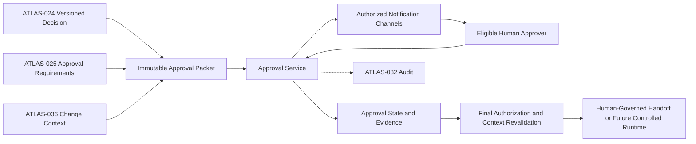
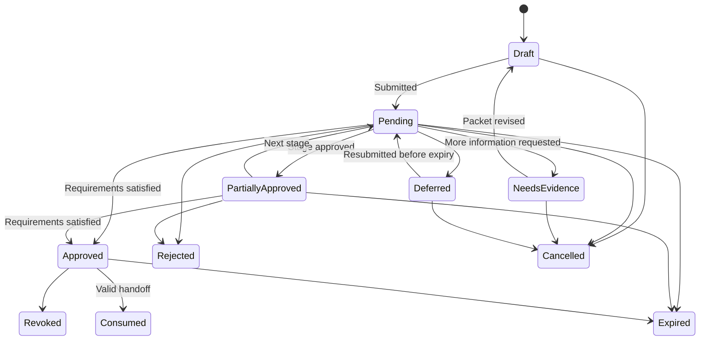

# Project Atlas

## Approval Workflow

| Field | Value |
| --- | --- |
| Document ID | ATLAS-037 |
| Version | 1.0.0 |
| Status | Approved |
| Document Owner | Governance and Workflow Owner |
| Reviewers | Product Owner, Security Architecture, Architecture Owner, Infrastructure Operations, IT Service Management Owner, Audit and Compliance |
| Approver | Umit Ozdemir (Product Owner) |
| Approval Date | 2026-08-03 |
| Last Updated | 2026-08-03 |
| Related Documents | [ATLAS-003](003_Project_Principles.md), [ATLAS-020](020_MCP_Framework.md), [ATLAS-023](023_Workflow_Engine.md), [ATLAS-024](024_Decision_Engine.md), [ATLAS-025](025_Policy_Engine.md), [ATLAS-030](030_Authentication.md), [ATLAS-031](031_RBAC.md), [ATLAS-032](032_Audit.md), [ATLAS-036](036_ITSM_Integration.md), [ATLAS-047](047_Guardrails.md) |
| Supersedes | ATLAS-037 version 0.1.0 |

## 1. Purpose

This document defines human approval for consequential Project Atlas plans and actions.

Approval records an informed, authorized human decision about one immutable proposal. It does not replace authentication, RBAC, policy, current precondition checks, connector safeguards, or runtime authorization. Atlas remains a decision-support platform; operational execution is outside the initial product scope and can be introduced only through separately approved controlled automation.

## 2. Scope

### In Scope

- Approval packet, request, decision, state, and evidence contracts
- Exact binding of approval to action, target, parameters, plan, policy, and time
- Eligible approvers, separation of duties, multi-step approval, expiry, and revocation
- ITSM approval mapping and emergency governance
- Revalidation, audit, notification, administration, and testing
- Approval requirements for future C2-C5 execution and sensitive platform administration

### Out of Scope

- Granting a missing RBAC permission
- Defining customer change-management policy
- Implementing autonomous infrastructure operation
- Authentication and step-up protocol details covered by ATLAS-030
- Generic document review and approval outside operational governance

## 3. Objectives

- Keep accountable humans in meaningful control of consequential activity
- Ensure the approver sees evidence, uncertainty, risk, impact, duration, interruption, and recovery
- Bind a decision to one immutable proposal and prevent replay or substitution
- Enforce eligible role, scope, assurance, separation, sequence, and quorum
- Expire or revoke approval when assumptions or context change
- Preserve complete, tamper-evident decision history
- Make rejection, deferral, and requests for evidence first-class outcomes

## 4. Non-Negotiable Rules

- Silence, inactivity, chat acknowledgement, ticket comment, or UI navigation is never approval.
- AI cannot approve, impersonate an approver, or select an approver to obtain a preferred outcome.
- The requester cannot approve the same sensitive action where separation of duties applies.
- Approval of one target, plan, parameter set, environment, or window does not approve another.
- Approval does not override a denial from authentication, RBAC, policy, target validation, or connector safeguards.
- An approval cannot authorize arbitrary commands or undeclared connector capabilities.
- An expired, revoked, superseded, rejected, or consumed approval is invalid.
- A confidence score does not reduce the required approval level.
- Approval evidence remains available for review and audit.

## 5. Approval Architecture



The Approval Service manages decision evidence and state. It does not execute connector capabilities.

## 6. Approval Packet

Each request contains an immutable packet with:

### Identity and Purpose

- Approval request ID and packet version
- Requesting human, initiating service, workflow, and delegation chain
- Business and technical purpose
- Related incident, problem, change, task, or service request
- Creation and expiry time

### Proposed Activity

- Connector package, instance, capability ID, and contract version
- C0-C5 capability class
- Exact target identifiers, environment, site, domain, and scope
- Canonical typed parameters with sensitive values represented by approved references
- Ordered implementation or diagnostic plan version
- Idempotency and execution-intent reference where applicable

### Evidence and Reasoning

- Problem and current-state summary
- Observed facts and data freshness
- Evidence, knowledge, graph, and prior-outcome references
- Probable cause, alternatives, assumptions, unknowns, and confidence rationale
- Why the proposed action is preferred and what could change the recommendation

### Risk and Impact

- Risk class and rationale
- Affected infrastructure and business services
- Blast radius and dependency evidence
- Expected duration and possible service interruption
- Capacity, performance, redundancy, security, and data-protection impact
- Worst credible outcome and residual risk

### Safe Implementation

- Preconditions and readiness checks
- Required maintenance window or freeze exception
- Success and validation criteria
- Stop conditions
- Rollback or recovery plan and estimated recovery time
- Required roles, approval stages, quorum, and authentication assurance
- Policy result, exceptions, and non-overridable controls

If required evidence, impact, or recovery information is unavailable, the packet states that limitation and cannot present the action as safe.

## 7. Exact Binding

The approval is bound to a canonical digest over at least:

```text
request version
decision and recommendation versions
connector package and capability versions
target set and environment
typed parameters and secret-reference identifiers
ordered plan and rollback versions
policy decision and exception versions
ITSM change record and approved window version
required preconditions and verification criteria
expiry and approval-stage requirements
```

Canonicalization is deterministic and versioned. Secret values are not included; their stable references and approved versions are bound where needed.

Any material change creates a new packet and restarts required approval stages. Cosmetic display changes that do not alter the canonical packet can retain the same request version.

## 8. Approval States



Terminal and historical states are immutable. A new decision creates a new event or request version rather than rewriting history.

## 9. Decision Outcomes

| Outcome | Meaning |
| --- | --- |
| Approve | The exact packet is accepted for the declared purpose and period |
| Reject | The proposal is not accepted; reason is required |
| Needs evidence | Specific missing or inadequate evidence is requested |
| Defer | No decision is made until a named condition or time |
| Revoke | A previously valid approval is withdrawn before handoff or completion |
| Cancel | The requester or authorized workflow withdraws the request |
| Expire | Time or context validity ends without valid consumption |

Approvers cannot edit the packet while approving it. Suggested changes return the request for revision.

## 10. Approver Eligibility

Eligibility is evaluated at decision time and again before consequential handoff. It includes:

- Authenticated stable human identity
- Required role and permission from ATLAS-031
- Scope covering every target and affected service where policy requires
- Required authentication assurance or fresh step-up
- Independence from requester, author, operator, or other approval stage as configured
- No conflicting temporary assignment or delegation
- Current employment, group, and account state
- Applicable technical, service-owner, security, or change authority
- Availability within the required window

Service identities, AI agents, shared accounts, and distribution lists are never accountable approvers.

## 11. Approval Levels and Stages

Policy determines stages from capability class, environment, service criticality, blast radius, interruption, data risk, uncertainty, exception, and customer governance.

Example baseline:

| Activity | Baseline approval posture |
| --- | --- |
| C0 informational analysis | No operational approval; normal access controls |
| C1 read-only query | No approval by default; sensitive scope may require justification |
| C2 bounded diagnostic | Single operational approval when resource or data impact is meaningful |
| C3 controlled change | Technical and service/change approval; exact plan and rollback required |
| C4 service-impacting | Multi-stage approval including service owner and change authority |
| C5 destructive | Not autonomously executable; exceptional human-governed procedure outside ordinary automation |
| Security-policy or trust-root change | Security and platform governance approval |
| Emergency access | Emergency authority plus mandatory post-use review |

The table is a minimum design baseline, not permission to enable C3-C5 execution.

## 12. Multi-Step Approval

- Stages have stable IDs, required roles, scope, sequence, quorum, and expiry.
- Parallel approval is permitted only for independent roles.
- Later approvers see prior decisions and the unchanged packet.
- A rejection stops the request unless policy explicitly permits revision and resubmission.
- A stage cannot count one person twice through multiple roles.
- Substitution and delegation require explicit policy and remain attributable.
- Quorum is calculated from distinct eligible humans.
- Policy changes affecting an in-flight request trigger re-evaluation and may require restart.

## 13. Requester, Approver, and Operator Separation

Policy can require distinct identities for:

- Requester and approver
- Recommendation author or reviewer and approver
- Connector or credential administrator and operator
- Policy author and publisher
- Change implementer and outcome verifier
- Emergency grantor and post-use reviewer

The platform evaluates effective identity across direct roles, groups, delegation, and temporary elevation. Using a workflow or service identity does not hide the initiating human.

## 14. Approval Expiry and Freshness

Approval validity is bounded by:

- Absolute expiry time
- ITSM change window
- Evidence and topology freshness requirements
- Target and service-state assumptions
- Policy and role-version validity
- Connector and capability version
- Credential-reference validity
- Maintenance freeze and environment state

Shorter boundaries take precedence. Approval is not automatically extended. Reapproval uses a current packet.

## 15. Revocation and Invalidation

Approval becomes invalid when:

- An authorized approver or governance role revokes it
- The approver loses eligibility before handoff where revalidation is required
- Target, parameters, plan, rollback, evidence, risk, or affected services materially change
- Policy, exception, role, connector, capability, or package version changes
- ITSM change is rejected, cancelled, rescheduled, or its window changes
- A precondition fails or a stop condition is reached
- A security incident, freeze, or platform guardrail blocks progress
- The request expires, is consumed, or is superseded

Invalidation is immediate for new handoff. In-progress behavior follows the deterministic runtime's stop and recovery rules, never an LLM decision.

## 16. Final Revalidation

Immediately before a future controlled handoff, Atlas revalidates:

1. Approval state, digest, stages, quorum, and expiry
2. Requester, operator, and approver identities and separation
3. Current RBAC permission and scope
4. Current policy and non-overridable guardrails
5. Connector trust, package, capability, credential, and target binding
6. ITSM record, approval, window, and freeze state
7. Preconditions, topology, service impact, and evidence freshness
8. Idempotency, prior execution, and cancellation state
9. Audit availability and runtime health

Any mismatch stops handoff and produces an explicit reason.

## 17. Approval Token or Handoff Artifact

If execution is introduced in a future phase, a successful approval produces a short-lived, single-purpose handoff artifact that contains or references:

- Approval request and canonical packet digest
- Authorized capability, target, parameters, and plan
- Required runtime identity and environment
- Not-before, expiry, and one-time or bounded-use constraints
- Policy, ITSM, and audit references
- Issuer and integrity signature

The artifact is validated by the deterministic execution service, not interpreted by the LLM. It cannot be exchanged for broader permission.

## 18. ITSM Approval Mapping

- ITSM approvals retain external record, stage, approver, decision, time, and source version.
- Atlas maps only explicitly supported approval types.
- Webhook authenticity, current record state, approver eligibility, and exact plan binding are verified.
- Generic ticket status, comments, email replies, or attachment presence are insufficient.
- Atlas and ITSM approvals can both be required.
- Conflicting decisions stop the request.
- External revocation, reschedule, or plan change invalidates dependent Atlas state.

## 19. Emergency Approval

Emergency does not mean ungoverned.

- Emergency criteria and eligible authority are preconfigured.
- Strong authentication and explicit justification are required.
- Scope, target, capability, parameters, and duration remain narrow.
- Service impact and available recovery information are still presented.
- Policy-denied C5 autonomy, audit, and connector safeguards cannot be bypassed.
- Security, operations, and service owners receive immediate notification as configured.
- Expiry is short and cannot silently renew.
- Mandatory post-use review records necessity, actions, outcome, impact, and follow-up.

If safe approval evidence cannot be produced, Atlas directs the user to the organization's manual emergency process rather than inventing authority.

## 20. Notification

- Notifications contain a safe summary, risk, expiry, and authorized link.
- Sensitive evidence and full target details remain behind Atlas access control.
- Notification channels do not capture approval by free-form reply unless a separately designed signed protocol exists.
- Reminder frequency is bounded and does not pressure the approver.
- Escalation changes visibility or assignee according to policy; it does not imply approval.
- Delivery failure is visible and does not change request state.

## 21. User Experience

The approval view presents, before the decision controls:

- Exact action, target, environment, and plan version
- Why the request exists and who requested it
- Facts, evidence, assumptions, unknowns, alternatives, and freshness
- Risk, blast radius, affected services, interruption, duration, and worst credible outcome
- Preconditions, validation, stop conditions, and rollback or recovery
- Required and completed approval stages
- Related ITSM record and window
- What approval does and does not authorize

Reject, needs-evidence, and defer controls are as accessible as approve. High-risk actions do not use urgency language or misleading defaults.

## 22. API and Event Contract

The Approval Service exposes authorized operations to:

- Create draft from a versioned decision
- Submit immutable packet
- Retrieve permitted request and evidence
- Decide, request evidence, defer, cancel, revoke, and expire
- Revalidate eligibility and context
- Obtain handoff readiness or future bounded artifact
- List requests by state, role, scope, owner, and expiry
- Subscribe to versioned lifecycle events

Mutating requests use idempotency keys and optimistic concurrency. Events follow ATLAS-016 and include request version, state transition, actor, reason, and correlation.

## 23. Audit Requirements

ATLAS-032 records:

- Draft creation, packet submission, canonical digest, and policy requirements
- Every view of restricted approval evidence where required
- Eligible approver evaluation and separation conflicts
- Decision, reason, authentication assurance, stage, quorum, and time
- Needs-evidence, revision, resubmission, deferral, cancellation, expiry, and revocation
- ITSM synchronization and conflict
- Notification and delivery result without secret content
- Final revalidation and each failed condition
- Handoff artifact issuance, validation, consumption, rejection, and expiry
- Emergency approval and post-use review

Historical decisions are never rewritten when a request is revised.

## 24. Security and Privacy

- Approval packets are classified and access-controlled.
- Evidence links re-authorize access and can expire.
- Secrets are represented only by safe references.
- Notifications and exports minimize identity, topology, and business-service data.
- Approval APIs protect against replay, cross-request substitution, enumeration, and confused-deputy behavior.
- Integrity signatures and canonicalization are versioned and security-reviewed.
- Approval data is not used for model training without explicit governance.
- Approver behavior analytics use privacy-approved aggregation.

## 25. Failure Behavior

| Failure | Required behavior |
| --- | --- |
| Approval service unavailable | No new consequential handoff; preserve pending state and show degradation |
| Identity, RBAC, or policy unavailable | Deny decision or handoff until current validation succeeds |
| Audit unavailable | Block protected decision and handoff according to ATLAS-032 |
| ITSM unavailable | Preserve pending state; do not assume external approval or window |
| Notification failure | Keep request state unchanged; expose retry and alternate authorized access |
| Packet digest mismatch | Reject decision or handoff and raise security event |
| Concurrent decision | Apply optimistic concurrency; preserve first valid transition and expose conflict |
| Unknown execution outcome | Do not reuse approval; reconcile and require recovery or new authorization |

## 26. Administration and Governance

- Approval policies, role mappings, stage templates, and emergency paths are versioned.
- Changes show gained or removed controls and affected in-flight requests.
- Authors cannot publish protected approval policy alone where separation is required.
- Customer configuration cannot disable non-overridable platform controls.
- Templates never substitute for current packet evidence.
- Periodic reviews cover approval volume, age, rejection, revocation, emergency use, and exceptions.

## 27. Observability

- Requests by state, capability class, environment, service, and policy
- Time to first review and final decision
- Expiring, expired, deferred, and stuck requests
- Needs-evidence and revision frequency
- Separation, eligibility, digest, freshness, and revalidation failures
- Notification delivery and ITSM synchronization health
- Emergency approvals and overdue post-use reviews
- Handoff artifact issuance, rejection, and consumption

Metrics must not become performance pressure that encourages unsafe approval.

## 28. Testing Requirements

- Canonical packet and digest stability across serialization and version changes
- Target, parameter, plan, policy, connector, and window substitution rejection
- Role, scope, authentication assurance, separation, stage, and quorum
- Approve, reject, needs-evidence, defer, cancel, expire, revoke, and concurrent decisions
- ITSM mapping, webhook replay, reschedule, revocation, and conflict
- Final revalidation under changed topology, risk, policy, credential, or target state
- Notification privacy and inability to approve through ambiguous replies
- Emergency expiry, notification, audit, and post-use review
- Audit outage, service outage, replay, tampering, and unknown outcome
- Verification that approval cannot grant RBAC or bypass policy and guardrails

## 29. MVP Scope

### Included

- Immutable approval packet and canonical digest
- Single and multi-stage human approval states
- Role, scope, separation-of-duties, step-up hook, expiry, and revocation
- Needs-evidence, reject, defer, cancel, and audit evidence
- ITSM change and window references
- Final revalidation contract
- Read-only approval inbox and notifications
- No operational execution by the AI

### Excluded

- General autonomous C3-C5 execution
- Email or chat reply as approval
- Biometric or passwordless factors managed directly by Atlas
- Customer bypass of non-overridable controls
- Self-approval by AI, workflow, service identity, or requester

## 30. Dependencies and Traceability

- ATLAS-003 establishes human control, capability classes, impact, recovery, and separation principles.
- ATLAS-020 defines connector capabilities and exact contracts.
- ATLAS-023 provides durable workflow state.
- ATLAS-024 supplies versioned decisions and evidence.
- ATLAS-025 determines approval requirements and exceptions.
- ATLAS-030 and ATLAS-031 provide current identity, assurance, role, and scope.
- ATLAS-032 preserves immutable approval evidence.
- ATLAS-036 maps ITSM change and approval context.
- ATLAS-047 defines non-overridable AI guardrails.

## 31. Assumptions

- Organizations can identify accountable human approvers and scopes.
- Early Atlas releases remain decision-support oriented and may stop at an approved handoff plan.
- ITSM approval semantics differ and require explicit mapping.
- Current infrastructure and service context can change after approval.

## 32. Open Questions and ADR Backlog

- Which MVP administration and C2 activities require approval?
- Which capability and service-risk combinations require each stage and quorum?
- What default expiry and evidence-freshness intervals apply?
- Which canonicalization and integrity-signature mechanism is selected?
- Which ITSM approval states and fields can be trusted for the first integration?
- Does MVP issue a non-executable approval receipt or defer all handoff artifacts?

## 33. Acceptance Criteria

This document is ready to enter Review when:

- Approval is bound to an immutable, canonical, exact proposal.
- Eligibility, separation, stages, quorum, expiry, revocation, and revalidation are agreed.
- Approval cannot supply missing authentication, RBAC, policy, or connector authority.
- Impact, interruption, uncertainty, evidence, and recovery are visible before a decision.
- ITSM and emergency paths preserve the same minimum human-control and audit principles.
- Failure, tampering, replay, substitution, and concurrent decision behavior is testable.
- Product, security, operations, ITSM, and audit reviewers accept the contract.

## 34. Change History

| Version | Date | Author | Summary |
| --- | --- | --- | --- |
| 0.1.0 | 2026-07-21 | Project Atlas Team | Initial approval goals, packet fields, and outcomes |
| 0.2.0 | 2026-08-03 | Governance and Workflow Owner | Added immutable exact binding, lifecycle, eligibility, separation, multi-stage approval, expiry, revocation, revalidation, ITSM and emergency governance, handoff, failure, and testing contracts |
| 1.0.0 | 2026-08-03 | Umit Ozdemir | Approved as the first binding documentation baseline under the designated approver authority |
