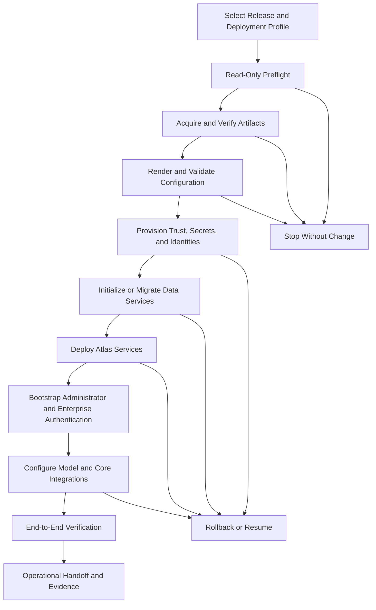

# Project Atlas

## Deployment and Bootstrap

| Field | Value |
| --- | --- |
| Document ID | ATLAS-038 |
| Version | 1.0.0 |
| Status | Approved |
| Document Owner | Platform Engineering Owner |
| Reviewers | Architecture Owner, Security Architecture, Site Reliability Engineering, Database Engineering, Network Engineering, Infrastructure Operations, Support Engineering |
| Approver | Umit Ozdemir (acting Architecture Owner) |
| Approval Date | 2026-08-03 |
| Last Updated | 2026-08-03 |
| Related Documents | [ATLAS-003](003_Project_Principles.md), [ATLAS-010](010_System_Architecture.md), [ATLAS-013](013_Deployment_Architecture.md), [ATLAS-014](014_AI_Architecture.md), [ATLAS-015](015_RAG_Architecture.md), [ATLAS-030](030_Authentication.md), [ATLAS-032](032_Audit.md), [ATLAS-033](033_Logging.md), [ATLAS-057](057_Deployment.md), [ATLAS-058](058_CI_CD.md) |
| Supersedes | ATLAS-038 version 0.1.0 |

## 1. Purpose

This document defines repeatable bootstrap, installation, initial configuration, verification, recovery, and removal expectations for Project Atlas development, lab, restricted-network, and future enterprise deployments.

ATLAS-013 defines the target deployment architecture. This document defines how an authorized operator safely creates and validates an instance of that architecture. It is a specification for future deployment assets; it does not authorize implementation while governing documents remain Draft.

## 2. Scope

### In Scope

- Supported setup modes and deployment prerequisites
- Preflight, artifact acquisition, trust, configuration, secrets, and certificates
- Data-store initialization and migration
- Local or private OpenAI-compatible model endpoint configuration
- Initial identity bootstrap and enterprise authentication handoff
- Installation, verification, upgrade preparation, rollback, recovery, and uninstall behavior
- Offline bundles, proxy handling, support diagnostics, and test requirements

### Out of Scope

- Final production technology selections not yet approved by ADR
- Detailed infrastructure-as-code implementation covered by ATLAS-057
- CI/CD pipeline implementation covered by ATLAS-058
- Vendor infrastructure connector configuration
- Customer-specific high-availability sizing and disaster-recovery design

## 3. Objectives

- Produce the same validated Atlas release from versioned inputs
- Detect environmental incompatibility before making changes
- Keep credentials and private keys out of files, commands, logs, and source control
- Support connected, proxy-restricted, mirrored, and fully offline environments
- Make every step idempotent or explicitly recoverable
- Verify security controls and end-to-end health before declaring success
- Preserve current installation and data if bootstrap fails
- Generate useful diagnostics without leaking customer secrets or sensitive content

## 4. Deployment Modes

| Mode | Intended use | Network posture | Availability expectation |
| --- | --- | --- | --- |
| Developer | Local contribution and automated tests | Connected or developer proxy | Single instance, disposable data allowed |
| Lab | Integration and vendor-system validation | Controlled internal access | Single or small multi-node setup |
| Enterprise connected | Future production or pre-production | Approved repositories and private services | HA according to ATLAS-013 |
| Enterprise mirrored | Restricted production with internal artifact mirrors | No direct public dependency access | HA and controlled promotion |
| Fully offline | Air-gapped or transfer-controlled environment | Signed offline bundles only | Deployment-specific HA |

One release manifest identifies which modes it supports. A developer shortcut must not silently become a production default.

## 5. Supported Host and Orchestration Profiles

The first supported profiles must be selected by ADR. The bootstrap contract remains platform-neutral enough to support:

- Developer workstation using containerized dependencies
- Linux server or virtual machine lab deployment
- Kubernetes-compatible enterprise deployment
- Internal container registry and package mirror
- Windows administration workstation invoking approved remote deployment tooling

Production workloads should run on an approved server or orchestration platform. A personal workstation is not a production dependency.

## 6. Bootstrap Phases

Every phase records input version, result, safe diagnostics, and resumability.

## 7. Release Manifest

Each release has a signed manifest containing:

- Atlas release version and build identifier
- Supported deployment and operating-system profiles
- Component images, packages, charts, schemas, migrations, and checksums
- Required runtime, database, object store, vector store, queue, and proxy compatibility
- Model endpoint protocol and validated feature requirements
- Minimum and recommended CPU, memory, storage, and network capacity
- Required ports, protocols, DNS records, certificates, and external endpoints
- Configuration schema and default-policy versions
- Upgrade-from versions and rollback constraints
- Known limitations and security notices
- Signature, publisher identity, and verification instructions

Unlisted, unsigned, or checksum-mismatched artifacts are rejected.

## 8. Preflight

Preflight is read-only and produces a machine-readable and human-readable report.

### Host and Runtime

- Supported operating system, architecture, kernel, container runtime, or cluster version
- CPU features, capacity, memory, disk, inode, and filesystem suitability
- Time synchronization, hostname, DNS, and locale
- Required administration tools and versions
- Port availability and conflicting services

### Network and Trust

- DNS resolution and route reachability
- Proxy and no-proxy behavior
- Internal registry, package mirror, model endpoint, identity provider, and integration endpoints
- TLS chain, hostname, expiry, revocation method, and approved algorithms
- Firewall and network-policy prerequisites without automatically changing them

### Data and Recovery

- Database, object, vector, queue, and cache availability
- Version and extension compatibility
- Storage capacity and performance baseline
- Existing installation, data, schema, backup, and migration state
- Backup target and restore readiness before upgrade or destructive initialization

### Security

- Secret manager and key-management reachability
- Required service identities and namespaces
- File and directory permissions
- Prohibited default or plaintext credentials
- Audit and log destination readiness where mandatory

A failed mandatory check stops before mutation and reports remediation without applying it automatically.

## 9. Configuration Contract

- Configuration uses a versioned, machine-validated schema.
- Environment overlays contain non-secret values only.
- Unknown keys, invalid enums, duplicate resources, unsafe wildcard binds, and unsupported combinations fail validation.
- Defaults are explicit and secure; no implicit public network exposure.
- Rendered effective configuration can be previewed with secret references redacted.
- Source, override order, schema version, and configuration digest are recorded.
- Production changes use governed deployment and change processes.
- Configuration drift is detectable after deployment.

## 10. Secrets and Credentials

- Secrets are created or imported through an approved secret manager.
- Configuration stores opaque references, never secret values.
- Interactive entry avoids command-line arguments, shell history, and echoed output.
- Generated credentials use approved entropy and are shown only through a controlled one-time path where necessary.
- Service, database, connector, model, and integration credentials are separate and least-privileged.
- Rotation and revocation are validated before handoff.
- Installation logs, state files, plans, reports, and support bundles are scanned for secret leakage.
- Offline secret injection uses a documented local ceremony and is never embedded in the transferable release bundle.

## 11. Certificates and Trust

- Deployment uses organization-approved certificates or a documented bootstrap trust path.
- Public endpoints require valid server identity and approved TLS configuration.
- Internal service authentication follows ATLAS-013 workload-identity decisions.
- Trust anchors, intermediates, server certificates, and client certificates have distinct lifecycle records.
- Private keys remain in approved key stores and are not exportable by default.
- Rotation supports overlap, validation, activation, and rollback.
- Expiry monitoring is enabled during bootstrap.
- Self-signed developer certificates are clearly labeled and prohibited for production profiles.

## 12. Artifact Acquisition

### Connected Mode

- Download only from approved registries and repositories.
- Pin immutable versions and verify signatures and checksums.
- Record resolved artifact identity and source.
- Cache according to policy without weakening verification.

### Mirrored Mode

- Resolve all dependencies through customer-controlled mirrors.
- Validate mirror completeness before mutation.
- Preserve upstream origin, version, checksum, signature, and software-bill-of-material references.
- Do not fall back to public networks when a mirror is incomplete.

### Offline Mode

- Import a signed, checksum-verified release bundle through controlled transfer.
- Bundle all required images, packages, schemas, migrations, policies, and validation tools.
- Include a manifest, size, compatibility, malware-scan status, and chain-of-custody fields.
- Reject added, missing, modified, expired, or incompatible artifacts.

## 13. Dependency and Image Security

- Component images and packages are immutable and version-pinned.
- Supported releases include a software bill of materials.
- Signature, provenance, license, vulnerability, and malware checks run before promotion.
- Critical unresolved findings block production installation according to policy.
- Base images and runtimes follow supported lifecycle and patch policy.
- Build tools are not installed into runtime images unless required.
- Offline vulnerability and trust metadata have an explicit freshness date.

## 14. Data Service Initialization

Bootstrap initializes only the services required by the selected architecture profile:

- Transactional database and schemas
- Object or artifact storage
- Event or work queues
- Cache where selected
- Vector index and knowledge metadata foundation
- Graph projections or graph store where selected
- Audit ledger and search projection

Initialization is idempotent, validates ownership and emptiness where required, and never overwrites an unknown existing database.

## 15. Database Migration

- Migrations are ordered, immutable, checksummed, and release-bound.
- Current and target schema compatibility is checked before migration.
- Backup and restore validation are required before a nontrivial upgrade.
- Expand-and-contract patterns are preferred for online compatibility.
- Irreversible steps are explicitly labeled and require a recovery plan.
- Migration lock prevents concurrent execution.
- Timeout, partial completion, and resume behavior are documented per migration.
- Application services do not start against unsupported schema versions.
- Migration results and timing are audited.

## 16. Service Deployment

- Services deploy in dependency-aware order with bounded readiness and liveness checks.
- Runtime identities, resource limits, network policies, storage, and configuration mounts are explicit.
- Containers or processes run without unnecessary privileges.
- Administrative endpoints are private and separately authorized.
- Startup does not require arbitrary internet access.
- Failed readiness prevents traffic routing.
- Rollout status distinguishes deployed, ready, degraded, failed, and rolled back.
- Partial deployment produces a recovery plan rather than reporting success.

## 17. Initial Identity Bootstrap

ATLAS-030 governs identity security. Bootstrap must:

1. Create a restricted first administrator through a local trusted channel.
2. Accept or generate the credential without logging or command-history exposure.
3. Require credential replacement on first use.
4. Configure and validate LDAP, Active Directory, or selected federation.
5. Map initial security and platform administration groups.
6. Test a pilot user and preserve a controlled recovery path.
7. Activate enterprise authentication through an audited change.
8. Disable or seal unused bootstrap material.

The first administrator cannot disable audit or non-overridable security controls.

## 18. Model Endpoint Bootstrap

Atlas supports a local or privately hosted OpenAI-compatible model endpoint subject to ATLAS-014.

Configuration validates:

- Endpoint URL, DNS, route, TLS, and expected server identity
- Authentication secret reference
- API compatibility and supported request features
- Approved model identifiers and context limits
- Structured-output and tool-use behavior required by selected agents
- Streaming, timeout, retry, rate, and concurrency limits
- Data-boundary and telemetry settings
- Health and a synthetic non-sensitive inference

The validation prompt contains no infrastructure secrets or customer data. A successful text response does not prove tool-use safety or production readiness.

## 19. Knowledge and Vector Bootstrap

- Create empty governed catalogs, collections, and access partitions.
- Register embedding and retrieval configuration versions.
- Validate model dimensions and index compatibility before ingestion.
- Load only approved starter content and clearly label sample data.
- Run synthetic ingestion, retrieval, citation, access-denial, and deletion tests.
- Ensure one organization's content cannot appear in another scope.
- Do not ingest vendor or internal documents automatically from arbitrary local paths.

## 20. Audit, Logging, Syslog, and SIEM Bootstrap

- Initialize the authoritative audit ledger before protected administration.
- Verify append, search, integrity, retention, and restricted access.
- Start structured log collection and pipeline-health monitoring.
- Validate secret redaction with synthetic markers.
- Configure optional or mandatory Syslog and SIEM destinations in inactive state.
- Send uniquely identified test events and verify mapping and receipt.
- Do not declare compliance forwarding healthy based on socket connectivity alone.

## 21. Integration Bootstrap

LDAP, ITSM, SIEM, Syslog, notification, and future connector integrations follow a common sequence:

1. Register owner, purpose, environment, and classification.
2. Configure endpoint, trust, credential reference, scope, and rate limit.
3. Validate connectivity and authentication with a non-changing operation.
4. Preview identity, field, event, or resource mapping.
5. Run synthetic or sandbox tests.
6. Review permissions and expected data flow.
7. Activate a versioned configuration.
8. Monitor health, expiry, drift, and last successful exchange.

No bootstrap validation performs an infrastructure-changing vendor action.

## 22. End-to-End Verification

Installation is successful only after a versioned verification suite confirms:

- UI and API readiness through the intended ingress
- Authentication, session, RBAC default deny, and group mapping
- Audit write, search, integrity, and protected access
- Structured logs, correlation, redaction, and pipeline health
- Database, object, queue, vector, graph, and cache health as applicable
- Model endpoint health and safe structured response
- Synthetic knowledge ingestion, authorized retrieval, citation, and deletion
- Synthetic workflow, policy denial, and approval-request lifecycle
- Read-only connector contract using a simulator or approved lab target
- Backup creation and at least a bounded restore validation
- Syslog, SIEM, or ITSM tests selected for the deployment

The report records passed, failed, skipped, and not-applicable checks with reasons. Skipped mandatory checks prevent a successful status.

## 23. Idempotency, Resume, and State

- Bootstrap maintains a local or platform state record containing phase, release, configuration digest, completed steps, and safe outputs.
- Re-running a completed step verifies current state before deciding no change is needed.
- Failed steps can resume from a documented checkpoint.
- A changed input invalidates affected downstream phases.
- Generated resource names and IDs are stable or recorded.
- Concurrency locks prevent two bootstrap processes from modifying the same deployment.
- `--force`-style bypasses cannot override trust, secret, audit, or data-loss controls.

## 24. Failure and Recovery

| Failure stage | Required behavior |
| --- | --- |
| Preflight, acquisition, or configuration | Stop without mutation and report corrective action |
| Trust or secret provisioning | Preserve prior valid configuration; remove incomplete temporary material |
| Data initialization | Do not overwrite unknown data; record partial resources and recovery steps |
| Migration | Stop services as required, preserve backup, expose exact applied step, resume or restore |
| Service rollout | Keep prior healthy release when possible; stop routing to unready instances |
| Identity activation | Preserve verified recovery path and last valid provider |
| Model or integration validation | Mark dependency unavailable; do not declare full readiness |
| Final verification | Mark deployment degraded or failed with explicit unresolved checks |

Automated cleanup removes only resources proven to belong to the failed attempt.

## 25. Rollback

- Every upgrade declares whether application and data rollback are supported.
- The prior release artifacts and configuration remain available through the rollback window.
- Rollback validates schema compatibility and does not run against irreversibly migrated data.
- Configuration and secret references roll back independently only when compatible.
- Workflows, approvals, connector packages, policies, and queued events preserve version compatibility.
- Rollback is followed by the same mandatory health and security checks as deployment.
- A failed rollback invokes documented recovery rather than repeated blind attempts.

## 26. Uninstall and Decommission

Uninstall is explicit and non-destructive by default.

- Stop and remove Atlas compute resources owned by the release.
- Preserve data stores, audit, configuration, backups, and secrets unless separately requested and authorized.
- Show a deletion inventory and dependency impact before destructive cleanup.
- Revoke workload credentials, certificates, tokens, and external integration accounts.
- Disable schedules, webhooks, exports, and callbacks.
- Export required audit and configuration evidence.
- Verify no active Atlas resources or external trust remain.
- Data deletion follows retention, legal hold, and customer policy.

## 27. Operational Handoff

Bootstrap produces a signed or integrity-protected deployment record containing:

- Release, profile, configuration digest, and artifact manifest
- Environment, endpoints, namespaces, and component versions
- Secret and certificate references without values
- Database and migration versions
- Enabled authentication and integration profiles
- Verification results and accepted exceptions
- Backup and restore status
- Known limitations and pending actions
- Operational owners, escalation contacts, and support procedure
- Installation and handoff audit references

Production handoff requires named service ownership.

## 28. Support and Troubleshooting

Troubleshooting guidance is organized by phase and stable error code. It provides safe checks, expected state, evidence locations, and escalation criteria.

Support bundle generation:

- Is authorized and audited
- Uses selected time, components, and deployment phase
- Includes manifest, versions, health, configuration schema, and sanitized logs
- Excludes secret values, private keys, raw prompts, customer documents, and unrestricted topology by default
- Allows preview and redaction verification before export
- Supports encrypted offline transfer and expiry

The system never recommends disabling TLS verification, audit, or authorization as a routine fix.

## 29. Backup and Restore Expectations

Before production readiness, deployment assets must define:

- Authoritative data and configuration backup scope
- Secret-manager and certificate backup responsibilities
- Schedule, retention, encryption, and destination
- Consistent snapshot or quiescence behavior
- Restore order and dependency compatibility
- Recovery-time and recovery-point objectives
- Periodic restore-test evidence
- Handling of audit ledger, legal hold, queued events, and revoked sessions

A backup job completing is not sufficient; restore validation is required.

## 30. Security Controls

- Least-privileged bootstrap operator and service identities
- Signed, pinned, and scanned artifacts
- No secret values in files, environment snapshots, command arguments, logs, or reports
- Encrypted communications and explicit trust
- Private administrative interfaces and minimal exposed ports
- Non-root or restricted runtime privileges where supported
- Network segmentation and egress control
- Immutable release inputs and change audit
- Safe temporary files and cleanup
- Security validation before operational handoff

## 31. Observability

- Bootstrap phase, duration, attempt, and current state
- Preflight failure categories and recurring environmental gaps
- Artifact download, mirror, signature, and checksum health
- Certificate and credential expiry
- Migration progress, lock, duration, and failure
- Service rollout, readiness, and dependency health
- Model and integration validation status
- Verification pass, fail, skip, and exception counts
- Configuration drift and unsupported component versions
- Backup and last successful restore-test age

## 32. Testing Requirements

- Clean install for every supported profile
- Re-run idempotency and interrupted-phase resume
- Invalid OS, capacity, port, DNS, proxy, trust, and dependency preflight
- Tampered, missing, extra, outdated, and incompatible artifacts
- Secret leakage into commands, logs, state, reports, and support bundles
- Database initialization, concurrent migration, partial migration, restore, and rollback
- Certificate rotation, expiry, invalid hostname, and private-trust behavior
- Identity bootstrap, enterprise provider activation, and recovery access
- Local OpenAI-compatible endpoint failure, timeout, incompatibility, and data boundary
- Offline bundle creation, transfer, verification, installation, and update
- Partial service rollout, node failure, dependency outage, and rollback
- Uninstall preservation and separately authorized data deletion

## 33. MVP Scope

### Included

- One developer and one Linux-based lab deployment profile
- Read-only preflight and versioned configuration schema
- Signed release-manifest and checksum verification foundation
- Containerized core dependencies selected by architecture ADRs
- Secret-reference and certificate bootstrap
- Database initialization and migration framework
- Secure local administrator bootstrap and one enterprise directory integration path
- Local or private OpenAI-compatible endpoint validation
- End-to-end verification report, resume, rollback foundation, and support bundle
- Mirrored and offline dependency-manifest design with at least one tested lab path

### Excluded

- Unapproved production SLA or sizing guarantees
- Every operating system and orchestrator
- Automated firewall, DNS, LDAP, SIEM, ITSM, or vendor-system administration
- Embedding production secrets in offline bundles
- Destructive uninstall by default
- Claiming HA or disaster recovery without tested evidence

## 34. Dependencies and Traceability

- ATLAS-003 requires reproducibility, restricted-network support, security, and auditability.
- ATLAS-010 defines system boundaries and major platform responsibilities.
- ATLAS-013 defines target topology, availability, and trust zones.
- ATLAS-014 defines model endpoint and AI data-boundary requirements.
- ATLAS-015 defines knowledge and vector initialization needs.
- ATLAS-030 governs initial and enterprise authentication.
- ATLAS-032 and ATLAS-033 govern audit and logging readiness.
- ATLAS-057 will define deployable infrastructure assets.
- ATLAS-058 will define build, promotion, and release automation.

## 35. Assumptions

- Early implementation begins with development and lab profiles before production certification.
- Enterprise customers can provide approved compute, storage, DNS, certificates, identity, and secret-management services.
- A private OpenAI-compatible model endpoint is reachable from the selected deployment boundary.
- Offline environments can transfer signed artifacts through an approved process.

## 36. Open Questions and ADR Backlog

- Which operating system, container runtime, and orchestrator are first-class for MVP?
- Which database, object store, queue, vector store, graph approach, and cache are selected?
- Which artifact signing, provenance, SBOM, and offline-bundle formats are mandatory?
- Which secrets manager and workload-identity profiles are supported first?
- What minimum developer and lab hardware profiles are supported?
- Which backup and restore objectives are required before production readiness?

## 37. Acceptance Criteria

This document is ready to enter Review when:

- Supported deployment modes and the bootstrap phase contract are agreed.
- Preflight can stop safely before mutation and produce actionable evidence.
- Release, artifact, trust, secret, configuration, migration, and model-endpoint handling are testable.
- Bootstrap is resumable and does not overwrite unknown data or expose credentials.
- End-to-end verification covers identity, RBAC, audit, logs, data services, AI, knowledge, workflow, policy, approval, and a safe connector path.
- Rollback, uninstall, backup, restore, offline operation, and support diagnostics have explicit behavior.
- Architecture, security, platform, database, network, operations, and support reviewers accept the contract.

## 38. Change History

| Version | Date | Author | Summary |
| --- | --- | --- | --- |
| 0.1.0 | 2026-07-21 | Project Atlas Team | Initial bootstrap goals, modes, assets, and questions |
| 0.2.0 | 2026-08-03 | Platform Engineering Owner | Added deployment profiles, phased preflight and bootstrap, artifact trust, secrets, certificates, data migration, identity and model setup, verification, recovery, rollback, uninstall, offline operation, support, and testing contracts |
| 1.0.0 | 2026-08-03 | Umit Ozdemir | Approved as the first binding documentation baseline under the designated approver authority |
