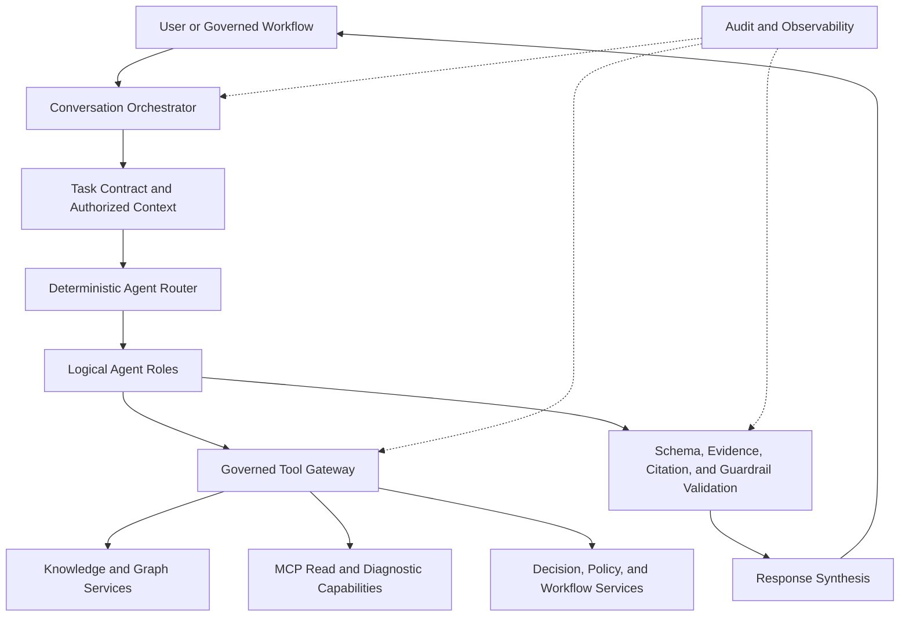
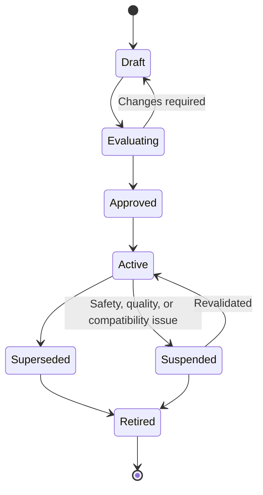

# Project Atlas

## AI Agents

| Field | Value |
| --- | --- |
| Document ID | ATLAS-040 |
| Version | 1.0.0 |
| Status | Approved |
| Document Owner | AI Architecture Owner |
| Reviewers | Architecture Owner, Security Architecture, Infrastructure Domain Architects, Platform Engineering, Operations, Audit and Compliance |
| Approver | Umit Ozdemir (acting Architecture Owner) |
| Approval Date | 2026-08-03 |
| Last Updated | 2026-08-03 |
| Related Documents | [ATLAS-003](003_Project_Principles.md), [ATLAS-014](014_AI_Architecture.md), [ATLAS-020](020_MCP_Framework.md), [ATLAS-023](023_Workflow_Engine.md), [ATLAS-024](024_Decision_Engine.md), [ATLAS-025](025_Policy_Engine.md), [ATLAS-031](031_RBAC.md), [ATLAS-032](032_Audit.md), [ATLAS-041](041_Reasoning.md), [ATLAS-047](047_Guardrails.md) |
| Supersedes | ATLAS-040 version 0.1.0 |

## 1. Purpose

This document defines the governed AI-agent model for Project Atlas: logical agent roles, shared contracts, orchestration, tool access, context boundaries, lifecycle, observability, and evaluation.

An Atlas agent is a constrained reasoning role operating inside platform controls. It is not an autonomous infrastructure operator, security principal, or source of authority.

## 2. Scope

### In Scope

- Agent catalog, responsibilities, contracts, and lifecycle
- Orchestration, routing, delegation, handoff, and termination
- Context, memory, evidence, tool, permission, and budget controls
- Human interaction, output validation, audit, observability, and evaluation
- MVP agent composition and service-boundary guidance

### Out of Scope

- Model-hosting implementation covered by ATLAS-014
- Detailed reasoning and confidence covered by ATLAS-041
- Domain algorithms for RCA, recommendations, impact, and runbooks in ATLAS-042 through ATLAS-045
- Deterministic workflow execution covered by ATLAS-023
- Granting infrastructure or approval authority to an LLM

## 3. Objectives

- Decompose complex infrastructure analysis into understandable, testable roles
- Keep one governed orchestration and evidence contract across roles
- Limit every role to the minimum tools, data, time, and scope it needs
- Prevent recursive, unbounded, or opaque multi-agent behavior
- Preserve user intent, identity, evidence, uncertainty, and accountability across handoffs
- Make model, prompt, tool, policy, and output versions reproducible
- Allow agents to fail, refuse, or request evidence safely

## 4. Agent Design Principles

- Agents are logical capabilities first; separate deployment services require demonstrated operational value.
- Agent names do not confer permission.
- The effective tool set is allowlisted and request-scoped.
- Evidence access is authorized before retrieval and again before presentation.
- Agent output is untrusted until schema, citation, policy, and guardrail validation completes.
- Deterministic services own state transitions, scheduling, policy, approval, audit, and connector dispatch.
- An agent may propose a tool call but cannot bypass the governed tool gateway.
- Delegation cannot broaden the initiating user's scope.
- Agents do not maintain hidden durable memory.
- Termination limits are mandatory.

## 5. Logical Agent Catalog

| Agent role | Primary responsibility | Typical tools | Prohibited responsibility |
| --- | --- | --- | --- |
| Conversation Orchestrator | Interpret request, establish task contract, route roles, synthesize response | Catalog, task state, safe retrieval | Direct connector execution or approval |
| Health Analysis Agent | Interpret health observations and deviations | C0/C1 observations, graph, knowledge | Declaring root cause without evidence |
| Troubleshooting Agent | Build and refine diagnostic investigation plans | Evidence retrieval, bounded C1/C2 proposals | Unapproved diagnostics or changes |
| Root Cause Agent | Rank causal hypotheses and discriminating checks | Timeline, graph, evidence, ATLAS-042 services | Presenting correlation as proven causation |
| Change Impact Agent | Estimate blast radius, interruption, and uncertainty | Graph, live state, history, ATLAS-044 services | Claiming simulation certainty |
| Recommendation Agent | Produce options, risk, prerequisites, recovery, and preferred recommendation | Decision, policy, knowledge, ATLAS-043 services | Executing or approving an option |
| Knowledge Agent | Retrieve, compare, and cite governed knowledge | ATLAS-015 and ATLAS-027 services | Treating retrieved instructions as authority |
| Runbook Agent | Match and interpret approved procedures | ATLAS-045 service, knowledge, policy | Converting ambiguous prose into silent automation |
| MCP Builder Agent | Draft connector artifacts from approved specifications | Isolated builder and validation environment | Signing, publishing, or deploying its own output |
| Security Review Agent | Identify unsafe requests, sensitive content, and control gaps | Guardrail, policy, static evidence | Replacing deterministic security enforcement |
| Audit Explanation Agent | Summarize an authorized activity chain | Audit search projection | Modifying or judging authoritative audit records |
| Report Agent | Render approved analysis into audience-specific reports | Versioned artifacts and templates | Adding unsupported facts |

Organizations may add domain-specialized roles, such as storage or SAN analysis, through the same governed contract.

## 6. Agent Runtime Architecture



The router is deterministic. An LLM may suggest a route, but platform code validates the selected role, tools, and limits.

## 7. Agent Definition Contract

Every agent version declares:

- Stable agent ID, name, purpose, owner, and lifecycle state
- Model profile and supported model capabilities
- Prompt templates and instruction hierarchy
- Accepted task types and input schema
- Output schema and required evidence fields
- Allowed tool and data classes
- Maximum capability class it may propose
- Required user permission and scope
- Context, token, time, tool-call, retry, and cost or resource budgets
- Memory policy and retention class
- Guardrail, policy, and validation profiles
- Handoff and termination conditions
- Evaluation suites, supported domains, and known limitations
- Compatibility, release, and rollback metadata

A definition change that can alter behavior, tool access, evidence use, or risk produces a new version.

## 8. Task Contract

Before agent work begins, the orchestrator creates a task contract containing:

- User request and normalized intent
- Authenticated subject and permitted organizational scope
- Target systems, environment, and time range where known
- Requested outcome and acceptable artifact type
- Allowed data classes and tool capabilities
- Capability-class ceiling
- Required freshness and evidence quality
- Time, tool-call, context, and resource budgets
- Human-review and approval constraints
- Cancellation, expiry, and correlation identifiers

Ambiguous target, scope, or purpose is resolved before a potentially consequential tool request.

## 9. Routing and Composition

- Routing uses task type, domain, risk, evidence need, and available validated agents.
- The smallest sufficient role set is selected.
- Parallel agents are used only for independent bounded analyses.
- Synthesis preserves disagreements instead of forcing false consensus.
- A specialist's output is an input artifact, not an instruction to another agent.
- Recursive delegation depth and fan-out are limited.
- A role cannot invoke itself recursively unless an explicitly bounded pattern is approved.
- Router fallback is safe refusal, direct retrieval, or human clarification.

## 10. Handoff Contract

An agent handoff contains:

- Source and destination agent IDs and versions
- Original task contract and unchanged authorization context
- Purpose of handoff and requested output schema
- Facts, evidence references, assumptions, hypotheses, unknowns, and data freshness
- Completed and failed tool calls
- Remaining budget and deadline
- Safety, policy, and user constraints
- Correlation and parent-artifact references

Handoffs contain no credentials and do not grant additional data or tools.

## 11. Tool Access

- Tools are registered through the governed MCP and platform catalogs.
- Every tool call uses typed parameters, target scope, timeout, idempotency where applicable, and a correlation ID.
- The Tool Gateway evaluates authentication, RBAC, policy, agent definition, task contract, capability class, and guardrails.
- C0 and C1 are the normal agent-access baseline.
- C2 calls require explicit product and policy design and may require human approval.
- C3 through C5 are not directly available to AI agents.
- Arbitrary shell, unrestricted HTTP, dynamic code execution, and raw credential access are prohibited production tools.
- Tool output is untrusted, size-bounded, classified, normalized, and protected against prompt injection.

## 12. Effective Authority

An agent's effective access is the intersection of:

```text
authenticated user scope
service identity permissions
agent definition allowlist
task contract
workflow constraints
policy and guardrails
tool and connector capability controls
current environment state
```

If any required element is missing or denies access, the call is denied. Approval cannot expand this intersection.

## 13. Context Assembly

Context is assembled just in time from authorized sources:

- User request and bounded conversation state
- Current task contract
- Relevant graph entities and relationships
- Time-stamped health and connector observations
- Governed knowledge excerpts with citations
- Workflow, decision, policy, and approval references
- Prior agent artifacts selected for the current task

Context records source, version, observation time, classification, and authorization. Stale, conflicting, untrusted, or generated content is labeled.

## 14. Memory

- Conversation memory is scoped to the task or configured session.
- Durable organizational memory is stored in governed graph, knowledge, workflow, decision, and audit systems.
- Agents cannot create invisible facts in model state.
- A conversation does not become authoritative knowledge automatically.
- Memory writes use explicit schemas, owners, retention, provenance, and review.
- User correction creates a traceable update or candidate knowledge item.
- Cross-user or cross-organization memory access is prohibited without explicit policy.

## 15. Agent Output Envelope

Every material output includes, as applicable:

- Agent and artifact ID and version
- Task and correlation references
- Request or problem summary
- Facts and observations
- Evidence and citations
- Inferences and hypotheses
- Assumptions, unknowns, conflicts, and freshness
- Confidence representation and rationale
- Affected components and services
- Options or recommended next checks
- Risk, impact, duration, interruption, and recovery
- Required permissions, policy, and human review
- Structured validation and guardrail status

Missing required fields cause validation failure or a clearly labeled incomplete response.

## 16. Output Validation

Validation is performed outside the model and includes:

- Schema and enum validation
- Citation existence, access, and claim support
- Target and identifier validation
- Unsupported certainty and contradiction checks
- Required risk, impact, recovery, and unknown sections
- Secret and sensitive-data scanning
- Policy and guardrail classification
- Tool-call result and artifact-reference validation
- Size and rendering safety

Validation can reject, redact, downgrade, request repair, or route to human review. Repeated repair is bounded.

## 17. Human Interaction

Agents may ask for:

- Missing target, time range, symptom, or desired outcome
- Permission to perform an eligible bounded read or diagnostic
- Confirmation of observed but ambiguous environment context
- Human validation of a hypothesis or recommendation
- Review of generated connector, runbook, report, or knowledge content

Agents must not use urgency, authority claims, or fabricated certainty to obtain approval. The UI separates conversation from formal ATLAS-037 approval.

## 18. Failure, Refusal, and Termination

Agents stop or refuse when:

- Identity, scope, tool, policy, or guardrail validation fails
- Required evidence is inaccessible, stale beyond policy, contradictory, or insufficient
- A requested action exceeds the task capability ceiling
- Prompt injection, secret exposure, or unsafe content is detected
- Time, token, tool, retry, or cost budget is exhausted
- The user cancels or the task expires
- A dependency returns an ambiguous consequential result
- Output cannot pass required validation

The final state reports completed work, unavailable evidence, unresolved questions, and safe next steps.

## 19. Concurrency and Cancellation

- Every agent run has a unique ID and parent task.
- Parallel work has bounded fan-out and shared budget accounting.
- Duplicate tool calls are prevented or idempotent.
- Cancellation propagates to eligible tool calls and child agents.
- Late results after cancellation are stored only as governed artifacts and are not presented as current without review.
- One agent cannot overwrite another's artifact; synthesis creates a new version.

## 20. Prompt and Model Lifecycle

- System, role, tool, and response templates are versioned separately.
- Prompt changes are reviewed as behavior changes.
- Model upgrades require compatibility, safety, quality, latency, and resource evaluation.
- Production runs retain model and prompt references.
- Rollback restores a validated compatible combination.
- Customer instructions cannot override platform system rules.
- Domain prompt content avoids embedding secrets or mutable production facts.

## 21. Security

- Agents run without infrastructure credentials.
- Tool results and retrieved documents are treated as untrusted data, not higher-priority instructions.
- Network destinations are allowlisted through platform tools.
- Code or connector generation occurs in isolated environments with no production secrets.
- Context and artifact access preserve organization and classification boundaries.
- Model endpoint telemetry follows configured data-boundary policy.
- Security Review Agent output supplements but never replaces deterministic enforcement.

## 22. Audit

ATLAS-032 records:

- Agent and prompt version, model profile, task contract, and initiating identity
- Routing, handoff, tool request, authorization, and result references
- Evidence, knowledge, graph, workflow, and policy references
- Output artifact, validation, guardrail, refusal, and human-review state
- Model endpoint, resource usage, retries, cancellation, and failure category
- Generated artifact lifecycle and approval status

Private model reasoning is not stored. Concise reasoning summaries and evidence lineage are retained.

## 23. Observability

- Runs by agent, task type, domain, state, and outcome
- Latency, token or context use, tool calls, retries, and resource cost
- Routing, handoff, cancellation, timeout, and budget exhaustion
- Citation, schema, grounding, guardrail, and repair failures
- Human-review rate and correction categories
- Tool-denial and unauthorized-scope attempts
- Model endpoint and prompt-version performance
- Cross-agent disagreement and synthesis failure

## 24. Evaluation Framework

Each agent version is evaluated for:

- Task completion and structured-output validity
- Factual support and citation precision
- Domain correctness and applicable-version handling
- Uncertainty, alternatives, and calibration
- Target, scope, and temporal correctness
- Tool selection and minimal-call behavior
- Security, privacy, prompt-injection, and refusal behavior
- Risk, impact, interruption, and recovery completeness
- Cross-organization isolation
- Latency and resource budgets
- Human usefulness and correction rate

Evaluation sets include normal, ambiguous, stale, conflicting, adversarial, permission-denied, dependency-failure, and cancellation cases.

## 25. Agent Lifecycle



Activation requires owner, compatible model and tools, evaluations, review, and rollback path.

## 26. MVP Composition

### Included Logical Roles

- Conversation Orchestrator
- Knowledge Agent
- Health and Troubleshooting role
- Root Cause role
- Change Impact role
- Recommendation role
- Security Review role
- Report rendering capability

These may run within one AI orchestration service with distinct versioned definitions.

### Excluded

- Autonomous multi-agent swarms
- Independent infrastructure credentials per agent
- Direct C3-C5 execution
- Self-modifying prompts or agent definitions
- Agent-created production permissions or approvals
- Unbounded background reasoning

## 27. Dependencies and Traceability

- ATLAS-003 establishes evidence, human control, and connector boundaries.
- ATLAS-014 defines model, orchestration, and data-boundary architecture.
- ATLAS-020 governs MCP tools and capability classes.
- ATLAS-023 owns durable deterministic workflow state.
- ATLAS-024 and ATLAS-025 own decision and policy outcomes.
- ATLAS-031 supplies permission and scope.
- ATLAS-032 supplies durable audit.
- ATLAS-041 through ATLAS-047 define specialized AI behavior and safety.

## 28. Assumptions

- Atlas uses one or more local or privately hosted OpenAI-compatible models.
- Model quality and tool support vary by deployment.
- Most early agent roles can remain logical definitions inside one service.
- Domain owners are available to review evaluations and generated artifacts.

## 29. Open Questions and ADR Backlog

- Which model and structured-tool capabilities are required for each MVP role?
- Which agent roles remain logical and which justify separate service isolation?
- What default budgets apply by task type and deployment size?
- Which evaluation thresholds block activation or model upgrade?
- Which C2 diagnostic proposals, if any, are available in MVP?
- How is human feedback converted into evaluation cases without leaking sensitive data?

## 30. Acceptance Criteria

This document is ready to enter Review when:

- Agent roles have non-overlapping primary responsibilities and named owners.
- Task, definition, handoff, tool, context, output, and lifecycle contracts are agreed.
- Effective authority cannot exceed the intersection of user, service, agent, task, policy, and tool controls.
- Agent loops, retries, fan-out, memory, and resources are bounded.
- Output validation, refusal, audit, and evaluation are testable.
- MVP composition does not require autonomous multi-agent behavior.
- AI, security, architecture, domain, and operations reviewers accept the model.

## 31. Change History

| Version | Date | Author | Summary |
| --- | --- | --- | --- |
| 0.1.0 | 2026-07-21 | Project Atlas Team | Initial candidate agents, rules, and output requirements |
| 0.2.0 | 2026-08-03 | AI Architecture Owner | Added logical role catalog, orchestration, task and handoff contracts, scoped tools, context, memory, validation, lifecycle, evaluation, and MVP composition |
| 1.0.0 | 2026-08-03 | Umit Ozdemir | Approved as the first binding documentation baseline under the designated approver authority |
