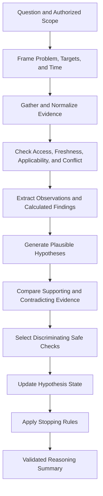

# Project Atlas

## Reasoning

| Field | Value |
| --- | --- |
| Document ID | ATLAS-041 |
| Version | 1.0.0 |
| Status | Approved |
| Document Owner | AI Architecture Owner |
| Reviewers | Architecture Owner, Security Architecture, Infrastructure Domain Architects, Data Science and Evaluation, Operations, Audit and Compliance |
| Approver | Umit Ozdemir (acting Architecture Owner) |
| Approval Date | 2026-08-03 |
| Last Updated | 2026-08-03 |
| Related Documents | [ATLAS-003](003_Project_Principles.md), [ATLAS-014](014_AI_Architecture.md), [ATLAS-015](015_RAG_Architecture.md), [ATLAS-024](024_Decision_Engine.md), [ATLAS-026](026_Graph_Engine.md), [ATLAS-027](027_Knowledge_Engine.md), [ATLAS-040](040_AI_Agents.md), [ATLAS-042](042_Root_Cause_Analysis.md), [ATLAS-046](046_Explainability.md), [ATLAS-047](047_Guardrails.md) |
| Supersedes | ATLAS-041 version 0.1.0 |

## 1. Purpose

This document defines evidence-grounded AI-assisted reasoning in Project Atlas. It specifies how Atlas frames a question, gathers authorized evidence, distinguishes observation from inference, compares hypotheses, represents uncertainty, and produces a reviewable reasoning summary.

Reasoning supports decisions; it is not authority. Private model chain-of-thought is neither required nor exposed. Atlas provides concise, verifiable rationales tied to evidence and deterministic calculations.

## 2. Scope

### In Scope

- Reasoning inputs, evidence units, claims, hypotheses, tests, and output contracts
- Temporal, causal, graph, historical, and counterfactual reasoning patterns
- Uncertainty, confidence, conflict, missing-data, and stopping behavior
- Model and deterministic-service responsibilities
- Validation, audit, observability, and evaluation

### Out of Scope

- Model training and hosting covered by ATLAS-014
- Domain-specific RCA workflow covered by ATLAS-042
- Recommendation ranking covered by ATLAS-043
- Private model reasoning traces
- Using AI judgment as policy, authorization, or approval

## 3. Objectives

- Ground material claims in current, authorized, and applicable evidence
- Keep facts, calculations, inferences, assumptions, hypotheses, and unknowns distinct
- Compare plausible alternatives and actively seek discriminating evidence
- Represent uncertainty without fabricated precision
- Preserve time, scope, source, version, and data quality
- Stop safely when evidence or controls are inadequate
- Produce reasoning artifacts that engineers can inspect, challenge, and reproduce

## 4. Epistemic Types

Every material statement has one type:

| Type | Meaning | Example form |
| --- | --- | --- |
| Observation | Direct time-stamped source or connector result | Port state was down at 10:04 UTC |
| Retrieved fact | Statement from a cited governed source | Vendor guide states the threshold for this version |
| Calculated finding | Deterministic result from declared inputs and method | 87 percent capacity from observed totals |
| Correlation | Co-occurrence or statistical association | Latency rose after path errors increased |
| Inference | Evidence-supported interpretation | Degraded paths likely contributed to latency |
| Hypothesis | Testable candidate explanation | Fabric instability may be the initiating cause |
| Assumption | Unverified condition used temporarily | Multipathing policy is assumed unchanged |
| Unknown | Material information not available or reliable | Current host queue depth is unknown |
| Recommendation | Proposed next check or action | Validate path state on both fabrics |

Language and output structure must not convert one type into another.

## 5. Evidence Unit

An evidence unit contains:

- Stable evidence ID and immutable artifact version
- Source type, source system, owner where known, and authority class
- Collection or publication time and applicable time range
- Target, environment, site, product, model, and version applicability
- Data classification and authorization reference
- Observation or retrieval method
- Normalized content or bounded excerpt
- Integrity, completeness, freshness, and quality indicators
- Conflict, supersession, and transformation lineage
- Citation target safe for the current user

Evidence without required scope, time, provenance, or access metadata cannot support a consequential claim without an explicit limitation.

## 6. Claim Contract

Each material claim records:

- Stable claim ID and epistemic type
- Concise claim text
- Scope and time window
- Supporting evidence IDs
- Contradicting or weakening evidence IDs
- Assumptions and dependencies
- Confidence category and rationale
- Agent and deterministic-method versions
- Validation state and reviewer feedback
- Relationships to hypotheses, findings, decisions, and recommendations

Claims can be superseded, corrected, or withdrawn without rewriting historical reasoning.

## 7. Reasoning Process

The process may iterate within explicit time, tool-call, risk, and resource limits.

## 8. Problem Framing

Atlas establishes:

- User's question and desired decision
- Target entities, business services, environment, site, and organizational boundary
- Symptom, expected state, actual state, and first known time
- Analysis window and timezone
- Current impact and urgency
- Available and inaccessible evidence classes
- Required freshness and confidence for intended use
- Capability-class ceiling for further checks
- Success and stopping conditions

Ambiguous target identity, mixed environments, or incompatible time windows are resolved or disclosed before analysis.

## 9. Evidence Acquisition

Evidence sources may include:

- Live C1 connector observations and approved bounded C2 diagnostics
- Health checks, alerts, logs, metrics, and traces
- Infrastructure graph entities, relationships, and observations
- Vendor documentation, release notes, KBs, and compatibility data
- Approved internal standards and runbooks
- Incident, problem, change, and execution outcomes
- User-provided observations with explicit provenance class
- Policy, workflow, approval, and audit records

Retrieval is purpose- and scope-authorized. More data is not automatically better; Atlas selects the smallest relevant evidence set and preserves source restrictions.

## 10. Evidence Quality

Quality is represented across separate dimensions:

- Authority and provenance
- Integrity and collection method
- Target and product-version applicability
- Temporal freshness and coverage
- Completeness and resolution
- Independence from other evidence
- Consistency with related observations
- Known source bias or limitations
- Access and classification confidence

A single aggregate quality score must not hide one critical weakness. For example, authoritative vendor guidance can still be inapplicable to the installed version.

## 11. Temporal Reasoning

- Events use UTC and preserve source and ingestion time.
- Clock quality and known skew are visible.
- Atlas distinguishes occurrence, observation, ingestion, and report times.
- A timeline identifies changes, symptoms, alerts, recovery, and data gaps.
- Later observation does not prove later causation.
- Stale topology or health data is not silently treated as current.
- Analysis windows account for propagation, queueing, sampling, and delayed collection.
- Conflicting timestamps reduce certainty and may require a new check.

## 12. Graph and Dependency Reasoning

ATLAS-026 supplies time-aware entities and relationships. Reasoning must:

- Identify relationship type, direction, source, and observation time
- Distinguish physical, logical, service, ownership, and inferred relationships
- Traverse only authorized graph scope
- Bound depth and expansion to avoid irrelevant blast radius
- Preserve alternative paths, redundancy, and shared dependencies
- Avoid treating mere reachability as active dependency
- Expose missing or low-confidence relationships
- Cite graph evidence used for impact or causality claims

## 13. Hypothesis Ledger

Every candidate hypothesis includes:

- Hypothesis ID and concise causal statement
- Initiating, contributing, and amplifying factors where known
- Scope, onset, and expected observable consequences
- Supporting evidence
- Contradicting or absent expected evidence
- Assumptions and known confounders
- Safe checks that would discriminate it from alternatives
- Current state: proposed, supported, weakened, rejected, confirmed, or unresolved
- Confidence category and reason for change

Atlas keeps multiple plausible hypotheses until evidence discriminates among them.

## 14. Hypothesis Generation

Candidate causes come from:

- Current symptoms and topology
- Domain fault models and approved diagnostic knowledge
- Recent changes and configuration drift
- Known product-version defects and compatibility constraints
- Historical incidents with comparable evidence, not merely similar text
- Resource saturation, dependency failure, control-plane failure, and observation error
- User-supplied hypotheses

Generation is bounded and diverse enough to avoid fixation. Rare possibilities are included only when evidence, severity, or diagnostic cost justifies them.

## 15. Discriminating Checks

A useful next check:

- Is authorized and within the task capability ceiling
- Produces evidence that changes relative support among hypotheses
- Has bounded target, duration, load, output, and data exposure
- States expected results under each leading hypothesis
- Avoids service change where a read-only alternative exists
- Has stop, timeout, and failure behavior
- Does not repeat already sufficient evidence without reason

Atlas ranks checks by information gain, safety, freshness, cost, and time, using deterministic support where feasible.

## 16. Causal Reasoning Rules

- Correlation is not labeled root cause.
- Temporal precedence is necessary for many causal claims but is not sufficient.
- A shared upstream dependency can explain correlated downstream symptoms.
- A recent change is a candidate, not proof.
- Recovery after an action strengthens a hypothesis only when alternative causes and coincident recovery are considered.
- Missing expected consequences can weaken a hypothesis.
- Confirmed cause requires domain-defined evidence and validation criteria.
- Multiple contributing causes and latent conditions are supported.
- Human confirmation is preserved as evidence with identity and time, not as infallible truth.

## 17. Counterfactual and Alternative Analysis

For material decisions, Atlas asks:

- What would be expected if the leading hypothesis were false?
- Which evidence is equally explained by another cause?
- What changed while unaffected peers remained stable?
- Which redundant path or component should have prevented impact?
- Could the observation source itself be faulty or stale?
- Would the proposed check or action create an indistinguishable result?

Counterfactual statements are labeled as estimates unless supported by a validated simulator or historical experiment.

## 18. Confidence Representation

Confidence is an evidence assessment, not a probability of guaranteed correctness and never an authorization signal.

Atlas uses calibrated categories such as:

| Category | Meaning |
| --- | --- |
| Insufficient | Evidence cannot support a useful conclusion |
| Low | Plausible but materially dependent on assumptions or missing data |
| Moderate | Multiple applicable evidence units support the claim; alternatives remain |
| High | Strong, current, independent, domain-relevant evidence with limited alternatives |
| Confirmed | Domain-defined verification criteria have been met and reviewed where required |

Every category includes supporting factors, reducing factors, important unknowns, and what evidence could change it. Numeric scores are used only after calibration against domain datasets and are displayed with their interpretation.

## 19. Confidence Updating

- New evidence changes confidence through documented rules or a versioned model.
- Duplicate or derivative evidence is not counted as independent support.
- Stale or inapplicable evidence reduces support.
- Contradictory authoritative evidence is surfaced and cannot be averaged away.
- Human correction creates a new reasoning version.
- Confidence never increases because an action was approved.
- Lack of an alert is evidence only when alert coverage and health are known.

## 20. Missing and Conflicting Evidence

When evidence is missing, Atlas states:

- What is missing and why it matters
- Whether it is inaccessible, unavailable, stale, failed, or never collected
- Which conclusions are weakened
- The safest useful next check
- Whether a partial answer remains appropriate

When evidence conflicts, Atlas preserves each source, applicability, authority, time, and likely reconciliation path. It does not silently choose the text most convenient to the recommendation.

## 21. Deterministic and Model Responsibilities

### Deterministic Services

- Authorization and policy evaluation
- Schema, identifier, scope, time, unit, and version validation
- Graph queries and declared calculations
- Event ordering and timeline normalization
- Evidence retrieval, citation checks, and access control
- Confidence thresholds and required-output gates where specified
- Audit, workflow state, and connector dispatch

### Model-Assisted Responsibilities

- Problem framing suggestions
- Evidence summarization
- Hypothesis generation and comparison
- Identification of assumptions, conflicts, and unknowns
- Proposed discriminating checks
- Audience-appropriate reasoning summary

Model output cannot override deterministic results.

## 22. Reasoning Artifact

A versioned reasoning artifact includes:

- Question, scope, targets, time window, and intended decision
- Evidence inventory and quality assessment
- Timeline and observed facts
- Calculated findings and declared methods
- Hypothesis ledger with supporting and contradicting evidence
- Assumptions, unknowns, conflicts, and excluded evidence
- Selected checks and their results
- Confidence categories and rationale
- Current conclusion and alternatives
- Stop reason and recommended next evidence
- Agent, model, prompt, tool, graph, knowledge, and policy versions

The artifact is immutable; updates create a new version linked to the prior one.

## 23. User-Facing Reasoning Summary

The summary communicates:

1. What is known
2. What Atlas infers and why
3. Which alternatives remain
4. What is unknown or stale
5. How confident Atlas is and why
6. What safe check would most improve the conclusion
7. What decision the current evidence can and cannot support

It does not expose private chain-of-thought, hidden prompts, secrets, or unauthorized evidence.

## 24. Stopping Rules

Reasoning stops when:

- The user's bounded question is answered at the required evidence level
- A domain confirmation criterion is met
- The next check requires unavailable permission or human approval
- Evidence is insufficient and no safe useful check remains
- Tool, time, context, or resource budget is exhausted
- New checks repeat existing evidence without meaningful discrimination
- A guardrail, data boundary, or policy blocks further work
- The user cancels or the task expires

Stopping reports the current state; it does not fabricate closure.

## 25. Safety and Security

- Retrieved text and tool output cannot change instruction priority or authorize tools.
- Reasoning does not reveal hidden resource existence or restricted evidence.
- Secrets and raw credentials never enter model context.
- Generated queries and checks are schema-validated and capability-limited.
- High-impact conclusions require current and applicable evidence.
- A plausible recommendation remains non-executable until independent controls are satisfied.
- Prompt injection and malicious-content findings are preserved as security evidence.

## 26. Audit and Reproducibility

ATLAS-032 records reasoning-artifact identity, task scope, agent, model and prompt versions, evidence references, tool calls, claim and hypothesis states, validation, human correction, stop reason, and resulting decision references.

Reproduction means reconstructing governed inputs, declared methods, and output artifact. Exact token-for-token model output is not required and must not be falsely promised.

## 27. Observability

- Reasoning tasks by domain, question, state, and stop reason
- Evidence count, freshness, quality, conflict, and access-denial rates
- Hypotheses generated, rejected, unresolved, and confirmed
- Tool calls, information gain proxies, repetition, and budget exhaustion
- Citation and claim-support validation failures
- Confidence distribution and calibration drift
- Human corrections, disputed claims, and accepted findings
- Latency and model or deterministic component contribution

## 28. Evaluation

- Claim support and citation correctness
- Fact, inference, assumption, hypothesis, and unknown classification
- Temporal and target-scope accuracy
- Alternative-hypothesis coverage and fixation resistance
- Discriminating-check usefulness and safety
- Confidence calibration and response to contradictory evidence
- Version and applicability handling
- Permission denial and hidden-data isolation
- Prompt-injection and malicious-evidence resistance
- Human engineer agreement, correction type, and decision usefulness

Datasets include answerable, ambiguous, insufficient, stale, conflicting, misleading, and adversarial cases.

## 29. MVP Scope

### Included

- Structured evidence and claim contracts
- Problem framing and hypothesis ledger
- Facts, inferences, assumptions, unknowns, and alternatives
- Categorical confidence with rationale
- Safe discriminating-check proposals
- Temporal and graph-aware reasoning
- Versioned reasoning artifact and concise user summary
- Citation, schema, access, and guardrail validation

### Excluded

- Universal numeric probability claims
- Autonomous causal discovery
- Private chain-of-thought display or storage
- Model-only policy, authorization, or approval decisions
- Claim of digital-twin simulation without a validated simulation engine

## 30. Dependencies and Traceability

- ATLAS-003 defines evidence, confidence, time-awareness, and explainability principles.
- ATLAS-014 supplies AI orchestration and model boundaries.
- ATLAS-015 and ATLAS-027 provide governed knowledge evidence.
- ATLAS-024 consumes validated reasoning artifacts for decisions.
- ATLAS-026 supplies time-aware graph evidence.
- ATLAS-040 defines agents, tools, and task contracts.
- ATLAS-042 specializes this contract for root cause analysis.
- ATLAS-046 renders user-facing explanations.
- ATLAS-047 enforces AI safety boundaries.

## 31. Assumptions

- Source quality, freshness, terminology, and observability differ by infrastructure domain.
- Deterministic services can normalize identifiers, units, timestamps, and graph relationships.
- Domain owners can define confirmation criteria and evaluation cases.
- Some investigations will remain unresolved despite correct reasoning behavior.

## 32. Open Questions and ADR Backlog

- Which categorical confidence rubric is adopted per MVP domain?
- Which calculations and hypothesis updates must be deterministic in the first release?
- What evidence freshness gates apply to high-impact recommendations?
- Which domain and fault family form the initial evaluation set?
- How are user corrections incorporated without turning opinion into fact?
- What minimum evidence is required before Atlas may use the word `confirmed`?

## 33. Acceptance Criteria

This document is ready to enter Review when:

- Epistemic types, evidence units, claims, hypotheses, and reasoning artifacts are agreed.
- Temporal, graph, causal, alternative, missing, and conflicting evidence behavior is testable.
- Confidence has a calibrated interpretation and cannot grant authority.
- Deterministic and model responsibilities are unambiguous.
- User explanations provide concise evidence-grounded rationale without private chain-of-thought.
- Stopping and refusal rules prevent fabricated closure.
- AI, domain, security, evaluation, operations, and audit reviewers accept the contract.

## 34. Change History

| Version | Date | Author | Summary |
| --- | --- | --- | --- |
| 0.1.0 | 2026-07-21 | Project Atlas Team | Initial reasoning principles, inputs, outputs, and questions |
| 0.2.0 | 2026-08-03 | AI Architecture Owner | Added epistemic and evidence contracts, temporal and graph reasoning, hypothesis ledger, discriminating checks, confidence model, deterministic boundaries, artifacts, stopping, evaluation, and reproducibility |
| 1.0.0 | 2026-08-03 | Umit Ozdemir | Approved as the first binding documentation baseline under the designated approver authority |
