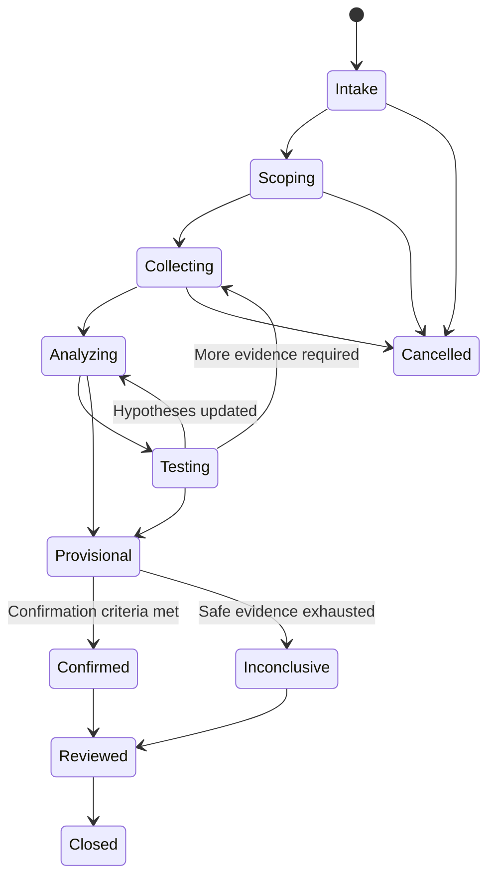

# Project Atlas

## Root Cause Analysis

| Field | Value |
| --- | --- |
| Document ID | ATLAS-042 |
| Version | 1.0.0 |
| Status | Approved |
| Document Owner | AI and Infrastructure Analysis Owner |
| Reviewers | AI Architecture, Architecture Owner, Infrastructure Domain Architects, Operations, IT Service Management Owner, Security Architecture, Data Science and Evaluation |
| Approver | Umit Ozdemir (acting Architecture Owner) |
| Approval Date | 2026-08-03 |
| Last Updated | 2026-08-03 |
| Related Documents | [ATLAS-003](003_Project_Principles.md), [ATLAS-015](015_RAG_Architecture.md), [ATLAS-023](023_Workflow_Engine.md), [ATLAS-024](024_Decision_Engine.md), [ATLAS-026](026_Graph_Engine.md), [ATLAS-027](027_Knowledge_Engine.md), [ATLAS-036](036_ITSM_Integration.md), [ATLAS-040](040_AI_Agents.md), [ATLAS-041](041_Reasoning.md), [ATLAS-043](043_Recommendation_Engine.md), [ATLAS-046](046_Explainability.md) |
| Supersedes | ATLAS-042 version 0.1.0 |

## 1. Purpose

This document defines evidence-grounded Root Cause Analysis for Project Atlas. RCA correlates symptoms, events, topology, changes, knowledge, and historical outcomes to identify and test probable initiating and contributing causes.

Atlas must not call a correlation a root cause. RCA remains provisional until declared domain confirmation criteria are met and, where required, validated by an accountable engineer.

## 2. Scope

### In Scope

- Incident framing, evidence acquisition, timelines, symptom clusters, and hypothesis analysis
- Cross-domain correlation through the infrastructure graph
- Initiating, contributing, amplifying, and latent causes
- Diagnostic planning, confirmation, uncertainty, and output contracts
- RCA workflow states, human review, learning, audit, and evaluation

### Out of Scope

- General reasoning primitives covered by ATLAS-041
- Recommendation selection covered by ATLAS-043
- Autonomous remediation
- Replacement of vendor engineering or formal post-incident review
- Guaranteed causal proof from incomplete operational telemetry

## 3. Objectives

- Reduce time spent gathering and correlating evidence across infrastructure domains
- Distinguish user-visible symptoms from causal and contributing conditions
- Identify affected services and common dependencies
- Compare current evidence with applicable vendor knowledge and historical incidents
- Recommend the safest high-value diagnostic checks
- Communicate uncertainty, alternatives, data gaps, and observation quality
- Preserve a versioned case that can support incident, problem, and learning processes

## 4. Cause Taxonomy

| Type | Definition |
| --- | --- |
| Symptom | Observed deviation or user-visible effect requiring explanation |
| Trigger | Event that initiated the incident sequence |
| Root cause | Underlying condition whose removal or correction prevents the incident in the defined scope |
| Contributing cause | Condition that increased likelihood or enabled the incident |
| Amplifying factor | Condition that increased duration, blast radius, or severity |
| Latent condition | Pre-existing weakness that remained hidden until combined with a trigger |
| Recovery factor | Condition or action that reduced or ended impact |
| Observation failure | Monitoring, collection, mapping, clock, or sensor behavior that created or distorted the symptom |
| Coincidental event | Temporally related event without supported causal contribution |

One incident can have multiple root or contributing causes across technical and process domains. The chosen scope and prevention criterion must be explicit.

## 5. RCA Case Contract

Each case includes:

- Stable case ID, version, owner, state, severity, and timestamps
- Incident, problem, alert, change, and service-record references
- User report and normalized symptoms
- Target entities, environments, sites, services, and analysis window
- Current impact, affected and unaffected peers, and business criticality
- Evidence inventory, access constraints, and freshness requirements
- Timeline and topology snapshot references
- Hypothesis ledger and diagnostic plan
- Findings, confidence, confirmation state, and reviewer decisions
- Recommendation, recovery, and follow-up references
- Agent, model, prompt, tool, connector, graph, and knowledge versions

Case updates create immutable versions or append-only events; they do not rewrite prior conclusions.

## 6. RCA Lifecycle

Cases can be reopened through a new version when contradictory evidence or recurrence appears.

## 7. Intake and Scoping

RCA intake establishes:

- What failed or degraded and who observed it
- Expected versus actual behavior
- First known symptom, last known good state, and current state
- Affected and explicitly unaffected users, services, hosts, paths, devices, and sites
- Severity, urgency, data-protection risk, and active incident status
- Recent changes, maintenance, failover, recovery, or environmental events
- Analysis time window and clock confidence
- Available permissions, connector health, and evidence sources
- Whether immediate human incident response takes priority over analysis

Atlas does not delay urgent safety or service-restoration procedures to complete an AI analysis.

## 8. Evidence Sources

- Alerts and health findings
- Metrics, logs, traces, events, and audit records
- Current and historical connector observations
- Configuration, firmware, software, compatibility, and capacity state
- Infrastructure graph and business-service dependencies
- Redundancy, path, replication, cluster, and protection state
- Recent incident, problem, change, and maintenance records
- Vendor documentation, KBs, release notes, and known defects
- Approved runbooks and architectural standards
- Human observations and completed diagnostic results

All evidence follows ATLAS-041 provenance, time, quality, access, and classification rules.

## 9. Collection Plan

The plan ranks evidence by:

- Ability to distinguish leading hypotheses
- Current impact and time sensitivity
- Data freshness and source authority
- Capability class and operational risk
- Target load, duration, and output volume
- Permission, privacy, and classification
- Expected latency and availability
- Redundancy with evidence already collected

Read-only and already-ingested evidence is preferred. C2 diagnostics are bounded and may require approval. C3-C5 operations are not RCA collection tools.

## 10. Timeline Construction

The timeline distinguishes:

- Source event time
- Collection or observation time
- Atlas ingestion time
- Human report time
- Change implementation and validation time
- Symptom onset, propagation, detection, mitigation, and recovery

Events are normalized to UTC while preserving source precision and clock quality. Late, duplicated, reordered, or inferred events are labeled. A temporal cluster is not presented as a causal chain without supporting dependency and mechanism evidence.

## 11. Symptom Clustering

Atlas groups symptoms using:

- Time proximity and propagation pattern
- Shared upstream dependencies
- Common product, version, site, fabric, cluster, pool, host, or service
- Similar error codes or measured behavior
- Affected and unaffected comparison groups
- Change and maintenance context
- Known observation-source limitations

Clustering is reversible. One incident may contain independent failures, and similar messages may have different causes.

## 12. Topology and Common-Cause Analysis

ATLAS-026 is used to:

- Trace affected services to infrastructure dependencies
- Find shared nodes, paths, fabrics, arrays, clusters, networks, sites, and control planes
- Evaluate redundancy and alternate paths
- Compare affected and unaffected branches
- Identify graph changes during the incident window
- Bound blast radius and locate missing relationships
- Distinguish configured, observed, inferred, and historical topology

Shared dependency is a cause candidate. It is not confirmation without a plausible mechanism and time-aligned evidence.

## 13. Change Correlation

Recent changes are evaluated by:

- Exact target and affected dependency overlap
- Implementation and symptom timing
- Configuration or state difference before and after
- Known expected effects and failure modes
- Verification and rollback outcome
- Similar unaffected targets that received the same change
- Other simultaneous changes or environmental events

`It changed recently` is not sufficient. Atlas also considers latent defects exposed by normal load and incidents with no recorded change.

## 14. Historical Similarity

Historical incidents support RCA only when comparison includes:

- Product, model, version, configuration, and environment
- Symptom and error evidence
- Topology and dependency pattern
- Trigger and timeline
- Confirmed cause and actual remediation outcome
- Data quality and incident-review status

Text similarity alone is insufficient. Historical cases are examples with bounded applicability, not proof.

## 15. Hypothesis Generation

Atlas generates a bounded hypothesis set covering, where relevant:

- Target component failure or degradation
- Shared upstream dependency failure
- Configuration drift or incompatible change
- Capacity, saturation, queueing, or performance contention
- Redundancy, path, quorum, replication, or protection degradation
- Software, firmware, interoperability, or known-defect behavior
- Authentication, authorization, certificate, DNS, time, or control-plane failure
- Environmental or site condition
- Observation, telemetry, parsing, or graph-mapping failure
- Independent coincidental incidents

Domain fault models and approved knowledge guide generation. Unsupported exotic causes are not given equal weight merely for variety.

## 16. Hypothesis Analysis

For each hypothesis, the RCA records:

- Proposed mechanism from cause to symptom
- Expected affected and unaffected entities
- Expected temporal sequence
- Supporting evidence and its quality
- Contradicting evidence and missing expected observations
- Confounders and assumptions
- Safe discriminating checks
- Current state and confidence rationale

Evidence derived from the same source is not counted as independent corroboration.

## 17. Diagnostic Plan

A diagnostic step declares:

- Question it will answer
- Target, scope, and capability class
- Exact connector capability or evidence source
- Preconditions, expected duration, load, and output size
- Expected result under leading hypotheses
- Timeout, stop, and error behavior
- Required role, policy, and approval
- Data classification and retention
- Next branch for each result

Atlas never presents an unrestricted command as a diagnostic plan.

## 18. Confirmation Levels

| Level | Description |
| --- | --- |
| Suspected | Plausible candidate with limited support |
| Supported | Multiple applicable evidence units and mechanism support the cause |
| Strongly supported | Current independent evidence, alternatives weakened, and expected consequences observed |
| Confirmed | Domain-defined verification criteria and required human or outcome review are satisfied |
| Rejected | Reliable evidence contradicts the hypothesis in the defined scope |
| Inconclusive | Available safe evidence cannot discriminate sufficiently |

Each infrastructure domain defines confirmation criteria. Recovery after an action alone does not necessarily confirm cause.

## 19. Root Cause Statement

A root-cause statement includes:

- Defined incident and scope
- Initiating condition and mechanism
- Affected dependency path and propagation
- Trigger, contributing, amplifying, and latent factors
- Evidence supporting each material part
- Confirmation level and accountable reviewer where required
- Contradicting evidence or residual uncertainty
- Why alternatives were weakened
- Prevention or verification implication

The statement avoids blame and unsupported organizational conclusions.

## 20. Active Incident Behavior

- Current service safety and human incident command take priority.
- Atlas clearly marks live versus historical data.
- Analysis updates are versioned and do not overwrite prior status.
- Low-risk evidence collection is bounded to avoid worsening an incident.
- Recommendations distinguish service restoration from permanent correction.
- If impact expands, data becomes stale, or a control fails, Atlas pauses affected diagnostics and alerts the user.
- The AI does not declare an incident resolved; authoritative health and human process determine resolution.

## 21. RCA Output Contract

The output includes:

1. Incident and impact summary
2. Analysis scope, time window, and data freshness
3. Affected and unaffected components and services
4. Timeline
5. Confirmed observations and calculated findings
6. Ranked hypotheses with mechanisms
7. Supporting and contradicting evidence per hypothesis
8. Confidence or confirmation level and rationale
9. Assumptions, unknowns, conflicts, and evidence gaps
10. Recommended next diagnostic checks
11. Provisional or confirmed root-cause statement
12. Restoration, remediation, prevention, and verification references
13. Risk, impact, interruption, recovery, policy, and approval notes

Sections unavailable from evidence are labeled, not invented.

## 22. Human Review

Reviewers can:

- Accept, dispute, or correct observations and entity mappings
- Add evidence or alternate hypotheses
- Mark a hypothesis weakened, rejected, or confirmed with reason
- Define or apply domain confirmation criteria
- Separate multiple incidents or merge related cases with preserved lineage
- Approve the final problem-record summary
- Record remediation and actual outcome

Human input is attributable and does not erase the AI artifact it corrects.

## 23. Integration with Recommendations and ITSM

- ATLAS-043 consumes the current RCA artifact but preserves uncertainty.
- Restoration options can be produced before final cause confirmation when operationally necessary.
- Permanent corrective recommendations require stronger cause and applicability evidence.
- ATLAS-036 links the case to incident and problem records.
- AI-generated ticket text is labeled and versioned.
- Closing a ticket does not automatically confirm the Atlas root cause.
- Post-incident outcomes can enter ATLAS-027 only through governed review.

## 24. Failure and Stopping Behavior

RCA stops or remains inconclusive when:

- Target or incident scope cannot be established
- Required evidence is inaccessible, stale, conflicting, or untrustworthy
- Safe diagnostic options are exhausted
- The next check exceeds permission, risk, or capability limits
- Connector, graph, knowledge, or time synchronization is unreliable
- Time, tool-call, or resource budget is exhausted
- Human incident command cancels or redirects analysis
- Guardrails or policy block further collection

The output names the blocker and safest useful next step.

## 25. Security and Privacy

- Incident scope and evidence access follow source permissions.
- Logs, tickets, topology, and knowledge are minimized before model context.
- Secrets and raw credentials are prohibited.
- Retrieved instructions are treated as evidence, not executable authority.
- Diagnostic proposals pass connector, RBAC, policy, and guardrail checks.
- Hidden entities do not leak through topology, similarity, or impact summaries.
- Cases and exports carry classification and retention.

## 26. Audit and Reproducibility

ATLAS-032 records case versions, identities, scope, evidence and tool references, timeline construction, hypothesis changes, diagnostic requests and results, model and prompt versions, human corrections, confirmation decisions, ITSM links, and stop reasons.

Reproduction uses immutable evidence references and declared deterministic methods. Exact model wording may differ; supported claims and decision state must remain inspectable.

## 27. Observability

- Cases by domain, state, severity, age, and outcome
- Time to first scoped assessment, leading hypothesis, and confirmation
- Evidence-source coverage, freshness, denial, and failure
- Diagnostic calls, retries, denials, and information gain
- Hypotheses per case and ranking changes
- Inconclusive and reopened cases
- Human correction, disagreement, and confirmation rates
- ITSM synchronization and post-incident-review completion
- Model, prompt, connector, graph, and knowledge version performance

## 28. Evaluation

### Technical Measures

- Root-cause top-k recall for reviewed cases
- Precision of supported and confirmed claims
- False-positive cause rate
- Citation and evidence correctness
- Timeline and affected-scope accuracy
- Alternative-hypothesis coverage
- Diagnostic-check safety and usefulness
- Confidence and confirmation calibration
- Time and tool use to useful assessment

### Operational Measures

- Engineer acceptance and correction types
- Reduction in evidence-gathering time
- Contribution to MTTD and MTTR without unsafe action
- Repeat-incident and prevention usefulness
- Inconclusive rate by missing telemetry class

Evaluation datasets preserve privacy and include no-cause, multiple-cause, telemetry-failure, stale-topology, recent-change, misleading-similarity, and adversarial cases.

## 29. MVP Scope

### Included

- One selected infrastructure domain and bounded fault families
- Versioned RCA case, timeline, symptom cluster, and hypothesis ledger
- Graph, connector, knowledge, incident, and change evidence
- Safe C0/C1 diagnostic planning with optional reviewed C2 proposals
- Supported, rejected, inconclusive, and human-confirmed states
- Structured output and ITSM incident or problem linking
- Evaluation against reviewed synthetic and historical cases

### Excluded

- Universal cross-domain causal diagnosis
- Autonomous remediation
- Claiming confirmation without domain criteria
- Unbounded live diagnostics
- Model training directly from unreviewed incidents
- Organizational blame or personnel-performance conclusions

## 30. Dependencies and Traceability

- ATLAS-003 requires evidence, confidence, time-awareness, and human control.
- ATLAS-015 and ATLAS-027 supply governed vendor and organizational knowledge.
- ATLAS-023 provides durable investigation workflow state.
- ATLAS-024 consumes findings and produces decisions.
- ATLAS-026 supplies time-aware topology and service dependencies.
- ATLAS-036 links incidents, problems, changes, and outcomes.
- ATLAS-040 defines agent and tool boundaries.
- ATLAS-041 supplies reasoning and confidence contracts.
- ATLAS-043 turns supported findings into options and recommendations.
- ATLAS-046 defines user-facing explanation.

## 31. Assumptions

- The first MVP domain has domain experts and representative cases.
- Relevant source systems expose sufficient read-only telemetry.
- Incident and change timestamps can be normalized with known limitations.
- Many real incidents remain multi-causal or inconclusive.

## 32. Open Questions and ADR Backlog

- Which infrastructure domain and fault families are the first RCA target?
- What domain criteria permit the state `Confirmed`?
- Which C2 diagnostics are useful and safe enough for MVP review?
- Which historical cases can be used legally and with sufficient outcome quality?
- What top-k recall, false-positive, and calibration thresholds block release?
- How are active-incident resource limits coordinated with human incident command?

## 33. Acceptance Criteria

This document is ready to enter Review when:

- Symptom, trigger, root, contributing, amplifying, latent, recovery, and observation-failure terms are agreed.
- Case, timeline, hypothesis, diagnostic, confirmation, and output contracts are testable.
- Correlation, recent change, shared dependency, and historical similarity cannot be presented as causal proof alone.
- Domain confirmation and human-review requirements are explicit.
- Failure produces inconclusive state and next evidence rather than fabricated cause.
- Evaluation includes false positives, alternative causes, telemetry failure, and engineer review.
- AI, domain, operations, ITSM, security, and evaluation reviewers accept the contract.

## 34. Change History

| Version | Date | Author | Summary |
| --- | --- | --- | --- |
| 0.1.0 | 2026-07-21 | Project Atlas Team | Initial RCA goals, inputs, output, and questions |
| 0.2.0 | 2026-08-03 | AI and Infrastructure Analysis Owner | Added cause taxonomy, case lifecycle, timeline, topology, change and historical correlation, hypotheses, diagnostics, confirmation, human review, evaluation, and MVP boundaries |
| 1.0.0 | 2026-08-03 | Umit Ozdemir | Approved as the first binding documentation baseline under the designated approver authority |
