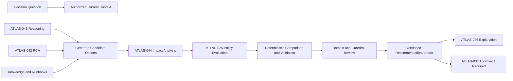
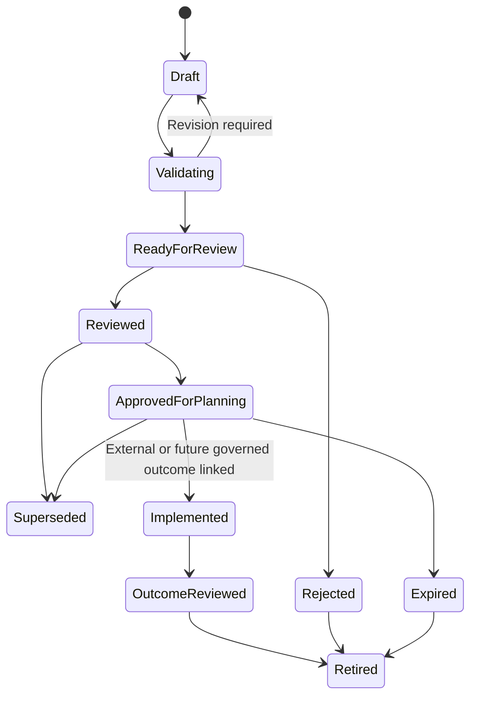

# Project Atlas

## Recommendation Engine

| Field | Value |
| --- | --- |
| Document ID | ATLAS-043 |
| Version | 1.0.0 |
| Status | Approved |
| Document Owner | Decision Intelligence Owner |
| Reviewers | AI Architecture, Architecture Owner, Infrastructure Domain Architects, Security Architecture, Operations, IT Service Management Owner, Audit and Compliance |
| Approver | Umit Ozdemir (acting Architecture Owner) |
| Approval Date | 2026-08-03 |
| Last Updated | 2026-08-03 |
| Related Documents | [ATLAS-003](003_Project_Principles.md), [ATLAS-023](023_Workflow_Engine.md), [ATLAS-024](024_Decision_Engine.md), [ATLAS-025](025_Policy_Engine.md), [ATLAS-026](026_Graph_Engine.md), [ATLAS-027](027_Knowledge_Engine.md), [ATLAS-037](037_Approval_Workflow.md), [ATLAS-041](041_Reasoning.md), [ATLAS-042](042_Root_Cause_Analysis.md), [ATLAS-044](044_Change_Impact.md), [ATLAS-045](045_Runbook_Engine.md), [ATLAS-046](046_Explainability.md), [ATLAS-047](047_Guardrails.md) |
| Supersedes | ATLAS-043 version 0.1.0 |

## 1. Purpose

This document defines how Project Atlas creates, compares, validates, versions, and presents operational recommendations.

A recommendation is decision support, not an instruction with inherent authority. Atlas presents evidence-based options and a preferred option when justified; accountable humans retain the decision, and independent authorization, policy, approval, and runtime controls remain mandatory.

## 2. Scope

### In Scope

- Recommendation request, option, ranking, plan, and artifact contracts
- Evidence, confidence, applicability, risk, impact, duration, interruption, and recovery
- Diagnostic, restoration, remediation, prevention, capacity, and change recommendations
- Human review, feedback, lifecycle, audit, observability, and evaluation
- Integration with RCA, impact analysis, runbooks, policy, approval, and ITSM

### Out of Scope

- Root-cause determination covered by ATLAS-042
- Detailed impact-calculation methods covered by ATLAS-044
- Executing or approving recommended actions
- Replacing organizational change or incident procedures
- Optimizing for vendor commercial preference

## 3. Objectives

- Produce useful choices rather than one opaque answer
- Make the evidence, assumptions, uncertainty, tradeoffs, and policy constraints inspectable
- Include safe deferral, additional diagnosis, and no-action options when appropriate
- Prefer lower-risk, reversible, and better-evidenced approaches
- Show affected services, interruption, duration, stop conditions, and recovery before change
- Prevent stale or inapplicable guidance from being presented as current
- Learn from reviewed outcomes without automatically reinforcing historical mistakes

## 4. Recommendation Categories

| Category | Purpose | Typical posture |
| --- | --- | --- |
| Observe | Continue monitoring with explicit trigger and expiry | C0 |
| Investigate | Gather additional evidence | C0-C2 |
| Contain | Limit active impact or exposure | Usually human-governed C3-C4 |
| Restore | Return service through temporary or durable means | Usually human-governed C3-C4 |
| Remediate | Correct a supported cause | C3-C5 depending on action |
| Prevent | Reduce recurrence through configuration, process, or architecture | Planned change |
| Capacity | Add, rebalance, or retire resources | Planned change |
| Security | Correct control, access, trust, or exposure risk | Policy-dependent |
| Escalate | Route to vendor, specialist, incident command, or governance | No infrastructure action by Atlas |
| Defer or no action | Accept current state temporarily with monitoring and review trigger | Explicit residual risk |

Category does not determine capability class by itself. Each option is classified by realistic worst-case effect.

## 5. Recommendation Architecture

The LLM may draft options and rationale. Deterministic services own schema, calculation, policy, version, and control checks.

## 6. Recommendation Request

The request declares:

- Decision to be supported and accountable audience
- Target systems, services, environment, site, and organizational scope
- Problem, symptom, finding, or planned-change references
- Intended horizon: immediate response, maintenance window, tactical, or strategic
- Constraints such as availability, budget, skill, support, compliance, and change freeze
- Required evidence freshness and confidence
- Maximum capability class and whether execution planning is permitted
- Accepted interruption, recovery, and residual-risk bounds where known
- Deadline and review or ITSM context

Atlas asks for clarification or returns bounded assumptions when the decision cannot be framed safely.

## 7. Candidate Generation

Candidates can be derived from:

- Confirmed observations and supported RCA hypotheses
- Approved vendor guidance applicable to product and version
- Approved internal architecture standards and runbooks
- Current topology, redundancy, capacity, and health
- Historical changes and incidents with verified outcomes
- Policy-required actions or prohibitions
- Domain fault and maintenance patterns
- User-proposed options

Candidate generation includes, when meaningful:

- A safe diagnostic option
- A temporary restoration or workaround option
- A permanent corrective option
- An escalation option
- A defer or no-action option with explicit consequence

Retrieved procedures are evidence; they are not automatically approved recommendations.

## 8. Option Contract

Every option contains:

### Identity and Applicability

- Stable option ID and version
- Category and concise title
- Products, versions, environments, targets, services, and time applicability
- Source recommendations, runbooks, cases, and vendor references

### Proposed Approach

- Intended outcome
- Exact action or ordered conceptual steps
- Connector capabilities or manual procedures involved
- Capability class per step
- Preconditions and required current observations
- Expected duration and maintenance window
- Success and verification criteria
- Stop conditions

### Evidence and Uncertainty

- Supporting facts and evidence references
- RCA or finding references
- Assumptions, unknowns, contradictions, and stale data
- Confidence category and rationale
- Evidence that would raise or lower confidence

### Risk and Impact

- Technical and business risk level with rationale
- Affected components, dependencies, and services
- Blast radius, redundancy, performance, capacity, security, and data-protection effects
- Expected and worst credible interruption
- Failure modes and partial-completion behavior
- Residual risk after success

### Recovery and Governance

- Rollback or recovery plan
- Rollback feasibility and point of no return
- Estimated recovery duration and data implications
- Required roles, policies, approvals, ITSM record, and vendor support
- Post-action monitoring and review

An option missing required safety information is labeled incomplete and cannot be preferred for consequential use.

## 9. Recommendation Artifact

The artifact contains:

- Stable recommendation ID, version, owner, state, creation, review, and expiry
- Request and current-context snapshot references
- Candidate options including no-action where applicable
- Comparison criteria, weights or precedence, and policy constraints
- Preferred option or explicit decision not to prefer one
- Reasoning summary and evidence lineage
- Impact-analysis versions and data freshness
- Required human review and approval path
- Supersession, correction, execution, and actual-outcome links
- Agent, model, prompt, rule, policy, connector, graph, and knowledge versions

Artifacts are immutable. Material context or option changes create a new version.

## 10. Comparison Criteria

Options are compared across separate dimensions:

- Evidence strength and applicability
- Expected effectiveness
- Service and business impact
- Capability class and security risk
- Reversibility and recovery quality
- Expected duration and interruption
- Operational complexity and prerequisites
- Resource, capacity, and cost implications
- Vendor support and compatibility
- Time to restore versus time to permanently correct
- Residual risk and recurrence prevention
- Policy, approval, change-window, and skill feasibility

One opaque aggregate score is insufficient for consequential choices. Tradeoffs remain visible.

## 11. Ranking and Preferred Option

- Non-overridable policy removes prohibited options before preference.
- Options with insufficient applicability, missing rollback, or unknown blast radius are not labeled safe.
- Lower risk, stronger evidence, reversibility, and smaller interruption are preferred when effectiveness is comparable.
- Immediate restoration and permanent remediation can have different preferred options.
- Customer objectives and weights are explicit and versioned.
- Ties or materially different tradeoffs can produce multiple co-equal options.
- The engine may state that no option is currently supportable.
- AI explanation cannot override deterministic exclusions.

## 12. Risk Model

Risk is represented by dimensions rather than a single unexplained label:

- Service availability and performance
- Data loss, corruption, protection, and recoverability
- Security, access, trust, and compliance
- Scope and blast radius
- Reversibility and point of no return
- Operational complexity and human error exposure
- Evidence uncertainty and stale context
- Vendor support and compatibility
- Timing, change window, and concurrent activity

An overall category can summarize these dimensions only with rationale and the highest material concern visible.

## 13. Impact and Duration

ATLAS-044 provides change-impact analysis. Recommendations disclose:

- Direct and transitive affected infrastructure
- Affected business and technical services
- Redundant paths and single points of failure
- Expected, plausible worst-case, and unknown impact
- Preparation, execution, validation, and recovery duration ranges
- Possible full, partial, intermittent, or performance interruption
- Data freshness and graph completeness
- Assumptions behind estimates

Estimates are ranges when precise measurement is not justified.

## 14. Preconditions and Readiness

Preconditions can include:

- Current backup, replication, redundancy, quorum, path, and health validation
- Supported product and firmware or software compatibility
- Sufficient capacity, resources, and licenses
- Required personnel, vendor support, and communication
- Approved maintenance window and no conflicting freeze
- Current topology and impact analysis
- Tested rollback or recovery assets
- Valid identity, role, policy, approval, and change record
- Audit, connector, and platform health

Preconditions are verifiable and have freshness limits. Unmet preconditions block readiness.

## 15. Implementation Plan

A plan separates:

1. Preparation
2. Pre-change validation
3. Communication and maintenance-window entry
4. Ordered implementation steps
5. Checkpoints and stop conditions
6. Service and technical validation
7. Rollback or recovery decision point
8. Post-change monitoring
9. ITSM and evidence update

Steps reference approved runbook or connector capability versions. Free-form shell commands are not silently generated as executable plans.

## 16. Rollback and Recovery

- Rollback returns to a known prior state where technically possible.
- Recovery restores service or data when direct rollback is unavailable.
- The artifact identifies irreversible steps and point of no return.
- Trigger conditions, responsible role, required evidence, and estimated duration are explicit.
- Backup existence is not treated as recoverability without relevant restore evidence.
- Rollback impact can differ from implementation impact and is analyzed separately.
- An option without credible rollback can be considered only with visible residual risk and appropriate governance.

## 17. Diagnostic Recommendations

Diagnostic options state:

- Question answered and hypotheses discriminated
- Target, connector capability, and C0-C2 class
- Expected load, duration, output, and retention
- Required role, policy, and approval
- Expected result patterns and next branches
- Timeout, stop, failure, and ambiguous-result behavior

Atlas prefers a read-only check over a state-changing test when both provide similar evidence.

## 18. Restoration versus Permanent Remediation

Atlas distinguishes:

- Workaround: reduces symptoms without correcting cause
- Restoration: returns service to acceptable state
- Remediation: corrects a supported cause
- Prevention: reduces recurrence or blast radius

Urgent restoration may proceed through human procedures before RCA confirmation, but uncertainty and the need for follow-up remain explicit. Temporary success does not prove root cause.

## 19. Vendor and Runbook Applicability

- Guidance must match product, model, version, configuration, and support status.
- Vendor authority and internal policy can have different purposes; conflicts are visible.
- Superseded, stale, generated, or unapproved runbooks cannot appear as authoritative.
- Historical success is weighted by environmental similarity and outcome quality.
- Unsupported combinations or end-of-support status are highlighted.
- Recommendation citations preserve exact source versions.

## 20. Policy and Approval

- ATLAS-025 evaluates prohibited, permitted, and approval-required states.
- ATLAS-037 binds approval to one exact recommendation, target, parameter set, plan, policy, and window.
- Approval does not make an option technically correct or grant missing RBAC.
- Policy or context changes invalidate readiness and may require a new recommendation version.
- C5 actions are not autonomously executable.
- Early Atlas releases may provide an approved plan for human handoff without any execution capability.

## 21. Recommendation States

`ApprovedForPlanning` is not infrastructure execution authority.

## 22. Freshness and Invalidating Events

Recommendation readiness is re-evaluated when:

- Target state, topology, service impact, capacity, or redundancy changes
- New alert, incident, or conflicting evidence appears
- Product, firmware, software, connector, runbook, or knowledge version changes
- Policy, role, approval, maintenance window, or change record changes
- Credential or connector health becomes invalid
- Expiry or maximum evidence age is reached

Atlas shows which inputs are stale and which sections require recalculation.

## 23. Human Review and Feedback

Reviewers can:

- Accept, reject, revise, or request evidence
- Change assumptions or decision constraints
- Add an option or explain why one is infeasible
- Correct target, impact, duration, or recovery estimates
- Record preferred option and accountable rationale
- Link actual implementation and outcome

Human changes create attributable versions. Acceptance is not hidden model training data and does not automatically prove recommendation quality.

## 24. Outcome Learning

After a human-executed or future governed action, Atlas records:

- Exact recommendation and plan version used
- Deviations from plan
- Actual start, duration, interruption, and affected scope
- Success, partial success, failure, rollback, or recovery
- Actual root cause and validation where known
- New incidents or side effects
- Reviewer lessons and follow-up

ATLAS-027 governs conversion into organizational knowledge. Failed or successful outcomes both inform evaluation after review.

## 25. Security and Privacy

- Recommendation access follows target, evidence, incident, and knowledge permissions.
- Secrets and raw credentials never enter artifacts or model context.
- Hidden targets and services are not disclosed through blast-radius summaries.
- Generated procedures and connector artifacts are untrusted.
- Prompt injection cannot alter policy, option ranking, or citation authority.
- Export and sharing preserve classification and redaction.
- Security Review and deterministic guardrails validate every consequential artifact.

## 26. Audit and Reproducibility

ATLAS-032 records request, scope, evidence, reasoning, RCA, candidate options, excluded options, comparison criteria, policy outcomes, impact versions, preferred option, human review, approval link, expiry, supersession, and actual outcome.

Reproduction reconstructs inputs, deterministic calculations, source versions, and artifact. Exact prose need not be identical, but claims and ranking rationale remain inspectable.

## 27. Observability

- Recommendations by category, domain, risk, state, and age
- Options per request and no-supportable-option rate
- Evidence, applicability, impact, rollback, and validation completeness
- Policy-denied and approval-required options
- Human acceptance, rejection, revision, and evidence-request rates
- Freshness invalidation and supersession reasons
- Estimated versus actual duration, interruption, impact, and outcome
- Model, prompt, knowledge, runbook, graph, and policy version performance

## 28. Evaluation

- Evidence and citation correctness
- Domain and version applicability
- Option coverage, diversity, and feasibility
- Preference quality and tradeoff transparency
- Risk and impact completeness
- Duration and interruption calibration
- Preconditions, stop, verification, and recovery quality
- Policy, RBAC, approval, and guardrail compliance
- Safe no-action, escalation, and insufficient-evidence behavior
- Human usefulness, correction, and actual-outcome comparison

Evaluation includes unsafe user proposals, stale guidance, conflicting sources, no rollback, hidden dependencies, low confidence, and no viable option.

## 29. MVP Scope

### Included

- Versioned request, option, plan, and recommendation artifact
- Diagnostic, escalation, restoration-planning, remediation-planning, and no-action categories
- Visible multidimensional comparison and preferred option where justified
- Evidence, confidence, applicability, risk, impact, duration, interruption, preconditions, validation, and recovery
- Policy and approval requirements without execution
- Human review, expiry, supersession, ITSM link, and outcome capture
- Evaluation in the first RCA and infrastructure domain

### Excluded

- Autonomous infrastructure execution
- Universal cost optimization
- Vendor-commercial ranking
- Unsupported precise downtime guarantees
- Recommendation from unreviewed generated runbooks or connectors
- Automatic learning from unverified outcomes

## 30. Dependencies and Traceability

- ATLAS-003 defines the standard recommendation and human-control contract.
- ATLAS-023 provides durable lifecycle and review workflows.
- ATLAS-024 and ATLAS-025 own decision and policy contracts.
- ATLAS-026 and ATLAS-044 provide topology and impact.
- ATLAS-027 and ATLAS-045 govern knowledge and runbooks.
- ATLAS-037 governs exact approval binding.
- ATLAS-041 and ATLAS-042 provide reasoning and RCA evidence.
- ATLAS-046 and ATLAS-047 govern explanation and safety.

## 31. Assumptions

- Organizations can define service criticality, policy, and decision constraints.
- The first domain has approved vendor guidance and runbooks.
- Actual execution outcomes can be linked manually or through ITSM.
- Some situations will have no supportable recommendation.

## 32. Open Questions and ADR Backlog

- Which recommendation categories and domain scenarios are first in MVP?
- Which comparison dimensions are ordered rules versus customer weights?
- What evidence, impact, and rollback fields are release-blocking by capability class?
- What expiry and freshness defaults apply to each category?
- How are duration and interruption estimates calibrated initially?
- Which actual outcomes can be imported automatically versus requiring human review?

## 33. Acceptance Criteria

This document is ready to enter Review when:

- Request, option, comparison, plan, recommendation, and outcome contracts are agreed.
- No-action, defer, escalation, diagnostic, restoration, remediation, and prevention choices are represented where applicable.
- Preferred options preserve visible tradeoffs and deterministic policy exclusions.
- Every consequential option includes impact, interruption, duration, preconditions, verification, and recovery or an explicit blocking gap.
- Recommendation approval cannot authorize execution or replace RBAC and policy.
- Freshness, supersession, human review, and outcome evaluation are testable.
- AI, domain, operations, security, ITSM, and audit reviewers accept the contract.

## 34. Change History

| Version | Date | Author | Summary |
| --- | --- | --- | --- |
| 0.1.0 | 2026-07-21 | Project Atlas Team | Initial recommendation requirements, sources, safety, and questions |
| 0.2.0 | 2026-08-03 | Decision Intelligence Owner | Added recommendation categories, request and option contracts, multidimensional comparison, risk, impact, readiness, implementation and recovery plans, lifecycle, outcome learning, evaluation, and MVP boundaries |
| 1.0.0 | 2026-08-03 | Umit Ozdemir | Approved as the first binding documentation baseline under the designated approver authority |
