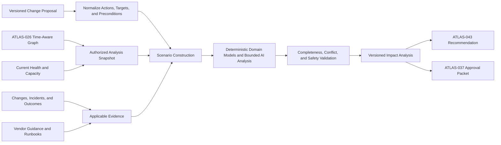

# Project Atlas

## Change Impact Analysis

| Field | Value |
| --- | --- |
| Document ID | ATLAS-044 |
| Version | 1.0.0 |
| Status | Approved |
| Document Owner | Infrastructure Architecture Owner |
| Reviewers | AI Architecture, Architecture Owner, Infrastructure Domain Architects, Service Owners, Operations, IT Service Management Owner, Security Architecture, Capacity Management |
| Approver | Umit Ozdemir (acting Architecture Owner) |
| Approval Date | 2026-08-03 |
| Last Updated | 2026-08-03 |
| Related Documents | [ATLAS-003](003_Project_Principles.md), [ATLAS-013](013_Deployment_Architecture.md), [ATLAS-024](024_Decision_Engine.md), [ATLAS-025](025_Policy_Engine.md), [ATLAS-026](026_Graph_Engine.md), [ATLAS-036](036_ITSM_Integration.md), [ATLAS-037](037_Approval_Workflow.md), [ATLAS-041](041_Reasoning.md), [ATLAS-043](043_Recommendation_Engine.md), [ATLAS-045](045_Runbook_Engine.md), [ATLAS-046](046_Explainability.md) |
| Supersedes | ATLAS-044 version 0.1.0 |

## 1. Purpose

This document defines how Project Atlas estimates the technical and business impact of a proposed infrastructure change before it occurs.

Change Impact Analysis identifies likely affected components and services, service interruption modes, blast radius, duration, recovery exposure, and uncertainty. It informs planning and approval; it does not authorize or execute the change.

## 2. Scope

### In Scope

- Change request, target, graph snapshot, scenario, and impact-result contracts
- Direct, transitive, shared-dependency, redundancy, capacity, security, and data-protection impact
- Expected, degraded, failure, rollback, and no-change scenarios
- Duration, interruption, uncertainty, confidence, and validation
- Integration with recommendations, runbooks, policy, approval, ITSM, and future simulation

### Out of Scope

- General recommendation ranking covered by ATLAS-043
- Workflow or connector execution
- Guaranteed prediction of undocumented vendor behavior
- Calling graph traversal alone a digital twin
- Customer-specific business-impact valuation without approved input data

## 3. Objectives

- Identify affected infrastructure and business services before change
- Expose single points of failure, redundancy degradation, shared dependencies, and hidden blast radius
- Estimate full, partial, intermittent, and performance interruption
- Separate preparation, execution, validation, rollback, and recovery duration
- Compare expected and credible failure scenarios
- Make stale topology, missing dependencies, unsupported assumptions, and estimate ranges visible
- Give approvers enough context to make an informed decision

## 4. Change Categories

- Configuration modification
- Software, firmware, driver, or patch update
- Restart, failover, takeover, or controller transition
- Path, zoning, fabric, network, DNS, or certificate change
- Storage volume, pool, replication, snapshot, or protection change
- Virtualization host, cluster, datastore, or VM change
- Operating-system service or host maintenance
- Backup, restore, retention, or policy change
- Capacity expansion, rebalance, migration, or retirement
- Identity, security, trust, or access-control change
- Atlas platform, connector, policy, or integration change

Each proposed step receives an ATLAS-003 capability class based on realistic worst-case behavior.

## 5. Analysis Architecture

Deterministic graph and domain calculations are authoritative over generated prose. AI assists with interpretation, gaps, and explanation.

## 6. Change Request Contract

The analysis request contains:

- Stable request and proposed-change version
- Purpose, expected outcome, and change category
- Exact actions or conceptual steps and their order
- Connector capabilities or manual procedure references
- Target entities, environment, site, and organizational scope
- Typed parameters with secret references instead of values
- Proposed start, maintenance window, and deadline
- Preconditions, success criteria, stop conditions, and rollback plan
- Current incident or change context
- Allowed analysis scope, data classes, and freshness requirements
- Requested scenarios and audience

An ambiguous target or materially incomplete plan cannot produce a high-confidence impact result.

## 7. Analysis Snapshot

Impact is calculated against an immutable, time-stamped snapshot referencing:

- Target inventory and configuration
- Physical, logical, service, protection, and ownership relationships
- Active and standby paths, redundancy groups, clusters, fabrics, controllers, and sites
- Current health, alerts, capacity, load, latency, and maintenance state
- Business service criticality and service owner
- Backup, replication, snapshot, recovery, and data-protection state
- Recent and concurrent changes
- Product, firmware, software, compatibility, and support state
- Graph source, confidence, observation time, and known gaps

The snapshot is an analysis artifact, not an assertion that infrastructure will remain unchanged.

## 8. Impact Dimensions

| Dimension | Questions |
| --- | --- |
| Availability | Which services may become unavailable, degraded, or intermittent? |
| Performance | Which latency, throughput, queueing, or contention effects are plausible? |
| Capacity | Is there sufficient headroom during transition, failover, rebuild, or rollback? |
| Redundancy | Which alternate paths, controllers, replicas, or nodes are lost temporarily? |
| Data | Is there risk to consistency, protection, retention, replication, or recoverability? |
| Security | Does trust, access, exposure, logging, or policy posture change? |
| Operations | Which teams, skills, vendor support, communications, and monitoring are required? |
| Compliance | Are change, retention, evidence, or separation controls affected? |
| Recovery | Can the prior or acceptable state be restored, and within what range? |
| Business | Which services, owners, users, commitments, and critical periods are affected? |

An overall risk summary preserves the highest material dimensions and rationale.

## 9. Dependency Traversal

Atlas traverses from each target through relevant relationships to:

- Parent and child infrastructure components
- Hosts, clusters, hypervisors, datastores, volumes, pools, fabrics, switches, paths, and arrays
- Operating systems, applications, databases, backup jobs, and protection services
- Business and technical services
- Shared control planes, networks, identity, DNS, time, and management dependencies
- Redundancy, failover, replication, quorum, and recovery relationships

Traversal is direction-, type-, time-, and depth-aware. It distinguishes configured, observed, inferred, and historical edges and preserves inaccessible or missing subgraphs.

## 10. Direct and Transitive Impact

- Direct impact affects the target or component explicitly changed.
- First-order impact affects immediate consumers, peers, or redundancy partners.
- Transitive impact propagates through declared dependency paths.
- Shared-dependency impact affects otherwise separate branches.
- Operational impact affects monitoring, management, backup, or recovery capability.
- Business impact maps technical effect to services and owners.

Each affected item includes the path and relationship evidence that connects it to the change. Unbounded reachability is not labeled impact.

## 11. Redundancy Analysis

The analysis identifies:

- Normal and maintenance redundancy level
- Components or paths intentionally removed by the change
- Existing degraded or failed redundant elements
- Failover eligibility, readiness, and recent test evidence
- Shared fate that invalidates apparent redundancy
- Quorum, witness, replication, and synchronization state
- Capacity and performance of remaining paths or nodes
- Single points of failure created during implementation or rollback

Configured redundancy is not assumed operational without current evidence appropriate to risk.

## 12. Capacity and Performance Analysis

- Current utilization, peak, trend, and forecast
- Headroom during failover, evacuation, rebuild, resynchronization, or migration
- Queue depth, bandwidth, IOPS, latency, CPU, memory, and storage constraints as applicable
- Workload concurrency and business peak periods
- Rate limits and vendor operating thresholds
- Performance effect of diagnostics, validation, and rollback
- Measurement coverage, age, and aggregation limitations

Estimates use units, formulas, assumptions, and ranges. Lack of telemetry is visible.

## 13. Data Protection and Recoverability

Atlas evaluates:

- Backup recency, status, scope, immutability, and relevant restore evidence
- Replication mode, lag, consistency, and failover state
- Snapshot, retention, and protection-policy consequences
- Write ordering, application consistency, and split-brain or divergence risk
- Recovery point and recovery time implications
- Point of no return and irreversible deletion or conversion
- Rollback versus recovery distinction
- Legal hold or retention constraints

Backup existence alone does not make a destructive change safe.

## 14. Service and Business Impact

For each service, Atlas reports:

- Service ID, name, owner, criticality, and supporting graph path
- Expected impact mode and affected function
- User or location scope where known
- Expected and worst credible interruption range
- Degradation and recovery dependencies
- Relevant SLA, maintenance, freeze, or business-calendar context
- Confidence and missing service mappings

Hidden or unauthorized service details are summarized without leaking names or relationships.

## 15. Interruption Model

Impact modes include:

- No expected user-visible interruption
- Redundancy reduced without current service loss
- Performance degradation
- Partial service unavailability
- Intermittent errors or reconnect behavior
- Planned full outage
- Unplanned outage under failure scenario
- Data unavailability or recovery-only state
- Unknown due to insufficient evidence

For every mode, Atlas states trigger, affected scope, duration range, detection, and recovery expectation.

## 16. Duration Model

Duration is decomposed into:

| Phase | Examples |
| --- | --- |
| Preparation | Backup, health validation, staging, communication |
| Transition | Failover, evacuation, path removal, service stop |
| Implementation | Change, upgrade, restart, migration, configuration |
| Stabilization | Rejoin, resync, rebuild, cache warmup, path recovery |
| Validation | Technical and service checks |
| Rollback | Return to previous state before point of no return |
| Recovery | Restore or alternate recovery when rollback is unavailable |

Atlas reports ranges with basis, comparable outcomes, vendor guidance, and factors that can extend them. It does not present false minute-level precision.

## 17. Scenario Model

At minimum, consequential analysis considers:

### Expected Scenario

All declared preconditions hold and the change follows documented behavior.

### Degraded Starting Scenario

One relevant redundancy, capacity, monitoring, protection, or dependency condition is already impaired.

### Implementation Failure Scenario

A step fails, times out, partially completes, or returns an unknown result.

### Failover or Recovery Failure Scenario

The intended redundant path, rollback, or recovery mechanism does not operate as expected.

### Concurrent Event Scenario

A plausible independent failure or conflicting change occurs during the window.

### No-Change Scenario

The current condition remains and its expected risk or deterioration is assessed.

Scenarios are bounded to plausible, decision-relevant conditions and carry separate assumptions and confidence.

## 18. Risk Classification

Risk incorporates:

- ATLAS-003 capability class
- Service criticality and blast radius
- Interruption mode and duration
- Data and security consequence
- Starting health and redundancy
- Reversibility and recovery evidence
- Plan complexity and manual dependency
- Evidence freshness and graph completeness
- Product support and historical outcome
- Timing and concurrent work

An unknown or incomplete critical dimension raises uncertainty and can raise minimum governance; it is not treated as zero risk.

## 19. Estimation Methods

Impact estimates may use:

- Deterministic graph traversal and rule evaluation
- Domain formulas and capacity models
- Vendor-documented behavior and timing
- Approved runbook step timing
- Comparable reviewed historical outcomes
- Validated lab measurements
- Human expert estimates with provenance
- Bounded AI synthesis of the above

Every estimate declares method and evidence. Model-only estimates without applicable support are labeled insufficient for consequential approval.

## 20. Digital Twin and Simulation Maturity

Atlas uses explicit maturity levels:

| Level | Capability | Permitted claim |
| --- | --- | --- |
| D0 | Static dependency and rule analysis | Potentially affected graph and rule-based risk |
| D1 | Time-aware state snapshot and scenario analysis | Estimated impact under declared assumptions |
| D2 | Validated domain simulation | Simulated result within tested domain and model limits |
| D3 | Calibrated cross-domain digital twin | Comparative simulation with measured error and coverage |

The MVP targets D0-D1. Atlas must not call graph traversal or LLM prediction a validated digital twin. Simulation output records model version, parameters, validation coverage, and known error.

## 21. Unknowns and Conservative Behavior

Unknowns include:

- Unmapped or inaccessible dependencies
- Stale health or configuration
- Unsupported product combination
- Unverified failover or restore
- Missing business-service mapping
- Incomplete plan or rollback
- Concurrent activity outside Atlas visibility
- Vendor behavior not covered by evidence

Atlas shows which impacts may be underestimated. Policy may block recommendation readiness when critical unknowns remain.

## 22. Impact Result Contract

The versioned result contains:

1. Proposed change and exact target summary
2. Snapshot time, scope, and freshness
3. Direct and transitive affected components
4. Affected technical and business services with dependency paths
5. Redundancy, capacity, performance, data, security, and recovery findings
6. Expected and failure scenarios
7. Interruption modes and duration ranges
8. Risk dimensions and capability classes
9. Preconditions, stop conditions, and validation requirements
10. Rollback and recovery impact
11. Assumptions, unknowns, graph gaps, conflicts, and confidence
12. Policy, approval, ITSM, and owner requirements
13. Evidence, method, model, graph, and artifact versions

## 23. Plan-Step Analysis

Multi-step changes are analyzed both per step and cumulatively.

- Each step has target, effect, duration, risk, and checkpoint.
- Temporary states between steps are included.
- Parallel steps expose shared dependencies and combined load.
- Stop and rollback points identify which prior steps remain active.
- A later safe step does not hide earlier irreversible impact.
- Reordering requires a new plan and impact version.
- Parameter or target changes invalidate affected analysis.

## 24. Validation and Review

Automated validation checks:

- Every target resolves to current authorized inventory
- Graph traversal is bounded and cites relationship paths
- Required impact dimensions and scenarios are present
- Units, ranges, formulas, and timestamps are consistent
- Hidden entities are not leaked
- Policy-required service owners and approvals are identified
- Plan and rollback versions match the recommendation
- Critical unknowns prevent unsupported safety claims

Domain and service owners review consequential analyses before formal approval.

## 25. Freshness and Recalculation

Impact is recalculated or invalidated when:

- Target, parameter, plan order, or rollback changes
- Topology, health, capacity, redundancy, protection, or service mapping changes
- New incident, alert, maintenance, or conflicting change appears
- Product, connector, runbook, rule, or simulation version changes
- Change window or business calendar changes
- Evidence exceeds its risk-based freshness limit

The result shows which sections changed and why.

## 26. ITSM and Approval Integration

- ATLAS-036 receives the immutable impact-report version or authorized reference.
- ATLAS-037 binds approval to that exact version, target, plan, policy, and window.
- ITSM approval does not cure stale topology or failed preconditions.
- Service-owner acknowledgement is distinct from technical approval where policy requires.
- A rescheduled change can require refreshed health and impact even when the plan is unchanged.
- Actual impact and duration are imported for review and calibration.

## 27. Human Review and Override

Reviewers can correct entity mapping, service ownership, assumptions, timing, scenario, and historical comparison. Corrections create a new version with identity and rationale.

A human may accept residual uncertainty through an authorized governance process, but Atlas preserves the unknowns and does not relabel them as safe or known.

## 28. Security and Privacy

- Analysis is bounded by target and evidence permissions.
- Hidden topology and business service names are not exposed.
- Secrets and credential values are excluded.
- Generated graph edges, simulations, and plans are treated as untrusted until validated.
- External model use follows configured data boundaries.
- Change details and impact reports carry classification and retention.
- Prompt injection cannot change policy, target scope, or graph authority.

## 29. Audit and Reproducibility

ATLAS-032 records request, change and plan versions, snapshot, graph and evidence references, methods, scenarios, estimates, assumptions, unknowns, validation, human corrections, recommendation and approval links, recalculation, and actual outcome.

Reproduction uses immutable snapshot and version references. A live rerun may differ and is recorded as a new result.

## 30. Observability

- Analyses by category, domain, risk, state, and age
- Graph coverage, missing relationships, and stale evidence
- Services and components per blast-radius result
- Scenario coverage and validation failures
- Duration, interruption, and risk estimate distributions
- Recalculation and invalidation causes
- Human correction and service-owner dispute rates
- Estimated versus actual affected scope, duration, interruption, and rollback
- Rules, models, graph versions, and domain calibration performance

## 31. Evaluation

- Affected and unaffected entity precision and recall
- Business-service mapping correctness
- Redundancy and single-point-of-failure detection
- Interruption-mode classification
- Duration and recovery range calibration
- Risk classification and critical-unknown handling
- Scenario usefulness and failure coverage
- False-safe and false-alarm rates
- Evidence and graph-path correctness
- Human reviewer usefulness and correction type

False-safe predictions receive greater severity than conservative overestimation.

## 32. MVP Scope

### Included

- D0-D1 dependency, state, and scenario analysis
- One selected domain plus cross-domain service mapping where available
- Direct, transitive, redundancy, capacity, performance, data-protection, and business-service dimensions
- Expected, degraded, failure, rollback, and no-change scenarios
- Duration ranges and interruption modes
- Versioned result, human review, ITSM attachment, and approval binding
- Actual-outcome capture and calibration foundation

### Excluded

- Claim of a calibrated cross-domain digital twin
- Autonomous change execution
- Guaranteed downtime prediction
- Unbounded graph traversal
- Business financial valuation without approved data and model
- Simulation of undocumented vendor internals

## 33. Dependencies and Traceability

- ATLAS-003 requires impact, duration, interruption, and recovery before change recommendation.
- ATLAS-013 defines platform deployment impact context.
- ATLAS-024 and ATLAS-025 govern decisions and policy.
- ATLAS-026 supplies time-aware topology and relationship evidence.
- ATLAS-036 and ATLAS-037 link ITSM and exact approval.
- ATLAS-041 provides evidence and confidence rules.
- ATLAS-043 consumes impact for option comparison.
- ATLAS-045 supplies structured plan and timing evidence.
- ATLAS-046 renders audience-specific explanation.

## 34. Assumptions

- Infrastructure and business-service mapping can be incomplete.
- Current health and capacity are available at different freshness levels.
- Vendor behavior and operation duration vary by model, version, load, and environment.
- Actual outcomes can be captured for calibration.

## 35. Open Questions and ADR Backlog

- Which change types and infrastructure domain are first for MVP?
- Which graph relationships are required before an impact result is usable?
- What risk-based freshness limits apply to health, topology, capacity, backup, and service mapping?
- Which deterministic domain models and rules are implemented first?
- What false-safe and duration-calibration thresholds block release?
- Which simulation capabilities qualify for D2 in future phases?

## 36. Acceptance Criteria

This document is ready to enter Review when:

- Request, snapshot, scenario, plan-step, and result contracts are agreed.
- Direct, transitive, redundancy, capacity, data, security, recovery, and service impact are represented.
- Duration is decomposed and uncertainty is visible.
- Critical graph or evidence gaps cannot produce unsupported safety claims.
- MVP digital-twin maturity is accurately limited to D0-D1.
- Approval binds to the exact current impact version and actual outcomes support calibration.
- Domain, service, operations, security, ITSM, and capacity reviewers accept the contract.

## 37. Change History

| Version | Date | Author | Summary |
| --- | --- | --- | --- |
| 0.1.0 | 2026-07-21 | Project Atlas Team | Initial change-impact goals, inputs, output, and questions |
| 0.2.0 | 2026-08-03 | Infrastructure Architecture Owner | Added change and snapshot contracts, dependency and redundancy analysis, impact dimensions, interruption and duration models, scenarios, digital-twin maturity, recalculation, calibration, and MVP boundaries |
| 1.0.0 | 2026-08-03 | Umit Ozdemir | Approved as the first binding documentation baseline under the designated approver authority |
