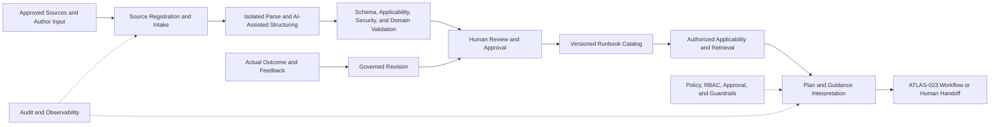
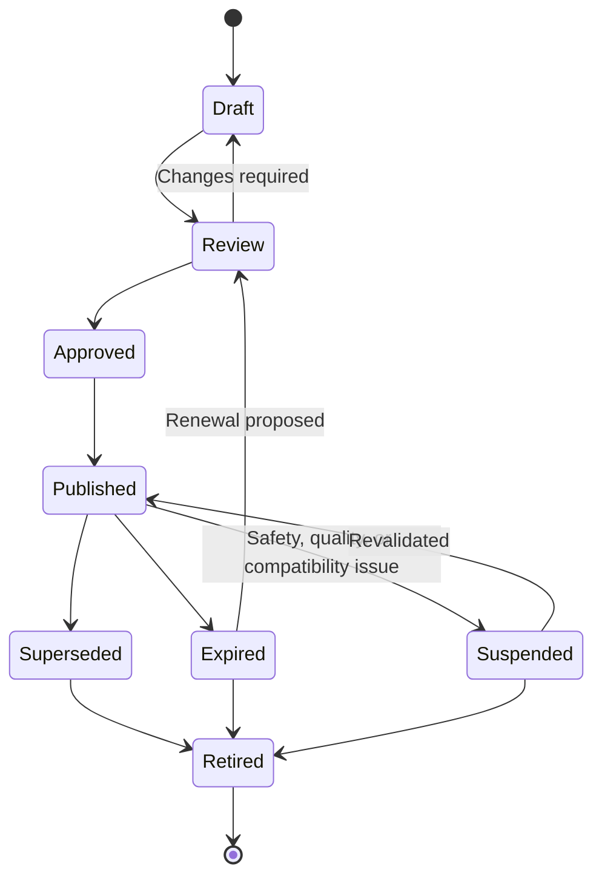

# Project Atlas

## Runbook Engine

| Field | Value |
| --- | --- |
| Document ID | ATLAS-045 |
| Version | 1.0.0 |
| Status | Approved |
| Document Owner | Knowledge and Operations Engineering Owner |
| Reviewers | Architecture Owner, AI Architecture, Infrastructure Domain Architects, Operations, Security Architecture, IT Service Management Owner, Audit and Compliance |
| Approver | Umit Ozdemir (acting Architecture Owner) |
| Approval Date | 2026-08-03 |
| Last Updated | 2026-08-03 |
| Related Documents | [ATLAS-003](003_Project_Principles.md), [ATLAS-015](015_RAG_Architecture.md), [ATLAS-020](020_MCP_Framework.md), [ATLAS-023](023_Workflow_Engine.md), [ATLAS-025](025_Policy_Engine.md), [ATLAS-027](027_Knowledge_Engine.md), [ATLAS-032](032_Audit.md), [ATLAS-037](037_Approval_Workflow.md), [ATLAS-041](041_Reasoning.md), [ATLAS-043](043_Recommendation_Engine.md), [ATLAS-044](044_Change_Impact.md), [ATLAS-047](047_Guardrails.md) |
| Supersedes | ATLAS-045 version 0.1.0 |

## 1. Purpose

This document defines how Project Atlas acquires, structures, governs, retrieves, interprets, validates, and improves operational runbooks.

A runbook is a governed procedural artifact. Retrieval or AI interpretation does not make its steps authorized or executable. Atlas uses runbooks to support diagnosis, planning, review, and future controlled workflows while preserving accountable human control.

## 2. Scope

### In Scope

- Runbook source, schema, lifecycle, ownership, applicability, and approval
- Ingestion, parsing, AI-assisted structuring, validation, publication, and retrieval
- Step, branch, precondition, risk, impact, approval, rollback, recovery, and verification contracts
- Diagnostic guidance, plan generation, dry-run, human handoff, and outcome feedback
- Security, audit, observability, evaluation, and MVP boundaries

### Out of Scope

- General knowledge lifecycle covered by ATLAS-027
- Deterministic workflow runtime covered by ATLAS-023
- Direct LLM execution of runbook steps
- Treating a vendor document as an organization-approved runbook automatically
- Replacing formal operating procedures or change management

## 3. Objectives

- Preserve trusted operational procedures with ownership and exact versions
- Match procedures to the correct product, version, target, environment, and incident context
- Make prerequisites, risks, impacts, approvals, stop conditions, and recovery explicit
- Convert eligible prose into reviewable structure without inventing missing steps
- Prevent stale, ambiguous, generated, or unapproved content from appearing authoritative
- Support safe planning and consistent human execution
- Capture actual outcomes and improvements through governed review

## 4. Runbook Classes

| Class | Purpose | Typical capability ceiling |
| --- | --- | --- |
| Informational | Explain architecture, interpretation, or decision criteria | C0 |
| Health Check | Evaluate defined health conditions | C0-C1 |
| Diagnostic | Gather bounded evidence and branch on results | C1-C2 |
| Restoration | Restore service through approved procedures | C3-C4 |
| Maintenance | Planned lifecycle or configuration activity | C3-C4 |
| Recovery | Recover from failed change, service loss, or data event | C3-C5 |
| Security Response | Investigate or contain a security condition | Policy-dependent |
| Validation | Verify precondition, success, rollback, or recovery | C0-C2 by default |

The class describes purpose, not authorization. Every step has its own capability class and control requirements.

## 5. Runbook Architecture

The Runbook Engine owns procedural semantics and lifecycle. It does not own infrastructure execution.

## 6. Source Types

- Approved internal standard operating procedures
- Vendor procedures and KB articles
- Architecture and engineering maintenance guides
- Incident and recovery procedures
- Security response playbooks
- Change templates and validation checklists
- Reviewed historical plans with verified outcomes
- Human-authored native Atlas runbooks
- AI-drafted candidate runbooks awaiting review

Source authority, license, owner, product/version applicability, and modification rights are recorded.

## 7. Runbook Metadata Contract

Every version contains:

- Stable runbook and immutable version ID
- Title, purpose, class, owner, steward, reviewers, and approver
- Draft, review, approved, published, suspended, superseded, expired, or retired state
- Source and derivation references
- Vendor, product, model, firmware, software, API, and connector compatibility
- Environment, site, service, target type, and organizational applicability
- Trigger, intended outcome, and excluded scenarios
- Capability-class ceiling and per-step classification
- Required roles, skills, authentication assurance, policy, approval, and ITSM records
- Expected duration, interruption, impact, maintenance window, and communication
- Tested date, test environment, result, review date, and expiry
- Data classification, access policy, retention, and export restrictions
- Change history and supersession links

## 8. Structured Runbook Contract

A runbook contains:

1. Purpose and scope
2. Applicability and exclusions
3. Trigger and entry criteria
4. Required context and evidence
5. Roles, responsibilities, and communication
6. Preconditions and readiness checks
7. Risk, impact, interruption, and duration
8. Ordered steps and branches
9. Checkpoints and stop conditions
10. Success and service-validation criteria
11. Rollback and recovery
12. Post-run monitoring and evidence capture
13. ITSM and documentation updates
14. Known failure modes and escalation

Missing mandatory sections are explicit validation findings.

## 9. Step Contract

Each step declares:

- Stable step ID and version
- Purpose and expected state transition
- Human, deterministic workflow, or governed connector actor
- Target selector and allowed scope
- Connector capability ID and version when applicable
- Typed parameters and safe parameter sources
- C0-C5 capability class
- Required role, policy, approval, change window, and assurance
- Preconditions and evidence freshness
- Instructions or deterministic operation
- Expected duration, load, output, and service effect
- Expected result, validation, and branch conditions
- Timeout, retry, idempotency, cancellation, and partial-result behavior
- Stop conditions
- Rollback or recovery link
- Evidence and audit outputs

Free-form command text is documentation, not an executable capability.

## 10. Branch and Decision Contract

- Branch conditions use typed observable fields where possible.
- Expected true, false, unknown, timeout, and error paths are declared.
- AI can summarize branch meaning but cannot silently choose a consequential path.
- Unknown or ambiguous result routes to review or a safe stop.
- Loops have maximum iterations, deadline, and exit conditions.
- Branches cannot broaden target scope or capability class.
- Policy and approval are re-evaluated at consequential boundaries.

## 11. Preconditions

Preconditions may include:

- Correct target identity and environment
- Supported vendor, product, firmware, software, and connector versions
- Current health, redundancy, quorum, path, capacity, and protection state
- Required backup, snapshot, replication, and restore evidence
- Required personnel, vendor support, communication, and maintenance window
- Valid identity, role, policy, approval, and ITSM record
- Audit, model, connector, integration, and platform health
- No conflicting incident, freeze, or concurrent change

Each precondition is verifiable, has a freshness limit, and declares whether failure blocks, warns, or routes to an alternative procedure.

## 12. Risk, Impact, and Duration

Runbooks declare:

- Direct and transitive affected systems and services
- Expected interruption mode and range
- Preparation, execution, stabilization, validation, rollback, and recovery duration
- Redundancy, capacity, data, security, and compliance effect
- Worst credible outcome and residual risk
- Point of no return and irreversible steps
- Required ATLAS-044 analysis for target-specific use

Static runbook estimates are guidance. Target-specific current impact analysis takes precedence.

## 13. Rollback and Recovery

- Rollback steps map to exact forward steps and checkpoints.
- Recovery is defined when direct rollback is impossible.
- Entry criteria and responsible role are explicit.
- Required backups, images, configuration, or spare resources are verified.
- Estimated duration and service effect are declared.
- Partial execution and unknown outcomes have recovery branches.
- A rollback plan that has never been tested is labeled accordingly.
- C5 or irreversible procedures require exceptional governance outside ordinary automation.

## 14. Authoring

Native authoring supports:

- Structured forms and text views
- Stable step and branch identifiers
- Reusable approved subprocedures with pinned versions
- Parameter schemas and constrained target selectors
- Risk, impact, approval, and evidence checklists
- Preview of human and machine interpretations
- Change diff and migration impact
- Validation against simulators or lab connectors
- Collaborative review without overwriting approved versions

Authors cannot embed secret values, unrestricted commands, or dynamic code as trusted executable content.

## 15. AI-Assisted Structuring

AI may propose:

- Metadata and applicability extraction
- Step and branch segmentation
- Parameter candidates and expected outputs
- Missing preconditions, risks, impact, validation, and recovery sections
- Connector capability mappings
- Ambiguity, contradiction, and unsafe-instruction findings
- Test scenarios and reviewer questions

Generated fields retain source spans and confidence. AI does not invent missing vendor facts, approve its output, or publish directly.

## 16. Ingestion and Parsing

- Sources are registered and classified before parsing.
- Files are scanned and parsed in an isolated environment.
- Active content, prompt injection, scripts, macros, and malformed files are treated as untrusted.
- Original artifact, extracted text, structure, and parser version retain lineage.
- Tables, warnings, notes, command blocks, and prerequisites preserve context.
- Unsupported or ambiguous constructs are quarantined or routed to review.
- Source updates create candidate versions; they do not mutate a published runbook.

## 17. Validation

Validation includes:

- Schema and required-section completeness
- Stable identifier and reference integrity
- Product and connector compatibility
- Parameter type and target-scope safety
- Capability classification
- Preconditions, checkpoints, stop, timeout, and unknown-result paths
- Impact, interruption, duration, rollback, and recovery completeness
- Permission, policy, approval, and separation requirements
- Secret, unsafe-command, prompt-injection, and prohibited-content scans
- Branch reachability, loop bounds, and terminal states
- Source fidelity and generated-content labeling

Validation findings have severity, evidence, owner, and resolution state.

## 18. Review and Approval

Required reviewers vary by class and risk:

- Domain reviewer validates technical correctness and applicability.
- Operations reviewer validates usability, timing, communication, and recovery.
- Security reviewer validates permissions, secrets, data, and unsafe behavior.
- Service owner validates target-specific impact where required.
- Governance approver authorizes publication for declared use.

The author or generating AI cannot be the sole approver. Publication approval is distinct from approval to use the runbook on a particular target.

## 19. Lifecycle

Suspension immediately removes a runbook from active recommendation and planning while preserving history.

## 20. Applicability Matching

Matching evaluates:

- Purpose, trigger, symptom, or change category
- Vendor, product, model, firmware, software, and connector version
- Environment, site, service, topology, and target class
- Current health, redundancy, capacity, and protection state
- Required role, policy, maintenance window, and capability class
- Runbook lifecycle, tested status, review date, and expiry
- Source authority and organization-specific precedence

Matches show exact, compatible, partial, conflicting, and inapplicable factors. Text similarity alone cannot establish applicability.

## 21. Retrieval and Selection

- Only authorized runbooks and metadata are returned.
- Published, applicable, current, and tested versions rank above generated or stale content.
- Exact product and version matches rank above generic guidance.
- Conflicting runbooks are shown with authority and scope differences.
- Superseded and retired versions are historical by default.
- A runbook used by an existing plan remains pinned to its exact version.
- No suitable runbook is a valid result.

## 22. Interpretation and Plan Generation

The engine can produce:

- A human checklist
- An incident diagnostic plan
- A target-specific recommendation plan
- An ATLAS-023 workflow draft
- An ATLAS-037 approval packet input

Interpretation binds a runbook version to current targets, parameters, evidence, graph, policy, and impact analysis. Material adaptation creates a derived plan and does not alter the source runbook.

## 23. Dry-Run and Simulation

Dry-run validates without changing infrastructure:

- Target resolution and scope
- Parameter types and required values
- Connector capability availability and trust
- Permission, policy, approval, and change-window requirements
- Precondition query availability
- Branch and terminal-state reachability
- Expected artifacts, logs, audit, and ITSM updates
- Target-specific impact and rollback references

Dry-run does not prove vendor behavior. Simulation claims follow ATLAS-044 maturity levels.

## 24. Execution Boundary

- The AI can retrieve, interpret, and draft a plan.
- The Workflow Engine can manage deterministic state and human tasks.
- Connector dispatch, if introduced, occurs only through governed runtime services.
- The LLM never receives arbitrary execution or infrastructure credentials.
- C3-C5 steps remain unavailable to autonomous AI.
- Every target-specific consequential use requires current authorization, policy, impact, approval, and preconditions.
- Human execution can use a rendered checklist while preserving step completion and evidence.

## 25. Human Handoff

The handoff view provides:

- Exact runbook and derived-plan versions
- Current target and environment
- Applicability and freshness summary
- Roles and responsibilities
- Preconditions and readiness state
- Ordered steps, branches, checkpoints, and stop conditions
- Risk, impact, interruption, duration, and recovery
- Required approval and ITSM context
- Evidence capture and service-validation checklist

Operators can record actual results and deviations without silently editing the runbook.

## 26. Deviation Handling

- Planned deviations are reviewed before use and create a new plan version.
- Unplanned deviation pauses consequential progression where safe.
- Operator records reason, actual state, impact, and decision.
- A different target, parameter, step order, capability, or rollback invalidates bound approval.
- Emergency deviation follows organizational emergency procedure and remains audited.
- Deviations become feedback candidates, not automatic runbook changes.

## 27. Outcome and Improvement

After use, Atlas records:

- Runbook and plan version
- Target and starting context
- Steps completed, skipped, failed, retried, or changed
- Actual duration, interruption, impact, and resource use
- Validation, rollback, recovery, and final outcome
- Operator feedback and missing or ambiguous instruction
- Related incident, problem, or change

Improvement follows ATLAS-027 governed learning: draft revision, evidence, review, approval, publication. One successful outcome does not prove universal safety.

## 28. Security and Privacy

- Runbooks contain secret references, never values.
- Source and runbook access preserve organization and classification.
- Commands and scripts are untrusted artifacts until reviewed and tested.
- Target selectors cannot expand outside authorized scope.
- Retrieved text cannot override platform instructions, policy, or guardrails.
- External model context is minimized according to data-boundary policy.
- Exported checklists and evidence packages are classified and redacted.

## 29. Audit

ATLAS-032 records source registration, parsing, AI generation, validation findings, review, approval, publication, suspension, supersession, retrieval for sensitive use, plan derivation, dry-run, target binding, policy and approval state, human step results, deviations, outcome, feedback, and export.

Audit references exact runbook, step, plan, connector, and policy versions.

## 30. Observability

- Runbooks by class, owner, state, domain, risk, and review status
- Stale, expired, suspended, untested, ownerless, and incompatible versions
- Parsing, validation, quarantine, and review backlog
- Retrieval match, no-match, conflict, and applicability rates
- Plans generated, dry-run failures, approval blocks, and human use
- Step failure, deviation, rollback, recovery, and outcome rates
- Estimated versus actual duration and interruption
- Feedback age and revision completion

## 31. Evaluation

- Source-to-structure fidelity
- Applicability and version-match precision
- Missing precondition, risk, impact, stop, and recovery detection
- Unsafe step and secret detection
- Branch, timeout, partial-result, and rollback completeness
- Retrieval relevance and conflict handling
- Plan correctness and target-scope safety
- Human usability and ambiguity rate
- Outcome and duration calibration
- Prompt-injection and generated-content resistance

Evaluation includes outdated, contradictory, partial, malicious, wrong-version, no-rollback, and overly broad procedures.

## 32. Backup and Recovery

- Catalog, versions, source lineage, approvals, tests, and outcome records are protected.
- Restore preserves state, access, classification, signatures, supersession, and expiry.
- Published plans retain exact runbook references after restore.
- Suspended and retired content must not return to active retrieval accidentally.
- Rebuilt indexes are reconciled with the authoritative catalog.

## 33. MVP Scope

### Included

- Native Markdown or structured YAML/JSON representation selected by ADR, with rendered Markdown view
- Internal health-check and diagnostic runbooks for the first domain
- Governed metadata, schema, lifecycle, versioning, applicability, and expiry
- AI-assisted extraction as a draft with source spans
- Human review and publication
- Authorized retrieval, target-specific plan, dry-run, and human checklist
- Preconditions, risks, impact, duration, approval, rollback, recovery, and outcome capture

### Excluded

- Autonomous C3-C5 execution
- Automatic publication of generated runbooks
- Universal ingestion of every document format
- Arbitrary scripts as trusted workflow steps
- Claiming dry-run proves real-world vendor behavior
- Automatic revision from unreviewed outcomes

## 34. Dependencies and Traceability

- ATLAS-003 defines generated-artifact, impact, approval, and execution boundaries.
- ATLAS-015 and ATLAS-027 supply governed ingestion, retrieval, lifecycle, and learning.
- ATLAS-020 defines connector capabilities and contracts.
- ATLAS-023 owns deterministic workflow execution state.
- ATLAS-025 and ATLAS-037 govern policy and exact approval.
- ATLAS-041 defines evidence and reasoning behavior.
- ATLAS-043 and ATLAS-044 consume runbook plans and timing evidence.
- ATLAS-047 supplies non-overridable AI guardrails.

## 35. Assumptions

- Organizations have at least some owned operational procedures.
- Source procedures vary in structure, quality, and freshness.
- Domain reviewers and lab or simulator environments are available.
- MVP remains primarily decision support and human-guided operation.

## 36. Open Questions and ADR Backlog

- Is structured YAML/JSON or Markdown with a validated sidecar the canonical MVP format?
- Which first-domain health and diagnostic runbooks are selected?
- Which metadata and sections block publication by runbook class?
- What review and expiry intervals apply by risk class?
- Which C2 diagnostic steps can be represented in MVP workflows?
- How are vendor-copyright and internal-procedure distribution rights enforced?

## 37. Acceptance Criteria

This document is ready to enter Review when:

- Runbook, metadata, step, branch, applicability, plan, and outcome contracts are agreed.
- Generated or parsed content cannot publish itself or hide missing procedure details.
- Every consequential procedure exposes current impact, duration, interruption, approval, stop, rollback, and recovery.
- Applicability uses product, version, environment, state, and lifecycle rather than text similarity alone.
- Dry-run and human handoff do not imply autonomous execution.
- Security, domain, operations, ITSM, knowledge, and audit reviewers accept the model.

## 38. Change History

| Version | Date | Author | Summary |
| --- | --- | --- | --- |
| 0.1.0 | 2026-07-21 | Project Atlas Team | Initial runbook goals, metadata, AI use, and questions |
| 0.2.0 | 2026-08-03 | Knowledge and Operations Engineering Owner | Added runbook and step contracts, authoring, AI-assisted structuring, validation, lifecycle, applicability, plans, dry-run, execution boundary, deviations, outcomes, and evaluation |
| 1.0.0 | 2026-08-03 | Umit Ozdemir | Approved as the first binding documentation baseline under the designated approver authority |
