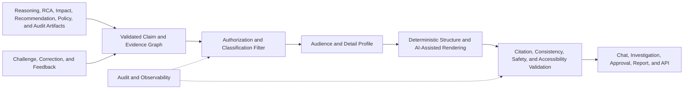

# Project Atlas

## Explainability

| Field | Value |
| --- | --- |
| Document ID | ATLAS-046 |
| Version | 1.0.0 |
| Status | Approved |
| Document Owner | AI Product and Experience Owner |
| Reviewers | AI Architecture, Product Owner, Architecture Owner, Infrastructure Domain Architects, Security Architecture, Operations, IT Service Management Owner, Audit and Compliance, User Experience |
| Approver | Umit Ozdemir (Product Owner) |
| Approval Date | 2026-08-03 |
| Last Updated | 2026-08-03 |
| Related Documents | [ATLAS-003](003_Project_Principles.md), [ATLAS-014](014_AI_Architecture.md), [ATLAS-015](015_RAG_Architecture.md), [ATLAS-024](024_Decision_Engine.md), [ATLAS-026](026_Graph_Engine.md), [ATLAS-032](032_Audit.md), [ATLAS-037](037_Approval_Workflow.md), [ATLAS-040](040_AI_Agents.md), [ATLAS-041](041_Reasoning.md), [ATLAS-042](042_Root_Cause_Analysis.md), [ATLAS-043](043_Recommendation_Engine.md), [ATLAS-044](044_Change_Impact.md), [ATLAS-047](047_Guardrails.md) |
| Supersedes | ATLAS-046 version 0.1.0 |

## 1. Purpose

This document defines how Project Atlas explains findings, hypotheses, recommendations, risks, impacts, policy outcomes, and limitations to users.

Explainability makes evidence and decision rationale inspectable. It does not expose private model chain-of-thought, weaken security boundaries, or convert a plausible AI answer into fact or authority.

## 2. Scope

### In Scope

- Explanation content, levels, audience profiles, evidence links, and interaction
- Confidence, uncertainty, alternatives, impact, policy, and approval explanation
- Chat, investigation, report, approval, audit, and API presentation
- Security, privacy, accessibility, localization readiness, audit, and evaluation

### Out of Scope

- Private model reasoning traces
- General reasoning internals covered by ATLAS-041
- Full UI visual design covered by future ATLAS-052 guidance
- Disclosure of restricted evidence or security-control internals
- Claiming that understandable output is necessarily correct

## 3. Objectives

- Help users understand what Atlas knows, infers, recommends, and cannot determine
- Tie material claims to inspectable authorized evidence
- Show uncertainty, data freshness, conflicts, assumptions, and alternatives
- Communicate risk, service impact, interruption, duration, and recovery before change decisions
- Provide the right detail for engineers, approvers, operators, auditors, and managers
- Let users challenge, correct, and request deeper evidence
- Avoid persuasion patterns that pressure users into accepting AI output

## 4. Explanation Principles

- Evidence precedes assertion.
- Facts, calculations, inferences, hypotheses, assumptions, unknowns, and recommendations remain distinct.
- Concise reasoning summary replaces private chain-of-thought.
- Confidence is explained through supporting and limiting factors.
- Current state is time-stamped and stale data is visible.
- Alternative explanations and no-action consequences are shown when material.
- User access is rechecked before evidence is displayed.
- Explanation depth changes presentation, not the underlying claim or evidence.
- Policy denial and approval requirements use stable reason codes plus human-readable context.
- Atlas may say `insufficient evidence` or `no supportable recommendation`.

## 5. Explanation Architecture

The explanation is a view over authoritative versioned artifacts. It does not become a separate hidden decision source.

## 6. Explanation Object

Every explanation contains or references:

- Stable explanation ID, version, creation time, and expiry or freshness boundary
- Source artifact IDs and versions
- Audience, purpose, channel, language, and detail profile
- Summary and current assessment
- Typed claims and evidence links
- Confidence, assumptions, unknowns, conflicts, and alternatives
- Affected components and services
- Risk, impact, duration, interruption, and recovery where applicable
- Policy, approval, role, and workflow constraints
- Recommended verification or next step
- Redaction and access-filter status
- Renderer, model, prompt, template, and validation versions

Material source changes invalidate or supersede the explanation.

## 7. Required Explanation Elements

### For Findings and RCA

- What was observed and when
- Which targets and services are in scope
- What Atlas infers from the observations
- Leading and alternative hypotheses
- Evidence supporting and contradicting each material hypothesis
- Confidence or confirmation level and why
- Missing or stale evidence
- Next discriminating checks

### For Recommendations

- Decision to be made
- Options considered, including defer or no action when meaningful
- Why an option is preferred or why none is preferred
- Evidence and applicability
- Tradeoffs, risk, impact, interruption, duration, preconditions, and recovery
- Required roles, policy, approval, and ITSM context
- What could change the recommendation

### For Policy and Approval

- Allowed, denied, or approval-required outcome
- Stable reason and relevant control category
- Missing permission, evidence, precondition, or approval without exposing hidden data
- Exact proposal and version subject to approval
- Expiry, invalidation, and next authorized step

## 8. Claim-to-Evidence Mapping

- Every material claim has a stable claim ID.
- Evidence links identify source, version, target, timestamp, authority, and applicability.
- One citation is not reused for unrelated unsupported claims.
- Derived calculations expose method, units, and inputs.
- Graph claims expose the relevant bounded dependency path.
- Historical similarity exposes matching and differing attributes.
- Contradicting evidence is linked near the affected claim.
- Missing evidence is represented as a gap, not an empty citation.

Evidence links open only after current authorization.

## 9. Evidence Inspection

Authorized users can inspect progressively:

1. Source label, authority, time, target, and short support summary
2. Bounded excerpt or normalized observation
3. Surrounding context and source metadata
4. Original governed artifact where permitted
5. Related, superseding, or conflicting evidence

The interface preserves location and version. It does not expose entire restricted documents merely to support one claim.

## 10. Explanation Levels

| Level | Intended use | Content |
| --- | --- | --- |
| L0 Status | Fast scanning | State, severity, confidence, freshness, and next step |
| L1 Summary | Chat and operational overview | Key evidence, assessment, impact, unknowns, and recommendation |
| L2 Technical | Engineer investigation and planning | Claim-evidence details, topology paths, alternatives, calculations, and checks |
| L3 Governance | Approval, audit, and compliance | Authority, policy, approval binding, versions, lineage, and control outcomes |

Users can move between levels without generating a different underlying conclusion.

## 11. Audience Profiles

### Infrastructure Engineer

Emphasize current observations, topology, versions, hypotheses, diagnostics, parameters, technical impact, and validation.

### Operations or NOC Analyst

Emphasize active symptoms, service state, severity, immediate safe checks, escalation, ownership, and timeline.

### Approver or Change Authority

Emphasize exact proposal, evidence quality, alternatives, risk, blast radius, interruption, duration, readiness, rollback, residual risk, and expiry.

### Service Owner or Manager

Emphasize affected service, user or business effect, uncertainty, expected restoration or maintenance range, choices, and accountability without hiding material risk.

### Security or Audit Reviewer

Emphasize identities, authority, policy, guardrails, evidence lineage, data access, versions, decisions, and immutable audit references.

Audience profiles change vocabulary and order, not facts or safety-relevant omissions.

## 12. Confidence and Uncertainty Language

Explanations use the ATLAS-041 confidence categories and include:

- Category definition
- Strongest supporting factors
- Important limiting factors
- Remaining alternatives
- Missing or conflicting evidence
- What evidence could change the category

Atlas avoids unsupported percentages and words such as `certain`, `guaranteed`, `safe`, or `no impact`. `Confirmed` is used only when domain criteria are met.

## 13. Facts and Inferences

Presentation visually and structurally separates:

- Observed facts
- Retrieved guidance
- Deterministic calculations
- AI-assisted inferences
- Hypotheses
- User-provided assumptions
- Unknowns
- Recommendations

A sentence that mixes types is split where practical. Summaries preserve the distinction even when concise.

## 14. Time and Freshness

- Current-state claims show observation time or age.
- Evidence spanning a window shows start, end, and gaps.
- Stale data has a visible warning proportional to intended use.
- Timeline views distinguish occurrence, collection, and ingestion time.
- Reopened explanations show changed evidence and conclusion.
- An old recommendation cannot be displayed as current without revalidation.

## 15. Alternatives and Counterevidence

- Leading alternatives are listed with supporting and weakening evidence.
- Rejected hypotheses retain a concise rejection reason.
- Options not selected retain key tradeoffs and policy constraints.
- No-action or defer consequence is shown when relevant.
- Minority or conflicting evidence is not hidden solely to simplify presentation.
- Exhaustive remote possibilities can be omitted with a bounded explanation of selection criteria.

## 16. Risk and Impact Explanation

For consequential recommendations, explanations show:

- Direct and transitive affected infrastructure
- Affected technical and business services
- Dependency paths and redundancy state
- Availability, performance, capacity, data, security, and recovery risk
- Expected and worst credible interruption modes
- Preparation, execution, validation, rollback, and recovery duration ranges
- Assumptions, graph gaps, and confidence
- Preconditions, stop conditions, and point of no return

Risk labels include rationale and are not represented by color alone.

## 17. Policy and Denial Explanation

Policy explanations balance usefulness and security:

- State the requested operation and outcome.
- Give a stable reason code and safe reason summary.
- Identify the control family: authentication, permission, scope, capability, policy, approval, precondition, trust, or guardrail.
- Show the next authorized action when one exists.
- Avoid revealing hidden resource names, role assignments, thresholds, or detection logic to unauthorized users.
- Provide richer details to eligible security or audit roles.

Denial is never rephrased by the AI as optional advice.

## 18. Approval Explanation

The approval view explains:

- Who requested the exact proposal and why
- Which action, target, parameters, plan, impact, and window are bound
- Which evidence and versions support it
- What assumptions and unknowns remain
- Which approval stage and role are required
- What approval permits and does not permit
- When approval expires and what invalidates it
- How to reject, request evidence, defer, or revoke

The design avoids preselected approval, false urgency, countdown pressure, and confidence-based persuasion.

## 19. Chat Presentation

Chat responses default to:

1. Direct assessment
2. Key evidence
3. Confidence and important limitation
4. Affected scope or service impact
5. Recommended next safe step
6. Expandable details and sources

Long evidence inventories are summarized with drill-down. Chat acknowledgement is never interpreted as formal approval.

## 20. Investigation Presentation

The investigation view supports:

- Timeline with source and clock quality
- Affected and unaffected topology
- Claim and hypothesis ledger
- Evidence filters by source, target, time, authority, and conflict
- Diagnostic checks and results
- Version comparison and human corrections
- Related incidents, changes, runbooks, and recommendations

Users can challenge a claim, add evidence, or mark a mapping issue without modifying source records.

## 21. Reports and Exports

Reports declare:

- Purpose, audience, scope, generation time, and data freshness
- Source artifacts and versions
- AI-generated sections
- Redactions, excluded evidence, and access boundary
- Confidence, assumptions, unknowns, and reviewer status
- Integrity manifest and expiry where appropriate

Exported links re-authorize where possible. Offline packages use classification, encryption, checksums, and custody metadata.

## 22. API Explanation Contract

Machine consumers receive structured fields for:

- Claims and epistemic types
- Evidence references and support relationships
- Confidence and limiting factors
- Alternatives and unknowns
- Risk and impact dimensions
- Policy outcome and safe reason codes
- Required human review and approval
- Source-artifact and renderer versions

Consumers must not parse prose to determine authorization or workflow state.

## 23. Security and Privacy

- Explanation is filtered by current user, purpose, and scope.
- Counts, labels, snippets, graph paths, and error messages do not leak hidden data.
- Secrets, private keys, tokens, and raw credential-bearing content are prohibited.
- Sensitive identities and targets are minimized or pseudonymized where possible.
- Prompt injection in evidence cannot control rendering or tool behavior.
- Explanation does not reveal private prompts, model chain-of-thought, detector internals, or exploitable security thresholds.
- Model endpoint and export data follow configured boundaries.

## 24. Consistency and Validation

Before presentation, Atlas validates:

- Claims match source-artifact versions
- Citations exist, are authorized, and support the associated claim
- Numeric values, units, time, target, and status are consistent
- Confidence and confirmation language matches artifact state
- Risk, impact, interruption, duration, unknowns, and recovery are present when required
- Policy and approval states are not softened or contradicted
- Redacted evidence does not leave a misleading unsupported conclusion
- Audience adaptation has not changed meaning
- Links and downloadable artifacts are current and authorized

Failed validation returns a safe incomplete state or routes to review.

## 25. Challenge and Correction

Users can:

- Mark a claim incorrect, unclear, stale, or unsupported
- Challenge a topology or service relationship
- Supply contrary evidence
- Correct target, time, unit, product, or version
- Request a deeper or simpler explanation
- Ask what evidence would change the conclusion
- Request human review

Feedback is attributable and creates a new artifact or review item. It does not silently retrain the model or alter an approved record.

## 26. Accessibility and Language

- Important meaning is not encoded by color alone.
- Tables, diagrams, labels, and status have text equivalents.
- Terminology uses ATLAS-004 and supports definitions on demand.
- Dates, times, units, and numbers preserve canonical values while rendering locale appropriately.
- Translation must preserve technical identifiers, risk, uncertainty, and policy meaning.
- Long identifiers and vendor terms remain readable without overlapping controls.
- Plain-language summaries do not remove safety-critical detail.

## 27. Failure Behavior

- Missing citations or source artifacts block material unsupported claims.
- Unauthorized evidence is omitted with a safe disclosure that relevant restricted context may exist when policy permits.
- Conflicting source versions produce a conflict explanation.
- Renderer or model failure falls back to deterministic structured fields where possible.
- Stale source artifacts mark the explanation stale rather than silently regenerating current language.
- Inability to produce a complete explanation blocks consequential approval readiness where required.
- Explanation failure never changes a deny to allow.

## 28. Audit

ATLAS-032 records explanation generation, source artifacts, audience and purpose, access and redaction decisions, model and template versions, validation state, restricted evidence inspection, export, user challenge, correction, and approval-view presentation where required.

Routine low-risk display telemetry follows privacy and logging policy; it is not all copied into the audit ledger.

## 29. Observability

- Explanations by type, audience, channel, state, and freshness
- Citation, access, validation, rendering, and redaction failures
- Drill-down and evidence-inspection use
- User challenge, correction, clarification, and human-review rates
- Policy and approval explanation comprehension signals
- Stale or superseded explanation views
- Renderer latency and fallback use
- Accessibility and localization defect trends

## 30. Evaluation

- Claim-evidence faithfulness
- Factual, numerical, temporal, target, and version consistency
- Fact versus inference distinction
- Confidence and uncertainty comprehension
- Alternative and unknown visibility
- Risk, impact, duration, interruption, and recovery completeness
- Policy and approval meaning preservation
- Hidden-data and prompt-injection resistance
- Audience usefulness without changed meaning
- Human task completion, correction, and comprehension
- Accessibility and translation accuracy

Evaluation includes evidence removal, conflict, stale sources, restricted evidence, low confidence, policy denial, high-risk approval, and renderer failure.

## 31. MVP Scope

### Included

- Structured explanation object and claim-evidence mapping
- L0-L3 detail levels
- Engineer, operations, approver, manager, and auditor profiles
- Chat, investigation, approval, report, and API representations
- Confidence, alternatives, unknowns, freshness, risk, impact, duration, and recovery
- Evidence drill-down with reauthorization
- Challenge, correction, and human-review workflow
- Deterministic fallback and validation

### Excluded

- Private chain-of-thought display
- Explanation as authorization or proof of correctness
- Automatic unrestricted disclosure for auditors or administrators
- Every language at MVP launch
- Persuasive approval optimization
- Model-generated policy interpretation replacing stable reason codes

## 32. Dependencies and Traceability

- ATLAS-003 defines explainability, evidence, confidence, impact, and meaningful-control principles.
- ATLAS-014 governs model and data boundaries.
- ATLAS-015 supplies citation and retrieval evidence.
- ATLAS-024, ATLAS-041, ATLAS-042, ATLAS-043, and ATLAS-044 supply source artifacts.
- ATLAS-026 supplies dependency-path evidence.
- ATLAS-032 preserves explanation and access evidence.
- ATLAS-037 defines approval presentation and exact binding.
- ATLAS-040 supplies agent and output contracts.
- ATLAS-047 enforces presentation and safety guardrails.

## 33. Assumptions

- Users have different technical depth but need consistent underlying facts.
- Evidence access can differ among users viewing the same source artifact.
- Some source data will be stale, conflicting, restricted, or incomplete.
- Deterministic structured fields remain available when natural-language rendering fails.

## 34. Open Questions and ADR Backlog

- Which explanation level is the default for each channel and role?
- Which claims require visible inline evidence versus expandable evidence?
- What explanation completeness blocks approval readiness by capability class?
- Which languages and terminology packs are first after English?
- Which comprehension and faithfulness thresholds block release?
- How should restricted evidence existence be disclosed without leaking sensitive context?

## 35. Acceptance Criteria

This document is ready to enter Review when:

- Explanation object, claim-evidence mapping, levels, audiences, and channels are agreed.
- Confidence, alternatives, unknowns, freshness, risk, impact, duration, and recovery remain visible.
- Audience adaptation cannot alter facts, policy, or safety meaning.
- Evidence inspection re-authorizes and hidden data cannot leak through summaries or errors.
- Users can challenge and correct output without rewriting history.
- Private chain-of-thought is excluded while concise verifiable rationale remains available.
- Product, AI, domain, security, operations, audit, and UX reviewers accept the contract.

## 36. Change History

| Version | Date | Author | Summary |
| --- | --- | --- | --- |
| 0.1.0 | 2026-07-21 | Project Atlas Team | Initial explainability goals, elements, user experience, and questions |
| 0.2.0 | 2026-08-03 | AI Product and Experience Owner | Added explanation object, claim-evidence mapping, audience and detail levels, channel contracts, confidence and impact presentation, policy and approval explanations, challenge, accessibility, failure, and evaluation |
| 1.0.0 | 2026-08-03 | Umit Ozdemir | Approved as the first binding documentation baseline under the designated approver authority |
