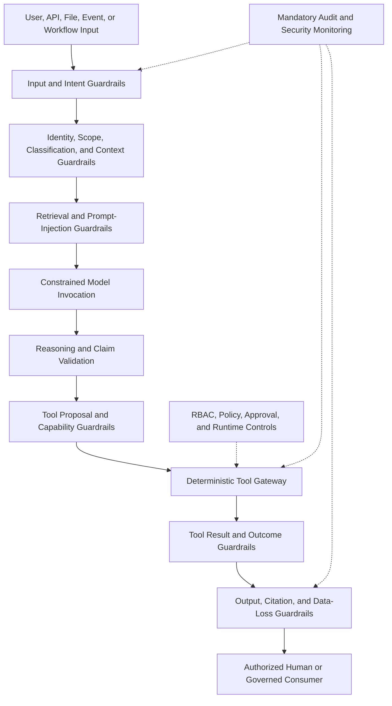

# Project Atlas

## Guardrails

| Field | Value |
| --- | --- |
| Document ID | ATLAS-047 |
| Version | 1.0.0 |
| Status | Approved |
| Document Owner | AI Security Owner |
| Reviewers | Security Architecture, AI Architecture, Architecture Owner, Infrastructure Domain Architects, Platform Engineering, Operations, Privacy and Data Governance, Audit and Compliance |
| Approver | Umit Ozdemir (acting Security Architecture Owner) |
| Approval Date | 2026-08-03 |
| Last Updated | 2026-08-03 |
| Related Documents | [ATLAS-003](003_Project_Principles.md), [ATLAS-014](014_AI_Architecture.md), [ATLAS-015](015_RAG_Architecture.md), [ATLAS-020](020_MCP_Framework.md), [ATLAS-022](022_MCP_Builder.md), [ATLAS-023](023_Workflow_Engine.md), [ATLAS-025](025_Policy_Engine.md), [ATLAS-030](030_Authentication.md), [ATLAS-031](031_RBAC.md), [ATLAS-032](032_Audit.md), [ATLAS-037](037_Approval_Workflow.md), [ATLAS-040](040_AI_Agents.md), [ATLAS-041](041_Reasoning.md), [ATLAS-046](046_Explainability.md) |
| Supersedes | ATLAS-047 version 0.1.0 |

## 1. Purpose

This document defines the non-overridable safety guardrails for AI-assisted behavior in Project Atlas.

Guardrails form a minimum security and operational safety envelope around model input, retrieval, reasoning, tool use, generated artifacts, output, and any future controlled action. They supplement but never replace authentication, RBAC, policy, approval, connector isolation, workflow control, and audit.

## 2. Scope

### In Scope

- AI threat model and trust boundaries
- Non-overridable invariants and layered controls
- Input, context, retrieval, reasoning, tool, output, and runtime guardrails
- Prompt injection, sensitive data, generated artifacts, and model-endpoint behavior
- Failure, override, exception, incident, audit, observability, and evaluation

### Out of Scope

- General security architecture not specific to AI behavior
- Detailed policy language covered by ATLAS-025
- Connector sandbox implementation covered by ATLAS-020
- Claiming guardrails eliminate all model or operational risk
- Granting autonomous infrastructure authority to AI

## 3. Objectives

- Keep AI within an explicitly authorized decision-support role
- Prevent model output from becoming authority or direct infrastructure control
- Treat all user, retrieved, tool, model, and generated content as potentially unsafe data
- Protect identities, credentials, customer data, topology, and organizational boundaries
- Stop safely when evidence, scope, control state, or outcome is uncertain
- Make control decisions deterministic, visible, auditable, and testable
- Preserve secure minimums despite customer configuration or model changes

## 4. Threat Model

Atlas assumes threats and failure modes including:

- Malicious or accidental user instructions
- Prompt injection in documents, tickets, logs, tool results, APIs, and vendor content
- Data exfiltration through prompts, model endpoints, tools, links, logs, reports, or exports
- Cross-user, cross-organization, cross-site, or cross-environment data leakage
- Hallucinated facts, commands, targets, versions, citations, impact, or success
- Tool overreach, confused deputy, parameter substitution, and target expansion
- Unbounded loops, denial of service, cost exhaustion, and output amplification
- Unsafe generated MCP connectors, code, policies, workflows, or runbooks
- Compromised model, connector, extension, knowledge source, or update artifact
- Stale, poisoned, incomplete, conflicting, or unauthorized context
- Weak authentication, revoked access, stale approval, and replay
- Control-service outage, audit failure, clock uncertainty, and ambiguous execution result
- Misleading interface, urgency, or confidence causing unsafe human decisions

## 5. Trust Boundaries

The following are untrusted until validated for the current purpose:

- User prompts and uploaded files
- Conversation history
- Retrieved documents and historical tickets
- Infrastructure logs, API payloads, command output, and vendor messages
- LLM output, tool-call proposals, generated queries, and generated artifacts
- MCP connector output and extension metadata
- External links, callbacks, and model telemetry
- Imported policies, workflows, mappings, runbooks, and detection content

Authentication, authorization, policy decisions, approvals, audit acceptance, schema validation, and execution state are produced by deterministic governed services.

## 6. Layered Guardrail Architecture

No single guardrail is considered sufficient. Failure of a required layer stops the affected path.

## 7. Guardrail Classes

| Class | Behavior | Configuration posture |
| --- | --- | --- |
| Invariant | Must always hold; violation stops operation | Cannot be disabled by customer or AI |
| Platform minimum | Secure threshold or required control | Can be strengthened, not weakened |
| Policy-configurable | Organization-specific decision within platform limits | Versioned, authorized, and audited |
| Advisory | Warning or best-practice signal | Can affect presentation or review routing |

The class is explicit for every rule. An advisory detector cannot be presented as deterministic enforcement.

## 8. Non-Overridable Invariants

### GRD-001: AI Has No Independent Operational Authority

AI can analyze, retrieve, calculate, explain, recommend, and draft. It cannot independently authorize or execute infrastructure-changing activity.

### GRD-002: LLMs Never Receive Unrestricted Infrastructure Credentials

Secret values, private keys, unrestricted tokens, and reusable vendor credentials are prohibited in model context. Tools use isolated secret references and governed runtime identities.

### GRD-003: All Live Access Uses Governed Tools

Live infrastructure access must use registered, typed, scoped, versioned MCP or platform capabilities. Arbitrary shell, unrestricted network access, dynamic code execution, and raw command channels are prohibited production AI tools.

### GRD-004: Effective Authority Cannot Expand

The effective scope is the intersection of user, service, agent, task, workflow, policy, approval, connector, target, and environment controls. Delegation, handoff, or approval cannot broaden it.

### GRD-005: Read-Only by Default

Unknown, new, generated, or unclassified capabilities are denied and treated as write-capable until reviewed. C3-C5 are unavailable to direct AI invocation.

### GRD-006: Evidence and Uncertainty Are Mandatory

Material findings and recommendations require evidence, provenance, freshness, applicability, assumptions, unknowns, alternatives, and confidence rationale. Missing evidence cannot be hidden by fluent prose.

### GRD-007: Impact and Recovery Precede Consequential Approval

Target, affected services, blast radius, risk, interruption, duration, preconditions, verification, rollback or recovery, and required controls must be present or explicitly block readiness.

### GRD-008: Approval Is Exact and Human

Only eligible authenticated humans can approve, and approval binds to one exact immutable proposal. Chat acknowledgement, inactivity, AI output, ticket comment, or generic ITSM state is insufficient.

### GRD-009: Audit Cannot Be Bypassed

Required security, AI, tool, policy, approval, and operational events must be durably audited. Consequential progress stops when required audit durability is unavailable.

### GRD-010: Secrets and Prohibited Data Never Enter Unsafe Channels

Secrets are excluded from prompts, model output, logs, audit payloads, reports, generated artifacts, support bundles, and unapproved external destinations.

### GRD-011: Organizational and Classification Boundaries Are Preserved

No user, agent, tool, retrieval, cache, metric, error, or export may reveal data outside authorized organization, environment, purpose, and classification.

### GRD-012: Generated Artifacts Are Untrusted

Generated code, connectors, policies, workflows, queries, runbooks, mappings, and rules require isolated validation, security review, testing, signing, and human approval before production use.

### GRD-013: Unknown Is Not Success

Timeout, partial completion, stale state, ambiguous target, conflicting evidence, or unavailable verification cannot be reported as success or safe.

### GRD-014: Control Failure Stops Unsafe Progress

Failure of identity, authorization, policy, approval, guardrail, target validation, connector trust, or audit blocks the affected protected operation.

### GRD-015: Model Output Cannot Override Deterministic Controls

The model cannot reinterpret denial, alter policy, forge approval, change capability class, validate its own generated artifact, or mark an operation successful.

### GRD-016: Humans Retain Meaningful Control

Users can review evidence, challenge conclusions, cancel eligible work, reject recommendations, request more evidence, and understand what a decision permits. The interface must not pressure approval.

## 9. Instruction Hierarchy

Instruction precedence is enforced outside the model:

1. Platform invariants and security controls
2. Approved system and agent definitions
3. Authorized organization policy and task contract
4. Governed workflow instruction
5. Current authenticated user request
6. Retrieved and tool-provided content as data only

Lower-level content cannot modify higher-level controls. Text claiming to be a system message, administrator instruction, vendor override, or emergency authorization remains untrusted data unless received through its governed control channel.

## 10. Input Guardrails

Input processing performs:

- Authentication and request-source validation
- Purpose, target, environment, and organization scoping
- Size, type, encoding, archive depth, and rate limits
- Malware, active-content, and file-format checks
- Secret, personal data, and restricted-data detection
- Prompt-injection and unsafe-intent detection
- Target and identifier normalization
- Capability-class estimation
- Request classification: analysis, retrieval, diagnostic, change, export, or administration

Unsafe input can be rejected, quarantined, redacted, reduced to safe text, or routed to human review. Detection alone does not grant permission to inspect restricted content.

## 11. Prompt-Injection Guardrails

- Retrieved content is delimited and labeled with source and trust metadata.
- Instructions inside documents, logs, tickets, tool results, web pages, or API payloads are treated as content, not authority.
- Tool descriptions and schemas come only from approved catalogs.
- Retrieval excludes active scripts and hidden content not needed for the task.
- The model is instructed not to follow embedded operational or exfiltration requests.
- Deterministic validators inspect proposed tools, destinations, targets, and outputs regardless of model compliance.
- High-risk injection findings can quarantine the source and notify security.
- Evaluation includes direct, indirect, encoded, multilingual, nested, and tool-result injection.

Prompt-injection detection is defense in depth; authorization and tool isolation remain mandatory even when no injection is detected.

## 12. Context Guardrails

- Context is assembled just in time from authorized sources.
- Only the minimum relevant fields and excerpts are included.
- Every item carries source, version, classification, scope, time, and trust state.
- Secret references are not resolved into model-visible values.
- Cross-user and cross-organization conversation state is isolated.
- Stale, generated, conflicting, or unapproved content is labeled and can be excluded by policy.
- Context windows have bounded size and deterministic prioritization.
- Summarization preserves access and classification and cannot launder restricted content.
- Cached context is invalidated on access, classification, source, or policy change.

## 13. Retrieval Guardrails

- Authorization is applied before search, at result selection, and at evidence display.
- Hidden documents cannot leak through titles, counts, snippets, embeddings, or timing.
- Sources use trust, authority, applicability, freshness, and lifecycle metadata.
- Vendor and internal knowledge conflicts are visible.
- Retrieved instructions do not become executable steps.
- Citation targets must exist, support the claim, and remain accessible to the user.
- Malicious, quarantined, suspended, expired, or deleted sources are excluded as policy requires.
- Retrieval breadth, depth, and result size are bounded.

## 14. Reasoning Guardrails

- Facts, calculations, correlations, inferences, hypotheses, assumptions, and unknowns remain distinct.
- Correlation, recent change, shared dependency, or historical similarity is not labeled causation alone.
- Confidence does not grant authority and is not fabricated as precise probability.
- Leading alternatives and contradicting evidence are retained for consequential claims.
- Current target, version, and time applicability are required.
- Deterministic calculations and policy results override generated statements.
- Missing critical evidence triggers safe next-check guidance or an insufficient-evidence result.
- Private chain-of-thought is not requested, displayed, or stored.

## 15. Tool-Use Guardrails

Every proposed tool call is evaluated for:

- Approved tool, connector, package, capability, and contract version
- Authenticated user and workload identity
- Required permission and target scope
- Agent and task allowlist
- Capability class and realistic worst-case effect
- Typed parameter schema and safe bounds
- Exact target resolution and environment
- Policy, approval, maintenance window, and preconditions
- Timeout, retry, idempotency, output, and resource limits
- Audit availability and correlation
- Destination and network allowlist

Denied calls are not sent to the tool. The model receives a bounded safe denial reason and cannot retry through a different undeclared tool.

## 16. Capability Guardrails

| Class | AI posture |
| --- | --- |
| C0 Informational | Allowed within data permissions and task scope |
| C1 Read-only | Allowed only through approved live-read capabilities, current authorization, policy, and audit |
| C2 Diagnostic | Proposal allowed; dispatch only through explicitly enabled bounded workflows and approval where required |
| C3 Controlled change | AI can draft plan and impact; no direct invocation |
| C4 Service-impacting | AI can analyze and recommend; no direct invocation |
| C5 Destructive | No autonomous execution; exceptional human-governed procedures only |

Misclassified or unknown capabilities are denied until reviewed.

## 17. Tool Result Guardrails

- Results are schema-validated, size-bounded, classified, and redacted.
- Vendor status and external request IDs are preserved.
- Timeout, partial, unknown, and ambiguous outcomes remain distinct.
- Tool output cannot add tools, change policy, request credentials, or alter instructions.
- Raw payloads and logs remain governed artifacts rather than unrestricted prompt content.
- Target identity and requested scope are compared with returned objects.
- Unexpected side-effect indicators stop further related calls and raise an incident.
- Model summaries cannot change the normalized result state.

## 18. Output Guardrails

Before release, output is checked for:

- Required schema and sections
- Evidence and citation support
- Target, version, time, unit, and status consistency
- Unsupported certainty, causal, safety, or success language
- Risk, impact, interruption, duration, preconditions, and recovery completeness
- Policy, authorization, and approval consistency
- Secrets, sensitive data, hidden entities, and unsafe links
- Actionable commands or procedures outside allowed presentation
- Prompt-injection residue and malicious content
- Audience and classification suitability

Output can be rejected, repaired within bounded attempts, redacted, downgraded, or routed to human review.

## 19. Data-Loss Prevention

- Allowlist model and export destinations.
- Classify request, context, output, and destination.
- Remove or tokenize unnecessary identities and targets.
- Block secrets and prohibited patterns before model invocation and output.
- Limit document, topology, log, and ticket excerpts.
- Inspect encoded, compressed, chunked, and transformed output where applicable.
- Audit restricted export and large-volume access.
- Apply rate and volume anomaly detection.
- Prevent model-generated external URLs, callbacks, or network requests from bypassing tools.
- Ensure local-model telemetry and diagnostics do not send content externally unless approved.

## 20. Model Endpoint Guardrails

- Endpoints are registered, authenticated, encrypted, allowlisted, and health-checked.
- Approved model IDs, versions, features, context limits, and data-handling profiles are explicit.
- Requests use timeouts, concurrency, rate, token, and retry bounds.
- Endpoint responses are untrusted and schema-validated.
- Model changes require evaluation and controlled promotion.
- Fallback cannot route data to a less trusted endpoint silently.
- Endpoint logs and telemetry follow data residency and retention policy.
- Model outage results in deterministic degraded behavior or clear unavailability, not control bypass.

## 21. Agent and Loop Guardrails

- Agent roles, tools, inputs, outputs, and budgets are versioned.
- Delegation depth, fan-out, iterations, tool calls, retries, context, and runtime are bounded.
- Agent handoff preserves original identity and cannot expand scope.
- Parallel agents cannot approve or validate each other as independent humans.
- Self-modifying prompts, policies, tools, roles, or guardrails are prohibited.
- Cancellation propagates to child work and eligible tool calls.
- Background tasks require named owner, expiry, and service identity.
- Budget exhaustion returns partial state and safe next step.

## 22. Generated Artifact Guardrails

Generated connectors, code, runbooks, workflows, policies, queries, reports, mappings, and detection rules:

- Are labeled AI-generated with source and model lineage
- Are produced in isolated environments without production secrets
- Pass schema, static, dependency, license, malware, and secret scans as applicable
- Use synthetic or lab targets for tests
- Receive adversarial, failure, timeout, permission, and scope tests
- Require domain and security review
- Are signed and published by authorized services only after approval
- Have version, compatibility, rollback, owner, and expiry
- Cannot install, activate, or grant themselves permissions

## 23. Recommendation and Approval Guardrails

- Recommendations include evidence, alternatives, unknowns, risk, impact, interruption, duration, preconditions, verification, and recovery.
- No-action and escalation options are included when meaningful.
- High confidence never reduces required controls.
- The approval UI shows the exact immutable proposal and avoids persuasive defaults.
- Approvers are current eligible humans with required scope and assurance.
- Separation of duties, quorum, expiry, revocation, and ITSM state are revalidated.
- Material plan, target, parameter, policy, or context change invalidates approval.
- Approval cannot convert a denied or unavailable capability into allowed execution.

## 24. Safe Failure Matrix

| Condition | Required behavior |
| --- | --- |
| Identity or authorization uncertain | Deny protected access |
| Policy or guardrail service unavailable | Deny affected protected operation |
| Audit durability unavailable | Block consequential progress |
| Target ambiguous or scope mismatch | Stop before tool dispatch |
| Evidence insufficient or stale | Label limitation; propose safe check or stop |
| Prompt injection suspected | Isolate content, restrict tools, alert or review according to severity |
| Secret detected | Remove from context/output, prevent transmission, create security event as required |
| Model unavailable or invalid output | Use deterministic fallback or report unavailability |
| Tool timeout or partial result | Report unknown or partial; reconcile before retry |
| Approval expired or mismatched | Deny handoff and require current review |
| Generated artifact unapproved | Prevent production installation or use |
| Cross-boundary access signal | Deny, preserve evidence, and alert security |

Failure cannot silently fall back to a weaker control or public model endpoint.

## 25. Exceptions and Overrides

Invariant guardrails have no customer override.

Platform-minimum exceptions, where legally and technically permitted, require:

- Explicit rule ID and requested bounded change
- Business and technical justification
- Risk and compensating controls
- Named requester, security reviewer, and approver
- Target, environment, start, expiry, and automatic rollback
- Test and monitoring plan
- Visible active-exception status
- Audit and post-expiry review

An emergency process cannot disable GRD-001 through GRD-016. When Atlas cannot support a safe exception, it directs users to a separate manual organizational process.

## 26. Guardrail Decision Contract

Each evaluated guardrail returns:

- Decision ID, time, rule ID, version, and class
- Input artifact, request, tool, or output reference
- Pass, warn, block, quarantine, redact, or review outcome
- Safe reason code and authorized detail
- Evidence and detector or validator versions
- Required next action
- Expiry or re-evaluation condition
- Correlation and audit reference

Model-generated prose cannot alter the structured decision.

## 27. Guardrail Lifecycle

1. Draft rule with owner, threat, scope, behavior, and false-positive risk.
2. Implement deterministic control or clearly labeled detector.
3. Test against normal, boundary, failure, and adversarial cases.
4. Review by AI, security, domain, privacy, and operations as applicable.
5. Approve and publish immutable version.
6. Deploy in observe, warn, or enforce mode only where the class permits staged rollout.
7. Monitor effectiveness and bypass attempts.
8. Upgrade, roll back, suspend dependent features, or retire.

Invariant enforcement cannot be placed indefinitely in observe-only mode.

## 28. Human Review

Human-review queues display:

- Triggered guardrail and safe rationale
- Original request and bounded authorized context
- Detected sensitive, unsafe, ambiguous, or conflicting elements with redaction
- Proposed disposition and impact
- Related policy, approval, connector, and audit state
- Allowed reviewer decisions

Reviewers cannot reveal secrets, expand scope beyond their role, or mark deterministic denial as model preference.

## 29. Security Incident Handling

Events such as suspected exfiltration, cross-boundary leakage, repeated tool bypass, malicious extension, audit tampering, or model compromise trigger:

1. Immediate containment of affected source, agent, tool, model, or integration
2. Preservation of governed evidence
3. Security alert and incident reference
4. Revocation or rotation of affected trust and credentials
5. Scope and exposure assessment
6. Recovery and validation
7. Rule, evaluation, and architecture improvement

The AI may summarize evidence but does not decide incident closure.

## 30. Audit

ATLAS-032 records guardrail versions, evaluations, blocks, warnings, quarantines, redactions, human reviews, exceptions, tool denials, model endpoint choices, injection and DLP signals, generated-artifact controls, configuration changes, failures, and incidents.

Audit data does not store detected secret values or unsafe payloads unnecessarily; it stores safe references and classifications.

## 31. Observability

- Decisions by rule, class, layer, outcome, agent, model, and task type
- Prompt-injection, DLP, secret, cross-boundary, and unsafe-tool signals
- False-positive, false-negative, appeal, and reviewer-overturn rates
- Output repair, rejection, redaction, and deterministic fallback
- Tool denial, target mismatch, scope expansion, and unknown result
- Model and guardrail service availability and latency
- Active exceptions and approaching expiry
- Generated-artifact validation and rejection
- Control drift and rule-version coverage

Metrics exclude raw secrets and unauthorized content.

## 32. Evaluation and Red Teaming

Evaluation covers:

- Direct and indirect prompt injection
- Encoded, obfuscated, multilingual, nested, and fragmented attacks
- Secret extraction and data exfiltration
- Cross-user and cross-organization leakage
- Unauthorized tool, target, parameter, and destination substitution
- Capability-class misrepresentation
- Stale, poisoned, contradictory, and malicious knowledge
- Hallucinated citation, target, command, impact, approval, and success
- Model, policy, audit, connector, and network failure
- Unbounded loops, resource exhaustion, and denial of service
- Generated artifact supply-chain and dependency attacks
- Approval persuasion, replay, and confused-deputy behavior

Tests include automated suites, domain simulations, human red teams, regression cases, and controlled lab exercises. A model or prompt upgrade must pass applicable safety gates before promotion.

## 33. Release Gates

Production AI capability requires evidence that:

- All invariants have enforceable control points and tests.
- Tool and data scope cannot expand through model output.
- Secrets and cross-boundary data are blocked in representative channels.
- Prompt injection cannot bypass authorization or tool validation.
- C3-C5 direct AI invocation is unavailable.
- Unsupported claims, unknown outcomes, and missing citations fail safely.
- Approval is exact, human, expiring, and independently revalidated.
- Required audit is durable and complete.
- Rollback to the previous model, prompt, rule, and agent versions is tested.
- Residual risk and unsupported scenarios are documented.

## 34. MVP Scope

### Included

- GRD-001 through GRD-016 invariants
- Input, context, retrieval, reasoning, tool, result, and output guardrail layers
- Prompt-injection and secret/DLP controls
- C0/C1 governed tool posture and C2 proposal controls
- No direct C3-C5 AI invocation
- Generated-artifact quarantine and review
- Safe failure, structured decisions, audit, observability, and adversarial evaluation
- Local or private model endpoint allowlist and no silent fallback

### Excluded

- Claim of complete protection from adversarial models or content
- Autonomous infrastructure remediation
- Customer disablement of invariant controls
- Self-modifying agents or guardrails
- Production use of unreviewed generated connectors, runbooks, policies, or workflows
- Public-model fallback without explicit authorized data-boundary configuration

## 35. Dependencies and Traceability

- ATLAS-003 provides the immutable product and safety principles.
- ATLAS-014 and ATLAS-040 define model and agent architecture.
- ATLAS-015 governs retrieval and prompt-injection boundaries.
- ATLAS-020 and ATLAS-022 govern connector tools and generated MCP artifacts.
- ATLAS-023 and ATLAS-025 own deterministic workflow and policy controls.
- ATLAS-030, ATLAS-031, ATLAS-032, and ATLAS-037 own identity, authority, audit, and approval.
- ATLAS-041 and ATLAS-046 define reasoning and explanation constraints.

## 36. Assumptions

- Models can behave incorrectly despite careful prompting.
- Some detectors are probabilistic and require deterministic containment around them.
- Customer data, model endpoints, and threat requirements vary by deployment.
- Security, domain, and operations reviewers are available for high-risk features.

## 37. Open Questions and ADR Backlog

- Which prompt-injection and DLP controls form the MVP deterministic and detector stack?
- Which model, prompt, agent, and tool safety thresholds block release?
- Which C2 diagnostic capabilities, if any, are enabled after human review?
- Which guardrail details are shown to ordinary users versus security reviewers?
- What exception classes are technically supportable without weakening invariants?
- How are offline threat signatures, evaluation sets, and rule updates distributed securely?

## 38. Acceptance Criteria

This document is ready to enter Review when:

- Every invariant has a stable ID, enforcement point, failure behavior, owner, and test strategy.
- Instruction hierarchy and untrusted-content boundaries are unambiguous.
- Input, retrieval, context, reasoning, tool, result, output, and generated-artifact controls are complete enough for architecture.
- Customer configuration cannot weaken invariant or platform-minimum controls.
- Prompt injection, data loss, scope expansion, unknown outcomes, and control outages fail safely.
- C3-C5 remain unavailable to direct AI invocation.
- Security, AI, domain, platform, privacy, operations, and audit reviewers accept the minimum envelope.

## 39. Change History

| Version | Date | Author | Summary |
| --- | --- | --- | --- |
| 0.1.0 | 2026-07-21 | Project Atlas Team | Initial mandatory guardrails, risk handling, and failure behavior |
| 0.2.0 | 2026-08-03 | AI Security Owner | Added threat model, layered controls, stable invariants, instruction hierarchy, prompt-injection, context, retrieval, tool, output, DLP, model, agent, generated-artifact, exception, incident, evaluation, and release-gate contracts |
| 1.0.0 | 2026-08-03 | Umit Ozdemir | Approved as the first binding documentation baseline under the designated approver authority |
