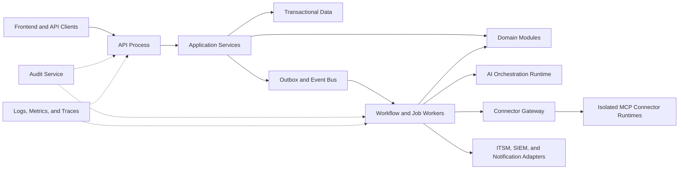

# Project Atlas

## Backend

| Field | Value |
| --- | --- |
| Document ID | ATLAS-051 |
| Version | 1.0.0 |
| Status | Approved |
| Document Owner | Backend Engineering Owner |
| Reviewers | Architecture Owner, Security Architecture, API Architecture, Data Architecture, Platform Engineering, Site Reliability Engineering, Quality Engineering, AI Architecture |
| Approver | Umit Ozdemir (acting Architecture Owner) |
| Approval Date | 2026-08-03 |
| Last Updated | 2026-08-03 |
| Related Documents | [ATLAS-003](003_Project_Principles.md), [ATLAS-011](011_Component_Architecture.md), [ATLAS-012](012_Microservice_Architecture.md), [ATLAS-016](016_Event_Architecture.md), [ATLAS-020](020_MCP_Framework.md), [ATLAS-023](023_Workflow_Engine.md), [ATLAS-030](030_Authentication.md), [ATLAS-031](031_RBAC.md), [ATLAS-032](032_Audit.md), [ATLAS-040](040_AI_Agents.md), [ATLAS-050](050_API.md), [ATLAS-053](053_Database.md), [ATLAS-055](055_Coding_Standards.md), [ATLAS-056](056_Testing.md) |
| Supersedes | ATLAS-051 version 0.1.0 |

## 1. Purpose

This document defines the implementation architecture and engineering constraints for the Project Atlas backend.

The backend enforces domain rules, identity, authorization, policy, approval, audit, workflow state, AI boundaries, and connector mediation. It must remain correct and secure when called outside the user interface.

## 2. Scope

### In Scope

- Backend style, module boundaries, layering, dependencies, and runtime processes
- API, domain, persistence, events, jobs, workflows, AI, connectors, and integrations
- Configuration, secrets, transactions, concurrency, failure, observability, and testing
- Technology direction and extraction criteria

### Out of Scope

- Detailed API contracts covered by ATLAS-050
- Frontend implementation covered by ATLAS-052
- Physical database design covered by ATLAS-053
- Deployment manifests covered by ATLAS-057
- Final technology selection without ADR approval

## 3. Objectives

- Keep business and safety rules independent from HTTP, database, model, and vendor frameworks
- Enforce controls at every protected backend boundary
- Start with low operational complexity while preserving clear ownership
- Support durable long-running work and human wait states
- Prevent AI or connectors from bypassing deterministic services
- Make failure, retry, partial state, cancellation, and recovery explicit
- Provide testable contracts and production-grade observability

## 4. Initial Architecture Style

Atlas should begin as a modular monolith plus isolated worker and connector processes.

- Domain modules have explicit public interfaces and private internals.
- Direct cross-module database-table access is prohibited.
- In-process calls use typed application contracts.
- Durable asynchronous work uses versioned events or commands.
- Connector execution and untrusted parsing use separate runtime isolation.
- Components are extracted into services only when ATLAS-012 criteria are met.

This choice reduces early distributed-system overhead without accepting a tangled codebase.

## 5. Candidate Technology Direction

The recommended initial direction, subject to ADR, is:

- Python 3.12 or later supported version
- FastAPI-compatible ASGI framework for HTTP APIs
- Pydantic-compatible schemas for validation and settings
- SQLAlchemy-compatible relational persistence abstraction
- Alembic-compatible ordered migrations
- PostgreSQL as the transactional database candidate
- A proven durable workflow or job mechanism selected by ADR
- OpenTelemetry-compatible traces, metrics, and logs

Technology versions are pinned and supported through release policy. Framework-specific types do not leak into core domain contracts.

## 6. Runtime Topology



Logical modules can share deployment initially while retaining distinct identities where security requires.

## 7. Module Catalog

### Platform and Identity

- Configuration and feature lifecycle
- Authentication provider integration
- Subjects, sessions, workload identities
- RBAC, scopes, assignments, and access review
- Audit and security event production

### Infrastructure

- Connector package and instance registry
- Targets, credential references, and capabilities
- Inventory and observations
- Graph entities, relationships, and impact snapshots
- Health checks and schedules

### Knowledge and AI

- Knowledge sources, lifecycle, and retrieval
- Conversations and task contracts
- Agent orchestration and validation
- Reasoning, RCA, recommendations, impact, runbooks, and reports
- Model endpoint registry and usage policy

### Governance and Operations

- Workflow definitions, runs, tasks, and schedules
- Decision and policy evaluation
- Approval requests and stages
- ITSM, Syslog, SIEM, and notifications
- Operations, support, backup, and release state

Each module names an owner and exposes versioned contracts.

## 8. Layering

```text
transport -> application -> domain
                     -> ports -> infrastructure adapters
```

- Transport parses HTTP or event envelopes and maps responses.
- Application services coordinate use cases and transaction boundaries.
- Domain objects and services enforce business invariants.
- Ports define required persistence, messaging, clock, identity, model, connector, and integration capabilities.
- Adapters implement ports using frameworks and external systems.
- Domain code does not import HTTP handlers, ORM sessions, model SDKs, or vendor clients.

## 9. Dependency Rules

- Dependencies point inward toward stable domain contracts.
- Modules import another module only through its public application interface or published event.
- Shared code is limited to genuinely universal primitives such as identifiers, time, result types, and telemetry context.
- A `utils` package cannot become an unowned dependency dump.
- Cyclic module dependencies are prohibited.
- Dependency boundaries are checked automatically.
- Runtime composition occurs in an explicit application bootstrap layer.

## 10. Request Lifecycle

1. Validate transport, media type, size, and correlation.
2. Authenticate through ATLAS-030.
3. Parse and validate the API schema.
4. Resolve target and organizational scope.
5. Authorize through ATLAS-031.
6. Evaluate policy and approval requirements where relevant.
7. Execute one application use case.
8. Persist transaction and required outbox or audit intent.
9. Return structured result or operation resource.
10. Emit operational telemetry without secrets.

Protected side effects do not occur before required authority and audit checks.

## 11. Domain Modeling

- Entities have stable identifiers and explicit lifecycle state.
- Value objects validate domain concepts such as scope, target, risk, capability class, and time window.
- Aggregate boundaries protect transactional invariants.
- Domain events describe completed facts in past tense.
- Commands express requested intent and do not imply success.
- State transitions are explicit methods, not arbitrary field updates.
- Unknown, partial, stale, and redacted are modeled states where needed.
- Vendor terminology is translated at adapter boundaries.

## 12. Application Services

Application services:

- Accept validated commands or queries
- Load authorized domain state
- Invoke domain behavior
- Coordinate ports and transactions
- Produce operation, event, artifact, and audit references
- Return typed outcomes and reason codes

They do not format UI prose, execute arbitrary model output, or bypass module APIs.

## 13. Persistence

- Repositories are defined by owning modules.
- Transactions are short and do not wrap external network calls.
- ORM models are persistence details, not API or domain schemas.
- Queries are bounded and use explicit loading behavior.
- Organization and scope filters are mandatory for protected data.
- Optimistic concurrency protects mutable governed resources.
- Append-only history uses immutable versions or events.
- Database constraints reinforce critical invariants.

## 14. Transactions and Outbox

- State changes and integration events are committed atomically through a transactional outbox where needed.
- Outbox delivery is at least once and consumers are idempotent.
- Event IDs, aggregate versions, and causality references prevent ambiguous duplicate processing.
- External side effects are never assumed complete merely because a database transaction committed.
- Inbox or deduplication state protects supported inbound events.
- Failed publication and backlog are observable.
- Audit behavior follows ATLAS-032 and can require a stronger pre-execution durability path.

## 15. Queries and Read Models

- Query services return authorized purpose-built projections.
- Read models can be eventually consistent and disclose freshness.
- Hidden resources are filtered before counts and pagination.
- Search, graph, and reporting queries have complexity and time limits.
- Export is asynchronous and separately governed.
- Read caches include organization, scope, role-relevant context, source version, and invalidation boundaries.

## 16. Long-Running Work

- HTTP requests do not hold open for durable workflows.
- ATLAS-023 owns persisted workflow state, timers, retries, waiting, cancellation, and compensation.
- Workers claim work with leases or equivalent concurrency controls.
- Every task is idempotent or declares reconciliation behavior.
- Human approval and maintenance-window waits do not consume a worker thread.
- Dead-letter or intervention states preserve context and recovery guidance.
- Worker shutdown returns or safely completes leased work.

## 17. AI Orchestration Boundary

- AI receives task-scoped authorized context and no infrastructure credentials.
- Agent, prompt, model, tool, budget, and output schemas are versioned.
- Tool proposals pass deterministic validation and the Tool Gateway.
- Model output is untrusted and validated before persistence or display.
- Private chain-of-thought is not stored.
- Deterministic services own policy, approval, workflow, calculation, and final connector dispatch.
- Model endpoint fallback cannot weaken the data boundary.
- AI failure produces a structured degraded or unavailable state.

## 18. Connector Boundary

- Connector packages execute outside the core API process.
- The Gateway validates package trust, capability, target, parameters, identity, scope, policy, and audit.
- Credentials are resolved only inside the authorized runtime boundary.
- Calls have timeout, resource, network, output, and retry limits.
- Raw results are normalized and treated as untrusted.
- A timeout or unknown result is reconciled before retry where side effects may exist.
- C3-C5 are not directly available to AI.

## 19. Integration Adapters

- ITSM, SIEM, Syslog management, identity, notification, model, and storage adapters implement typed ports.
- Vendor errors map to stable internal categories while retaining safe source codes.
- Adapters own protocol retry and rate-limit behavior within application policy.
- External records retain source identifiers and versions.
- Webhooks are authenticated, replay-protected, and idempotent.
- Adapters cannot update another module's tables directly.

## 20. Configuration

- Settings use a versioned schema and explicit source precedence.
- Environment variables can carry non-secret deployment overrides and secret references, not bulk unvalidated configuration.
- Unknown or incompatible settings fail startup.
- Effective configuration is previewable with redaction.
- Dynamic settings declare owner, scope, validation, reload, and rollback behavior.
- Security minimums and guardrail invariants cannot be disabled.
- Configuration changes are versioned and audited.

## 21. Secrets and Cryptography

- Secret values are fetched through an approved secrets port at the latest practical moment.
- Values are never represented in domain objects, API responses, logs, model context, or exceptions.
- Secret references are independently rotatable.
- Cryptographic algorithms and key management use approved libraries and policy.
- Custom cryptographic primitives are prohibited.
- Sensitive buffers are bounded and not cached unnecessarily.
- Certificate and token expiry are observable.

## 22. Error Model

- Domain errors use stable typed codes.
- Application errors distinguish validation, denial, conflict, stale, dependency, partial, timeout, unknown, and internal failure.
- Transport maps internal errors to ATLAS-050 without leaking internals.
- Exceptions are not used for expected domain branching where a result type is clearer.
- Catch-all handlers preserve correlation and generate sanitized telemetry.
- Retried errors declare retryability and idempotency requirements.
- Unknown external outcomes never become success.

## 23. Concurrency

- Mutable governed resources use optimistic concurrency.
- Unique constraints and idempotency protect duplicate creation.
- Schedules and singleton jobs use distributed leases or equivalent ownership.
- Lock duration is bounded and external calls do not occur under database locks.
- Event consumers handle duplicate and out-of-order delivery.
- Race-condition tests cover approval, revocation, cancellation, role changes, and connector state.

## 24. Caching

- Cache is an optimization, never authority.
- Keys include organization, scope, relevant version, and classification.
- Authorization and policy caches have short bounded lifetimes and explicit invalidation.
- Secret values, private prompts, and unrestricted evidence are not cached in general stores.
- Stale-while-revalidate is used only where stale display is safe and labeled.
- Cache outage degrades performance rather than silently broadening access.

## 25. Security

- Validate every trust-boundary input.
- Use parameterized database access and safe serializers.
- Prevent SSRF through destination allowlists and controlled clients.
- Restrict file parsing, archives, templates, and generated code to isolated runtimes.
- Enforce organization and scope in backend services.
- Apply secure defaults, least privilege, and network egress controls.
- Maintain dependency, image, and supply-chain scanning.
- Threat models are required for connectors, AI tools, exports, webhooks, and privileged administration.

## 26. Audit and Observability

All processes propagate correlation, request, trace, workflow, decision, approval, and operation references.

The backend emits:

- Structured operational logs under ATLAS-033
- Metrics for traffic, latency, queues, workers, dependencies, errors, and resources
- Distributed traces across API, jobs, models, integrations, and connector gateway
- Mandatory audit events under ATLAS-032

Telemetry excludes secret values and controls high-cardinality labels.

## 27. Health and Lifecycle

- Liveness indicates process progress, not dependency health.
- Readiness verifies dependencies required for accepted traffic.
- Startup checks configuration, schema compatibility, identity, trust, and required audit connectivity.
- Degraded state identifies unavailable optional capabilities.
- Graceful shutdown stops new work, drains eligible requests, releases leases, and preserves work state.
- Dependency circuit breakers are bounded and do not hide control failure.
- Build and release versions are exposed through authorized health metadata.

## 28. Performance and Resource Control

- Blocking I/O does not run on the async event loop.
- Database pools, HTTP clients, model requests, connector calls, and workers have explicit limits.
- Timeouts exist at every external boundary and respect an overall deadline.
- Bulk and report work is asynchronous.
- Backpressure is propagated through queues and API limits.
- Memory and output size are bounded for documents, logs, graph queries, and model context.
- Performance targets are measured by representative workload, not framework benchmarks alone.

## 29. Testing

- Domain unit tests without framework or database
- Application tests with fake ports
- Repository and migration integration tests against real supported databases
- API contract and security tests
- Event, outbox, duplicate, order, retry, and worker tests
- Connector and model boundary tests with simulators
- Authorization, policy, approval, audit, and organization-isolation tests
- Concurrency, cancellation, partial-result, timeout, and shutdown tests
- Dependency and chaos tests for critical paths
- Architecture tests for module dependencies and prohibited imports

## 30. Service Extraction Criteria

A module is considered for extraction only when one or more are demonstrated:

- Independent scaling or resource profile
- Strong security or failure isolation requirement
- Independent release cadence with stable contract
- Dedicated technology or data-store need
- Team ownership and operational readiness
- Measured contention that cannot be solved within the modular deployment

Extraction requires an ADR, API or event contract, data-ownership migration, observability, deployment, rollback, and failure analysis.

## 31. Developer Experience

- One documented command path starts the supported local profile.
- Development uses synthetic fixtures and simulated connectors.
- Static checks, tests, migrations, and API generation run consistently locally and in CI.
- Module templates include standard configuration, logging, metrics, errors, and tests.
- Debug modes retain redaction and do not expose secrets.
- Local services do not require production credentials or arbitrary internet access.

## 32. MVP Scope

### Included

- Modular monolith API and application process
- Separate durable worker and isolated connector runtime
- Domain modules for identity, connectors, inventory, knowledge, AI analysis, workflow, policy, approval, audit, and reports
- Relational transaction and outbox foundation
- OpenAPI-first HTTP API and SSE
- Secure configuration, secret references, observability, health, and graceful shutdown
- Simulators and contract tests

### Excluded

- Premature microservice decomposition
- Direct AI infrastructure execution
- Shared mutable tables across future services
- Arbitrary plugin code in the API process
- In-memory-only durable workflow state
- Production dependency on a developer workstation

## 33. Dependencies and Traceability

- ATLAS-003 defines backend control and reliability principles.
- ATLAS-011 and ATLAS-012 define component ownership and evolution.
- ATLAS-016 defines events and asynchronous compatibility.
- ATLAS-020 and ATLAS-023 define connector and workflow boundaries.
- ATLAS-030 through ATLAS-032 define identity, authorization, and audit.
- ATLAS-040 defines agent and tool constraints.
- ATLAS-050 defines external API contracts.
- ATLAS-053 defines data ownership and persistence requirements.
- ATLAS-055 and ATLAS-056 define implementation and test quality.

## 34. Assumptions

- The first implementation team benefits from one primary backend language.
- Early scale can be served by a modular monolith and worker topology.
- PostgreSQL or an equivalent relational database supports transactional state.
- Model and connector execution require stronger isolation than ordinary domain logic.

## 35. Open Questions and ADR Backlog

- Confirm Python, ASGI framework, relational library, and supported versions.
- Which durable workflow or job engine is selected first?
- Which modules require separate processes in MVP?
- Which event broker, if any, is needed beyond a transactional queue initially?
- What performance and availability objectives apply to API and workers?
- Which architecture-boundary checks are enforced in CI?

## 36. Acceptance Criteria

This document is ready to enter Review when:

- Initial modular-monolith, worker, AI, and connector runtime boundaries are agreed.
- Module ownership, layering, dependency rules, transaction, outbox, and long-running work are explicit.
- Authentication, authorization, policy, approval, audit, and guardrails are enforced server-side.
- Configuration, secrets, errors, concurrency, failure, observability, and shutdown are testable.
- Extraction criteria prevent both accidental coupling and premature microservices.
- Architecture, backend, security, data, platform, AI, operations, and testing reviewers accept the direction.

## 37. Change History

| Version | Date | Author | Summary |
| --- | --- | --- | --- |
| 0.1.0 | 2026-07-21 | Project Atlas Team | Initial backend responsibilities, principles, technology direction, and questions |
| 0.2.0 | 2026-08-03 | Backend Engineering Owner | Added modular-monolith runtime, module and layer boundaries, request lifecycle, domain and persistence rules, outbox, workers, AI and connector isolation, configuration, failure, observability, testing, and extraction criteria |
| 1.0.0 | 2026-08-03 | Umit Ozdemir | Approved as the first binding documentation baseline under the designated approver authority |
