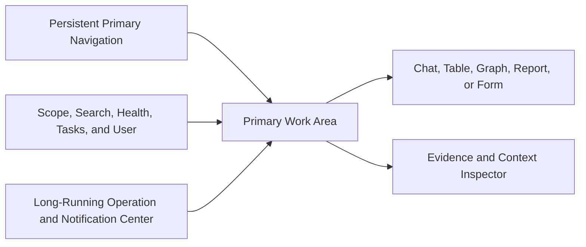

# Project Atlas

## Frontend

| Field | Value |
| --- | --- |
| Document ID | ATLAS-052 |
| Version | 1.0.0 |
| Status | Approved |
| Document Owner | Frontend and User Experience Owner |
| Reviewers | Product Owner, Architecture Owner, Security Architecture, Infrastructure Operations, Accessibility, API Architecture, Quality Engineering, Audit and Compliance |
| Approver | Umit Ozdemir (Product Owner) |
| Approval Date | 2026-08-03 |
| Last Updated | 2026-08-03 |
| Related Documents | [ATLAS-003](003_Project_Principles.md), [ATLAS-004](004_Glossary.md), [ATLAS-010](010_System_Architecture.md), [ATLAS-030](030_Authentication.md), [ATLAS-031](031_RBAC.md), [ATLAS-037](037_Approval_Workflow.md), [ATLAS-046](046_Explainability.md), [ATLAS-047](047_Guardrails.md), [ATLAS-050](050_API.md), [ATLAS-051](051_Backend.md), [ATLAS-056](056_Testing.md) |
| Supersedes | ATLAS-052 version 0.1.0 |

## 1. Purpose

This document defines the frontend product experience and implementation constraints for Project Atlas.

The frontend is a chat-centered enterprise operations workspace for repeated investigation, comparison, review, and reporting. It presents backend authority and evidence; it never implements security, policy, approval, or operational truth by itself.

## 2. Scope

### In Scope

- Information architecture, application shell, primary views, and workflows
- Chat, investigation, inventory, graph, health, recommendation, approval, report, audit, and administration experiences
- State, streaming, errors, accessibility, responsiveness, security, observability, and testing
- Candidate implementation direction and MVP boundaries

### Out of Scope

- Marketing or public landing pages
- Backend authorization and policy enforcement
- Detailed brand identity and final visual tokens
- Native mobile application
- Implementing a general monitoring platform replacement

## 3. Objectives

- Let engineers move quickly from question to evidence, affected scope, and safe next step
- Preserve context across chat, topology, health, tickets, and recommendations
- Make uncertainty, freshness, risk, impact, interruption, duration, and recovery visible
- Support accountable review without pressuring approval
- Remain efficient for dense daily operational work
- Handle long-running, partial, stale, denied, and failed states honestly
- Meet enterprise accessibility, privacy, and security expectations

## 4. Experience Principles

- The actual operations workspace is the first screen after login.
- Chat is central but does not hide structured evidence or workflow state.
- Critical state is communicated by text and icon, not color alone.
- Evidence and source versions are inspectable in context.
- AI-generated content is labeled without visual noise.
- Approval is a distinct formal flow, never an ordinary chat reply.
- Empty, loading, partial, stale, denied, and failed states are designed explicitly.
- Dense information uses stable tables, lists, timelines, and split panes rather than decorative cards.
- Navigation and primary controls remain predictable across modules.
- UI permissions improve ergonomics; the backend remains authoritative.

## 5. Audience and Core Jobs

| User | Core jobs |
| --- | --- |
| Infrastructure engineer | Investigate health, compare evidence, test hypotheses, prepare a plan |
| Operations or NOC analyst | Triage active issues, identify service impact, route and track work |
| Infrastructure architect | Explore dependencies, impact, capacity, and change options |
| Approver or service owner | Review exact proposal, evidence, risk, interruption, and recovery |
| Security or audit reviewer | Inspect identities, authority, controls, events, and exports |
| Platform administrator | Configure identity, connectors, integrations, policies, and platform health |
| Manager | Review service status, trends, risk, and technical or executive reports |

Views adapt detail and available commands through current authorization, not separate inconsistent applications.

## 6. Information Architecture

Primary navigation:

- Workspace
- Infrastructure
- Health
- Investigations
- Recommendations
- Workflows
- Approvals
- Knowledge
- Reports
- Audit
- Administration

Administration contains identity, connectors, model endpoints, policies, integrations, deployment health, and support according to role.

## 7. Application Shell

- The header shows current organization, environment, and site scope.
- The main area uses stable responsive panes.
- The context inspector opens evidence, entity, timeline, policy, or audit details without losing the main task.
- Long-running operations remain accessible across navigation.
- Breadcrumbs and back behavior preserve filters and investigation position.

## 8. Candidate Technology Direction

The recommended initial direction, subject to ADR, is:

- TypeScript with strict type checking
- React and a production-supported application framework
- Generated or validated API types from ATLAS-050 OpenAPI
- A proven query and server-state library
- A proven accessible component foundation
- A proven graph-visualization library selected after scale and accessibility evaluation
- Component and browser testing through established tools

Framework choice must support self-hosted enterprise deployment without mandatory external runtime services.

## 9. Workspace View

The Workspace combines:

- Conversation and task history
- Current scope and target context
- Structured status and progress
- Evidence and citations
- Affected infrastructure and services
- Hypotheses, unknowns, and recommended checks
- Recommendation and report artifacts
- Related incident, change, workflow, and approval state

Users can pin relevant entities or evidence to the current investigation. Conversation prose never replaces immutable recommendation, impact, or approval artifacts.

## 10. Chat Interaction

- User messages show sender, time, and attachment state.
- AI responses distinguish draft streaming from validated final output.
- Tool and retrieval activity appears as concise status with optional details.
- Evidence citations open the context inspector and re-authorize access.
- Facts, inferences, assumptions, unknowns, alternatives, and recommendations are visually distinct.
- Stop or cancel is available for eligible long work.
- Formal actions such as create investigation, save report, or submit approval use explicit controls.
- Typing `yes` or confirming conversationally never constitutes approval.

## 11. Streaming and Long-Running State

The frontend consumes ATLAS-050 SSE and operation resources.

- Sequence and reconnection cursors prevent duplicate rendering.
- Draft fragments are visually provisional.
- Terminal success, failure, cancellation, partial, timeout, and unknown states are explicit.
- A reconnect retrieves authoritative operation state before continuing.
- Waiting for evidence, user input, maintenance window, dependency, or approval are distinct.
- Background operations surface in a persistent task center.
- Navigation or browser refresh does not lose durable work.

## 12. Investigation View

The investigation workspace includes:

- Incident scope and current impact
- Timeline with event-source and clock-quality metadata
- Affected and unaffected entities
- Hypothesis ledger and confidence state
- Evidence inventory and conflicts
- Diagnostic plan, results, and safe next checks
- Related changes, incidents, runbooks, and tickets
- Version history and human corrections

The interface allows challenging a claim or mapping without editing source evidence.

## 13. Infrastructure Inventory

- Dense searchable table and hierarchical views
- Filters for environment, site, domain, vendor, product, health, owner, freshness, and lifecycle
- Stable columns, saved views, and authorized export
- Entity detail with identifiers, attributes, observations, relationships, health, and related services
- Source and last-observed time per material field
- Conflict and stale-state indicators
- Bulk selection only for commands explicitly supported and safe

Unauthorized entities are excluded before counts and filters.

## 14. Graph View

The graph supports focused operational questions, not unrestricted visual complexity.

- Start from one or more authorized entities or services.
- Expand by relationship type, direction, depth, and observation time.
- Distinguish physical, logical, service, protection, and inferred edges.
- Show source, freshness, confidence, and hidden-boundary indicators.
- Preserve affected versus unaffected and redundant paths.
- Provide table and relationship-list alternatives.
- Bound nodes, edges, labels, layout work, and query duration.
- Never imply causality solely through visual proximity.

The first release prioritizes inspectable dependency paths over a full digital-twin canvas.

## 15. Health View

- Current findings and scheduled check results
- Severity, confidence, freshness, source, target, and service impact
- Acknowledgement, assignment, suppression, and maintenance state where governed
- Trend and history appropriate to the finding type
- Related evidence, runbook, investigation, and recommendation
- Clear distinction between source alert, Atlas finding, and AI interpretation
- Partial collection and connector-health warnings

Atlas does not duplicate every monitoring dashboard; it correlates and explains health relevant to operational decisions.

## 16. Recommendation View

- Decision question and current context
- Options compared across evidence, effectiveness, risk, impact, duration, interruption, reversibility, and policy
- Preferred option or explicit absence of a supportable preference
- No-action and escalation options where meaningful
- Preconditions, ordered plan, checkpoints, validation, stop conditions, rollback, and recovery
- Stale or invalidating inputs
- Review, ITSM, and approval state
- Version diff and actual outcome after implementation

Users can inspect tradeoffs rather than seeing one oversized recommendation card.

## 17. Approval View

The approval experience follows ATLAS-037:

- Exact immutable action, target, parameters, plan, impact, policy, and window
- Requester and eligible approver context
- Evidence, assumptions, unknowns, alternatives, and freshness
- Risk, affected services, interruption, duration, point of no return, and recovery
- Approval stages, quorum, expiry, and invalidation conditions
- Approve, reject, needs evidence, defer, and revoke controls
- Mandatory reason where policy requires
- Fresh authentication or step-up flow

No control is preselected. Risk is not communicated by color alone. Approval is visually separate from chat and recommendation preference.

## 18. Workflow View

- Definition and run version
- Trigger, owner, schedule, target scope, and capability ceiling
- Timeline and current state
- Completed, active, waiting, failed, cancelled, partial, and compensated steps
- Human tasks, approvals, deadlines, retries, and stop conditions
- Inputs, outputs, evidence, and related records
- Eligible cancellation and recovery actions

The UI does not report completion while verification or external outcome is unknown.

## 19. Knowledge View

- Source catalog, ownership, authority, classification, sync health, and freshness
- Item lifecycle, product and version applicability, review, expiry, conflict, and supersession
- Search with authorized excerpts and citation preview
- Generated-content and approved-content distinction
- Feedback, correction, review, and publication queues
- Ingestion, quarantine, deletion, and index status

Upload is purpose-specific and shows scanning, parsing, classification, and publication state.

## 20. Reports

- Report templates are task-oriented, not decorative dashboards.
- Technical and executive detail profiles share source artifacts.
- Generation time, scope, freshness, confidence, redaction, and reviewer state are visible.
- Scheduled delivery shows owner, recipients, classification, and expiry.
- Download uses governed operation and authorized short-lived links.
- Failed or partial report sections are disclosed.

## 21. Audit View

- Search by time, actor, event, target, workflow, decision, approval, connector, and correlation
- End-to-end activity-chain reconstruction
- Restricted-field and export permission handling
- Integrity, delivery, retention, and legal-hold status
- Immutable event detail with source and schema versions
- Governed case export with manifest

Platform administration does not imply unrestricted audit-content access.

## 22. Administration

Administration uses consistent lifecycle patterns:

- Draft configuration
- Validate connectivity, trust, permissions, and mappings
- Preview effective change and risk
- Test with synthetic or pilot context
- Review and activate version
- Observe health, expiry, drift, and audit
- Roll back, suspend, or retire

Secret values are write-only and never redisplayed. Destructive operations show explicit inventory and impact.

## 23. Forms and Validation

- Labels, descriptions, required state, units, and valid ranges are explicit.
- Validation occurs at field, section, and submission level.
- Server errors map to fields without hiding global control failures.
- Typed selectors replace free-form target IDs where feasible.
- Sensitive fields use secret-reference selection or controlled write-only entry.
- Unsaved changes, concurrency conflicts, and stale forms are visible.
- Consequential submissions show a concise review step and exact diff.
- Browser validation never replaces server validation.

## 24. Tables and Lists

- Stable row height and controls prevent layout shift.
- Sorting, filtering, pagination, column visibility, and saved views are consistent.
- Keyboard navigation and screen-reader semantics are supported.
- Long identifiers use copy controls and accessible full-value inspection.
- Bulk actions show selected scope and eligibility before submission.
- Empty, filtered-empty, loading, stale, and failure states differ.
- Virtualization is used only with accessible fallback and tested focus behavior.

## 25. Navigation and Search

- Global search is permission-filtered and type-aware.
- Search results show resource type, scope, freshness, and safe context.
- Recent and saved items do not reveal revoked resources.
- Deep links re-authorize and retain artifact version.
- Browser back and forward preserve route and safe query state.
- Command palettes, if added, contain commands only, not hidden operational shortcuts.

## 26. State Management

- Server state remains authoritative and uses query caching with bounded freshness.
- Local state covers view, form, draft, and transient interaction only.
- Durable conversation, investigation, workflow, recommendation, and approval state is backend-owned.
- Cache keys include organization, environment, scope, and resource version.
- Logout and scope change clear sensitive cached state.
- Optimistic updates are limited to safely reversible low-risk interactions.
- Approval, policy, role, connector, and operation state uses confirmed server responses.

## 27. Error and Degraded States

Errors show:

- What did not complete
- Safe reason and correlation ID
- Whether retry is safe
- Preserved work and partial results
- Current authoritative state
- Next supported action

Dependency degradation is scoped: model outage, connector outage, stale graph, unavailable audit search, or ITSM delay are distinct. The interface never turns an unknown operation result into success.

## 28. Notifications

- Notifications communicate state change, assigned task, expiry, failure, or review need.
- Severity and urgency use governed source state.
- Sensitive details remain behind authenticated views.
- Notifications are deduplicated and grouped without hiding critical events.
- A notification link does not grant access.
- Email or chat replies are not approval.
- User preferences cannot suppress mandatory security or assigned approval notices where policy requires.

## 29. Authorization in the UI

- Navigation and controls reflect backend-provided capabilities.
- Disabled controls explain the safe reason when disclosure is permitted.
- Hidden resources do not appear in counts, filters, search, or cached state.
- The frontend never derives permission from role names alone.
- Every command handles backend denial and stale authority.
- Temporary elevation and break-glass state are visible.
- Scope changes require refreshed data and can invalidate drafts.

## 30. Security and Privacy

- Use secure cookies, CSRF protection, content security policy, and trusted origins.
- Avoid storing tokens or sensitive payloads in browser persistent storage.
- Sanitize untrusted rich content and disallow arbitrary scripts or HTML.
- External links are labeled and controlled.
- Prevent sensitive data in URLs, analytics, errors, or client logs.
- Clipboard and download actions for restricted data are explicit and audited where required.
- Model and tool content is rendered as data, never executable markup.
- Session expiry and revocation produce a safe reauthentication path.

## 31. Accessibility

- Target WCAG 2.2 AA for supported workflows.
- Full keyboard operation and visible focus
- Semantic landmarks, headings, tables, labels, and status announcements
- Accessible names and tooltips for icon controls
- Sufficient contrast and non-color status cues
- Reduced-motion support
- Responsive zoom and text resizing without overlap
- Alternative table or list for graph relationships
- Screen-reader validation of chat streaming and operation updates
- Accessible approval and error flows as release gates

## 32. Responsive Behavior

- Desktop supports navigation, main workspace, and context inspector.
- Medium widths collapse the inspector into a controlled drawer.
- Small screens preserve review and triage but can limit complex graph editing.
- Tables use priority columns and intentional horizontal scrolling.
- Fixed toolbars and action areas do not cover content.
- Touch targets and text remain usable without viewport-scaled font sizes.
- Operational meaning is never available only on hover.

## 33. Visual System

- Quiet, utilitarian palette with semantic colors reserved for state
- Compact spacing appropriate to operational work
- Cards only for repeated items or bounded tools, not every page section
- Border radius at or below 8px unless the selected design system requires otherwise
- Icons from one maintained library, with tooltips for unfamiliar actions
- Stable typography hierarchy suited to dense panels
- No decorative gradients, orbs, marketing hero, or ornamental illustration in the application shell
- Charts and graphs use accessible legends and direct values

## 34. Performance

- Define budgets for initial shell, route transition, table interaction, graph query, and chat first event.
- Code-split heavy graph, editor, and report features.
- Paginate and virtualize bounded large datasets carefully.
- Stream long results without rendering unvalidated content as final.
- Avoid duplicate fetches and unbounded polling.
- Use server-provided summaries rather than loading hidden full datasets.
- Measure on enterprise networks and supported hardware.

## 35. Observability

- Route and workflow completion and failure
- API, SSE, reconnect, cancellation, and stale-cache behavior
- Render and interaction performance
- Frontend errors with sanitized context and source maps under access control
- Accessibility defects and keyboard-flow failures
- Approval abandon, needs-evidence, and conflict paths without coercive optimization
- Search no-result and hidden-resource-safe behavior
- Feature and version adoption

No keystroke, prompt, evidence, or restricted content is sent to external analytics by default.

## 36. Testing

- Component behavior and accessibility
- API contract fixtures and generated types
- Authentication, session expiry, authorization, scope, and hidden resources
- Chat streaming, reconnect, draft/final, cancellation, partial, and failure
- Inventory table and graph limits
- Recommendation and approval exact-version behavior
- Forms, concurrency conflict, stale data, and server validation
- Keyboard, screen reader, zoom, contrast, and reduced motion
- Responsive desktop, tablet, and mobile layouts without overlap
- Browser security, content sanitization, download, and URL privacy
- End-to-end core journeys using synthetic data

## 37. MVP Scope

### Included

- Authenticated application shell and scope selector
- Chat-centered workspace with evidence inspector and task center
- Inventory table and bounded dependency-path graph
- Health findings, investigations, recommendations, approvals, knowledge, reports, and platform health views
- Role-aware administration for initial integrations
- SSE streaming, operation state, errors, accessibility, and responsive behavior
- No marketing landing page in the product application

### Excluded

- Full monitoring-dashboard replacement
- General-purpose graph editor
- Native mobile application
- Autonomous operation controls
- Approval through chat or notification reply
- Decorative or marketing-first product shell

## 38. Dependencies and Traceability

- ATLAS-003 defines meaningful control, explainability, impact, and security principles.
- ATLAS-004 defines consistent product terminology.
- ATLAS-030, ATLAS-031, and ATLAS-037 govern identity, UI capability display, and formal approval.
- ATLAS-046 defines explanations and audience levels.
- ATLAS-047 defines AI and content guardrails.
- ATLAS-050 supplies API, streaming, operation, and error contracts.
- ATLAS-051 supplies backend authority.
- ATLAS-056 defines frontend and end-to-end verification.

## 39. Assumptions

- The main experience is used on managed desktop browsers.
- Users need dense operational context more than marketing presentation.
- Backend APIs provide authorization-filtered resources and capability metadata.
- Complex graph exploration can be bounded in MVP.

## 40. Open Questions and ADR Backlog

- Which React framework, component foundation, query library, and graph library are selected?
- Which exact screen and synthetic scenario form the first vertical slice?
- What graph scale and browser-performance budgets apply to MVP?
- Which browsers, screen readers, and mobile widths are supported?
- Which UI states require user research before approval?
- What terminology and localization infrastructure is required in the first release?

## 41. Acceptance Criteria

This document is ready to enter Review when:

- Information architecture, shell, primary views, and core journeys are agreed.
- Chat remains connected to structured evidence, operation, recommendation, and approval artifacts.
- Approval is distinct, exact, non-coercive, and accessible.
- Loading, stale, partial, unknown, denied, error, and cancellation states are testable.
- UI filtering cannot replace backend authorization or leak hidden resources.
- Desktop, small-screen, keyboard, screen-reader, and security behavior have release criteria.
- Product, UX, operations, security, API, accessibility, and testing reviewers accept the direction.

## 42. Change History

| Version | Date | Author | Summary |
| --- | --- | --- | --- |
| 0.1.0 | 2026-07-21 | Project Atlas Team | Initial frontend goals, views, principles, and questions |
| 0.2.0 | 2026-08-03 | Frontend and User Experience Owner | Added operational application shell, chat and investigation flows, inventory and graph, recommendation and approval UX, state, security, accessibility, responsive behavior, performance, and testing |
| 1.0.0 | 2026-08-03 | Umit Ozdemir | Approved as the first binding documentation baseline under the designated approver authority |
