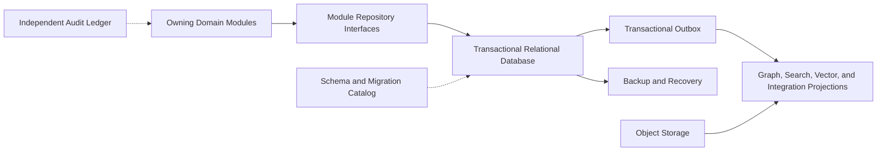

# Project Atlas

## Database

| Field | Value |
| --- | --- |
| Document ID | ATLAS-053 |
| Version | 1.0.0 |
| Status | Approved |
| Document Owner | Data Architecture Owner |
| Reviewers | Architecture Owner, Security Architecture, Backend Engineering, Database Engineering, Site Reliability Engineering, Privacy and Data Governance, Audit and Compliance, Quality Engineering |
| Approver | Umit Ozdemir (acting Architecture Owner) |
| Approval Date | 2026-08-03 |
| Last Updated | 2026-08-03 |
| Related Documents | [ATLAS-003](003_Project_Principles.md), [ATLAS-011](011_Component_Architecture.md), [ATLAS-015](015_RAG_Architecture.md), [ATLAS-016](016_Event_Architecture.md), [ATLAS-026](026_Graph_Engine.md), [ATLAS-027](027_Knowledge_Engine.md), [ATLAS-032](032_Audit.md), [ATLAS-038](038_Deployment_and_Bootstrap.md), [ATLAS-051](051_Backend.md), [ATLAS-054](054_VectorDB.md), [ATLAS-056](056_Testing.md), [ATLAS-057](057_Deployment.md) |
| Supersedes | ATLAS-053 version 0.1.0 |

## 1. Purpose

This document defines database and persistence requirements for Project Atlas transactional state and its relationships to graph, vector, object, search, cache, and audit stores.

Data ownership, integrity, access, lifecycle, and recovery are domain contracts. Store technology is selected only after those contracts and operational requirements are understood.

## 2. Scope

### In Scope

- Persistence categories, source-of-truth boundaries, domain ownership, and transactional behavior
- Relational schema, identifiers, versions, isolation, concurrency, migrations, and retention
- Encryption, secrets, privacy, deletion, legal hold, backup, restore, HA, and observability
- Relationships among relational, graph, vector, object, search, cache, and audit stores

### Out of Scope

- Detailed vector-store selection covered by ATLAS-054
- Full graph-engine design covered by ATLAS-026
- Application repository code covered by ATLAS-051
- Deployment manifests covered by ATLAS-057
- Customer-specific retention and recovery targets

## 3. Objectives

- Preserve authoritative structured state and critical invariants
- Enforce organization and scope boundaries at every data-access path
- Support immutable versions, audit lineage, and reproducible decisions
- Make migrations reversible or explicitly recoverable
- Prevent secrets and large unstructured artifacts from leaking into unsuitable tables
- Support backup, restore, retention, deletion, and legal hold across derived stores
- Scale with measured demand while keeping early operational complexity controlled

## 4. Persistence Portfolio

| Store | Responsibility | Authority |
| --- | --- | --- |
| Relational database | Transactional domain state, ownership, lifecycle, references, workflow, policy, approval | Authoritative for structured application state |
| Audit ledger | Append-only accountable activity and integrity metadata | Authoritative under ATLAS-032 |
| Object storage | Original documents, bounded evidence, reports, exports, generated artifacts | Authoritative for Atlas-owned binary artifacts |
| Vector store | Derived embeddings and retrieval index | Rebuildable projection under ATLAS-054 |
| Graph store or projection | Optimized relationship traversal and time-aware topology views | Derived unless ATLAS-026 declares specific authored records authoritative |
| Search index | Operational full-text and faceted query | Rebuildable projection |
| Cache | Performance optimization and leases where selected | Never authoritative business state |
| Metrics store | Time-series operational measurements | Authority depends on source contract; not transactional state |

No derived store can silently overwrite authoritative state.

## 5. Candidate Relational Direction

PostgreSQL is the recommended initial transactional store, subject to ADR, because Atlas requires:

- Strong transactions and constraints
- Mature indexing and query planning
- JSON support for bounded extension data
- Row-level security as optional defense in depth
- Backup, replication, migration, and enterprise operational maturity
- Optional vector support for an early consolidated profile

Technology selection includes supported versions, extensions, deployment profiles, licensing, and offline availability.

## 6. Data Domain Ownership

| Domain | Representative data |
| --- | --- |
| Identity and access | Subjects, providers, role definitions, assignments, scopes, sessions, revocation |
| Connector platform | Packages, instances, targets, capability metadata, credential references, trust state |
| Infrastructure | Entities, observations, source mappings, health findings, topology metadata |
| Knowledge | Sources, items, versions, classification, lifecycle, ingestion, citations |
| AI and investigation | Conversations, task contracts, reasoning artifacts, RCA cases, recommendations, impact reports |
| Workflow | Definitions, runs, steps, timers, human tasks, schedules, retries, compensation |
| Governance | Policies, decisions, exceptions, approvals, ITSM references |
| Reporting | Report definitions, runs, subscriptions, artifact references |
| Platform operations | Configuration versions, integrations, model endpoints, deployment and backup state |

Each table or collection has one owning module. Other modules use public contracts, references, or events.

## 7. Relational Architecture

Shared physical deployment does not imply shared ownership or unrestricted queries.

## 8. Identifier Rules

- Every domain entity uses a stable opaque identifier.
- Identifiers do not encode customer, vendor, location, sequence, or secret data.
- External vendor and ITSM identifiers remain separate mapped fields.
- Organization and environment context are explicit columns, not inferred from ID format.
- Immutable versions have distinct version IDs or aggregate revision.
- Idempotency, event, request, correlation, and artifact IDs use separate namespaces.
- Database surrogate keys, if used, are not automatically public identifiers.

## 9. Common Record Metadata

Records include where applicable:

- Stable ID and aggregate revision
- Organization, environment, site, and scope references
- Lifecycle state
- Creation and update time and actor references
- Effective, observed, review, expiry, deletion, and retention times
- Classification and access-policy reference
- Source, external ID, source version, and synchronization time
- Generated, reviewed, approved, and superseded status
- Optimistic concurrency version

Timestamps use UTC and distinguish event, observation, ingestion, and transaction time.

## 10. Schema Principles

- Normalize core domain invariants and frequently queried relationships.
- Use constrained JSON only for bounded versioned extension payloads.
- Do not hide authorization scope or critical state exclusively inside opaque JSON.
- Foreign keys and checks reinforce valid lifecycle and ownership.
- Enumerations have stable identifiers and managed evolution.
- Nullable fields represent a meaningful absent or unknown state and are documented.
- Large binaries, documents, model prompts, command output, and reports belong in object storage.
- Secret values do not belong in application tables.

## 11. Organization and Scope Isolation

- Every protected row is attributable to an organization and applicable scope.
- Repository APIs require organization or approved global context.
- Queries filter scope before pagination, aggregation, and joins.
- Unique constraints include organization where uniqueness is not global.
- Database roles separate application, migration, reporting, backup, and administration.
- Row-level security can provide defense in depth but does not replace application authorization.
- Cross-organization operations are prohibited except named platform functions with explicit policy and audit.
- Isolation tests cover joins, errors, counts, exports, caches, and restored data.

## 12. Transactions

- Transaction boundaries align with domain aggregate invariants.
- External network calls do not occur inside open database transactions.
- State change and outbox message can commit atomically.
- Audit requirements use ATLAS-032's appropriate durability contract.
- Transactions have bounded duration and lock acquisition.
- Isolation level is selected per use case and documented where stronger than default.
- Partial multi-aggregate workflows use durable orchestration, not distributed transactions by default.
- Commit success does not imply an external connector action succeeded.

## 13. Concurrency

- Governed mutable resources use optimistic concurrency and expected revision.
- Unique constraints protect duplicate logical resources.
- Workflow tasks and schedules use leases or conditional state transitions.
- Approval and policy transitions reject stale writes.
- Connector and ITSM intents use idempotency and reconciliation.
- Lock order and maximum duration are documented for unavoidable pessimistic locking.
- Race tests cover revoke-versus-use, approve-versus-change, cancel-versus-dispatch, and migration-versus-startup.

## 14. Versioned and Append-Only Data

Immutable versions apply to:

- Policies and exceptions
- Workflow definitions
- Agent and prompt definitions
- Runbooks and knowledge items
- Recommendations, impact analyses, and approval packets
- Connector packages and capability contracts
- Reports and governed exports

Corrections create new versions or linked events. Historical decisions retain exact input versions even after supersession.

## 15. Soft Delete, Deletion, and Tombstones

- Lifecycle retirement is distinct from privacy or retention deletion.
- Soft delete is not a universal substitute for deletion.
- Deletion requests identify authoritative and derived records.
- Tombstones preserve required referential and audit facts without prohibited content where permitted.
- Cascades are explicit and reviewed; destructive database cascades are limited.
- Legal hold blocks eligible deletion.
- Completion verifies object, vector, graph, search, cache, backup, and export handling according to policy.
- Deleted content must not reappear after projection rebuild or restore.

## 16. Retention

- Retention classes map data domain, classification, environment, legal, support, and operational need.
- Creation, observation, closure, supersession, or expiry can start the retention clock depending on data type.
- Policy versions and applied decisions are retained.
- Short-lived session, idempotency, cache, and temporary artifact data have bounded expiry.
- Required operational and audit history remains distinguishable.
- Retention jobs are idempotent, observable, and dry-run capable.
- Policy change and bulk deletion require authorization and audit.

## 17. Privacy and Data Classification

- Personal data and infrastructure identifiers are collected for declared purposes only.
- Classification is stored with authoritative resources and propagated to derivatives.
- Sensitive fields may use column or application-level encryption where threat analysis requires.
- Search, reporting, support, and model context use minimized projections.
- Lower environments use synthetic or approved masked data.
- Data-subject or organizational deletion requests retain governance and legal constraints.
- Cross-border replication and backup follow residency policy.

## 18. Secrets and Sensitive Configuration

- Tables store secret-manager identifiers, credential metadata, and rotation state, never secret values.
- Password verifiers for local recovery identities follow ATLAS-030 and are separately protected.
- Connection strings and database credentials are injected through approved secret references.
- Query parameters, exceptions, change-data capture, and database logs are reviewed for leakage.
- Backup encryption keys are separate from backup data.
- Database administrators do not automatically gain external connector credential access.

## 19. Encryption and Key Management

- Encrypt supported production storage at rest using approved platform controls.
- Encrypt database, replica, backup, and administrative network paths in transit.
- Key ownership, rotation, revocation, recovery, and separation are documented.
- Application-level field encryption retains query and indexing limitations explicitly.
- Key unavailability fails protected access safely.
- Restores validate current key and certificate access.
- Cryptographic configuration and rotation are audited.

## 20. Object Storage Contract

Object storage holds:

- Original source documents
- Parsed artifacts and bounded evidence
- Connector raw results retained under policy
- Reports and exports
- Generated connector, workflow, runbook, or evaluation artifacts
- Support bundles and offline packages

Objects use opaque keys, checksums, classification, owner, source, version, retention, encryption, malware state, and relational metadata. Direct unauthenticated bucket access is prohibited.

## 21. Graph Projection Contract

- Relational source mappings and observation records feed ATLAS-026 projections.
- Projection checkpoints and source versions are retained.
- Graph rebuild does not create new authoritative facts.
- Generated or inferred edges retain provenance and confidence.
- Access policy propagates to nodes, edges, queries, and caches.
- Graph deletion and correction reconcile with authoritative records.
- Stale projection state is visible to impact analysis.

## 22. Vector Projection Contract

- ATLAS-054 stores embeddings as derived data tied to exact source artifact and chunk versions.
- Metadata contains organization, classification, access policy, language, product, version, lifecycle, and embedding model.
- Access filters are mandatory before similarity result use.
- Source update, suspension, deletion, or permission change invalidates affected vectors.
- Vector backup is optional when deterministic rebuild meets recovery objectives.
- The vector store cannot become the only copy of knowledge content.

## 23. Search and Cache Projections

- Search indexes retain source IDs, versions, checkpoint, and classification.
- Rebuild and catch-up are documented and observable.
- Authorization-sensitive fields do not leak through facets or counts.
- Cache keys include organization, scope, source version, and policy-relevant context.
- Cache invalidation is triggered by authority, access, lifecycle, and source changes.
- Cache loss must not cause business-state loss.

## 24. Migrations

- Migrations are immutable, ordered, checksummed, and release-bound.
- Every migration declares compatibility window, lock and duration risk, data transformation, and rollback or recovery.
- Expand-and-contract supports rolling upgrades where required.
- Destructive changes require backup, usage evidence, and staged removal.
- Data backfills are resumable, bounded, and observable.
- One migration owner or lock prevents concurrent execution.
- Application startup verifies supported schema range.
- Offline environments receive all required migration assets and checksums.

## 25. Migration Lifecycle

1. Define schema and compatibility change.
2. Test against representative data volume and prior supported versions.
3. Review security, privacy, retention, and lock impact.
4. Create backup and verify restore procedure.
5. Apply in non-production and validate application compatibility.
6. Promote with release artifact.
7. Run preflight and apply once under lock.
8. Verify constraints, counts, checksums, and critical queries.
9. Complete later contract or cleanup migration after compatibility window.

## 26. Backup

Backups cover:

- Transactional database and migration catalog
- Audit ledger according to ATLAS-032
- Atlas-owned object artifacts
- Required graph, vector, and search state or documented rebuild inputs
- Configuration metadata, policy, approval, workflow, and retention state
- Encryption and key-recovery responsibilities

Backups are encrypted, access-controlled, integrity-checked, monitored, and protected from the application identity where possible.

## 27. Restore and Recovery

- Restore order and dependency versions are documented.
- Recovery preserves organization, classification, access, retention, legal hold, revocation, and immutable versions.
- Outbox, queues, workflows, approvals, idempotency, and external effects are reconciled.
- Derived stores rebuild or restore from consistent checkpoints.
- Restored sessions remain expired or revoked as appropriate.
- Deleted or suspended knowledge does not reappear.
- Restore tests verify application reads, writes, denial, audit, and representative workflows.
- Recovery point and time are measured, not assumed.

## 28. High Availability

- Production profile supports database redundancy appropriate to ATLAS-013 objectives.
- Writer failover behavior and client retry are bounded.
- Replicas do not serve stale security or approval state unless explicitly safe.
- Read routing declares consistency and freshness.
- Split-brain prevention and fencing are required.
- Backup remains necessary despite replication.
- Failover tests cover connections, in-flight transactions, leases, outbox, and migrations.
- Region or site recovery is a separate capability from node HA.

## 29. Performance and Capacity

- Define expected entity, observation, workflow, event, knowledge, and audit growth.
- Index from measured query patterns and authorization filters.
- Prevent unbounded scans, joins, JSON extraction, and report queries.
- Separate operational transactions from heavy exports and analytics.
- Monitor table and index growth, bloat, vacuum or maintenance, connection pools, locks, and slow queries.
- Partition only when lifecycle or scale evidence justifies it.
- Capacity forecast includes retention, backup, migration headroom, and failover.

## 30. Database Access and Administration

- Applications use distinct least-privileged database roles.
- Migration, backup, read-only support, and administration roles are separate.
- Interactive production access requires strong authentication, authorization, time bounds, reason, and audit.
- Direct data correction follows a governed procedure and preserves before and after evidence.
- Shared accounts are prohibited.
- Query tools and exports honor classification and purpose.
- Emergency access is reviewed after use.

## 31. Audit

ATLAS-032 records schema and migration changes, retention, legal hold, deletion, backup, restore, role and privilege administration, sensitive export, direct production access, data correction, and integrity events.

Database statement logging is not a substitute for application audit and must avoid credential or sensitive-data leakage.

## 32. Observability

- Availability, latency, throughput, errors, connections, and pool saturation
- Lock wait, deadlock, long transaction, and replication lag
- Table, index, object, vector, graph, and backup growth
- Slow and high-volume query fingerprints without secret parameters
- Outbox backlog and projection checkpoint age
- Migration and backfill progress
- Retention, deletion, legal-hold, and restore-test status
- Certificate, credential, and encryption-key expiry
- Organization-isolation and authorization-denial anomalies

## 33. Testing

- Schema constraints and repository contracts
- Organization and scope isolation across joins, counts, search, and exports
- Transaction, rollback, outbox, duplicate, order, and failure behavior
- Optimistic concurrency and race conditions
- Migration from every supported prior version with representative volume
- Retention, legal hold, deletion, tombstone, and projection cleanup
- Backup, point-in-time recovery where supported, restore, and derived-store rebuild
- HA failover, replica lag, connection recovery, and migration exclusion
- Encryption, role privilege, secret leakage, and administrative access
- Performance and capacity limits for critical queries

## 34. MVP Scope

### Included

- One PostgreSQL-compatible transactional database selected by ADR
- Module-owned schemas or clear naming boundaries
- Stable identifiers, versions, organization scope, lifecycle, and optimistic concurrency
- Transactional outbox
- Object storage for governed artifacts
- Initial graph and vector projections with rebuild contracts
- Ordered migrations, encrypted backup, restore tests, retention, and deletion foundation
- Least-privileged roles and production-access controls

### Excluded

- Polyglot transactional databases without demonstrated need
- Vector or graph store as sole authoritative source
- Production analytics against primary operational tables without controls
- Secrets in relational or object records
- Automatic destructive migration rollback without evidence
- HA claim without failover and restore testing

## 35. Dependencies and Traceability

- ATLAS-003 defines data boundary, version, audit, and recovery principles.
- ATLAS-011 defines component ownership.
- ATLAS-015, ATLAS-026, and ATLAS-027 define knowledge and graph data.
- ATLAS-016 defines outbox and event compatibility.
- ATLAS-032 defines authoritative audit storage.
- ATLAS-038 defines bootstrap and migration preflight.
- ATLAS-051 defines repository and transaction boundaries.
- ATLAS-054 defines vector projection behavior.
- ATLAS-056 and ATLAS-057 verify and deploy persistence assets.

## 36. Assumptions

- A relational database can serve initial structured Atlas state.
- Graph, vector, and search stores are projections or specialized stores with explicit authority.
- Customer retention, residency, and recovery objectives differ.
- Enterprise deployments provide approved encryption and backup destinations.

## 37. Open Questions and ADR Backlog

- Confirm PostgreSQL version, extensions, driver, ORM, and migration tool.
- Are module boundaries separate schemas or naming conventions initially?
- Which object storage and encryption profiles are supported?
- Does MVP use relational graph projection, a dedicated graph store, or both?
- Which recovery point and recovery time objectives apply by deployment profile?
- Which data classes require application-level field encryption?

## 38. Acceptance Criteria

This document is ready to enter Review when:

- Persistence portfolio and source-of-truth boundaries are agreed.
- Domain ownership, identifiers, schema, transactions, concurrency, and versions are testable.
- Organization, scope, classification, retention, deletion, legal hold, and secret boundaries are explicit.
- Migrations, backup, restore, projection rebuild, HA, and recovery have measurable validation.
- Derived graph, vector, search, and cache stores cannot overwrite authority or resurrect deleted data.
- Architecture, data, security, backend, operations, privacy, audit, and testing reviewers accept the contract.

## 39. Change History

| Version | Date | Author | Summary |
| --- | --- | --- | --- |
| 0.1.0 | 2026-07-21 | Project Atlas Team | Initial data domains, principles, candidate stores, and questions |
| 0.2.0 | 2026-08-03 | Data Architecture Owner | Added persistence portfolio, domain ownership, schema and isolation, transactions, versions, retention, deletion, encryption, projection contracts, migrations, backup, restore, HA, operations, and testing |
| 1.0.0 | 2026-08-03 | Umit Ozdemir | Approved as the first binding documentation baseline under the designated approver authority |
