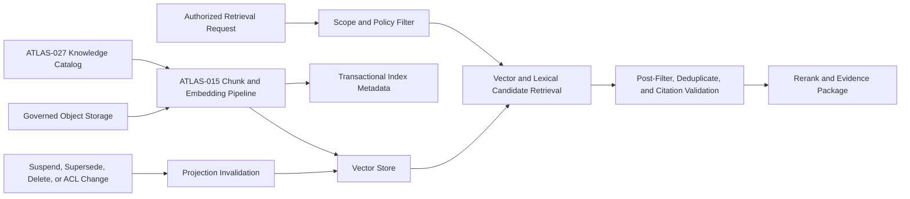
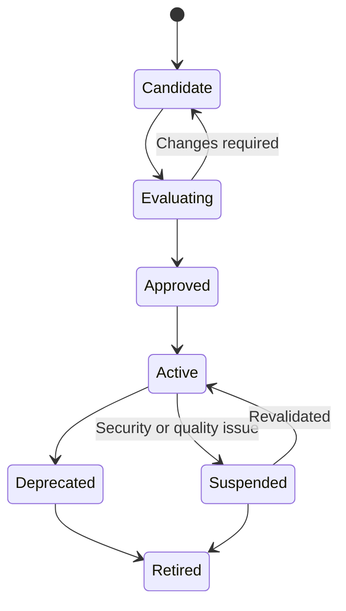

# Project Atlas

## Vector Database

| Field | Value |
| --- | --- |
| Document ID | ATLAS-054 |
| Version | 1.0.0 |
| Status | Approved |
| Document Owner | Knowledge Retrieval Engineering Owner |
| Reviewers | AI Architecture, Data Architecture, Security Architecture, Knowledge Management Owner, Platform Engineering, Site Reliability Engineering, Privacy and Data Governance, Quality Engineering |
| Approver | Umit Ozdemir (acting Architecture Owner) |
| Approval Date | 2026-08-03 |
| Last Updated | 2026-08-03 |
| Related Documents | [ATLAS-003](003_Project_Principles.md), [ATLAS-015](015_RAG_Architecture.md), [ATLAS-027](027_Knowledge_Engine.md), [ATLAS-032](032_Audit.md), [ATLAS-038](038_Deployment_and_Bootstrap.md), [ATLAS-041](041_Reasoning.md), [ATLAS-047](047_Guardrails.md), [ATLAS-051](051_Backend.md), [ATLAS-053](053_Database.md), [ATLAS-056](056_Testing.md), [ATLAS-057](057_Deployment.md) |
| Supersedes | ATLAS-054 version 0.1.0 |

## 1. Purpose

This document defines the vector-store requirements for Project Atlas retrieval-augmented generation and knowledge search.

The vector database stores derived embeddings and retrieval metadata. It is not the authoritative source for documents, knowledge lifecycle, permissions, or citations and must be rebuildable from governed inputs.

## 2. Scope

### In Scope

- Vector collections, points, embeddings, metadata, access filters, indexes, and query behavior
- Embedding lifecycle, versioning, re-indexing, deletion, migration, backup, and restore
- Hybrid retrieval integration, restricted-network operation, security, observability, and evaluation
- Candidate technology criteria and MVP boundaries

### Out of Scope

- Document acquisition, parsing, chunking, and reranking details covered by ATLAS-015
- Knowledge ownership and approval covered by ATLAS-027
- Transactional metadata storage covered by ATLAS-053
- Selecting an embedding model without evaluation
- Model training from vector contents

## 3. Objectives

- Retrieve semantically relevant authorized evidence with low interactive latency
- Preserve exact source, chunk, lifecycle, version, and embedding lineage
- Enforce organization, classification, and source ACLs before content reaches AI
- Support hybrid retrieval and deterministic metadata filters
- Remove or invalidate vectors promptly after source, permission, or lifecycle changes
- Operate locally in restricted and offline enterprise environments
- Permit rebuild, migration, and model change without losing authoritative knowledge

## 4. Core Principles

- Embeddings are derived data.
- Similarity is relevance evidence, not permission or truth.
- Metadata filtering is mandatory, not optional post-processing.
- Source and chunk versions are immutable.
- One embedding model space is not mixed with an incompatible space.
- Source suspension and deletion propagate to active retrieval.
- Vector search does not bypass document-level and chunk-level authorization.
- Retrieval quality and access isolation are tested separately.
- The store cannot send customer data to an external service implicitly.

## 5. Architecture

Transactional metadata tracks projection state and reconciliation. The vector store serves candidates only.

## 6. Candidate Technology Profiles

Candidates include:

- PostgreSQL with a supported vector extension for an operationally consolidated MVP
- Qdrant for a dedicated self-hosted vector service
- Another enterprise-suitable local store that passes the same requirements

Selection criteria:

- Metadata filtering correctness and performance
- Organization and collection isolation
- Hybrid or integration-friendly retrieval
- Index and payload update semantics
- Deletion and compaction behavior
- Backup, restore, replication, and restricted-network deployment
- Observability and operational maturity
- Scale, latency, recall, and resource efficiency
- Licensing, supported versions, and offline artifact availability

A benchmark uses representative chunks, filters, and concurrent query patterns.

## 7. Collection Strategy

Collections are partitioned by compatibility and isolation needs, considering:

- Organization or deployment boundary
- Embedding model and version
- Vector dimension and distance metric
- Language or content profile where justified
- Knowledge domain and retention class
- Security or residency boundary

Too many small collections create operational cost; one unrestricted collection creates isolation and lifecycle risk. The selected strategy is documented by ADR and validated at expected scale.

## 8. Vector Point Contract

Each point contains or references:

- Stable point ID
- Organization and deployment boundary
- Source, artifact, document, item, version, and chunk IDs
- Chunk ordinal and content checksum
- Embedding model, model version, dimension, normalization, and pipeline version
- Knowledge domain, source authority, lifecycle, and generated-content state
- Vendor, product, model, software or firmware version, language, and applicability
- Classification, access-policy reference, source ACL version, and scope tags
- Publication, observation, ingestion, review, expiry, suspension, and deletion times
- Parent-child and nearby-chunk references where useful
- Index batch, status, and reconciliation checkpoint

Raw secret-bearing content is never stored in vector payload metadata.

## 9. Embedding Contract

An embedding record declares:

- Approved embedding model ID and immutable version
- Model source and deployment endpoint class
- Input normalization and tokenizer assumptions
- Vector dimension and distance metric
- Maximum input length and truncation behavior
- Language and domain support
- Generation time, batch, and software version
- Content checksum and source chunk version
- Data-boundary and telemetry policy
- Evaluation suite and known limitations

Embedding generation is deterministic enough to detect stale projections, but exact floating-point equality across platforms is not assumed unless validated.

## 10. Embedding Model Lifecycle

Model change creates a new vector space. Re-embedding runs side by side, is evaluated, and changes the active retrieval profile only after validation. Rollback retains the prior compatible index during the transition window.

## 11. Ingestion and Upsert

- Only approved pipeline identities can write vectors.
- Source and chunk metadata are committed before or with projection intent.
- Point IDs are deterministic from immutable source and chunk version or otherwise idempotent.
- Upsert validates collection profile, dimensions, metadata schema, classification, and ownership.
- Batches have size, time, and resource limits.
- Partial batch failure reports exact accepted and rejected points.
- Projection status remains pending until reconciliation confirms expected counts and checksums.
- Duplicate source versions do not create unbounded duplicate points.

## 12. Authorization Filters

Before vector similarity is used, the query is constrained by:

- Organization or deployment boundary
- Current authenticated subject and purpose
- Classification and source ACL
- Environment, site, and resource scope where applicable
- Knowledge lifecycle and publication state
- Legal hold, suspension, deletion, and export restrictions
- Product and version applicability when required by the task

Filters are generated deterministically from authorized context. Model output cannot create or relax them.

## 13. Pre-Filter and Post-Filter

- Native vector-store filtering narrows candidates before similarity ranking.
- Post-filter revalidates current authoritative permission, source lifecycle, chunk existence, and classification.
- Candidate counts and timing do not reveal hidden content.
- Over-fetch for post-filtering is bounded and cannot cross organization boundaries.
- If native filters cannot express required isolation safely, the store or collection design is unsuitable.
- A permission-service outage fails closed.

## 14. Query Contract

A vector query includes:

- Query ID, purpose, subject, organization, scope, and classification ceiling
- Query embedding model and version
- Authorized collection profile
- Deterministic filters
- Candidate count, score threshold, and resource budget
- Product, version, language, time, and source preferences
- Exclusions and lifecycle constraints
- Correlation, task, and audit references

The query result contains point IDs, scores, safe metadata, and projection status. Full content is resolved from the governed artifact service after authorization.

## 15. Hybrid Retrieval

Hybrid retrieval combines:

- Semantic vector similarity
- Lexical or full-text matching
- Metadata and product-version filtering
- Source authority and lifecycle
- Recency and applicability
- Parent-child or neighboring context
- Graph and entity relevance where available

Fusion and reranking methods are versioned and evaluated. A high vector score cannot overcome a denied ACL, wrong product version, suspended source, or unsupported claim.

## 16. Score Interpretation

- Distance or similarity score is store- and model-specific.
- Scores are not displayed as factual confidence.
- Thresholds are calibrated per model, domain, language, and query class.
- Scores from incompatible vector spaces are not compared directly.
- Empty or low-quality results are valid and visible.
- Retrieval rank is separate from source authority and claim support.
- User-facing citations depend on content validation, not score alone.

## 17. Chunk and Citation Integrity

- Every point resolves to an existing immutable chunk and source artifact.
- Content checksum detects mismatch.
- Citation location and surrounding context are retained outside the embedding.
- Rechunking creates new chunk and vector versions.
- Superseded chunks remain available only for historical artifacts that cite them.
- Active retrieval excludes stale orphan points.
- Reconciliation detects missing, duplicate, or mismatched vectors.

## 18. Lifecycle Propagation

The following invalidate active retrieval:

- Source access removal or ACL change
- Item suspension, supersession, expiry, retirement, or deletion
- Classification increase or organization-scope change
- Artifact checksum or parser correction
- Chunking, embedding, or metadata schema change
- Model suspension or security issue
- Legal or licensing restriction

Invalidation updates transactional state first, blocks affected retrieval, and completes vector deletion or replacement asynchronously with observable status.

## 19. Deletion

- Deletion is identified by source, artifact, item version, chunk set, organization, or legal request.
- Active retrieval blocks points immediately through authoritative lifecycle state.
- Physical point deletion and index compaction follow with confirmation.
- Caches, lexical indexes, reranking stores, and derived summaries are included.
- Tombstones prevent deleted points from reappearing during replay or restore.
- Legal hold blocks deletion where required.
- Completion records expected, removed, missing, and failed counts.

## 20. Re-Indexing

Re-indexing is required for model, chunk, parser, metadata, filter, or store changes.

- A new index or collection is built alongside the active one.
- Source snapshot and pipeline versions are pinned.
- Progress, failures, counts, and resource use are visible.
- Retrieval quality and access isolation are evaluated before activation.
- Cutover is atomic at the retrieval-profile level.
- Prior index remains for bounded rollback.
- Delta changes during build are replayed or reconciled.
- Old index retirement follows retention and deletion rules.

## 21. Migration Between Stores

- Migrate from authoritative chunks and metadata when feasible rather than opaque store export alone.
- Validate dimensions, metric, metadata types, filter semantics, score behavior, and deletion.
- Compare retrieval, latency, access, and resource results against fixed evaluation sets.
- Run dual-read shadow evaluation without exposing mixed results to users.
- Preserve event, source, and vector lineage.
- Cutover and rollback are versioned and audited.
- Unsupported filter semantics block migration.

## 22. Restricted-Network Embedding

- Embedding models, tokenizers, runtimes, and dependencies are signed offline artifacts.
- Model files include checksum, license, provenance, supported hardware, and evaluation metadata.
- Inference runs within the approved deployment boundary.
- No model download or telemetry fallback uses public networks.
- Offline updates support side-by-side evaluation and rollback.
- Hardware acceleration is optional unless declared by the supported profile.

## 23. Security

- Encrypt client, replica, administrative, and backup paths.
- Use distinct least-privileged read, write, migration, backup, and administration identities.
- Restrict network access to retrieval and ingestion services.
- Treat vector payloads and scores as sensitive derived data.
- Prevent arbitrary filter or query-language injection.
- Bound query vectors, dimensions, candidate counts, and computational cost.
- Do not expose raw vector values through ordinary APIs.
- Detect unusual bulk query, enumeration, export, and cross-scope attempts.

## 24. Privacy and Data Governance

- Embeddings inherit the most restrictive source classification.
- Personal and infrastructure data minimization occurs before embedding.
- The organization can identify which model processed each chunk.
- Embeddings are included in deletion and residency analysis.
- Cross-customer model or index sharing requires proven isolation and explicit governance.
- Test and evaluation data is synthetic or approved.
- Model providers receive no customer content unless explicitly configured and authorized.

## 25. Backup and Restore

Two recovery profiles are supported:

- Rebuild from authoritative artifacts, chunks, metadata, models, and pipeline versions
- Store-native backup where rebuild time exceeds recovery objective

Restore or rebuild validates collection profile, point count, sample checksums, ACL filters, lifecycle exclusions, deleted tombstones, query quality, and current model compatibility. Restored vectors are not activated until reconciliation passes.

## 26. High Availability

- Production profile defines replica and failover behavior appropriate to retrieval objectives.
- Ingestion and retrieval availability can differ.
- Replica lag and index-build state are visible.
- Failover preserves organization and filter semantics.
- Split-brain writes and conflicting collection state are prevented.
- A vector-store outage degrades knowledge retrieval explicitly; it does not authorize model-only answers as evidence-grounded.
- HA does not replace backup or rebuild testing.

## 27. Performance and Capacity

Plan and monitor:

- Documents, chunks, vectors, payload size, and growth
- Dimensions, index type, build time, and memory
- Concurrent query and ingestion load
- Filter selectivity and candidate over-fetch
- p50, p95, and p99 query and end-to-end retrieval latency
- Recall and latency tradeoff
- Re-index and compaction headroom
- Backup or rebuild duration
- CPU, memory, storage, and acceleration requirements

Interactive latency target covers authorization, embedding, candidate search, content resolution, reranking, and evidence packaging, not vector search alone.

## 28. Observability

- Collections and points by organization, model, domain, lifecycle, and status
- Ingestion, upsert, deletion, reconciliation, and re-index backlog
- Query rate, latency, filter selectivity, score distribution, and empty result
- Authorization and post-filter rejection
- Orphan, duplicate, dimension, checksum, and metadata errors
- Store availability, replica, memory, disk, compaction, and index-build health
- Model version usage and deprecated index traffic
- Backup, rebuild, restore, and cutover status

Labels avoid source text, raw identities, and high-cardinality point IDs.

## 29. Evaluation

- Retrieval recall, precision, ranking, and citation usefulness
- Product and version applicability
- Authority, freshness, and lifecycle handling
- Metadata-filter correctness
- Organization, role, classification, and hidden-content isolation
- Deletion and ACL-change propagation
- Hybrid versus vector-only quality
- Adversarial and prompt-injection source behavior
- Query latency and resource use at representative scale
- Re-index and migration equivalence

Evaluation includes empty-answer and no-authorized-result cases.

## 30. Testing

- Point and metadata schema, dimensions, checksums, and idempotent upsert
- Native pre-filter and authoritative post-filter
- Cross-organization, classification, role, and source ACL isolation
- Source suspend, supersede, expire, delete, and permission change
- Hybrid fusion, score threshold, wrong-version, conflict, and empty result
- Ingestion partial failure and reconciliation
- Re-index side-by-side cutover and rollback
- Backup, rebuild, restore, tombstone, and deleted-content non-return
- HA failover, replica lag, outage, and degraded retrieval
- Query injection, resource exhaustion, bulk enumeration, and raw-vector access denial

## 31. MVP Scope

### Included

- One self-hosted vector-store profile selected by ADR
- One approved local embedding model profile
- Organization, classification, source ACL, lifecycle, product, version, and language metadata
- Deterministic pre-filter and authoritative post-filter
- Vector plus lexical hybrid retrieval integration
- Idempotent ingestion, reconciliation, deletion, and full rebuild
- Query and access evaluation suite
- Restricted-network artifacts and operational metrics

### Excluded

- Externally hosted vector service by default
- Cross-organization shared collections without proven isolation
- Vector score as AI confidence
- Embeddings as authoritative document storage
- Automatic model switch without side-by-side evaluation
- Universal multilingual or every-domain optimization

## 32. Dependencies and Traceability

- ATLAS-003 defines knowledge, data-boundary, secret, and reliability principles.
- ATLAS-015 owns the full RAG pipeline.
- ATLAS-027 owns knowledge authority, lifecycle, and access.
- ATLAS-032 preserves sensitive retrieval and lifecycle audit.
- ATLAS-038 and ATLAS-057 govern offline and deployed store profiles.
- ATLAS-041 and ATLAS-047 govern evidence reasoning and prompt-injection safety.
- ATLAS-051 and ATLAS-053 own backend and authoritative metadata boundaries.
- ATLAS-056 defines retrieval and isolation testing.

## 33. Assumptions

- Knowledge artifacts and chunks are stored outside the vector database authoritatively.
- A local embedding runtime is available in restricted environments.
- Retrieval scale and filter selectivity can be represented in evaluation datasets.
- Rebuild is acceptable for at least the initial deployment profile.

## 34. Open Questions and ADR Backlog

- Is the first store PostgreSQL vector extension or Qdrant?
- Which local embedding model, dimension, metric, and language coverage are selected?
- What collection and organization-isolation strategy is required?
- What recall, latency, deletion, and isolation thresholds block release?
- Is store-native backup needed for MVP, or is verified rebuild sufficient?
- Which lexical engine and fusion method implement hybrid retrieval first?

## 35. Acceptance Criteria

This document is ready to enter Review when:

- Vector-store and embedding contracts, authority boundaries, and collection strategy are agreed.
- Organization, classification, source ACL, lifecycle, and product-version filters are enforced before and after retrieval.
- Source change, permission change, suspension, deletion, model change, and rebuild behavior are testable.
- Similarity score cannot be confused with confidence, authority, or permission.
- Restricted-network model and store operation has no implicit external dependency.
- AI, data, knowledge, security, platform, privacy, operations, and testing reviewers accept the contract.

## 36. Change History

| Version | Date | Author | Summary |
| --- | --- | --- | --- |
| 0.1.0 | 2026-07-21 | Project Atlas Team | Initial vector-store goals, capabilities, candidates, and questions |
| 0.2.0 | 2026-08-03 | Knowledge Retrieval Engineering Owner | Added vector and embedding contracts, access filtering, hybrid retrieval, score and citation semantics, lifecycle invalidation, deletion, re-index, migration, offline operation, recovery, evaluation, and testing |
| 1.0.0 | 2026-08-03 | Umit Ozdemir | Approved as the first binding documentation baseline under the designated approver authority |
