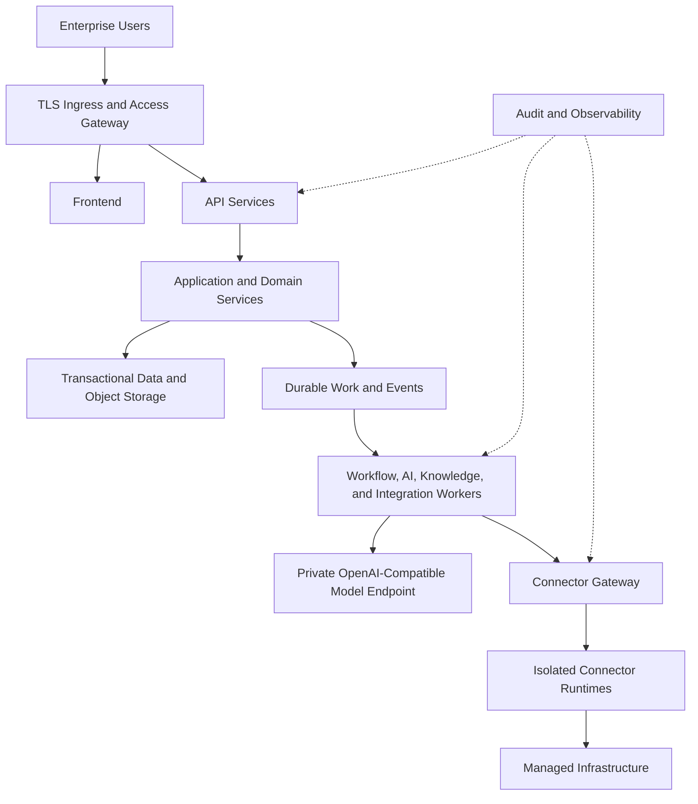

# Project Atlas

## Deployment

| Field | Value |
| --- | --- |
| Document ID | ATLAS-057 |
| Version | 1.0.0 |
| Status | Approved |
| Document Owner | Platform Engineering Owner |
| Reviewers | Architecture Owner, Security Architecture, Site Reliability Engineering, Backend Engineering, Frontend Engineering, Database Engineering, Network Engineering, Infrastructure Operations, Quality Engineering |
| Approver | Umit Ozdemir (acting Architecture Owner) |
| Approval Date | 2026-08-03 |
| Last Updated | 2026-08-03 |
| Related Documents | [ATLAS-003](003_Project_Principles.md), [ATLAS-013](013_Deployment_Architecture.md), [ATLAS-016](016_Event_Architecture.md), [ATLAS-030](030_Authentication.md), [ATLAS-032](032_Audit.md), [ATLAS-033](033_Logging.md), [ATLAS-038](038_Deployment_and_Bootstrap.md), [ATLAS-051](051_Backend.md), [ATLAS-052](052_Frontend.md), [ATLAS-053](053_Database.md), [ATLAS-054](054_VectorDB.md), [ATLAS-056](056_Testing.md), [ATLAS-058](058_CI_CD.md), [ATLAS-059](059_Release_Process.md) |
| Supersedes | ATLAS-057 version 0.1.0 |

## 1. Purpose

This document defines deployment artifacts and operating practices for Project Atlas implementation.

ATLAS-013 defines target deployment architecture and ATLAS-038 defines bootstrap flow. This document specifies how release artifacts represent environments, infrastructure, configuration, rollout, upgrade, rollback, availability, recovery, and restricted-network operation.

## 2. Scope

### In Scope

- Deployment profiles, artifacts, topology, configuration, secrets, certificates, and network controls
- Resource, storage, database, model, connector, and observability deployment
- Rollout, migration, upgrade, rollback, backup, restore, HA, and disaster recovery
- Environment promotion, drift, restricted-network bundles, validation, and operational handoff

### Out of Scope

- Build and CI workflow covered by ATLAS-058
- Release governance covered by ATLAS-059
- Customer-specific infrastructure procurement
- Claiming production readiness before architecture and test gates are approved
- Automatic vendor infrastructure configuration

## 3. Objectives

- Deploy the same immutable release predictably across supported profiles
- Separate environment configuration from built artifacts
- Protect credentials, trust, network, and data boundaries
- Make health, capacity, failure, upgrade, and rollback observable
- Support connected, mirrored, proxy-restricted, and offline environments
- Avoid dependence on personal workstations or undocumented manual steps
- Provide tested recovery and operational ownership

## 4. Deployment Profiles

| Profile | Purpose | Orchestration | Availability |
| --- | --- | --- | --- |
| Developer | Local feature and integration work | Supported container composition or equivalent | Single instance, disposable dependencies |
| Lab | Connector, model, workflow, and integration validation | Container or small orchestrated environment | Bounded single or multi-node |
| Enterprise test | Production-like release validation | Kubernetes-compatible platform preferred | HA topology where tested |
| Enterprise production | Governed operational service | Approved Kubernetes-compatible platform or ADR-selected equivalent | Defined HA and recovery objectives |
| Offline enterprise | Restricted or air-gapped deployment | Same supported runtime using internal registry and bundles | Profile-specific HA |

The release manifest states supported profiles and exact platform versions.

## 5. Deployment Unit Catalog

- Web frontend
- API and application service
- Workflow and background workers
- AI orchestration workers
- Connector Gateway
- Isolated connector runtime pools
- Knowledge ingestion and indexing workers
- Audit ingestion and search services
- Integration and notification workers
- Transactional database
- Object storage
- Vector and graph or search projections
- Queue, cache, and event infrastructure selected by ADR
- Observability collectors and exporters

Logical units can share an image or deployment initially only when security, scaling, and failure boundaries permit.

## 6. Deployment Architecture

Trust zones and egress paths follow ATLAS-013.

## 7. Deployment Artifacts

Each release can include:

- Signed container images with immutable digests
- Helm chart, Kubernetes manifests, or ADR-selected orchestration package
- Developer container-composition profile
- Configuration schemas and environment-value examples
- Database and projection migrations
- Bootstrap and preflight tools
- Policy, workflow, agent, prompt, guardrail, runbook, and report seed packages
- OpenAPI, event, MCP, and artifact schemas
- Offline bundle manifest and import tools
- SBOM, provenance, checksums, signatures, compatibility matrix, and release notes
- Verification, backup, restore, upgrade, rollback, and support procedures

Release artifacts contain no customer credentials or production configuration.

## 8. Immutable Artifact Rules

- Images and packages are identified by immutable digest and semantic version.
- Tags are convenience pointers and not trusted alone.
- Promotion does not rebuild artifacts.
- Every artifact has publisher, source commit, build, dependency, SBOM, provenance, signature, and checksum references.
- Runtime images contain only required supported components.
- Debug tools are excluded from production images unless explicitly approved.
- Images run without root and with read-only filesystem where feasible.
- Unknown or unsigned artifacts fail preflight.

## 9. Environment Configuration

- One versioned schema validates all environment configuration.
- Base configuration plus explicit environment overlays is preferred.
- Values files contain no secret values.
- Organization, site, endpoint, storage, scale, retention, and feature settings are externalized.
- Secure defaults bind administrative services privately.
- Unknown settings and unsupported combinations fail deployment.
- Effective configuration and digest are recorded with redaction.
- Configuration promotion is reviewed separately from image promotion.
- Drift between desired and observed configuration is detected.

## 10. Secrets and Workload Identity

- Secret-manager integration is required for production profiles.
- Workloads receive distinct service identities and least-privileged access.
- Secrets are mounted or fetched through approved short-lived mechanisms.
- Environment variables containing long-lived secret values are avoided in production.
- Connector, model, database, integration, and signing credentials remain separate.
- Rotation supports overlap and no broad restart where possible.
- Secret references and workload identity are validated before readiness.
- Deployment manifests, rendered plans, events, logs, and support bundles are scanned for leakage.

## 11. Certificates and Trust

- External ingress, service-to-service, model, connector, database, and integration TLS profiles are explicit.
- Trust anchors and expected identities are configured, not inferred broadly.
- Private keys remain in approved key-management boundaries.
- Certificate issuance, renewal, rotation, revocation, and expiry alerts are automated where supported.
- Temporary self-signed trust is limited to developer profiles.
- No production component silently disables hostname or chain verification.
- Trust rotation includes rollback and connectivity validation.

## 12. Network Design

- Ingress is limited to required user and integration endpoints.
- Administrative endpoints are private and separately authorized.
- East-west service communication uses explicit identity and policy.
- Connector runtimes have target-specific egress allowlists.
- Model endpoint egress follows approved data boundary.
- Direct arbitrary public internet egress is denied in enterprise profiles.
- DNS, proxy, no-proxy, MTU, and timeout requirements are documented.
- Network policy blocks lateral access not required by the component.
- Syslog, SIEM, ITSM, LDAP, and object endpoints are explicit dependencies.

## 13. Resource and Scheduling Controls

- Every workload declares requests, limits, concurrency, and expected resource profile.
- CPU, memory, ephemeral storage, file descriptors, and process count are bounded.
- AI, ingestion, graph, report, and connector workloads use separate pools or quotas where needed.
- Critical control services receive scheduling priority over batch work.
- Anti-affinity and topology spread protect HA deployments.
- Node selectors and hardware acceleration are optional profiles, not hidden assumptions.
- Resource exhaustion produces backpressure and alerts rather than uncontrolled eviction loops.

## 14. Stateful Services

- Database, object, queue, vector, graph, search, and cache requirements are declared separately.
- Persistent volumes have storage class, capacity, performance, encryption, expansion, and backup policy.
- Data services use supported operators or managed patterns only after ADR and operational validation.
- Application charts do not pretend to provide production-grade data HA without testing.
- Stateful upgrades honor version and quorum rules.
- Persistent data is not deleted with compute teardown by default.
- Restore order and compatibility are documented.

## 15. Database Deployment

- Supported database version and extensions are pinned.
- Application and migration identities are separate.
- Connection TLS, pools, timeouts, and credential rotation are configured.
- Schema compatibility is checked before traffic.
- HA, backup, point-in-time recovery where selected, and failover are validated.
- Read replicas are not used for stale authority-sensitive state unless explicitly safe.
- Migration runs under one lock and emits progress and audit evidence.
- Capacity covers growth, indexes, migration, backup, and failover headroom.

## 16. Object, Vector, and Graph Deployment

- Each service declares authority, rebuild, backup, consistency, and recovery profile.
- Organization and classification isolation is validated.
- Credentials and network paths are least-privileged.
- Index build, compaction, re-index, and migration use bounded worker resources.
- Projection checkpoint and staleness are visible.
- Vector-model and dimension compatibility block incorrect startup.
- Deleted or suspended content cannot reappear after restore or rebuild.
- Store-native HA claims require failover tests.

## 17. Model Endpoint Deployment

- Endpoint is local or privately hosted under ATLAS-014.
- Model and runtime artifacts are signed, pinned, licensed, and compatible with hardware.
- Network, TLS, authentication, data handling, telemetry, context, rate, and concurrency are explicit.
- Model workloads have resource isolation from control services.
- Health checks use synthetic non-sensitive input.
- Model change is promoted independently through evaluation gates.
- Fallback never sends data to a less trusted endpoint silently.
- Endpoint outage produces explicit degraded state.

## 18. Connector Runtime Deployment

- Connector packages are verified before runtime creation.
- Runtime images or sandboxes have read-only base, minimal privileges, resource limits, and restricted egress.
- Credential access is target and capability specific.
- Package, target, capability, and organization isolation are enforceable.
- Runtime pools can be recycled after untrusted or high-risk work.
- Connector failure cannot crash the API or core workflow service.
- C3-C5 remain unavailable to direct AI invocation.
- Runtime health, package version, and target connectivity are observable.

## 19. Observability Deployment

- Structured logs, metrics, traces, and audit are enabled by default.
- Collectors buffer within bounded encrypted storage.
- Dashboards and alerts cover identity, policy, audit, model, connector, queue, data, and integration health.
- Telemetry endpoints are private and authenticated.
- High-cardinality and sensitive labels are controlled.
- External forwarding uses validated TLS and queues.
- Monitoring of monitoring detects silent collectors and gaps.
- Production readiness includes alert routing and runbooks.

## 20. Health Probes

- Liveness indicates process progress and avoids dependency cascades.
- Readiness verifies dependencies required for accepted traffic.
- Startup probes cover slow initialization and migrations.
- Degraded optional capability is exposed separately from total readiness.
- Probes are lightweight, bounded, and non-mutating.
- Authentication and sensitive status protect detailed health.
- Connector target health is not the same as connector runtime readiness.
- Load balancers remove unready instances without losing durable state.

## 21. Scaling

- Stateless web and API processes scale horizontally.
- Worker pools scale by queue, task type, capability, and resource profile.
- AI and ingestion concurrency is limited by model and data-store capacity.
- Connector concurrency respects target and vendor limits.
- Stateful scaling follows selected store architecture.
- Autoscaling uses bounded meaningful signals and avoids oscillation.
- Scale-to-zero is prohibited for required control services unless recovery time is accepted.
- Capacity models include failure and maintenance state.

## 22. Availability

Production topology defines:

- Redundant ingress and stateless services
- Control-service replicas and placement
- Durable queue and workflow recovery
- Database and object-store availability
- Vector, graph, and search degradation behavior
- Model and connector failure isolation
- Dependency timeout and circuit behavior
- Maintenance and rolling-update capacity

Critical identity, authorization, policy, approval, audit, and secret failures fail safely rather than serving uncontrolled traffic.

## 23. Environment Promotion

- Source and build create one immutable artifact set.
- Artifacts pass integration, security, evaluation, deployment, and recovery gates.
- Promotion references digest and release manifest; it does not rebuild.
- Environment configuration and secret binding are validated separately.
- Production promotion requires release and change approvals.
- Evidence includes prior environment results and accepted differences.
- Rollback artifacts remain available for the declared window.
- Offline promotion uses signed bundles and custody records.

## 24. Deployment Strategy

- Rolling deployment is preferred for compatible stateless changes.
- Blue-green or canary is used when risk, model behavior, schema, or rollback speed justifies it.
- One deployment changes a bounded set of artifacts.
- Readiness gates traffic.
- Soak period and automatic abort thresholds are declared.
- Security and control-service errors have zero or very low tolerance.
- Rollout progress distinguishes deployed, ready, degraded, failed, paused, and rolled back.
- AI quality can use shadow or canary evaluation without exposing unvalidated output as authoritative.

## 25. Database and Schema Rollout

- Expand schema before code depends on it.
- Deploy compatible code during transition.
- Backfill in resumable bounded jobs.
- Switch reads or writes under versioned configuration where necessary.
- Remove old schema only after usage evidence and rollback window.
- Irreversible migration requires recovery and release approval.
- Mixed-version behavior is tested when rolling updates are supported.
- Application does not start against unsupported schema.

## 26. Upgrade

Upgrade preflight validates:

- Current and target release compatibility
- Artifact signatures, checksums, and support status
- Configuration and schema migration
- Database, store, model, connector, workflow, policy, and API compatibility
- Backup and restore readiness
- Capacity and rollout headroom
- Certificate, secret, and external integration health
- In-flight workflows and approvals
- Offline dependency completeness

Upgrade creates immutable evidence and runs the release verification suite.

## 27. Rollback

- Rollback uses prior signed artifacts and compatible configuration.
- Database and projection compatibility are checked first.
- Irreversible migration can require restore or forward recovery rather than binary rollback.
- In-flight workflows, approvals, events, and external effects are reconciled.
- Model, prompt, agent, policy, runbook, and connector versions roll back only in compatible sets.
- Rollback is followed by security, data, health, and service validation.
- Repeated automated rollback is bounded to prevent loops.

## 28. Backup and Restore

- Backup scope follows ATLAS-053 and ATLAS-032.
- Schedules, encryption, retention, destinations, and ownership are configuration.
- Backup identities are separate from application identities.
- Restore is tested in isolated supported environments.
- Restore verifies organization isolation, revocation, legal hold, deletion, workflows, approvals, and audit.
- Derived stores rebuild or restore from consistent checkpoints.
- Recovery time and point are measured.
- Backup failure generates operational alerts and can block risky upgrades.

## 29. Disaster Recovery

DR design declares:

- Failure scenarios and protected service scope
- Recovery point and time objectives
- Primary and recovery site responsibilities
- Data replication and consistency
- Secret, key, certificate, DNS, and identity recovery
- Artifact and offline bundle availability
- Workflow, event, approval, and audit reconciliation
- Activation, communication, validation, and return procedure
- Test schedule and evidence

HA within one cluster is not disaster recovery.

## 30. Restricted-Network and Offline Deployment

- All images, packages, models, schemas, charts, policies, and tools are in a signed release bundle.
- Internal registry and mirrors preserve digest and provenance.
- Preflight proves bundle completeness before mutation.
- No component attempts public download, telemetry, or license callback unless explicitly supported and configured.
- Trust and vulnerability metadata include freshness.
- Import and promotion use custody, malware, checksum, and signature checks.
- Offline update and rollback are tested end to end.
- Support export is signed, encrypted, classified, and redacted.

## 31. Drift Management

- Desired deployment, configuration, image, policy seed, and schema versions are recorded.
- Drift detection distinguishes authorized emergency change, external operator change, and observation delay.
- Automatic reconciliation is limited to declared safe resources.
- Security, identity, network, audit, and secret drift produces high-priority alerts.
- Drift remediation uses change and rollback procedures.
- Manual production fixes are captured back into versioned assets.
- Unknown drift blocks upgrade readiness where material.

## 32. Operational Handoff

Production handoff requires:

- Named service, platform, security, data, and escalation owners
- Verified release and configuration manifest
- Health, capacity, alert, dashboard, and on-call readiness
- Backup and restore evidence
- Upgrade, rollback, DR, and support procedures
- Certificate, secret, license, and review expiry inventory
- Known limitations, exceptions, and residual risk
- Incident, change, and vendor-support integration
- Access review and break-glass readiness

## 33. Security

- Least-privileged runtime and deployment identities
- Signed and scanned artifacts
- No secrets in manifests, plans, logs, or release bundles
- Private administration and minimized ingress
- Egress allowlists and network segmentation
- Non-root and restricted containers
- Read-only filesystems and minimal capabilities where feasible
- Explicit trust, encryption, and certificate validation
- Protected backups and separate keys
- Audited deployment and production access

## 34. Audit and Observability

ATLAS-032 records deployment, configuration, secret-reference, trust, migration, promotion, rollback, backup, restore, drift, break-glass, and production-access events.

Deployment metrics include rollout status, readiness, replicas, resources, queue, dependencies, store health, model and connector health, certificate expiry, backup age, and drift.

## 35. Testing

- Render and schema validation for every profile
- Policy and security checks on manifests
- Clean install, idempotent apply, interrupted resume, and uninstall preservation
- Connected, proxy, mirrored, and offline deployment
- Secret and certificate rotation
- Rolling, canary, blue-green where supported, abort, and rollback
- Database migration and mixed-version compatibility
- Node, dependency, model, connector, and data-store failure
- Backup, restore, HA failover, and DR exercise
- Drift detection and controlled remediation
- Support bundle redaction and offline export

## 36. MVP Scope

### Included

- Developer container-composition profile
- Linux-based lab profile
- Kubernetes-compatible enterprise test profile selected by ADR
- Signed images, deployment package, configuration schema, secret references, and network policies
- Relational, object, vector, queue, model, audit, and observability dependencies
- Rolling deployment and tested rollback foundation
- Backup and restore
- Mirrored and offline release-bundle deployment in lab
- Operational handoff checklist

### Excluded

- Untested production HA or DR claims
- Every Kubernetes distribution or operating system
- Public internet dependency in restricted profiles
- Embedded production secrets
- Automatic infrastructure firewall, DNS, identity, or vendor-system changes
- Destructive uninstall by default

## 37. Dependencies and Traceability

- ATLAS-003 requires reproducible deployment and safe failure.
- ATLAS-013 defines target topology and trust zones.
- ATLAS-016 defines event durability during rollout.
- ATLAS-030, ATLAS-032, and ATLAS-033 govern identity, audit, and logs.
- ATLAS-038 defines preflight and bootstrap.
- ATLAS-051 through ATLAS-054 define runtime and data-store needs.
- ATLAS-056 defines deployment and recovery testing.
- ATLAS-058 creates and promotes artifacts.
- ATLAS-059 governs release approval.

## 38. Assumptions

- Enterprise production targets an approved Kubernetes-compatible platform unless ADR selects another.
- Developer and lab profiles can use containers on supported hosts.
- Customers provide enterprise DNS, certificates, secrets, storage, and identity services.
- Offline environments can transfer signed bundles through approved channels.

## 39. Open Questions and ADR Backlog

- Which Kubernetes distributions and versions are first supported?
- Which chart or deployment packaging tool is selected?
- Which data services are customer-provided versus bundled by profile?
- What availability, recovery, scale, and performance objectives apply to the first production profile?
- Which rollout strategy is mandatory for model and schema changes?
- What offline bundle size, format, signing, and import tooling are selected?

## 40. Acceptance Criteria

This document is ready to enter Review when:

- Profiles, deployment units, artifacts, configuration, secrets, trust, and network design are agreed.
- Stateful, model, connector, audit, and observability deployment contracts are testable.
- Promotion, rollout, migration, upgrade, rollback, backup, restore, HA, DR, drift, and handoff are explicit.
- Restricted-network deployment has no hidden public dependency.
- Production readiness requires measured health, recovery, security, and operational evidence.
- Architecture, platform, security, application, data, network, operations, and testing reviewers accept the direction.

## 41. Change History

| Version | Date | Author | Summary |
| --- | --- | --- | --- |
| 0.1.0 | 2026-07-21 | Project Atlas Team | Initial deployment goals, artifacts, environments, and questions |
| 0.2.0 | 2026-08-03 | Platform Engineering Owner | Added profiles, units, immutable artifacts, configuration, secrets, network, resources, stateful services, model and connector deployment, scaling, rollout, migration, upgrade, rollback, recovery, offline operation, drift, and handoff |
| 1.0.0 | 2026-08-03 | Umit Ozdemir | Approved as the first binding documentation baseline under the designated approver authority |
