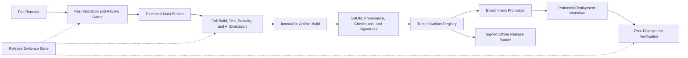

# Project Atlas

## CI/CD

| Field | Value |
| --- | --- |
| Document ID | ATLAS-058 |
| Version | 1.0.0 |
| Status | Approved |
| Document Owner | Platform Engineering and Release Automation Owner |
| Reviewers | Architecture Owner, Security Architecture, Engineering Enablement, Quality Engineering, Site Reliability Engineering, AI Architecture, Documentation Owner, Audit and Compliance |
| Approver | Umit Ozdemir (acting Architecture Owner) |
| Approval Date | 2026-08-03 |
| Last Updated | 2026-08-03 |
| Related Documents | [ATLAS-003](003_Project_Principles.md), [ATLAS-032](032_Audit.md), [ATLAS-038](038_Deployment_and_Bootstrap.md), [ATLAS-047](047_Guardrails.md), [ATLAS-050](050_API.md), [ATLAS-055](055_Coding_Standards.md), [ATLAS-056](056_Testing.md), [ATLAS-057](057_Deployment.md), [ATLAS-059](059_Release_Process.md) |
| Supersedes | ATLAS-058 version 0.1.0 |

## 1. Purpose

This document defines continuous integration, artifact production, promotion, and controlled delivery requirements for Project Atlas.

CI/CD establishes reproducible evidence and software-supply-chain integrity. It does not replace code review, release approval, change management, or deployment policy, and it never grants an AI agent autonomous production authority.

## 2. Scope

### In Scope

- Repository events, pipeline tiers, required checks, runners, identities, permissions, and secrets
- Build, test, scan, package, attest, sign, publish, promote, deploy, verify, and rollback automation
- Documentation, API, schema, connector, AI, model, offline bundle, and release evidence
- Branch protection, environment controls, audit, observability, and incident behavior

### Out of Scope

- Product release approval covered by ATLAS-059
- Deployment topology covered by ATLAS-057
- Final CI platform selection before ADR
- Autonomous production deployment by AI
- Customer-specific change-window administration

## 3. Objectives

- Provide fast trustworthy feedback on every change
- Prevent unreviewed or unsafe changes from reaching protected branches and artifacts
- Build immutable artifacts once and promote the same digests
- Preserve source, dependency, test, model, schema, and provenance evidence
- Protect CI credentials and production environments from untrusted code
- Produce connected and offline enterprise release bundles
- Make pipeline failures, exceptions, drift, and deployment outcome auditable

## 4. Pipeline Principles

- Pipeline definitions are versioned in the repository.
- Pull-request code receives no production secrets.
- Build and test use pinned dependencies and reproducible inputs.
- Artifacts are promoted, not rebuilt per environment.
- Required security and safety checks fail closed.
- Signing occurs only after successful required gates.
- Deployment uses protected environment identities and explicit approval.
- Generated code and configuration follow the same controls.
- Logs and artifacts contain no secrets.
- Offline artifacts preserve the same provenance and verification.

## 5. Pipeline Architecture



## 6. Repository and Branch Model

- `main` is protected and represents integrated releasable history.
- Changes enter through reviewed pull requests.
- Direct push, force push, and branch deletion are restricted.
- Required status checks and current review are enforced before merge.
- Signed commits or equivalent verified identity can be required for protected contributions.
- Release tags are protected and created by authorized release automation.
- Emergency changes use the same audit, test, and follow-up requirements with a separately governed path.
- Stacked documentation or feature branches remain explicit and merge in dependency order.

## 7. Pull Request Pipeline

Required fast checks include:

- Repository hygiene and changed-file policy
- Formatting and linting
- Strict static typing
- Unit and component tests
- Changed-area integration and contract tests
- OpenAPI, JSON Schema, event, connector, workflow, policy, and migration validation
- Architecture-boundary tests
- Documentation metadata, links, spelling or style where configured, and Markdown structure
- Secret and sensitive-data scan
- Dependency, license, and vulnerability review
- Infrastructure and container manifest policy
- Fast AI schema, grounding, refusal, and guardrail smoke suite for affected behavior

High-risk changes trigger additional owners and tests by path and metadata.

## 8. Main Branch Pipeline

After merge, CI runs:

- Clean dependency resolution from lock files
- Full unit, integration, contract, system, and browser suites
- Database migration from supported prior versions
- Connector simulator and retrieval suites
- Full mandatory AI evaluation subset
- Security static and dynamic checks appropriate to the build
- Artifact and container build
- SBOM, provenance, checksum, and signature generation
- Documentation and schema publication
- Ephemeral deployment and verification
- Evidence retention

A failed main build creates visible repository health degradation and blocks promotion.

## 9. Scheduled Pipeline

Scheduled suites include:

- Extended AI and adversarial evaluation
- Dependency and vulnerability refresh
- Fuzzing and long-running concurrency tests
- Performance and resource trend
- Chaos and dependency-failure scenarios
- Backup and restore validation
- Offline bundle reproducibility
- Certificate, signing-key, and artifact expiry monitoring
- Documentation link and compatibility drift
- Connector vendor-version compatibility where lab access permits

Scheduled failures are triaged with owner and severity and can suspend release readiness.

## 10. Release Candidate Pipeline

- Build from an authorized immutable commit or tag candidate.
- Run full release test matrix from ATLAS-056.
- Produce candidate images, packages, model references, schemas, documentation, and offline bundle.
- Generate SBOM, provenance, signatures, checksums, compatibility matrix, and release notes draft.
- Install clean in supported profiles.
- Upgrade from every supported source version.
- Test rollback or documented forward recovery.
- Restore backup and validate data and access.
- Run security, AI, connector, accessibility, and operational gates.
- Store complete release evidence for ATLAS-059 review.

## 11. Runner Trust Levels

| Runner | Input trust | Credentials | Permitted work |
| --- | --- | --- | --- |
| Untrusted PR runner | Unreviewed code, including forks | No protected secrets or signing identity | Static checks and isolated tests |
| Trusted CI runner | Protected main or approved internal branch | Read-only dependency and test credentials | Full build and integration tests |
| Build and signing runner | Protected immutable source | Ephemeral signing and registry identity | Reproducible artifact build and attestation |
| Deployment runner | Approved signed artifacts | Environment-scoped short-lived identity | Protected environment deployment |
| Offline bundle runner | Approved signed release set | Bundle-signing identity | Deterministic offline package creation |

Untrusted code cannot run on a runner with protected credentials.

## 12. Pipeline Identity and Permissions

- Every job uses a distinct workload identity where practical.
- Tokens are short-lived, audience-bound, repository- and environment-scoped.
- Default permissions are read-only.
- Write permissions are granted per job, not pipeline-wide.
- Signing, registry publishing, release tagging, and deployment are separated.
- Human and automation identities remain attributable.
- Shared static tokens are avoided.
- Permission changes are reviewed and audited.

## 13. Secrets in CI/CD

- Secrets come from approved CI or enterprise secret managers.
- Fork and untrusted pull requests receive no protected secret.
- Values are masked but masking is not the only protection.
- Secrets are not passed through command arguments, artifacts, caches, or debug traces.
- Jobs minimize exposure time and downstream processes.
- Synthetic services replace production integrations in CI.
- Secret scans cover source, history as configured, generated files, images, logs, and artifacts.
- Suspected exposure triggers revocation and incident handling.

## 14. Dependency Resolution

- Direct and transitive versions are locked.
- Package registries and mirrors are allowlisted.
- Integrity hashes or signatures are verified where supported.
- CI does not execute arbitrary dependency lifecycle scripts without policy.
- Dependency provenance, license, maintenance, and vulnerability are evaluated.
- Cache keys include lock-file and toolchain identity.
- Offline release includes all required runtime dependencies and metadata.
- Update automation opens reviewed changes and cannot merge itself solely on version freshness.

## 15. Toolchain Pinning

- Compiler, interpreter, package manager, formatter, linter, test, scanner, generator, and builder versions are pinned.
- Container build base images use immutable digests.
- CI actions and reusable workflows are pinned to immutable versions.
- Tool updates are reviewed and tested as supply-chain changes.
- Build environment and platform architecture are recorded.
- Clock and locale assumptions are controlled.
- Reproducibility differences are investigated before release.

## 16. Build Once, Promote

- One approved source commit produces one immutable artifact set.
- Environment deployment references signed digests.
- Environment configuration and secrets remain external.
- Promotion changes registry or release metadata, not artifact contents.
- A rebuilt artifact receives a new identity even from the same source.
- Post-build mutation invalidates signature and provenance.
- Promotion checks policy, compatibility, scan age, and release state.

## 17. Artifact Catalog

- Backend, frontend, worker, connector-gateway, and support images
- Connector packages and SDK artifacts
- Database and projection migrations
- API, event, workflow, policy, runbook, agent, prompt, guardrail, and configuration schemas
- Model and embedding model references or approved offline artifacts
- Deployment charts and manifests
- Documentation package
- Test fixtures and evaluation summaries where publishable
- Online and offline release manifests

Each artifact has stable name, version, digest, source, owner, compatibility, and lifecycle.

## 18. SBOM and Provenance

- Every shipped binary, image, package, and offline bundle has an SBOM.
- Provenance links source commit, build definition, runner identity, inputs, dependencies, and outputs.
- Generated source and artifacts retain generator and version.
- Model artifacts record source, license, checksum, runtime, and evaluation profile.
- Connector and plugin packages record publisher and capability manifest.
- Attestations are signed and verifiable offline.
- Missing or unverifiable provenance blocks release.

## 19. Signing and Verification

- Signing keys are held in approved key-management systems.
- Build jobs request short-lived signing operations after gates pass.
- Source tags, images, packages, manifests, SBOMs, and offline bundles are signed as required.
- Verification occurs at publish, promotion, deployment preflight, and offline import.
- Key rotation supports overlapping trust and revocation.
- Compromised signing identity triggers artifact suspension and incident response.
- CI cannot bypass signature verification through a convenience flag in protected environments.

## 20. Security Checks

- Secret and sensitive-data scanning
- Static application security testing
- Dependency and vulnerability scanning
- License and policy checks
- Container and base-image scanning
- Infrastructure and deployment manifest policy
- IaC misconfiguration scanning
- API and browser dynamic testing on protected test deployments
- Malware and active-content scanning for packaged assets
- Signature, provenance, and SBOM validation

Severity thresholds and exception policy are versioned. Critical control bypass findings block release.

## 21. AI and Model Gates

Changes to model, prompt, agent, retrieval, tool, guardrail, runbook, or recommendation logic trigger:

- Structured-output and schema checks
- Grounding and citation evaluation
- Domain correctness and applicability tests
- Confidence and uncertainty calibration
- Prompt-injection, DLP, exfiltration, tool-scope, and refusal tests
- Risk, impact, duration, interruption, and recovery completeness
- Human review for consequential behavior
- Baseline comparison with statistical and safety thresholds
- Rollback artifact and compatibility validation

Aggregate quality improvement cannot offset a failed invariant safety case.

## 22. API, Schema, and Migration Gates

- Detect breaking OpenAPI, event, connector, configuration, workflow, policy, and artifact changes.
- Require explicit version and migration for accepted breaks.
- Validate generated clients and examples.
- Run database migrations from every supported version.
- Test expand-and-contract and mixed-version behavior where required.
- Validate migration lock, duration, resume, rollback, or recovery.
- Ensure retired fields have usage and deprecation evidence.
- Include schemas and migrations in release manifest.

## 23. Documentation Gates

- Required governed metadata and change history
- Unique document IDs and registered filenames
- Valid relative links and anchors where checked
- Balanced code fences and Markdown structure
- ASCII or repository-approved character-set policy
- No unresolved temporary markers outside explicit open-question sections
- API, schema, behavior, migration, deployment, and release documentation updated with code
- Generated documentation reproducible from contracts
- No secrets, customer data, or environment-specific production details

## 24. Caching

- Cache improves performance but is not a trust source.
- Keys include toolchain, platform, lock file, source, and configuration identity.
- Untrusted PRs cannot poison caches used by privileged signing or deployment jobs.
- Cache restore paths are restricted and contents validated.
- Secrets are never cached.
- Release builds can bypass or verify caches for reproducibility.
- Cache hit, miss, corruption, and eviction are observable.

## 25. Test Artifacts and Evidence

- Test reports, coverage, evaluation, scan, benchmark, deployment, migration, and restore evidence use immutable references.
- Logs are redacted and bounded.
- Failed and skipped tests are preserved, not only successful summaries.
- Evidence retention aligns with release and compliance policy.
- Restricted payloads remain in protected stores.
- Release review uses evidence by digest, not mutable latest links.
- Evidence packages are verifiable offline where required.

## 26. Environment Protection

- Environments have explicit owners, required reviewers, and allowed branches or tags.
- Deployment credentials are environment-scoped.
- Production requires current release approval and change context.
- Self-approval is prevented where separation is required.
- Concurrency controls prevent overlapping conflicting deployments.
- Maintenance window, freeze, and environment health are checked.
- Manual override is bounded, justified, audited, and cannot weaken invariants.
- Environment secrets are not readable by build jobs.

## 27. Deployment Automation

- Deployment consumes only trusted signed release artifacts.
- Preflight validates environment, configuration, trust, schema, capacity, and backup.
- The deployment plan and diff are reviewable.
- Rollout follows ATLAS-057 and exposes progress.
- Post-deployment verification is mandatory.
- Failure triggers pause or approved rollback based on deterministic criteria.
- Deployment result, version, configuration digest, and evidence are recorded.
- AI can summarize status but cannot initiate or approve production deployment.

## 28. Promotion Stages

Example stage flow:

```text
build -> integration -> lab -> enterprise-test -> release-candidate -> production-approved
```

- Stage entry criteria are versioned.
- The same artifact digests move forward.
- Test and evaluation evidence accumulates.
- Expired scans, signatures, or compatibility can block later promotion.
- Environment-specific findings can reject or suspend promotion.
- Production promotion is a release and change decision, not a CI success side effect.

## 29. Offline Bundle Pipeline

The offline pipeline:

1. Resolves the approved release artifact graph.
2. Verifies every signature, digest, license, and compatibility record.
3. Includes images, packages, models, schemas, migrations, deployment assets, documentation, SBOMs, provenance, and verification tools.
4. Generates deterministic manifest and checksums.
5. Scans the complete package.
6. Signs the bundle and custody metadata.
7. Tests import and clean deployment in an offline lab.
8. Stores size, contents, freshness, and known limitations.

No production secrets or customer configuration are included.

## 30. Rollback Automation

- Prior signed artifacts remain available through the rollback window.
- Rollback checks database, configuration, workflow, model, connector, and policy compatibility.
- Automation refuses unsafe binary rollback after irreversible migration.
- In-flight operations and external effects are reconciled.
- Rollback requires protected environment authority and applicable approval.
- Verification after rollback is mandatory.
- Repeated rollback loops are prevented.
- Forward recovery is explicit when rollback is not possible.

## 31. Failure Behavior

- Failed required check blocks merge, signing, promotion, or deployment at its gate.
- CI platform outage does not permit manual unsigned release.
- Scanner outage blocks affected security gate unless an approved bounded exception exists.
- Secret detection stops artifact publication and triggers response.
- Signing failure leaves artifacts untrusted and unpublished.
- Deployment unknown state pauses and reconciles before retry.
- Evidence-store failure blocks release approval where evidence is mandatory.
- Partial pipeline success is never represented as a release.

## 32. Exceptions

Exceptions include:

- Exact failed or unavailable control
- Affected artifact and environment
- Justification and urgency
- Risk and compensating controls
- Owner, security reviewer, and approver
- Expiry and remediation issue
- Tests and monitoring required
- Whether promotion is limited to a non-production stage

ATLAS-003 principles and ATLAS-047 invariants cannot be waived.

## 33. Audit

ATLAS-032 records protected-branch changes, workflow and permission changes, artifact build and signing, promotion, release tags, environment approval, deployment, rollback, exception, secret exposure, and production-access events.

Pipeline logs remain operational evidence and do not replace the authoritative audit trail.

## 34. Observability

- Pipeline queue, duration, pass, fail, cancel, and retry
- Check and test trend by component
- Flake and quarantine state
- Dependency, vulnerability, and license findings
- Artifact build, signature, provenance, and publication health
- Promotion lead time and blocked reasons
- Deployment, rollback, and verification outcome
- Runner capacity and trust-level use
- Secret access and denied permission
- Offline bundle size, build, scan, import, and test status

## 35. Testing the Pipeline

- Workflow syntax, permissions, and trigger behavior
- Fork and untrusted PR secret isolation
- Cache poisoning resistance
- Dependency and action pinning
- Artifact reproducibility and tamper detection
- Signing, rotation, revocation, and verification
- Failed gate prevention of merge, publication, promotion, and deployment
- Environment approval and separation of duties
- Deployment timeout, partial, unknown, rollback, and verification
- Offline bundle completeness and air-gapped install
- Backup of release evidence and pipeline configuration recovery

## 36. MVP Scope

### Included

- One CI platform selected by ADR
- Protected main branch and pull-request workflow
- Formatting, lint, typing, unit, integration, contract, security, secret, dependency, schema, documentation, and AI smoke gates
- Full main and release-candidate suites
- Immutable container and package build
- SBOM, provenance, checksums, signing, and trusted registry
- Protected lab and enterprise-test deployment
- Signed offline bundle with tested import
- Release evidence for ATLAS-059

### Excluded

- Unreviewed automatic production deployment
- Production secrets in pull-request workflows
- Floating unpinned CI actions or dependencies
- Rebuild per environment
- Self-merging AI-generated changes
- Waiver of invariant safety gates

## 37. Dependencies and Traceability

- ATLAS-003 defines repository, version, audit, and generated-artifact principles.
- ATLAS-032 governs pipeline and release audit.
- ATLAS-038 defines bootstrap and offline validation.
- ATLAS-047 supplies invariant AI safety gates.
- ATLAS-050 and ATLAS-055 define contracts and coding quality.
- ATLAS-056 defines test tiers and release gates.
- ATLAS-057 defines deployment and rollback behavior.
- ATLAS-059 consumes release artifacts and evidence.

## 38. Assumptions

- GitHub or an equivalent enterprise repository platform provides protected branches and workload identity.
- Enterprise runners can access internal mirrors and lab dependencies.
- Signing and artifact registry services are available.
- Production deployment remains a human-governed release and change decision.

## 39. Open Questions and ADR Backlog

- Which CI platform, runner model, registry, signing, and provenance tools are selected?
- Which checks run on every PR versus main, scheduled, and release candidate?
- What vulnerability, quality, performance, and AI evaluation thresholds block promotion?
- Which protected environments are automated before production?
- What evidence retention and artifact retention periods apply?
- Which offline bundle format and transfer-verification tools are supported?

## 40. Acceptance Criteria

This document is ready to enter Review when:

- Repository, runner trust, identity, secret, pipeline tier, and required-check rules are agreed.
- Build-once promotion, SBOM, provenance, signing, verification, and evidence are testable.
- Untrusted code cannot access protected credentials or poison privileged outputs.
- AI, schema, migration, documentation, security, deployment, rollback, and offline gates are complete.
- Production delivery remains protected by human release and change governance.
- Platform, security, quality, engineering, AI, operations, documentation, and audit reviewers accept the contract.

## 41. Change History

| Version | Date | Author | Summary |
| --- | --- | --- | --- |
| 0.1.0 | 2026-07-21 | Project Atlas Team | Initial CI/CD goals, checks, and questions |
| 0.2.0 | 2026-08-03 | Platform Engineering and Release Automation Owner | Added pipeline tiers, runner trust, identities, secrets, pinned supply chain, build-once promotion, artifacts, SBOM, provenance, signing, AI and schema gates, environments, offline bundles, rollback, failure, and evidence |
| 1.0.0 | 2026-08-03 | Umit Ozdemir | Approved as the first binding documentation baseline under the designated approver authority |
