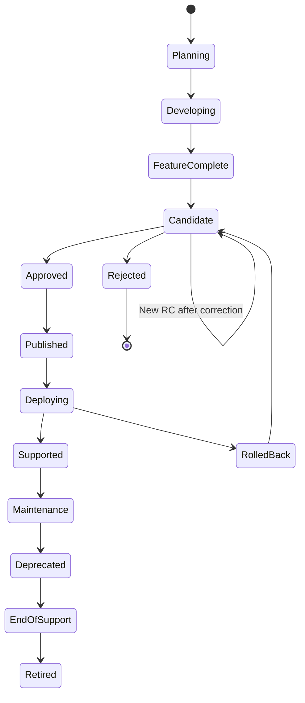

# Project Atlas

## Release Process

| Field | Value |
| --- | --- |
| Document ID | ATLAS-059 |
| Version | 1.0.0 |
| Status | Approved |
| Document Owner | Release Management Owner |
| Reviewers | Product Owner, Architecture Owner, Security Architecture, Quality Engineering, Platform Engineering, Site Reliability Engineering, AI Architecture, Infrastructure Domain Owners, Support Owner, Audit and Compliance |
| Approver | Umit Ozdemir (Product Owner) |
| Approval Date | 2026-08-03 |
| Last Updated | 2026-08-03 |
| Related Documents | [ATLAS-003](003_Project_Principles.md), [ATLAS-032](032_Audit.md), [ATLAS-038](038_Deployment_and_Bootstrap.md), [ATLAS-047](047_Guardrails.md), [ATLAS-050](050_API.md), [ATLAS-053](053_Database.md), [ATLAS-055](055_Coding_Standards.md), [ATLAS-056](056_Testing.md), [ATLAS-057](057_Deployment.md), [ATLAS-058](058_CI_CD.md) |
| Supersedes | ATLAS-059 version 0.1.0 |

## 1. Purpose

This document defines how Project Atlas versions, evaluates, approves, publishes, deploys, supports, patches, deprecates, and retires releases.

A release is an immutable compatible set of software, schemas, models, prompts, connectors, policies, documentation, deployment assets, and evidence. CI success alone does not make a release approved.

## 2. Scope

### In Scope

- Versioning, release types, cadence, roles, lifecycle, scope, freeze, and candidate management
- Readiness criteria, evidence, approval, publication, rollout, rollback, support, patching, LTS, and retirement
- Compatibility among platform, API, data, connector, AI, deployment, and documentation artifacts
- Online, mirrored, and offline distribution

### Out of Scope

- CI implementation covered by ATLAS-058
- Deployment mechanics covered by ATLAS-057
- Customer-specific CAB or production-change approval
- Commercial packaging and pricing
- Declaring initial production readiness while governing documents remain Draft

## 3. Objectives

- Publish repeatable, supportable, secure, and explainable releases
- Keep all shipped artifacts and compatibility relationships explicit
- Prevent unresolved safety, isolation, migration, or recovery risk from being averaged away
- Give operators reliable upgrade, rollback, offline, and support information
- Preserve release evidence and accountability
- Respond rapidly to security issues without abandoning validation
- Manage deprecation and long-term support predictably

## 4. Release Principles

- One release manifest defines the complete approved artifact set.
- Published artifact contents never change under the same version or digest.
- Semantic compatibility is documented, not inferred from version numbers alone.
- Build once and promote the same signed digests.
- Required safety, security, audit, migration, backup, and restore gates cannot be waived casually.
- AI quality improvement cannot offset a failed invariant guardrail.
- Offline customers receive equivalent integrity and evidence.
- Every release has named owners and support status.
- Rollback or forward recovery is defined before approval.
- Documentation is a release artifact.

## 5. Versioning Model

Atlas uses Semantic Versioning for platform releases:

```text
MAJOR.MINOR.PATCH[-PRERELEASE][+BUILD]
```

- `MAJOR`: incompatible product, API, data, deployment, or behavioral contract change
- `MINOR`: backward-compatible capability or material compatible behavior addition
- `PATCH`: backward-compatible correction, security patch, or documentation correction shipped with software
- Prerelease labels include `alpha`, `beta`, and `rc.N`
- Build metadata can identify reproducible build without changing precedence

Version changes follow impact analysis, not marketing preference.

## 6. Independent Artifact Versions

The release manifest pins independent versions for:

- Backend and frontend applications
- Public and internal APIs
- Event and schema contracts
- Database migrations and schema range
- Connector Gateway, SDK, and connector packages
- Workflow and policy schemas and seed packages
- Agent, prompt, model profile, guardrail, and evaluation packages
- Runbooks, knowledge packs, reports, and mappings
- Deployment charts, configuration schema, and bootstrap tools
- Documentation set
- Offline bundle format

Independent versioning permits compatible updates while the platform matrix controls supported combinations.

## 7. Compatibility Matrix

The matrix declares:

- Platform and component versions
- Supported source versions for upgrade
- Database, object, vector, graph, queue, cache, and runtime versions
- API and event major versions
- Connector SDK and package compatibility
- Supported vendor products, models, firmware, software, and APIs
- Model endpoint protocol and approved model profiles
- Browser, operating system, container runtime, and orchestrator versions
- Deployment and offline bundle profiles
- Known incompatible combinations and degraded features

Compatibility is backed by test evidence and has an owner.

## 8. Release Types

| Type | Purpose | Typical version |
| --- | --- | --- |
| Development snapshot | Internal integration feedback | Build metadata or branch artifact |
| Alpha | Early capability and architecture validation | Prerelease |
| Beta | Feature-complete broader validation | Prerelease |
| Release candidate | Immutable approval candidate | `rc.N` |
| General release | Supported production release | Major, minor, or patch |
| Security release | Vulnerability or urgent control correction | Patch or supported branch patch |
| Hotfix | Narrow critical production correction | Patch with expedited governance |
| LTS release | Extended support baseline | Designated minor or major line |
| Connector release | Independently compatible connector update | Connector semantic version |
| Documentation release | Governed document correction or package update | Document versions and package revision |

Snapshots and prereleases are not production-supported unless explicitly stated.

## 9. Release Lifecycle



Security incident can suspend any published artifact or supported release.

## 10. Roles and Accountability

- Product Owner: scope, value, user impact, and final product approval
- Release Manager: coordinates plan, evidence, readiness, publication, and communication
- Architecture Owner: compatibility, architecture, migration, and technical risk
- Security Owner: vulnerabilities, threat model, guardrails, exceptions, and security approval
- Quality Owner: test strategy, results, defects, and release-quality recommendation
- AI Owner: model, prompt, agent, retrieval, calibration, and evaluation evidence
- Platform Owner: artifacts, deployment, upgrade, rollback, backup, and offline bundle
- Domain Owners: connector, RCA, impact, runbook, and vendor correctness
- Operations and Support Owners: readiness, monitoring, runbooks, known issues, and support acceptance
- Audit and Compliance Reviewer: evidence completeness and required control traceability

Separation of duties applies to high-risk exceptions and production approval.

## 11. Release Plan

The plan identifies:

- Release type, target version, goals, and intended users
- Included and excluded capabilities
- Required architecture and document approvals
- Supported deployment and upgrade profiles
- Compatibility and deprecation changes
- Security, data, AI, connector, and operational risk
- Required evaluation, lab, performance, recovery, and offline tests
- Feature-complete, freeze, candidate, review, publication, and support dates
- Owners and escalation paths
- Rollback or forward-recovery strategy

Scope change after freeze requires explicit impact and schedule review.

## 12. Entry Criteria for Implementation

A capability can enter release implementation when:

- Product requirement and acceptance criteria are approved at the required level
- Architecture and security design are reviewed
- API, event, data, connector, AI, or UI contracts are defined
- Capability class, risk, audit, approval, and failure behavior are known
- Test and evaluation approach exists
- Deployment, migration, compatibility, and rollback implications are understood
- Required dependencies and owners are available

Draft exploration can occur earlier, but it cannot be represented as committed release scope.

## 13. Feature Complete

Feature complete means:

- Planned code and artifacts are integrated
- Public contracts are frozen except approved corrections
- Documentation and migrations are present
- Required unit, integration, contract, connector, AI, and UI suites pass
- Known missing work is explicitly triaged
- Security and architecture reviews have no unknown critical finding
- Deployment and upgrade paths are operational enough for candidate testing
- New feature work stops for the release line

Feature complete does not mean release ready.

## 14. Freeze Policy

During candidate freeze:

- Only release-blocking fixes, security corrections, documentation, and evidence changes enter.
- Each change has release-manager approval and affected-owner review.
- Riskier correction can require a new full candidate cycle.
- Dependency, model, prompt, schema, migration, and deployment changes are material even when code diff is small.
- Generated mass refactors are prohibited.
- Fixes receive regression tests.
- Candidate artifact set is rebuilt and re-signed as a new RC.

## 15. Release Candidate

Each RC is an immutable signed artifact set with:

- Candidate version and source commit
- Complete manifest and compatibility matrix
- Application, connector, model, schema, migration, deployment, and documentation artifacts
- SBOM, provenance, signatures, and checksums
- Test, security, AI evaluation, accessibility, performance, upgrade, rollback, backup, restore, and offline evidence
- Draft release notes and known issues
- Open defects and exceptions

An RC is promoted or rejected; it is never modified in place.

## 16. Readiness Criteria

### Product

- Scope and acceptance criteria are met.
- User-facing behavior and limitations are documented.

### Architecture and Compatibility

- ADRs and compatibility matrix are current.
- API, event, data, connector, and deployment evolution is supported.

### Security and Governance

- No unresolved release-blocking vulnerability or control bypass.
- Authentication, authorization, policy, approval, audit, and guardrails pass.
- Exceptions are explicit, bounded, approved, and unexpired.

### Quality and AI

- Mandatory test suites pass.
- AI quality, grounding, calibration, and safety meet thresholds.
- No false-safe or invariant failure is accepted through aggregate scoring.

### Operations

- Install, upgrade, rollback or recovery, backup, restore, monitoring, support, and offline paths pass.
- Capacity and availability evidence match claims.

### Documentation

- Release notes, known issues, compatibility, installation, upgrade, rollback, security, and operations guidance are complete.

## 17. Release Evidence Package

The package includes:

- Manifest, source, artifacts, digests, signatures, SBOM, and provenance
- Requirements and document versions
- API, event, schema, migration, connector, model, prompt, agent, policy, and guardrail versions
- Test and evaluation results with datasets and environments
- Security findings and remediation state
- Performance, capacity, HA, backup, restore, and DR evidence
- Install, upgrade, rollback, and offline bundle evidence
- Open defects, known issues, exceptions, and residual risk
- Reviewer decisions and final approval

Evidence is immutable, access-controlled, secret-free, and retained by policy.

## 18. Release Readiness Review

The review:

1. Confirms candidate identity and unchanged artifacts.
2. Reviews scope and acceptance.
3. Reviews security, privacy, AI, data, migration, and operational risk.
4. Reviews mandatory tests, failures, skips, and trends.
5. Reviews upgrade, rollback, backup, restore, and offline paths.
6. Reviews known issues and customer impact.
7. Resolves or accepts bounded exceptions.
8. Records approve, reject, or needs-evidence decision.

Meeting notes do not replace signed or auditable approval records.

## 19. Approval

- Final release approval is made by the designated accountable humans.
- Security approval is required for unresolved security exceptions or security releases.
- Architecture approval is required for compatibility, migration, or deployment exceptions.
- Quality recommendation is required with complete evidence.
- Self-approval by build automation, AI, author, or one unreviewed role is prohibited.
- Approval binds to exact candidate digests and evidence package.
- Artifact change invalidates approval.

## 20. Release Manifest

The signed manifest contains:

- Release version, channel, date, and support status
- Every artifact name, version, digest, signature, and source
- Required and optional components
- Compatibility matrix reference
- Supported install and upgrade paths
- Configuration and migration versions
- Model, embedding, prompt, agent, policy, workflow, runbook, and connector versions
- SBOM and provenance references
- Release notes, known issues, and security advisory references
- Offline bundle contents and verification profile
- Approval and evidence references

## 21. Release Notes

Release notes include:

- Summary and intended use
- New capabilities and meaningful behavior changes
- Security and privacy changes
- AI, model, retrieval, and guardrail changes
- API, event, connector, schema, configuration, and migration changes
- Deployment and resource changes
- Compatibility, deprecation, and removed support
- Upgrade prerequisites and expected duration
- Rollback or recovery constraints
- Known issues, workarounds, and residual risk
- Documentation and support links

AI can draft notes, but accountable owners verify every claim.

## 22. Publication

- Publish only approved signed artifacts and manifest.
- Protect release tags and immutable registry records.
- Publish checksums, signatures, SBOM, provenance, compatibility, documentation, and release notes.
- Mirror artifacts through approved enterprise channels.
- Generate offline bundle from the approved manifest.
- Verify download and offline import paths.
- Announce support status and deprecation dates.
- Record publication audit event and artifact locations.

## 23. Rollout

- Rollout plan identifies environments, cohorts, timing, owners, metrics, abort, and rollback criteria.
- The same artifact digests move through stages.
- Canary or phased rollout is used when risk justifies it.
- Health, security, audit, error, performance, and AI-quality signals are monitored.
- Customer or environment differences are documented.
- Production change approval is separate from product release approval.
- Atlas AI cannot initiate or approve rollout.

## 24. Post-Deployment Verification

- Release, configuration, schema, model, connector, and policy versions
- Identity, authorization, policy, approval, and audit health
- API, UI, workflow, connector, retrieval, and model smoke tests
- Data migration and projection reconciliation
- Logs, metrics, traces, alerts, and external integrations
- Backup and rollback readiness
- No unexpected public egress or secret exposure
- Representative user journey and service impact

Unknown deployment outcome pauses further rollout.

## 25. Rollback and Forward Recovery

- Rollback criteria are declared before rollout.
- Prior signed artifacts remain available.
- Data and schema compatibility is checked.
- In-flight workflows, approvals, connectors, and external effects are reconciled.
- Model, prompt, agent, policy, runbook, and connector compatibility is preserved.
- Irreversible migrations use tested restore or forward recovery.
- Rollback receives required production change authority.
- Post-rollback verification and incident review are mandatory.

## 26. Patch and Hotfix Process

- Scope is narrow and tied to a confirmed defect or vulnerability.
- Supported branches are explicit.
- Root cause and affected versions are assessed.
- Fix includes focused regression and relevant full safety suites.
- Compatibility and migration impact are reviewed.
- A new immutable patch candidate and evidence package are produced.
- Expedited approval preserves required security, quality, signing, and deployment controls.
- Main and supported branches receive consistent correction or documented divergence.
- Follow-up prevents permanent process debt.

## 27. Security Release

- Security owner coordinates embargo and disclosure.
- Affected versions, exploitability, exposure, and compensating controls are assessed.
- Patch artifacts, signatures, offline bundle, and advisory are prepared securely.
- Tests include exploit regression and control bypass.
- Signing keys and affected credentials are rotated if required.
- Publication timing and customer notification are controlled.
- Vulnerability details are not exposed prematurely in public CI logs.
- Unsupported versions receive clear upgrade or mitigation guidance.

## 28. Connector Releases

- Connector packages use independent semantic versions.
- Manifest declares platform, SDK, capability, vendor product, and version compatibility.
- Capability or permission expansion is a visible material change.
- C0-C5 classification and safety tests are reviewed.
- Package is signed, scanned, simulated, and vendor-lab tested as required.
- Platform release matrix identifies compatible connector ranges.
- Connector can be suspended without republishing platform artifacts.
- Upgrade and rollback preserve target and credential scope.

## 29. AI and Model Releases

Model, prompt, agent, retrieval, or guardrail update requires:

- Independent version and immutable package or profile
- Dataset and evaluation-version record
- Baseline comparison for quality, grounding, calibration, latency, and resource use
- Prompt-injection, DLP, tool, refusal, and invariant safety gates
- Domain and human review for consequential use
- Canary or shadow plan where appropriate
- Compatible output, artifact, and audit schemas
- Rollback to prior validated combination

Silent model substitution is prohibited.

## 30. Data and Schema Releases

- Supported source and target schema versions are listed.
- Migration, lock, duration, backfill, compatibility, and recovery are tested.
- Backup and restore readiness are current.
- Expand-and-contract stages can span releases with explicit completion state.
- Destructive changes require deprecation and usage evidence.
- Derived graph, vector, and search rebuilds are included.
- Deleted and restricted data cannot reappear.
- Restore into incompatible release is blocked.

## 31. Offline Release

- Bundle content exactly matches the approved manifest.
- Images, packages, models, schemas, migrations, deployment assets, documentation, SBOM, provenance, checksums, and verification tools are included.
- Bundle is malware-scanned, signed, encrypted where required, and custody-ready.
- Import and clean install or upgrade are tested in an offline lab.
- Public callbacks and missing dependencies are detected.
- Security metadata freshness and known limitations are stated.
- Production secrets and customer configuration are excluded.

## 32. Support Policy

Every supported release declares:

- Support start and end dates
- Full support, maintenance, security-only, deprecated, and end-of-support phases
- Supported platform, dependency, connector, model, and deployment versions
- Patch eligibility
- Upgrade paths and minimum destination version
- Backup and restore compatibility
- Known limitations and service objectives
- Contact and escalation process

Support does not imply compatibility with unlisted combinations.

## 33. Long-Term Support

An LTS release requires:

- Stable architecture and migration baseline
- Extended security and critical-defect patch commitment
- Restricted change policy
- Long-lived dependency and platform support
- Tested offline distribution
- Documented connector and model compatibility policy
- Periodic backup, restore, upgrade, and security validation
- Clear transition to next LTS

LTS designation is a product and engineering commitment, not a label applied at first release.

## 34. Deprecation and End of Support

- Announce affected feature, API, connector, model, platform, or deployment profile.
- Provide reason, replacement, migration, first warning, and removal or support-end date.
- Monitor authorized usage where possible.
- Preserve security until stated support end.
- Removal follows compatibility and release review.
- Emergency retirement is allowed for active security risk with clear mitigation.
- Offline customers receive notices in release bundles and support channels.

## 35. Release Suspension and Recall

Triggers include:

- Signature or provenance compromise
- Critical vulnerability or isolation failure
- Data corruption or unrecoverable migration defect
- Authentication, authorization, policy, approval, audit, or guardrail bypass
- Unsafe AI or connector behavior
- Failed rollback or restore assumptions

Response can suspend publication, halt rollout, revoke trust, notify customers, provide mitigation, issue patch, or recall a bundle. Evidence is preserved and incident governance applies.

## 36. Known Issues and Exceptions

Each issue or exception records:

- Affected version, profile, component, and scenario
- Severity and realistic impact
- Detection and workaround
- Security, data, service, and AI implications
- Owner, fix target, and expiry
- Whether deployment or feature enablement is blocked
- Customer communication
- Acceptance authority

ATLAS-003 principles and ATLAS-047 invariants cannot be accepted as ordinary release exceptions.

## 37. Audit

ATLAS-032 records release plan, scope, candidate creation, evidence, review, approval, signature, publication, promotion, rollout, rollback, patch, exception, suspension, recall, deprecation, and support-state changes.

Release evidence preserves human and automation identities without secret material.

## 38. Metrics

- Lead time, candidate count, and release frequency
- Gate failure and defect escape
- Security and AI evaluation regression
- Upgrade, rollback, and deployment success
- Backup and restore validation age
- Offline bundle build and import success
- Mean time to patch critical vulnerabilities
- Support incidents by release and component
- Adoption, deprecated usage, and LTS transition
- Exception count and age

Metrics inform improvement and do not pressure teams to approve unsafe releases.

## 39. MVP Scope

### Included

- Semantic platform and independent artifact versioning
- Compatibility matrix and signed release manifest
- Alpha, beta, RC, general, patch, security, connector, and documentation release paths
- Readiness review and immutable evidence package
- Online, mirrored, and offline publication
- Phased rollout, verification, rollback or recovery
- Support status, known issues, deprecation, suspension, and recall
- No LTS promise until readiness criteria are met

### Excluded

- Automatic production release from CI success
- Mutable artifacts under published versions
- Silent model, prompt, connector, or policy changes
- General release with failed invariant guardrail or isolation tests
- LTS designation without operational commitment
- Unsupported downgrade across irreversible migrations

## 40. Dependencies and Traceability

- ATLAS-003 defines versioning, evidence, generated-artifact, and repository principles.
- ATLAS-032 defines release audit.
- ATLAS-038 defines install and upgrade preflight.
- ATLAS-047 defines invariant release gates.
- ATLAS-050 and ATLAS-053 define API and data compatibility.
- ATLAS-055 and ATLAS-056 define code quality and test evidence.
- ATLAS-057 defines rollout, upgrade, rollback, and recovery.
- ATLAS-058 produces signed artifacts and evidence.

## 41. Assumptions

- Atlas releases through protected repositories and trusted artifact registries.
- Enterprise customers require online and offline distribution.
- Platform, connector, AI, and documentation versions can evolve independently under a compatibility matrix.
- Production deployment requires customer or organization change governance in addition to release approval.

## 42. Open Questions and ADR Backlog

- What initial cadence and release channels are supported?
- Which components version independently from the first release?
- What support duration applies to normal and future LTS releases?
- Which approvers and quorum are required for general, security, and hotfix releases?
- What evidence-retention period and release-record store are selected?
- Which artifact suspension and recall mechanisms work in offline environments?

## 43. Acceptance Criteria

This document is ready to enter Review when:

- Versioning, compatibility, release types, lifecycle, roles, and artifacts are agreed.
- Candidate, readiness, evidence, review, approval, publication, rollout, and rollback are testable.
- Security, AI, connector, data, deployment, documentation, and offline release requirements are explicit.
- CI success cannot become release or production approval automatically.
- Patch, security, support, LTS, deprecation, suspension, and recall have accountable processes.
- Product, architecture, security, quality, platform, AI, domain, operations, support, and audit reviewers accept the process.

## 44. Change History

| Version | Date | Author | Summary |
| --- | --- | --- | --- |
| 0.1.0 | 2026-07-21 | Project Atlas Team | Initial release goals, artifacts, requirements, and questions |
| 0.2.0 | 2026-08-03 | Release Management Owner | Added semantic and independent versioning, compatibility, release types and lifecycle, readiness, evidence, approval, manifest, rollout, patch and security releases, connector and AI releases, offline distribution, support, LTS, deprecation, suspension, and recall |
| 1.0.0 | 2026-08-03 | Umit Ozdemir | Approved as the first binding documentation baseline under the designated approver authority |
